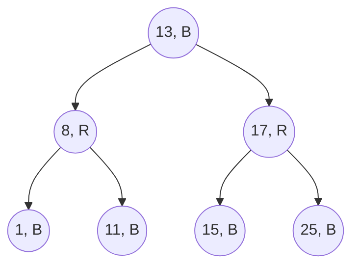

# Intro

A red-black tree is a [[Binary Search Tree]] that colors every node red or black and enforces a handful of color rules instead of measuring heights. The rules are deliberately looser than an [[AVL Tree]]'s ±1 balance factor — the tree tolerates up to 2·log₂(n+1) height — but in exchange any insert is repaired with at most **two rotations** and any delete with at most **three**, plus some recolorings, which are single-field writes. That "good enough balance, cheap repairs" bargain made it the default self-balancing tree in practice: .NET's `SortedSet<T>` and `SortedDictionary<TKey, TValue>` are red-black trees, as are Java's `TreeMap`, C++'s `std::map`, and the Linux kernel's scheduler run-queue (CFS, now EEVDF).

You rarely implement one — you use it every time you write `new SortedDictionary<string, decimal>()` to keep, say, 100K price levels ordered while an exchange feed inserts and removes thousands of entries per second. Ordered iteration stays O(log n) per step no matter how adversarial the insertion order — the exact guarantee a naive BST loses on sorted input. (`Min`/`Max` and `GetViewBetween` range views live on `SortedSet<T>`; `SortedDictionary` offers ordered enumeration plus `First()`/`Last()`.)

## The Color Rules

Five invariants; the last two do the real work:

1. Every node is red or black.
2. The root is black.
3. Every leaf (nil sentinel) is black.
4. **A red node has no red child** — no two reds in a row on any path.
5. **Every root-to-leaf path contains the same number of black nodes** (the tree's _black-height_).

Why this bounds height: rule 5 makes the all-black skeleton perfectly balanced; rule 4 means reds can at most double a path's length by interleaving. Shortest possible path = all black; longest = alternating black-red. So no path exceeds twice the black-height, giving height ≤ 2·log₂(n+1).



Every path root→leaf here crosses exactly 2 black nodes, and no red has a red child.

## Rebalancing on Insert

New nodes are inserted red (inserting black would break rule 5 on one path — much harder to fix). If the parent is black, done — zero extra work. If the parent is red, rule 4 is violated and the fix depends on the **uncle** (parent's sibling):

- **Uncle red** → recolor parent and uncle black, grandparent red, and re-examine the grandparent. This can bubble to the root, but each step is three field writes — no structural change.
- **Uncle black** → one or two rotations around the grandparent (same zig-zig/zig-zag distinction as AVL cases) plus a recoloring, and the fixup **terminates**.

So the expensive structural operation is capped at two rotations per insert, while the unbounded part (recoloring up the tree) is nearly free. Delete is the messier direction — the "double black" cases — but the same shape holds: at most three rotations, rest is recoloring.

## Red-Black in .NET

`SortedSet<T>` and `SortedDictionary<TKey, TValue>` are the red-black trees you actually touch; `SortedDictionary` is literally a `SortedSet` of key-value pairs internally.

```csharp
var prices = new SortedDictionary<decimal, int>();
prices[101.50m] = 300;   // O(log n) insert, stays ordered
prices[99.25m]  = 120;
prices[100.00m] = 450;

var bestAsk = prices.First();          // (99.25, 120) — min key, O(log n)
bool hit = prices.ContainsKey(100m);   // O(log n), regardless of insert order
```

Decision rule: default to `Dictionary<TKey, TValue>` (O(1) average, see [[HashMap]]); switch to `SortedDictionary` only when you need ordered iteration, min/max, or range views. If the data is mostly loaded up front and then queried, `SortedList<TKey, TValue>` (sorted array, binary search) is more memory-compact and cache-friendly — its weakness is O(n) inserts into the middle, which is exactly where the red-black tree's O(log n) pointer surgery wins.

## Tradeoffs

- **vs [[AVL Tree]]** — red-black is up to ~40% taller (2·log₂ n vs 1.44·log₂ n), so reads visit more nodes; writes are cheaper and bounded. Default to red-black; AVL only for genuinely read-dominated, mutation-rare workloads.
- **vs [[B-tree]]** — one key per node means one pointer chase per level; fine in RAM, fatal on disk where each chase is a page read. On-disk indexes use B-trees for fan-out; red-black is an in-memory structure.
- **vs [[HashMap|hash map]]** — you pay O(log n) instead of O(1) per lookup solely to keep order. If you never iterate in key order or query ranges, the tree is pure overhead.

## Questions

> [!QUESTION]- What does the red-black invariant buy you?
> It prevents the tree from becoming tall enough to turn ordered lookup into a linear scan, while using fewer rotations than stricter balancing schemes.

> [!QUESTION]- Why is a red-black tree's height at most 2·log₂(n+1)?
> Equal black counts on every path (rule 5) make the black skeleton balanced, and "no red parent with a red child" (rule 4) means reds can at most double a path by interleaving — so the longest path is at most twice the shortest.

> [!QUESTION]- Why are new nodes inserted red, and when is the fixup expensive?
> A red insert can only break the "no two reds" rule, fixable locally; a black insert breaks the black-height rule on a whole path. Fixup is cheap recoloring while the uncle is red (possibly bubbling up), and terminates with at most two rotations once a black uncle is hit.

> [!QUESTION]- Which .NET collections are red-black trees, and when do you pick them over `Dictionary`?
> `SortedSet<T>` and `SortedDictionary<TKey, TValue>`. Pick them only when you need ordered iteration, or — with `SortedSet<T>` — `Min`/`Max` and `GetViewBetween` range queries; otherwise `Dictionary`'s O(1) average lookup wins.

## References

- [SortedSet<T> source](https://github.com/dotnet/runtime/blob/main/src/libraries/System.Collections/src/System/Collections/Generic/SortedSet.cs) — .NET runtime implementation of a red-black tree-backed set.
- [Guibas & Sedgewick, "A dichromatic framework for balanced trees" (1978)](https://sedgewick.io/wp-content/themes/sedgewick/papers/1978Dichromatic.pdf) — the paper that introduced the red-black formulation; primary source.
- [Red-Black BSTs (Princeton Algorithms)](https://algs4.cs.princeton.edu/33balanced/) — Sedgewick's left-leaning variant with the clearest walkthrough of insert fixup and the 2-3 tree correspondence.
- [SortedDictionary\<TKey,TValue> class](https://learn.microsoft.com/en-us/dotnet/api/system.collections.generic.sorteddictionary-2) — API reference; documents the O(log n) guarantees and the contrast with `SortedList`.
