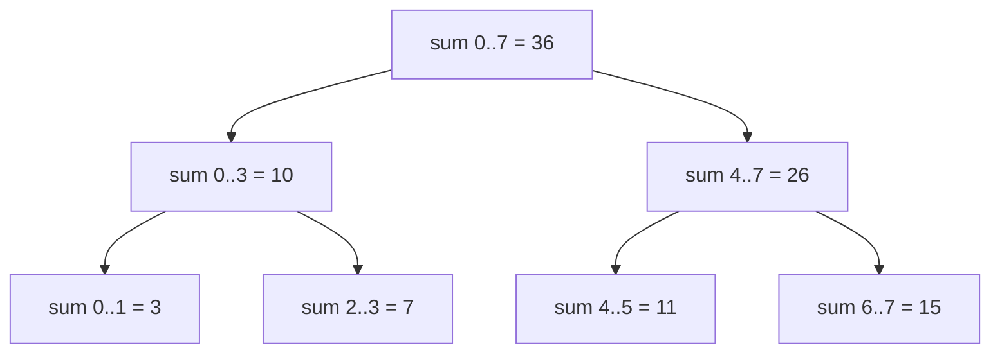

# Intro

A segment tree answers **range queries over a mutable array** — "what is the sum (or min, max, gcd…) of `a[l..r]`?" — in O(log n), while also supporting O(log n) point updates. It solves the tension that neither plain structure can: a raw array queries a range in O(n); a prefix-sum array queries in O(1) but any update invalidates O(n) prefixes. The segment tree pays O(log n) for both, which wins as soon as queries and updates interleave.

Concrete case: a metrics dashboard holds 1M per-second latency samples and must answer "max latency in any time window" while new samples keep overwriting old slots. Prefix tricks don't work for max at all (max has no inverse); the segment tree handles it because it only needs the aggregate to be **associative**.

.NET has no built-in — you write ~40 lines over a flat array, same as [[Disjoint Set]].

## How It Works

The tree is a binary hierarchy of intervals: the root covers `[0, n)`, each node covers an interval and its two children cover the two halves, leaves cover single elements. Each node stores the aggregate of its interval — `merge(left, right)` where `merge` is any associative function (`+`, `Math.Min`, `Math.Max`, `Gcd`).

It is stored heap-style in a flat array: node `i` has children `2i` and `2i+1` (root at index 1). Allocating `4 * n` slots is the standard safe bound for arbitrary n.

- **Build** — fill leaves from the source array, compute parents bottom-up. O(n).
- **Update(i, value)** — overwrite the leaf, recompute the O(log n) ancestors on the path to the root.
- **Query(l, r)** — descend from the root; when a node's interval lies fully inside `[l, r]`, take its stored aggregate and stop; when fully outside, contribute the identity; otherwise recurse into both halves. Any range decomposes into at most O(log n) fully-covered nodes — that's the whole trick.



Querying `sum(2..5)` touches exactly two stored nodes — `sum 2..3` and `sum 4..5` — instead of four leaves.

## C# Implementation

Range-sum version; swap `+`/`0` for `Math.Min`/`int.MaxValue` in the three `// merge`-marked spots (Build, Update, Query) to get range-min — the structure itself doesn't change.

```csharp
public class SegmentTree
{
    private readonly int[] _tree;
    private readonly int _n;

    public SegmentTree(int[] source)
    {
        _n = source.Length;
        _tree = new int[4 * _n];
        Build(source, node: 1, lo: 0, hi: _n - 1);
    }

    private void Build(int[] src, int node, int lo, int hi)
    {
        if (lo == hi) { _tree[node] = src[lo]; return; }
        int mid = (lo + hi) / 2;
        Build(src, 2 * node, lo, mid);
        Build(src, 2 * node + 1, mid + 1, hi);
        _tree[node] = _tree[2 * node] + _tree[2 * node + 1]; // merge
    }

    public void Update(int index, int value) => Update(1, 0, _n - 1, index, value);

    private void Update(int node, int lo, int hi, int index, int value)
    {
        if (lo == hi) { _tree[node] = value; return; }
        int mid = (lo + hi) / 2;
        if (index <= mid) Update(2 * node, lo, mid, index, value);
        else              Update(2 * node + 1, mid + 1, hi, index, value);
        _tree[node] = _tree[2 * node] + _tree[2 * node + 1];
    }

    public int Query(int l, int r) => Query(1, 0, _n - 1, l, r);

    private int Query(int node, int lo, int hi, int l, int r)
    {
        if (r < lo || hi < l) return 0;                    // outside: identity
        if (l <= lo && hi <= r) return _tree[node];        // fully covered
        int mid = (lo + hi) / 2;
        return Query(2 * node, lo, mid, l, r)
             + Query(2 * node + 1, mid + 1, hi, l, r);
    }
}
```

## Complexity

| Operation | Cost |
|---|---|
| Build | O(n) |
| Point update | O(log n) |
| Range query | O(log n) |
| Space | O(n) — 4n array slots in practice |

## Range updates: lazy propagation

**Range updates** ("add 5 to every element in `[l, r]`") need **lazy propagation**: a node stores a pending delta and pushes it to children only when someone descends past it, keeping range-update _and_ range-query at O(log n). It roughly doubles the code and is easy to get subtly wrong — reach for it only when the problem genuinely has range updates.

## Segment tree or Fenwick?

If all you need is prefix/range **sums** with point updates, a [[Fenwick Tree]] does the same O(log n) in a third of the code, n array slots instead of 4n, and better constants. Take the segment tree when the aggregate is not invertible (min/max/gcd — Fenwick's range query needs subtraction) or when you need lazy range updates. That decision is spelled out from the other side in the Fenwick note.

## Questions

> [!QUESTION]- When is a segment tree a better fit than prefix sums?
> When the underlying values change and you need both updates and range queries after those updates.

> [!QUESTION]- Why does a range query cost only O(log n) instead of touching every element in the range?
> Any range `[l, r]` decomposes into at most O(log n) tree nodes whose intervals are fully contained in it. The query takes each such node's precomputed aggregate and stops descending there, never visiting the leaves underneath.

> [!QUESTION]- What property must the aggregate function have, and what does that rule in and out?
> Associativity — `merge(a, merge(b, c)) == merge(merge(a, b), c)` — so partial results combine in any grouping. Sum, min, max, and gcd qualify; mean does not directly (store `(sum, count)` pairs and derive it instead).

> [!QUESTION]- What problem does lazy propagation solve?
> Range updates. Without it, "add x to `[l, r]`" costs O(r − l) leaf updates; with a pending delta stored on covering nodes and pushed down on demand, range update and range query both stay O(log n).

## References

- [Segment tree](https://cp-algorithms.com/data_structures/segment_tree.html) — detailed construction and query/update mechanics.
- [Efficient and easy segment trees (Codeforces, Al.Cash)](https://codeforces.com/blog/entry/18051) — the compact iterative bottom-up variant using exactly 2n slots; worth knowing after the recursive version clicks.
