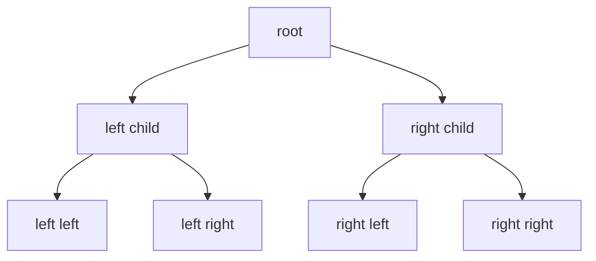

# Intro

Trees represent hierarchical data with parent-child relationships. In .NET, tree-like behavior commonly appears through `SortedSet<T>` (red-black tree), `SortedDictionary<TKey, TValue>`, custom recursive node models, and expression trees in the compiler pipeline. A concrete use case: an autocomplete service maintains a trie (prefix tree) of 500K product names; lookup for any prefix completes in O(k) where k is prefix length, regardless of dataset size — a `Dictionary` scan would be O(n).

<nav style="--card-accent: 239, 68, 68;" class="folder-structure-map" aria-label="Trees section map"><div class="folder-map-children"><article class="db-card folder-map-node"><div class="db-card-body"><div class="folder-map-node-heading"><span class="folder-map-node-title-group"><span class="db-card-icon" aria-hidden="true"><svg xmlns="http://www.w3.org/2000/svg" stroke-linejoin="round" stroke-linecap="round" stroke-width="2" stroke="currentColor" fill="none" viewBox="0 0 24 24"><path d="M14.5 2H6a2 2 0 0 0-2 2v16a2 2 0 0 0 2 2h12a2 2 0 0 0 2-2V7.5L14.5 2z"/><polyline points="14 2 14 8 20 8"/><line y2="13" y1="13" x2="8" x1="16"/><line y2="17" y1="17" x2="8" x1="16"/><line y2="9" y1="9" x2="8" x1="10"/></svg></span><span class="db-card-title" title="AVL Tree">AVL Tree</span></span></div><p class="db-card-summary">A rigidly self-balancing BST with a ±1 balance factor, giving the fewest search levels per lookup.</p></div><span class="db-card-hit"><a class="internal-link" href="Home/Computer Science/Data Structures/Trees/AVL Tree.md" data-tooltip-position="top" aria-label="AVL Tree">AVL Tree</a></span></article><article class="db-card folder-map-node"><div class="db-card-body"><div class="folder-map-node-heading"><span class="folder-map-node-title-group"><span class="db-card-icon" aria-hidden="true"><svg xmlns="http://www.w3.org/2000/svg" stroke-linejoin="round" stroke-linecap="round" stroke-width="2" stroke="currentColor" fill="none" viewBox="0 0 24 24"><path d="M14.5 2H6a2 2 0 0 0-2 2v16a2 2 0 0 0 2 2h12a2 2 0 0 0 2-2V7.5L14.5 2z"/><polyline points="14 2 14 8 20 8"/><line y2="13" y1="13" x2="8" x1="16"/><line y2="17" y1="17" x2="8" x1="16"/><line y2="9" y1="9" x2="8" x1="10"/></svg></span><span class="db-card-title" title="B-tree">B-tree</span></span></div><p class="db-card-summary">A self-balancing search tree with page-sized many-key nodes, keeping disk-resident indexes shallow.</p></div><span class="db-card-hit"><a class="internal-link" href="Home/Computer Science/Data Structures/Trees/B-tree.md" data-tooltip-position="top" aria-label="B-tree">B-tree</a></span></article><article class="db-card folder-map-node"><div class="db-card-body"><div class="folder-map-node-heading"><span class="folder-map-node-title-group"><span class="db-card-icon" aria-hidden="true"><svg xmlns="http://www.w3.org/2000/svg" stroke-linejoin="round" stroke-linecap="round" stroke-width="2" stroke="currentColor" fill="none" viewBox="0 0 24 24"><path d="M14.5 2H6a2 2 0 0 0-2 2v16a2 2 0 0 0 2 2h12a2 2 0 0 0 2-2V7.5L14.5 2z"/><polyline points="14 2 14 8 20 8"/><line y2="13" y1="13" x2="8" x1="16"/><line y2="17" y1="17" x2="8" x1="16"/><line y2="9" y1="9" x2="8" x1="10"/></svg></span><span class="db-card-title" title="B+ Tree">B+ Tree</span></span></div><p class="db-card-summary">The B-tree variant databases ship, with data only in leaves chained for fast range scans.</p></div><span class="db-card-hit"><a class="internal-link" href="Home/Computer Science/Data Structures/Trees/B+ Tree.md" data-tooltip-position="top" aria-label="B+ Tree">B+ Tree</a></span></article><article class="db-card folder-map-node"><div class="db-card-body"><div class="folder-map-node-heading"><span class="folder-map-node-title-group"><span class="db-card-icon" aria-hidden="true"><svg xmlns="http://www.w3.org/2000/svg" stroke-linejoin="round" stroke-linecap="round" stroke-width="2" stroke="currentColor" fill="none" viewBox="0 0 24 24"><path d="M14.5 2H6a2 2 0 0 0-2 2v16a2 2 0 0 0 2 2h12a2 2 0 0 0 2-2V7.5L14.5 2z"/><polyline points="14 2 14 8 20 8"/><line y2="13" y1="13" x2="8" x1="16"/><line y2="17" y1="17" x2="8" x1="16"/><line y2="9" y1="9" x2="8" x1="10"/></svg></span><span class="db-card-title" title="Binary Search Tree">Binary Search Tree</span></span></div><p class="db-card-summary">A binary tree ordered left &lt; node &lt; right, giving O(height) search and ordered queries.</p></div><span class="db-card-hit"><a class="internal-link" href="Home/Computer Science/Data Structures/Trees/Binary Search Tree.md" data-tooltip-position="top" aria-label="Binary Search Tree">Binary Search Tree</a></span></article><article class="db-card folder-map-node"><div class="db-card-body"><div class="folder-map-node-heading"><span class="folder-map-node-title-group"><span class="db-card-icon" aria-hidden="true"><svg xmlns="http://www.w3.org/2000/svg" stroke-linejoin="round" stroke-linecap="round" stroke-width="2" stroke="currentColor" fill="none" viewBox="0 0 24 24"><path d="M14.5 2H6a2 2 0 0 0-2 2v16a2 2 0 0 0 2 2h12a2 2 0 0 0 2-2V7.5L14.5 2z"/><polyline points="14 2 14 8 20 8"/><line y2="13" y1="13" x2="8" x1="16"/><line y2="17" y1="17" x2="8" x1="16"/><line y2="9" y1="9" x2="8" x1="10"/></svg></span><span class="db-card-title" title="Fenwick Tree">Fenwick Tree</span></span></div><p class="db-card-summary">A binary indexed tree computing prefix sums and point updates in O(log n) with one array.</p></div><span class="db-card-hit"><a class="internal-link" href="Home/Computer Science/Data Structures/Trees/Fenwick Tree.md" data-tooltip-position="top" aria-label="Fenwick Tree">Fenwick Tree</a></span></article><article class="db-card folder-map-node"><div class="db-card-body"><div class="folder-map-node-heading"><span class="folder-map-node-title-group"><span class="db-card-icon" aria-hidden="true"><svg xmlns="http://www.w3.org/2000/svg" stroke-linejoin="round" stroke-linecap="round" stroke-width="2" stroke="currentColor" fill="none" viewBox="0 0 24 24"><path d="M20 20a2 2 0 0 0 2-2V8a2 2 0 0 0-2-2h-7.9a2 2 0 0 1-1.69-.9L9.6 3.9A2 2 0 0 0 7.93 3H4a2 2 0 0 0-2 2v13a2 2 0 0 0 2 2Z"/></svg></span><span class="db-card-title" title="Heap-like">Heap-like</span></span><span class="folder-map-node-count">5 notes</span></div><p class="db-card-summary">Priority-queue structures with an O(1) root peek, differing on meld and decreaseKey.</p></div><span class="db-card-hit"><a class="internal-link" href="Home/Computer Science/Data Structures/Trees/Heap-like/Heap-like.md" data-tooltip-position="top" aria-label="Heap-like">Heap-like</a></span></article><article class="db-card folder-map-node"><div class="db-card-body"><div class="folder-map-node-heading"><span class="folder-map-node-title-group"><span class="db-card-icon" aria-hidden="true"><svg xmlns="http://www.w3.org/2000/svg" stroke-linejoin="round" stroke-linecap="round" stroke-width="2" stroke="currentColor" fill="none" viewBox="0 0 24 24"><path d="M14.5 2H6a2 2 0 0 0-2 2v16a2 2 0 0 0 2 2h12a2 2 0 0 0 2-2V7.5L14.5 2z"/><polyline points="14 2 14 8 20 8"/><line y2="13" y1="13" x2="8" x1="16"/><line y2="17" y1="17" x2="8" x1="16"/><line y2="9" y1="9" x2="8" x1="10"/></svg></span><span class="db-card-title" title="Quadtree">Quadtree</span></span></div><p class="db-card-summary">A tree that recursively subdivides a 2D region into four quadrants for spatial queries — fast on uniform data, unbalanced by nature.</p></div><span class="db-card-hit"><a class="internal-link" href="Home/Computer Science/Data Structures/Trees/Quadtree.md" data-tooltip-position="top" aria-label="Quadtree">Quadtree</a></span></article><article class="db-card folder-map-node"><div class="db-card-body"><div class="folder-map-node-heading"><span class="folder-map-node-title-group"><span class="db-card-icon" aria-hidden="true"><svg xmlns="http://www.w3.org/2000/svg" stroke-linejoin="round" stroke-linecap="round" stroke-width="2" stroke="currentColor" fill="none" viewBox="0 0 24 24"><path d="M14.5 2H6a2 2 0 0 0-2 2v16a2 2 0 0 0 2 2h12a2 2 0 0 0 2-2V7.5L14.5 2z"/><polyline points="14 2 14 8 20 8"/><line y2="13" y1="13" x2="8" x1="16"/><line y2="17" y1="17" x2="8" x1="16"/><line y2="9" y1="9" x2="8" x1="10"/></svg></span><span class="db-card-title" title="Red-Black Tree">Red-Black Tree</span></span></div><p class="db-card-summary">A self-balancing BST using node colors for good-enough balance with cheap repairs, the default ordered map.</p></div><span class="db-card-hit"><a class="internal-link" href="Home/Computer Science/Data Structures/Trees/Red-Black Tree.md" data-tooltip-position="top" aria-label="Red-Black Tree">Red-Black Tree</a></span></article><article class="db-card folder-map-node"><div class="db-card-body"><div class="folder-map-node-heading"><span class="folder-map-node-title-group"><span class="db-card-icon" aria-hidden="true"><svg xmlns="http://www.w3.org/2000/svg" stroke-linejoin="round" stroke-linecap="round" stroke-width="2" stroke="currentColor" fill="none" viewBox="0 0 24 24"><path d="M14.5 2H6a2 2 0 0 0-2 2v16a2 2 0 0 0 2 2h12a2 2 0 0 0 2-2V7.5L14.5 2z"/><polyline points="14 2 14 8 20 8"/><line y2="13" y1="13" x2="8" x1="16"/><line y2="17" y1="17" x2="8" x1="16"/><line y2="9" y1="9" x2="8" x1="10"/></svg></span><span class="db-card-title" title="Segment Tree">Segment Tree</span></span></div><p class="db-card-summary">A binary interval hierarchy answering associative range queries and point updates in O(log n).</p></div><span class="db-card-hit"><a class="internal-link" href="Home/Computer Science/Data Structures/Trees/Segment Tree.md" data-tooltip-position="top" aria-label="Segment Tree">Segment Tree</a></span></article><article class="db-card folder-map-node"><div class="db-card-body"><div class="folder-map-node-heading"><span class="folder-map-node-title-group"><span class="db-card-icon" aria-hidden="true"><svg xmlns="http://www.w3.org/2000/svg" stroke-linejoin="round" stroke-linecap="round" stroke-width="2" stroke="currentColor" fill="none" viewBox="0 0 24 24"><path d="M14.5 2H6a2 2 0 0 0-2 2v16a2 2 0 0 0 2 2h12a2 2 0 0 0 2-2V7.5L14.5 2z"/><polyline points="14 2 14 8 20 8"/><line y2="13" y1="13" x2="8" x1="16"/><line y2="17" y1="17" x2="8" x1="16"/><line y2="9" y1="9" x2="8" x1="10"/></svg></span><span class="db-card-title" title="Splay Tree">Splay Tree</span></span></div></div><span class="db-card-hit"><a class="internal-link" href="Home/Computer Science/Data Structures/Trees/Splay Tree.md" data-tooltip-position="top" aria-label="Splay Tree">Splay Tree</a></span></article><article class="db-card folder-map-node"><div class="db-card-body"><div class="folder-map-node-heading"><span class="folder-map-node-title-group"><span class="db-card-icon" aria-hidden="true"><svg xmlns="http://www.w3.org/2000/svg" stroke-linejoin="round" stroke-linecap="round" stroke-width="2" stroke="currentColor" fill="none" viewBox="0 0 24 24"><path d="M14.5 2H6a2 2 0 0 0-2 2v16a2 2 0 0 0 2 2h12a2 2 0 0 0 2-2V7.5L14.5 2z"/><polyline points="14 2 14 8 20 8"/><line y2="13" y1="13" x2="8" x1="16"/><line y2="17" y1="17" x2="8" x1="16"/><line y2="9" y1="9" x2="8" x1="10"/></svg></span><span class="db-card-title" title="Ternary Search Tree">Ternary Search Tree</span></span></div></div><span class="db-card-hit"><a class="internal-link" href="Home/Computer Science/Data Structures/Trees/Ternary Search Tree.md" data-tooltip-position="top" aria-label="Ternary Search Tree">Ternary Search Tree</a></span></article><article class="db-card folder-map-node"><div class="db-card-body"><div class="folder-map-node-heading"><span class="folder-map-node-title-group"><span class="db-card-icon" aria-hidden="true"><svg xmlns="http://www.w3.org/2000/svg" stroke-linejoin="round" stroke-linecap="round" stroke-width="2" stroke="currentColor" fill="none" viewBox="0 0 24 24"><path d="M14.5 2H6a2 2 0 0 0-2 2v16a2 2 0 0 0 2 2h12a2 2 0 0 0 2-2V7.5L14.5 2z"/><polyline points="14 2 14 8 20 8"/><line y2="13" y1="13" x2="8" x1="16"/><line y2="17" y1="17" x2="8" x1="16"/><line y2="9" y1="9" x2="8" x1="10"/></svg></span><span class="db-card-title" title="Trie">Trie</span></span></div><p class="db-card-summary">A prefix tree storing strings as character paths, giving O(k) lookup and prefix queries.</p></div><span class="db-card-hit"><a class="internal-link" href="Home/Computer Science/Data Structures/Trees/Trie.md" data-tooltip-position="top" aria-label="Trie">Trie</a></span></article></div><style>.db-card { position: relative; box-sizing: border-box; border: 1px solid var(--background-modifier-border, var(--lightgray, #d8dee9)); border-radius: var(--radius-m, 0.55rem); background-color: var(--background-primary, var(--light, #ffffff)); box-shadow: 0 0 0 rgba(0, 0, 0, 0); transition: border-color 150ms ease, background-color 150ms ease, box-shadow 150ms ease, transform 150ms ease; } .db-card::before { content: ""; position: absolute; inset: 0; border-radius: inherit; pointer-events: none; background: radial-gradient( ellipse 150% 175% at -22% -38%, rgba(var(--card-accent, 125, 125, 125), 0.09) 0%, rgba(var(--card-accent, 125, 125, 125), 0.04) 38%, rgba(var(--card-accent, 125, 125, 125), 0.014) 66%, transparent 90% ); opacity: 0.78; transition: opacity 150ms ease; } .db-card:hover, .db-card:focus-within { border-color: rgba(var(--card-accent, 125, 125, 125), 0.55); background-color: color-mix(in srgb, rgb(var(--card-accent, 125, 125, 125)) 2.5%, var(--background-primary, var(--light, #ffffff))); box-shadow: 0 0.45rem 1.1rem rgba(0, 0, 0, 0.08); transform: translateY(-0.125rem); } .db-card:hover::before, .db-card:focus-within::before { opacity: 1; } .db-card-body { position: relative; z-index: 0; box-sizing: border-box; display: flex; flex-direction: column; padding: var(--db-card-pad, 0.85rem 0.9rem); } .db-card-icon { display: flex; width: 1.1rem; height: 1.1rem; flex: 0 0 auto; color: rgb(var(--card-accent, 125, 125, 125)); } .db-card-icon svg { display: block; width: 100%; height: 100%; } .db-card-title { display: block; margin: 0; color: var(--text-normal, var(--dark, #1f2937)); font-size: 1rem; font-weight: 700; line-height: 1.25; } p.db-card-summary { margin: 0.45rem 0 0; color: var(--text-muted, var(--darkgray, #5f6b7a)); font-size: 0.875rem; line-height: 1.45; } .db-card-hit { position: absolute; inset: 0; z-index: 1; } .db-card-hit a { position: absolute; inset: 0; min-width: 2.75rem; min-height: 2.75rem; border-radius: var(--radius-m, 0.55rem); background: transparent !important; font-size: 0; } .db-card-hit a:focus-visible { outline: 2px solid rgb(var(--card-accent, 125, 125, 125)); outline-offset: -0.3rem; } @media (prefers-reduced-motion: reduce) { .db-card { transition: none; } .db-card::before { transition: none; } .db-card:hover, .db-card:focus-within { transform: none; } } .folder-structure-map { --card-accent: 16, 185, 129; --map-gap: 0.75rem; width: 100%; box-sizing: border-box; margin: 0.5rem 0 0.75rem; container-name: folder-map; container-type: inline-size; } .folder-map-children { display: flex; flex-wrap: wrap; gap: var(--map-gap); } .folder-map-node { flex: 1 1 12rem; min-height: 2.75rem; --db-card-pad: 0.5rem 0.75rem; } .folder-map-node .db-card-body { min-height: 2.75rem; justify-content: center; } .folder-map-node-heading { display: flex; align-items: center; justify-content: space-between; gap: 0.75rem; } .folder-map-node-title-group { display: flex; align-items: center; gap: 0.5rem; } .folder-map-node .db-card-title { white-space: nowrap; } .folder-map-node-count { display: block; flex: 0 0 auto; color: var(--text-muted, var(--darkgray, #5f6b7a)); font-size: 0.875rem; white-space: nowrap; } .folder-map-node .db-card-summary { display: none; } .folder-map-node-empty { cursor: default; } .folder-map-node-empty:hover, .folder-map-node-empty:focus-within { border-color: var(--background-modifier-border, var(--lightgray, #d8dee9)); background-color: var(--background-primary, var(--light, #ffffff)); box-shadow: 0 0 0 rgba(0, 0, 0, 0); transform: none; } .folder-map-node-empty:hover::before, .folder-map-node-empty:focus-within::before { opacity: 0.78; } .folder-structure-map .folder-map-node-empty .db-card-body { justify-content: center; align-items: center; text-align: center; } .folder-map-empty-text { color: var(--text-normal, var(--dark, #1f2937)); font-size: 1rem; font-weight: 400; font-style: normal; line-height: 1.25; } @container folder-map (min-width: 40rem) { .folder-map-node { min-height: 6rem; --db-card-pad: 0.85rem 0.9rem; } .folder-map-node .db-card-body { min-height: 6rem; justify-content: flex-start; } .folder-map-node .db-card-summary { display: block; } } @container folder-map (min-width: 64rem) { .folder-map-node, .folder-map-node .db-card-body { min-height: 6.75rem; } }</style></nav>

## Deeper Explanation

A tree organizes nodes so each node has at most one parent (except the root) and any number of children. Balanced trees keep height at O(log n), making insert, delete, and search O(log n). Unbalanced trees degrade toward O(n) — inserting already-sorted values into a naïve BST produces a linked list.

**Traversal orders** define processing sequence:

- _Pre-order_ (root → left → right): used to serialize or copy a tree.
- _In-order_ (left → root → right): visits nodes in sorted order for a BST — the basis for `SortedSet<T>` enumeration.
- _Post-order_ (left → right → root): used when children must be processed before parents, such as deleting a subtree or evaluating an expression tree.
- _BFS (level-order)_: uses a `Queue<T>` to visit nodes level by level, natural for shortest-path in unweighted trees.

`SortedSet<T>` in .NET uses a red-black tree internally, guaranteeing O(log n) insert and lookup regardless of insertion order.

**Terminology:** _height_ (longest root-to-leaf path), _depth_ (distance from root), _balance factor_ (height difference between subtrees). A _full_ tree has 0 or 2 children per node; a _complete_ tree fills levels left-to-right (the heap shape); a _perfect_ tree is both.

## Common Tree Types

"Tree" is a family — the right one depends on the operation you need:

| Type | What it adds | Used for |
|---|---|---|
| [[Binary Search Tree\|BST]] | Ordered left < node < right | Baseline ordered lookup — but degrades to O(n) if unbalanced |
| [[AVL Tree\|AVL]] / [[Red-Black Tree\|Red-Black]] | Self-balancing rotations → guaranteed O(log n) | `SortedSet`/`SortedDictionary` (red-black); AVL is more rigidly balanced (faster reads, more rotations) |
| [[Splay Tree\|Splay]] | Self-adjusting: each access rotated to the root | Amortized O(log n) (O(n) worst); locality-adaptive — reads mutate structure, no stored balance metadata |
| [[B-tree]] / [[B+ Tree\|B+-tree]] | High fan-out, shallow; node = disk/page sized | **Database & filesystem indexes** — minimizes disk seeks. See [[Indexes]] |
| [[Trie\|Trie (prefix tree)]] | Path = sequence of characters | Autocomplete, prefix search, routing tables — O(k) by key length, independent of n |
| [[Ternary Search Tree]] | Trie whose children are a BST on the next char, not a σ-wide array | Large/Unicode alphabets; sorted and near-neighbour string queries |
| [[Quadtree]] | Recursively splits 2D space into four quadrants — a **spatial-partitioning tree, unbalanced, not an O(log n) balanced search tree** | 2D range / nearest-neighbor / geospatial queries (spatial indexes, collision detection) |
| [[Heap]] | Parent/child priority, array-backed | Priority queues and heap-like mergeable queues |
| [[Segment Tree]] | Any associative merge over a range — sum, **min/max**, gcd; lazy range updates | Range-min/max & range-assign in O(log n), ~4n slots |
| [[Fenwick Tree\|Fenwick (BIT)]] | Prefix/range **sum** only — invertible aggregates, so no range-min | Range-sum with point updates in O(log n), ~n slots |

## Traversal Without Recursion

The depth pitfall (below) is why production traversal of unbounded-depth trees uses an explicit `Stack<T>` rather than recursion. For the extreme case, **Morris traversal** achieves in-order traversal in **O(1) extra space** by temporarily rewiring leaf `right` pointers (threading) instead of using a stack at all — niche, but the canonical answer to "traverse a tree without recursion _and_ without a stack."

## Structure



### Example

```csharp
var ids = new SortedSet<int> { 5, 1, 3, 3 };
// Stored sorted and unique: 1, 3, 5
```

### Pitfalls

- **Stack overflow on recursive traversal** — a tree with 100K+ nodes and no balancing guarantee (e.g., user-built BST from sorted input) can degrade to a linked list with depth 100K. Recursive DFS blows the default 1 MB stack. Use iterative traversal with an explicit `Stack<T>` for unknown-depth trees.
- **GC pressure from node objects** — each tree node is a separate heap allocation. A tree with 1M nodes creates 1M objects for the GC to track. For read-heavy scenarios, consider a flat array-based representation (binary heap style) where children of node i are at 2i+1 and 2i+2.
- **Unbalanced insert patterns** — inserting already-sorted values into a naive BST produces a linked list with O(n) operations. Always use self-balancing trees (red-black, AVL) or .NET's `SortedSet<T>` which guarantees O(log n) regardless of insertion order.

### Tradeoffs

- `SortedSet<T>` gives sorted uniqueness with O(log n) operations.
- Flat arrays/lists can be faster for simple one-time sorting and scan workloads.

## Questions

> [!QUESTION]- Which built-in .NET collection is closest to a self-balancing tree?
> `SortedSet<T>` (and `SortedDictionary<TKey, TValue>` for key-value scenarios).

> [!QUESTION]- When would you avoid recursive tree traversal?
> On unknown/deep depth, where iterative traversal with an explicit stack is safer.

## References

- [`SortedSet<T>` class](https://learn.microsoft.com/en-us/dotnet/api/system.collections.generic.sortedset-1) — API reference for the closest built-in self-balancing tree in .NET.
- [Sorted collection types](https://learn.microsoft.com/en-us/dotnet/standard/collections/sorted-collection-types) — Microsoft overview of SortedSet, SortedDictionary, and SortedList with complexity comparison.
- [Traverse a binary tree with parallel tasks](https://learn.microsoft.com/en-us/dotnet/standard/parallel-programming/how-to-traverse-a-binary-tree-with-parallel-tasks) — example of parallel tree traversal using Task Parallel Library.
- [SortedSet implementation in dotnet runtime](https://github.com/dotnet/runtime/blob/main/src/libraries/System.Collections/src/System/Collections/Generic/SortedSet.cs) — source code for the red-black tree backing `SortedSet<T>`.
