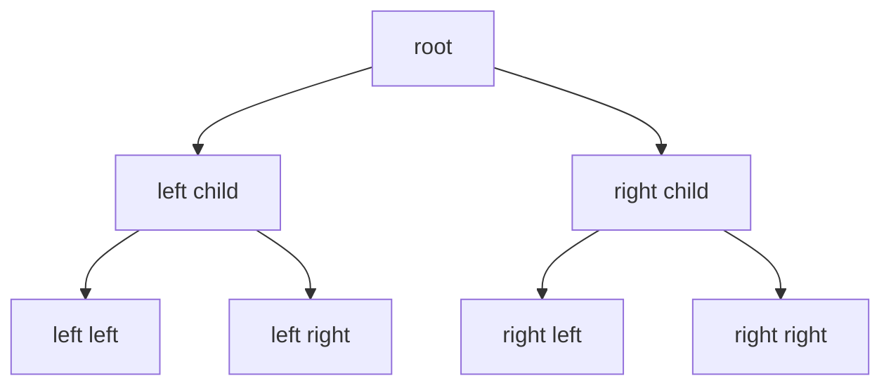

A tree represents relationships through parent-child edges. It is a shape, not a complexity guarantee. A balanced search tree can keep lookup at O(log n), while an unbalanced tree may become a chain and cost O(n). A trie follows another rule entirely: lookup is O(k) in key length, while scanning a flat dictionary for a prefix is O(n).

In .NET, `SortedSet<T>` and `SortedDictionary<TKey, TValue>` provide ordered collections backed by red-black trees. Custom node models fit domain hierarchies, while expression trees represent code as data.

<nav style="--card-accent: 239, 68, 68;" class="folder-structure-map" aria-label="Trees section map"><div class="folder-map-children"><article class="db-card folder-map-node"><div class="db-card-body"><div class="folder-map-node-heading"><span class="folder-map-node-title-group"><span class="db-card-icon" aria-hidden="true"><svg xmlns="http://www.w3.org/2000/svg" stroke-linejoin="round" stroke-linecap="round" stroke-width="2" stroke="currentColor" fill="none" viewBox="0 0 24 24"><path d="M20 20a2 2 0 0 0 2-2V8a2 2 0 0 0-2-2h-7.9a2 2 0 0 1-1.69-.9L9.6 3.9A2 2 0 0 0 7.93 3H4a2 2 0 0 0-2 2v13a2 2 0 0 0 2 2Z"/></svg></span><span class="db-card-title" title="Heap-like">Heap-like</span></span><span class="folder-map-node-count">5 notes</span></div><p class="db-card-summary">Priority-queue structures with an O(1) root peek, differing on meld and decreaseKey.</p></div><span class="db-card-hit"><a class="internal-link" href="Home/Computer Science/Data Structures/Trees/Heap-like/Heap-like.md" data-tooltip-position="top" aria-label="Heap-like">Heap-like</a></span></article><article class="db-card folder-map-node"><div class="db-card-body"><div class="folder-map-node-heading"><span class="folder-map-node-title-group"><span class="db-card-icon" aria-hidden="true"><svg xmlns="http://www.w3.org/2000/svg" stroke-linejoin="round" stroke-linecap="round" stroke-width="2" stroke="currentColor" fill="none" viewBox="0 0 24 24"><path d="M14.5 2H6a2 2 0 0 0-2 2v16a2 2 0 0 0 2 2h12a2 2 0 0 0 2-2V7.5L14.5 2z"/><polyline points="14 2 14 8 20 8"/><line y2="13" y1="13" x2="8" x1="16"/><line y2="17" y1="17" x2="8" x1="16"/><line y2="9" y1="9" x2="8" x1="10"/></svg></span><span class="db-card-title" title="AVL Tree">AVL Tree</span></span></div><p class="db-card-summary">A rigidly self-balancing BST with tighter worst-case height than red-black trees for lookup-heavy workloads.</p></div><span class="db-card-hit"><a class="internal-link" href="Home/Computer Science/Data Structures/Trees/AVL Tree.md" data-tooltip-position="top" aria-label="AVL Tree">AVL Tree</a></span></article><article class="db-card folder-map-node"><div class="db-card-body"><div class="folder-map-node-heading"><span class="folder-map-node-title-group"><span class="db-card-icon" aria-hidden="true"><svg xmlns="http://www.w3.org/2000/svg" stroke-linejoin="round" stroke-linecap="round" stroke-width="2" stroke="currentColor" fill="none" viewBox="0 0 24 24"><path d="M14.5 2H6a2 2 0 0 0-2 2v16a2 2 0 0 0 2 2h12a2 2 0 0 0 2-2V7.5L14.5 2z"/><polyline points="14 2 14 8 20 8"/><line y2="13" y1="13" x2="8" x1="16"/><line y2="17" y1="17" x2="8" x1="16"/><line y2="9" y1="9" x2="8" x1="10"/></svg></span><span class="db-card-title" title="B-tree">B-tree</span></span></div><p class="db-card-summary">A self-balancing search tree with page-sized many-key nodes, keeping disk-resident indexes shallow.</p></div><span class="db-card-hit"><a class="internal-link" href="Home/Computer Science/Data Structures/Trees/B-tree.md" data-tooltip-position="top" aria-label="B-tree">B-tree</a></span></article><article class="db-card folder-map-node"><div class="db-card-body"><div class="folder-map-node-heading"><span class="folder-map-node-title-group"><span class="db-card-icon" aria-hidden="true"><svg xmlns="http://www.w3.org/2000/svg" stroke-linejoin="round" stroke-linecap="round" stroke-width="2" stroke="currentColor" fill="none" viewBox="0 0 24 24"><path d="M14.5 2H6a2 2 0 0 0-2 2v16a2 2 0 0 0 2 2h12a2 2 0 0 0 2-2V7.5L14.5 2z"/><polyline points="14 2 14 8 20 8"/><line y2="13" y1="13" x2="8" x1="16"/><line y2="17" y1="17" x2="8" x1="16"/><line y2="9" y1="9" x2="8" x1="10"/></svg></span><span class="db-card-title" title="B+ Tree">B+ Tree</span></span></div><p class="db-card-summary">The B-tree variant databases ship, with data only in leaves chained for fast range scans.</p></div><span class="db-card-hit"><a class="internal-link" href="Home/Computer Science/Data Structures/Trees/B+ Tree.md" data-tooltip-position="top" aria-label="B+ Tree">B+ Tree</a></span></article><article class="db-card folder-map-node"><div class="db-card-body"><div class="folder-map-node-heading"><span class="folder-map-node-title-group"><span class="db-card-icon" aria-hidden="true"><svg xmlns="http://www.w3.org/2000/svg" stroke-linejoin="round" stroke-linecap="round" stroke-width="2" stroke="currentColor" fill="none" viewBox="0 0 24 24"><path d="M14.5 2H6a2 2 0 0 0-2 2v16a2 2 0 0 0 2 2h12a2 2 0 0 0 2-2V7.5L14.5 2z"/><polyline points="14 2 14 8 20 8"/><line y2="13" y1="13" x2="8" x1="16"/><line y2="17" y1="17" x2="8" x1="16"/><line y2="9" y1="9" x2="8" x1="10"/></svg></span><span class="db-card-title" title="Binary Search Tree">Binary Search Tree</span></span></div><p class="db-card-summary">A binary tree ordered left &lt; node &lt; right for lookup, traversal, and ordered queries.</p></div><span class="db-card-hit"><a class="internal-link" href="Home/Computer Science/Data Structures/Trees/Binary Search Tree.md" data-tooltip-position="top" aria-label="Binary Search Tree">Binary Search Tree</a></span></article><article class="db-card folder-map-node"><div class="db-card-body"><div class="folder-map-node-heading"><span class="folder-map-node-title-group"><span class="db-card-icon" aria-hidden="true"><svg xmlns="http://www.w3.org/2000/svg" stroke-linejoin="round" stroke-linecap="round" stroke-width="2" stroke="currentColor" fill="none" viewBox="0 0 24 24"><path d="M14.5 2H6a2 2 0 0 0-2 2v16a2 2 0 0 0 2 2h12a2 2 0 0 0 2-2V7.5L14.5 2z"/><polyline points="14 2 14 8 20 8"/><line y2="13" y1="13" x2="8" x1="16"/><line y2="17" y1="17" x2="8" x1="16"/><line y2="9" y1="9" x2="8" x1="10"/></svg></span><span class="db-card-title" title="Fenwick Tree">Fenwick Tree</span></span></div><p class="db-card-summary">A binary indexed tree that computes prefix sums and point updates in one flat array.</p></div><span class="db-card-hit"><a class="internal-link" href="Home/Computer Science/Data Structures/Trees/Fenwick Tree.md" data-tooltip-position="top" aria-label="Fenwick Tree">Fenwick Tree</a></span></article><article class="db-card folder-map-node"><div class="db-card-body"><div class="folder-map-node-heading"><span class="folder-map-node-title-group"><span class="db-card-icon" aria-hidden="true"><svg xmlns="http://www.w3.org/2000/svg" stroke-linejoin="round" stroke-linecap="round" stroke-width="2" stroke="currentColor" fill="none" viewBox="0 0 24 24"><path d="M14.5 2H6a2 2 0 0 0-2 2v16a2 2 0 0 0 2 2h12a2 2 0 0 0 2-2V7.5L14.5 2z"/><polyline points="14 2 14 8 20 8"/><line y2="13" y1="13" x2="8" x1="16"/><line y2="17" y1="17" x2="8" x1="16"/><line y2="9" y1="9" x2="8" x1="10"/></svg></span><span class="db-card-title" title="Quadtree">Quadtree</span></span></div><p class="db-card-summary">A tree that recursively subdivides a 2D region into four quadrants for spatial queries — fast on uniform data, unbalanced by nature.</p></div><span class="db-card-hit"><a class="internal-link" href="Home/Computer Science/Data Structures/Trees/Quadtree.md" data-tooltip-position="top" aria-label="Quadtree">Quadtree</a></span></article><article class="db-card folder-map-node"><div class="db-card-body"><div class="folder-map-node-heading"><span class="folder-map-node-title-group"><span class="db-card-icon" aria-hidden="true"><svg xmlns="http://www.w3.org/2000/svg" stroke-linejoin="round" stroke-linecap="round" stroke-width="2" stroke="currentColor" fill="none" viewBox="0 0 24 24"><path d="M14.5 2H6a2 2 0 0 0-2 2v16a2 2 0 0 0 2 2h12a2 2 0 0 0 2-2V7.5L14.5 2z"/><polyline points="14 2 14 8 20 8"/><line y2="13" y1="13" x2="8" x1="16"/><line y2="17" y1="17" x2="8" x1="16"/><line y2="9" y1="9" x2="8" x1="10"/></svg></span><span class="db-card-title" title="Red-Black Tree">Red-Black Tree</span></span></div><p class="db-card-summary">A self-balancing BST using node colors for good-enough balance with cheap repairs, the default ordered map.</p></div><span class="db-card-hit"><a class="internal-link" href="Home/Computer Science/Data Structures/Trees/Red-Black Tree.md" data-tooltip-position="top" aria-label="Red-Black Tree">Red-Black Tree</a></span></article><article class="db-card folder-map-node"><div class="db-card-body"><div class="folder-map-node-heading"><span class="folder-map-node-title-group"><span class="db-card-icon" aria-hidden="true"><svg xmlns="http://www.w3.org/2000/svg" stroke-linejoin="round" stroke-linecap="round" stroke-width="2" stroke="currentColor" fill="none" viewBox="0 0 24 24"><path d="M14.5 2H6a2 2 0 0 0-2 2v16a2 2 0 0 0 2 2h12a2 2 0 0 0 2-2V7.5L14.5 2z"/><polyline points="14 2 14 8 20 8"/><line y2="13" y1="13" x2="8" x1="16"/><line y2="17" y1="17" x2="8" x1="16"/><line y2="9" y1="9" x2="8" x1="10"/></svg></span><span class="db-card-title" title="Segment Tree">Segment Tree</span></span></div><p class="db-card-summary">A binary interval hierarchy for associative range queries and point updates.</p></div><span class="db-card-hit"><a class="internal-link" href="Home/Computer Science/Data Structures/Trees/Segment Tree.md" data-tooltip-position="top" aria-label="Segment Tree">Segment Tree</a></span></article><article class="db-card folder-map-node"><div class="db-card-body"><div class="folder-map-node-heading"><span class="folder-map-node-title-group"><span class="db-card-icon" aria-hidden="true"><svg xmlns="http://www.w3.org/2000/svg" stroke-linejoin="round" stroke-linecap="round" stroke-width="2" stroke="currentColor" fill="none" viewBox="0 0 24 24"><path d="M14.5 2H6a2 2 0 0 0-2 2v16a2 2 0 0 0 2 2h12a2 2 0 0 0 2-2V7.5L14.5 2z"/><polyline points="14 2 14 8 20 8"/><line y2="13" y1="13" x2="8" x1="16"/><line y2="17" y1="17" x2="8" x1="16"/><line y2="9" y1="9" x2="8" x1="10"/></svg></span><span class="db-card-title" title="Splay Tree">Splay Tree</span></span></div><p class="db-card-summary">A self-adjusting BST that rotates each accessed node to the root, adapting the structure to access locality.</p></div><span class="db-card-hit"><a class="internal-link" href="Home/Computer Science/Data Structures/Trees/Splay Tree.md" data-tooltip-position="top" aria-label="Splay Tree">Splay Tree</a></span></article><article class="db-card folder-map-node"><div class="db-card-body"><div class="folder-map-node-heading"><span class="folder-map-node-title-group"><span class="db-card-icon" aria-hidden="true"><svg xmlns="http://www.w3.org/2000/svg" stroke-linejoin="round" stroke-linecap="round" stroke-width="2" stroke="currentColor" fill="none" viewBox="0 0 24 24"><path d="M14.5 2H6a2 2 0 0 0-2 2v16a2 2 0 0 0 2 2h12a2 2 0 0 0 2-2V7.5L14.5 2z"/><polyline points="14 2 14 8 20 8"/><line y2="13" y1="13" x2="8" x1="16"/><line y2="17" y1="17" x2="8" x1="16"/><line y2="9" y1="9" x2="8" x1="10"/></svg></span><span class="db-card-title" title="Ternary Search Tree">Ternary Search Tree</span></span></div><p class="db-card-summary">Stores strings with trie-style depth and a character BST at each position, using three links per node.</p></div><span class="db-card-hit"><a class="internal-link" href="Home/Computer Science/Data Structures/Trees/Ternary Search Tree.md" data-tooltip-position="top" aria-label="Ternary Search Tree">Ternary Search Tree</a></span></article><article class="db-card folder-map-node"><div class="db-card-body"><div class="folder-map-node-heading"><span class="folder-map-node-title-group"><span class="db-card-icon" aria-hidden="true"><svg xmlns="http://www.w3.org/2000/svg" stroke-linejoin="round" stroke-linecap="round" stroke-width="2" stroke="currentColor" fill="none" viewBox="0 0 24 24"><path d="M14.5 2H6a2 2 0 0 0-2 2v16a2 2 0 0 0 2 2h12a2 2 0 0 0 2-2V7.5L14.5 2z"/><polyline points="14 2 14 8 20 8"/><line y2="13" y1="13" x2="8" x1="16"/><line y2="17" y1="17" x2="8" x1="16"/><line y2="9" y1="9" x2="8" x1="10"/></svg></span><span class="db-card-title" title="Trie">Trie</span></span></div><p class="db-card-summary">A prefix tree that stores strings as character paths for exact and prefix queries.</p></div><span class="db-card-hit"><a class="internal-link" href="Home/Computer Science/Data Structures/Trees/Trie.md" data-tooltip-position="top" aria-label="Trie">Trie</a></span></article></div><style>.db-card { position: relative; box-sizing: border-box; border: 1px solid var(--background-modifier-border, var(--lightgray, #d8dee9)); border-radius: var(--radius-m, 0.55rem); background-color: var(--background-primary, var(--light, #ffffff)); box-shadow: 0 0 0 rgba(0, 0, 0, 0); transition: border-color var(--dur-2, 140ms) var(--ease-out, cubic-bezier(0.22, 1, 0.36, 1)), background-color var(--dur-2, 140ms) var(--ease-out, cubic-bezier(0.22, 1, 0.36, 1)), box-shadow var(--dur-2, 140ms) var(--ease-out, cubic-bezier(0.22, 1, 0.36, 1)), transform var(--dur-2, 140ms) var(--ease-out, cubic-bezier(0.22, 1, 0.36, 1)); } .db-card::before { content: ""; position: absolute; inset: 0; border-radius: inherit; pointer-events: none; background: radial-gradient( ellipse 150% 175% at -22% -38%, rgba(var(--card-accent, 125, 125, 125), 0.09) 0%, rgba(var(--card-accent, 125, 125, 125), 0.04) 38%, rgba(var(--card-accent, 125, 125, 125), 0.014) 66%, transparent 90% ); opacity: 0.78; transition: opacity var(--dur-2, 140ms) var(--ease-out, cubic-bezier(0.22, 1, 0.36, 1)); } .db-card:hover, .db-card:focus-within { border-color: rgba(var(--card-accent, 125, 125, 125), 0.55); background-color: color-mix(in srgb, rgb(var(--card-accent, 125, 125, 125)) 2.5%, var(--background-primary, var(--light, #ffffff))); box-shadow: 0 0.45rem 1.1rem rgba(0, 0, 0, 0.08); transform: translateY(-0.125rem); } .db-card:hover::before, .db-card:focus-within::before { opacity: 1; } .db-card-body { position: relative; z-index: 0; box-sizing: border-box; display: flex; flex-direction: column; padding: var(--db-card-pad, 0.85rem 0.9rem); } .db-card-icon { display: flex; width: 1.1rem; height: 1.1rem; flex: 0 0 auto; color: rgb(var(--card-accent, 125, 125, 125)); } .db-card-icon svg { display: block; width: 100%; height: 100%; } .db-card-title { display: block; margin: 0; color: var(--text-normal, var(--dark, #1f2937)); font-size: 1rem; font-weight: 700; line-height: 1.25; } p.db-card-summary { margin: 0.45rem 0 0; color: var(--text-muted, var(--darkgray, #5f6b7a)); font-size: 0.875rem; line-height: 1.45; } .db-card-hit { position: absolute; inset: 0; z-index: 1; } .db-card-hit a { position: absolute; inset: 0; min-width: 2.75rem; min-height: 2.75rem; border-radius: var(--radius-m, 0.55rem); background: transparent !important; font-size: 0; } .db-card-hit a:focus-visible { outline: 2px solid rgb(var(--card-accent, 125, 125, 125)); outline-offset: -0.3rem; } @keyframes db-card-in { from { opacity: 0; transform: translateY(6px); } } .dc-topic-grid .db-card, .folder-map-children .db-card { animation: db-card-in var(--dur-3, 220ms) var(--ease-spring, cubic-bezier(0.34, 1.56, 0.64, 1)) backwards; } .dc-topic-grid .db-card:nth-child(2), .folder-map-children .db-card:nth-child(2) { animation-delay: calc(var(--stagger, 28ms) * 1); } .dc-topic-grid .db-card:nth-child(3), .folder-map-children .db-card:nth-child(3) { animation-delay: calc(var(--stagger, 28ms) * 2); } .dc-topic-grid .db-card:nth-child(4), .folder-map-children .db-card:nth-child(4) { animation-delay: calc(var(--stagger, 28ms) * 3); } .dc-topic-grid .db-card:nth-child(5), .folder-map-children .db-card:nth-child(5) { animation-delay: calc(var(--stagger, 28ms) * 4); } .dc-topic-grid .db-card:nth-child(6), .folder-map-children .db-card:nth-child(6) { animation-delay: calc(var(--stagger, 28ms) * 5); } .dc-topic-grid .db-card:nth-child(n+7), .folder-map-children .db-card:nth-child(n+7) { animation-delay: calc(var(--stagger, 28ms) * 6); } @media (prefers-reduced-motion: reduce) { .db-card { transition: none; } .db-card::before { transition: none; } .db-card:hover, .db-card:focus-within { transform: none; } .dc-topic-grid .db-card, .folder-map-children .db-card { animation: none; } } .folder-structure-map { --card-accent: 16, 185, 129; --map-gap: 0.75rem; width: 100%; box-sizing: border-box; margin: 0.5rem 0 0.75rem; container-name: folder-map; container-type: inline-size; } .folder-map-children { display: flex; flex-wrap: wrap; gap: var(--map-gap); } .folder-map-node { flex: 1 1 12rem; min-height: 2.75rem; --db-card-pad: 0.5rem 0.75rem; } .folder-map-node .db-card-body { min-height: 2.75rem; justify-content: center; } .folder-map-node-heading { display: flex; align-items: center; justify-content: space-between; gap: 0.75rem; } .folder-map-node-title-group { display: flex; align-items: center; gap: 0.5rem; } .folder-map-node .db-card-title { white-space: nowrap; } .folder-map-node-count { display: block; flex: 0 0 auto; color: var(--text-muted, var(--darkgray, #5f6b7a)); font-size: 0.875rem; white-space: nowrap; } .folder-map-node .db-card-summary { display: none; } .folder-map-node-empty { cursor: default; } .folder-map-node-empty:hover, .folder-map-node-empty:focus-within { border-color: var(--background-modifier-border, var(--lightgray, #d8dee9)); background-color: var(--background-primary, var(--light, #ffffff)); box-shadow: 0 0 0 rgba(0, 0, 0, 0); transform: none; } .folder-map-node-empty:hover::before, .folder-map-node-empty:focus-within::before { opacity: 0.78; } .folder-structure-map .folder-map-node-empty .db-card-body { justify-content: center; align-items: center; text-align: center; } .folder-map-empty-text { color: var(--text-normal, var(--dark, #1f2937)); font-size: 1rem; font-weight: 400; font-style: normal; line-height: 1.25; } @container folder-map (min-width: 40rem) { .folder-map-node { min-height: 6rem; --db-card-pad: 0.85rem 0.9rem; } .folder-map-node .db-card-body { min-height: 6rem; justify-content: flex-start; } .folder-map-node .db-card-summary { display: block; } } @container folder-map (min-width: 64rem) { .folder-map-node, .folder-map-node .db-card-body { min-height: 6.75rem; } }</style></nav>

# Shape and Traversal

A rooted tree gives every node except the root exactly one parent. Nodes may have any number of children, and there is one path from the root to each node. Height measures the longest path down from a node. Depth measures the path from the root.

Balance belongs to particular tree families, not to trees in general. Inserting sorted values into a naive binary search tree creates a linked list. A red-black or AVL tree repairs its shape after updates and keeps height at O(log n).

Traversal order determines when a node is processed relative to its children:

- _Pre-order_ (root → left → right): used to serialize or copy a tree.
- _In-order_ (left → root → right): visits nodes in sorted order for a BST — the basis for `SortedSet<T>` enumeration.
- _Post-order_ (left → right → root): used when children must be processed before parents, such as deleting a subtree or evaluating an expression tree.
- _BFS (level-order)_: uses a `Queue<T>` to visit nodes level by level, natural for shortest-path in unweighted trees.

`SortedSet<T>` in .NET uses a red-black tree internally, guaranteeing O(log n) insert and lookup regardless of insertion order.

A _full_ binary tree gives each node either zero or two children. A _complete_ binary tree fills each level from left to right, which makes the array layout used by heaps possible. A _perfect_ binary tree is both full and complete.

# Common Tree Types

The required operation chooses the tree:

| Type | What it adds | Used for |
|---|---|---|
| [[Binary Search Tree\|BST]] | Ordered left < node < right | Baseline ordered lookup — but degrades to O(n) if unbalanced |
| [[AVL Tree\|AVL]] / [[Red-Black Tree\|Red-Black]] | Self-balancing rotations → guaranteed O(log n) | `SortedSet`/`SortedDictionary` (red-black). AVL is more rigidly balanced (faster reads, more rotations) |
| [[Splay Tree\|Splay]] | Self-adjusting: each access rotated to the root | Amortized O(log n) (O(n) worst). Locality-adaptive — reads mutate structure, no stored balance metadata |
| [[B-tree]] / [[B+ Tree\|B+-tree]] | High fan-out, shallow. Node = disk/page sized | **Database & filesystem indexes** — minimizes disk seeks. See [[Indexes]] |
| [[Trie\|Trie (prefix tree)]] | Path = sequence of characters | Autocomplete, prefix search, routing tables — O(k) by key length, independent of n |
| [[Ternary Search Tree]] | Trie whose children are a BST on the next char, not a σ-wide array | Large/Unicode alphabets. Sorted and near-neighbour string queries |
| [[Quadtree]] | Recursively splits 2D space into four quadrants — a **spatial-partitioning tree, unbalanced, not an O(log n) balanced search tree** | 2D range / nearest-neighbor / geospatial queries (spatial indexes, collision detection) |
| [[Heap]] | Parent/child priority, array-backed | Priority queues and heap-like mergeable queues |
| [[Segment Tree]] | Any associative merge over a range — sum, **min/max**, gcd. Lazy range updates | Range-min/max & range-assign in O(log n), ~4n slots |
| [[Fenwick Tree\|Fenwick (BIT)]] | Invertible prefix aggregates such as sum or XOR — no range-min because min is not invertible | Range-sum with point updates in O(log n), ~n slots |

# Traversal Without Recursion

Unbounded depth makes recursive traversal unsafe because call-stack use grows with height. An explicit `Stack<T>` moves that memory to the managed heap and makes the limit visible. **Morris traversal** reaches O(1) extra space for in-order traversal by temporarily threading `right` pointers, but it mutates the tree during the walk and is rarely the practical default.

# Structure


```mermaid
graph TD
    R[root]
    R --> L[left child]
    R --> M[right child]
    L --> LL[left left]
    L --> LR[left right]
    M --> RL[right left]
    M --> RR[right right]
```

## Example

```csharp
var ids = new SortedSet<int> { 5, 1, 3, 3 };
// Stored sorted and unique: 1, 3, 5
```

## Pitfalls

- **Stack overflow on recursive traversal.** A tree without a height bound can become deep enough to exhaust the call stack. Iterative traversal with an explicit `Stack<T>` is safer when depth comes from external data.
- **GC pressure from node objects.** Pointer-based trees allocate one object per node and lose locality. A flat representation fits complete shapes such as heaps much better.
- **Unbalanced insert patterns.** Sorted input turns a naive BST into a chain with O(n) lookup. A self-balancing tree or .NET's `SortedSet<T>` keeps the logarithmic bound.

## Tradeoffs

- `SortedSet<T>` provides sorted uniqueness with O(log n) lookup and updates.
- Sorting a flat array or list is usually simpler for build-once, scan-many workloads.

# References

- [Sorted collection types](https://learn.microsoft.com/en-us/dotnet/standard/collections/sorted-collection-types)
