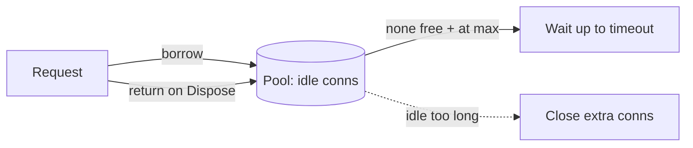

# Intro

Opening a database connection is expensive: a TCP handshake, TLS negotiation, and server-side authentication and session setup that can take tens of milliseconds — far longer than the query itself. A connection pool keeps a set of already-open connections and **lends** them to requests, returning them to the pool instead of closing them. The result is that "opening a connection" becomes a cheap rent-from-pool, and the database is protected from being swamped by thousands of short-lived connections. In .NET this is on by default (ADO.NET / `SqlClient` / `Npgsql`); the skill is sizing and using it correctly.

## How It Works

The pool sits in the application (client-side) and manages a bounded set of physical connections:

1. App calls `OpenConnection()` → pool hands back an **idle** connection, or opens a new one if under the max, or **waits** if the pool is exhausted.
2. App runs its query.
3. App "closes"/`Dispose()`s the connection → it's **reset and returned to the pool**, not physically closed.



Connections are keyed by **connection string** — a different string (different database, user, or even option) gets its **own** pool. Pools also retire connections that have been idle too long or exceeded a max lifetime.

## Example

The pattern that makes pooling work is **open late, dispose early** — hold the connection only for the query, never across I/O or user think-time:

```csharp
// 'using' returns the connection to the pool immediately after the query.
await using var conn = new NpgsqlConnection(connectionString);
await conn.OpenAsync(ct);                       // rented from pool (cheap)
await using var cmd = new NpgsqlCommand("SELECT name FROM users WHERE id = $1", conn)
    { Parameters = { new() { Value = id } } };
var name = (string?)await cmd.ExecuteScalarAsync(ct);
// dispose → connection reset and returned to pool
```

Pool size is configured in the connection string, e.g. `Maximum Pool Size=100;Minimum Pool Size=5;Connection Lifetime=300`.

## Sizing the Pool

Bigger is **not** better. Each pooled connection consumes memory and a worker/backend on the database server, and past the point of CPU/disk saturation more concurrency just adds contention and latency. A useful starting heuristic (from the HikariCP project) is roughly:

> **connections ≈ (CPU cores × 2) + effective spindle count**

— often a _small_ number (e.g. 10–30) per app instance, not hundreds. Then **multiply by the number of app instances**: 50 pods × 100 max-pool = 5,000 connections hammering a database that handles maybe a few hundred well. Size the _total_ against the database's limit (`max_connections`), not each app in isolation.

## Pitfalls

- **Pool exhaustion** — every connection is checked out and the next request blocks until the pool timeout, then throws ("timeout obtaining a connection from the pool"). Causes: pool too small for the load, or **leaked connections** (see below), or holding connections during slow I/O/transactions.
- **Connection leaks** — forgetting to `Dispose()` (no `using`) keeps a connection checked out forever; under load the pool drains and the app hangs. Always scope connections with `using`/`await using`.
- **Holding a connection across slow work** — opening a connection, then awaiting an HTTP call or user input before running the query, ties up a pooled connection for the whole wait. Open it _immediately before_ the query and release right after (this mirrors the "keep transactions short" rule in [[ACID]]).
- **Per-tenant connection strings explode pools** — building a connection string per tenant/user (different credentials) creates a separate pool each, multiplying total connections. Use one app identity + row-level scoping, not a string per tenant.
- **Pool × instances overwhelms the DB** — autoscaling to N replicas multiplies your connection footprint by N; the database hits `max_connections` and rejects everyone. Account for fleet size when sizing.
- **Serverless makes pooling hard** — short-lived functions (Lambda, Azure Functions) spin up many isolated instances, each with its own tiny pool and no sharing, easily exhausting the database. This is the main reason external proxies exist.

## Server-Side Poolers

When the _client_-side pool isn't enough — too many app instances, or serverless — put a pooler **in front of the database**:

- **PgBouncer** (PostgreSQL) — a lightweight proxy that multiplexes thousands of client connections onto a small number of real ones. In **transaction mode** a backend connection is held only for the duration of a transaction, drastically cutting real connections (caveat: session-level features like prepared statements/`SET` need care).
- **RDS Proxy / Azure SQL** — managed equivalents that also smooth failovers and protect the database from connection storms.

## Tradeoffs

| Concern | Small pool | Large pool |
|---|---|---|
| DB server load | Low (few backends) | High — can saturate `max_connections`, memory |
| App throughput under burst | May queue/timeout | More concurrency, until DB becomes the bottleneck |
| Latency | Slight wait when busy | Lower wait, but risks DB-side contention |

**Decision rule**: start small (cores × 2-ish per instance), measure wait time and DB CPU, and grow only until the database — not the pool — is the limiter. If many instances or serverless functions push total connections past the DB's comfort zone, add a server-side pooler (PgBouncer / RDS Proxy) rather than enlarging client pools.

## Questions

> [!QUESTION]- Why is a bigger connection pool often worse, not better?
> Each connection costs a server-side backend/worker plus memory, and once the database's CPU and disk are saturated, additional concurrent queries just contend and add latency — throughput can actually _drop_. The right size is a small multiple of the database's core count, sized against `max_connections` across the _whole fleet_, not maximized per app.

> [!QUESTION]- What causes connection-pool exhaustion and how do you fix it?
> All connections are checked out and new requests block until timing out. Usual causes: a pool too small for real concurrency, connections **leaked** by missing `Dispose()`/`using`, or connections held across slow I/O or long transactions. Fixes: scope every connection with `using`, keep the checkout window to just the query, right-size the pool, and add a server-side pooler if the fleet is large.

> [!QUESTION]- Why is connection pooling hard in serverless environments?
> Serverless platforms run many short-lived, isolated function instances that can't share an in-process pool, and each may open its own connections — so a spike spawns thousands of connections and exhausts the database. The standard remedy is an external pooler (RDS Proxy, PgBouncer) that all instances share, multiplexing them onto a small set of real connections.

## References

- [About connection pooling (ADO.NET, Microsoft Learn)](https://learn.microsoft.com/en-us/dotnet/framework/data/adonet/sql-server-connection-pooling) — how .NET pools by connection string, lifetime, and reset semantics.
- [Npgsql connection string parameters (pooling)](https://www.npgsql.org/doc/connection-string-parameters.html) — Min/Max pool size, lifetime, and timeout tuning.
- [About Pool Sizing (HikariCP wiki)](https://github.com/brettwooldridge/HikariCP/wiki/About-Pool-Sizing) — the canonical, math-backed argument for small pools.
- [PgBouncer documentation](https://www.pgbouncer.org/) — transaction vs session pooling modes for PostgreSQL at scale.
