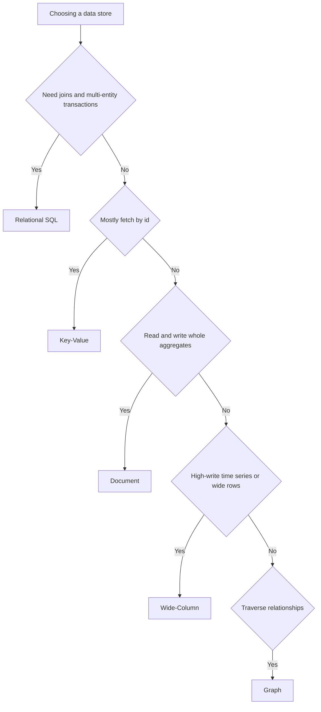

# Intro

NoSQL is an umbrella term for non-relational data stores that trade some of the relational model (normalized tables + joins) for scalability, flexible schemas, or specialized access patterns.
You reach for it when your workload is better described as "fetch by key", "store a document", "traverse relationships", or "write lots of events" rather than "join many tables".
The hard part is not "NoSQL vs SQL" but selecting the right NoSQL family and modeling your data around your queries.

<nav style="--card-accent: 249, 115, 22;" class="folder-structure-map" aria-label="NoSQL section map">
<article class="db-card folder-map-node">

<svg xmlns="http://www.w3.org/2000/svg" stroke-linejoin="round" stroke-linecap="round" stroke-width="2" stroke="currentColor" fill="none" viewBox="0 0 24 24"><path d="M14.5 2H6a2 2 0 0 0-2 2v16a2 2 0 0 0 2 2h12a2 2 0 0 0 2-2V7.5L14.5 2z"/><polyline points="14 2 14 8 20 8"/><line y2="13" y1="13" x2="8" x1="16"/><line y2="17" y1="17" x2="8" x1="16"/><line y2="9" y1="9" x2="8" x1="10"/></svg>NoSQL Database Types

The four NoSQL families (document, key-value, wide-column, graph) and their access patterns.

<a class="internal-link" href="Home/Data Persistence/NoSQL/NoSQL Database Types.md" data-tooltip-position="top" aria-label="NoSQL Database Types">NoSQL Database Types</a></article>
</nav>

## How It Works

NoSQL is not one thing — it is four data models, each shaped around a different access pattern. Pick the family by how you read and write, then model the data around those queries.

Most distributed NoSQL stores sit on the AP side of the [[CAP theorem]]: they favor availability and partition tolerance and offer **eventual** (tunable) consistency rather than the strong, immediately-consistent transactions of a relational database. Modeling is query-first — you denormalize and duplicate data to make the reads you need cheap, accepting write-side duplication as the cost.

## Tradeoffs

| Dimension | Relational (SQL) | NoSQL |
| --- | --- | --- |
| Consistency | Strong, ACID transactions | Often eventual/tunable (BASE) |
| Schema | Fixed, enforced | Flexible, per-record |
| Joins | First-class | Avoided; data is denormalized |
| Scaling | Vertical first; sharding is hard | Horizontal scale-out by design |
| Best for | Complex relationships, integrity | Known access patterns, high scale |

## Questions

> [!QUESTION]- Which NoSQL family fits a user-profile API with very frequent reads by user id?
>
> - Key-value or document store, because the access pattern is dominated by point reads on a single id.
> - Use key-value if it is almost entirely get/put by id with no rich querying.
> - Use document if you read/update an aggregate (profile + preferences) and occasionally query a few indexed fields.
> - Key-value gives the simplest, fastest id lookups but no secondary queries; the document store adds query flexibility at some indexing and storage cost.

> [!QUESTION]- When is NoSQL a bad idea?
>
> - When the core use case needs relational constraints and multi-entity ACID transactions, or queries are fundamentally join-heavy.
> - Forcing those onto NoSQL pushes join logic and consistency into application code, which is error-prone.
> - Often the better move is to keep SQL and add caching, read replicas, or a denormalized read model.
> - NoSQL trades joins and strong consistency for scale and flexible schemas — if you need the former, that trade is a net loss.

> [!QUESTION]- Why does NoSQL push you toward denormalization and data duplication?
>
> - Without joins, the cheapest read is one that fetches a whole aggregate in a single hit.
> - So you model data per query, duplicating fields across documents/rows instead of normalizing them once.
> - That makes reads fast and partition-friendly but means a single logical change may touch many copies.
> - You accept write-side duplication and temporarily inconsistent copies in exchange for fast, scalable reads — the opposite of the normalized SQL bargain.

## References

- [Understand data store models](https://learn.microsoft.com/azure/architecture/guide/technology-choices/data-store-overview)
- [Relational vs NoSQL data](https://learn.microsoft.com/dotnet/architecture/cloud-native/relational-vs-nosql-data)
- [Choose a data store](https://learn.microsoft.com/azure/architecture/guide/technology-choices/data-stores-getting-started)
- [Designing Data Intensive Applications chapter on storage and retrieval](https://www.oreilly.com/library/view/designing-data-intensive-applications/9781098119058/ch04.html)
