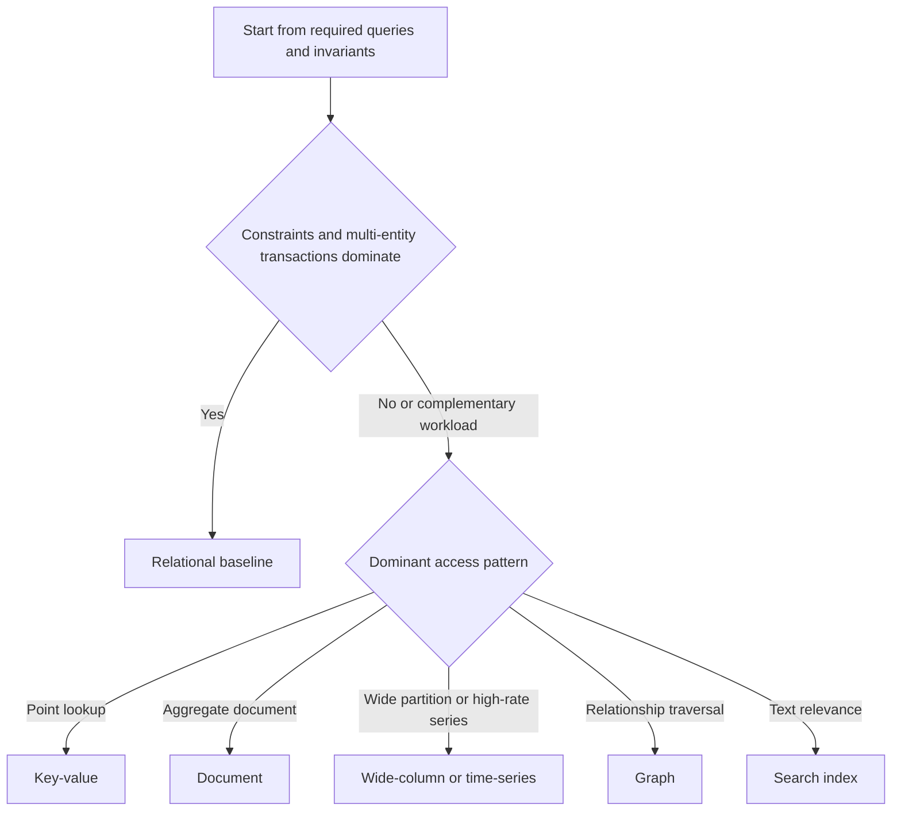

# Intro

NoSQL is an umbrella term for data stores whose primary model is not the conventional relational table-and-join model. The label includes key-value, document, wide-column, graph, search, and time-series systems, but their capabilities overlap: some enforce schemas, support transactions, or provide join-like operators.

Reach for a specialized store when a measured workload is dominated by an access pattern it serves better, such as point reads by key, aggregate-shaped documents, relationship traversal, text search, or high-rate time-series ingestion. Keep a relational database as the baseline when constraints, multi-entity transactions, and ad-hoc joins are central. The hard part is choosing a concrete engine and modeling its consistency, partitioning, and query boundaries—not choosing a label.

<nav style="--card-accent: 249, 115, 22;" class="folder-structure-map" aria-label="NoSQL section map">
<article class="db-card folder-map-node">

<svg xmlns="http://www.w3.org/2000/svg" stroke-linejoin="round" stroke-linecap="round" stroke-width="2" stroke="currentColor" fill="none" viewBox="0 0 24 24"><path d="M14.5 2H6a2 2 0 0 0-2 2v16a2 2 0 0 0 2 2h12a2 2 0 0 0 2-2V7.5L14.5 2z"/><polyline points="14 2 14 8 20 8"/><line y2="13" y1="13" x2="8" x1="16"/><line y2="17" y1="17" x2="8" x1="16"/><line y2="9" y1="9" x2="8" x1="10"/></svg>Elasticsearch

How Elasticsearch maps and analyzes documents into Lucene segments, distributes shards, and serves search and aggregations.

<a class="internal-link" href="Home/Data Persistence/NoSQL/Elasticsearch.md" data-tooltip-position="top" aria-label="Elasticsearch">Elasticsearch</a></article><article class="db-card folder-map-node">

<svg xmlns="http://www.w3.org/2000/svg" stroke-linejoin="round" stroke-linecap="round" stroke-width="2" stroke="currentColor" fill="none" viewBox="0 0 24 24"><path d="M14.5 2H6a2 2 0 0 0-2 2v16a2 2 0 0 0 2 2h12a2 2 0 0 0 2-2V7.5L14.5 2z"/><polyline points="14 2 14 8 20 8"/><line y2="13" y1="13" x2="8" x1="16"/><line y2="17" y1="17" x2="8" x1="16"/><line y2="9" y1="9" x2="8" x1="10"/></svg>LSM-Tree

A write-optimized storage engine that buffers writes in memory and flushes immutable sorted files, trading read amplification for sequential-write throughput — the B-tree's counterpart.

<a class="internal-link" href="Home/Data Persistence/NoSQL/LSM-Tree.md" data-tooltip-position="top" aria-label="LSM-Tree">LSM-Tree</a></article><article class="db-card folder-map-node">

<svg xmlns="http://www.w3.org/2000/svg" stroke-linejoin="round" stroke-linecap="round" stroke-width="2" stroke="currentColor" fill="none" viewBox="0 0 24 24"><path d="M14.5 2H6a2 2 0 0 0-2 2v16a2 2 0 0 0 2 2h12a2 2 0 0 0 2-2V7.5L14.5 2z"/><polyline points="14 2 14 8 20 8"/><line y2="13" y1="13" x2="8" x1="16"/><line y2="17" y1="17" x2="8" x1="16"/><line y2="9" y1="9" x2="8" x1="10"/></svg>NoSQL Database Types

The four NoSQL families (document, key-value, wide-column, graph) and their access patterns.

<a class="internal-link" href="Home/Data Persistence/NoSQL/NoSQL Database Types.md" data-tooltip-position="top" aria-label="NoSQL Database Types">NoSQL Database Types</a></article><article class="db-card folder-map-node">

<svg xmlns="http://www.w3.org/2000/svg" stroke-linejoin="round" stroke-linecap="round" stroke-width="2" stroke="currentColor" fill="none" viewBox="0 0 24 24"><path d="M14.5 2H6a2 2 0 0 0-2 2v16a2 2 0 0 0 2 2h12a2 2 0 0 0 2-2V7.5L14.5 2z"/><polyline points="14 2 14 8 20 8"/><line y2="13" y1="13" x2="8" x1="16"/><line y2="17" y1="17" x2="8" x1="16"/><line y2="9" y1="9" x2="8" x1="10"/></svg>Redis

Redis data structures, persistence, replication, clustering, and the failure contracts behind common use cases.

<a class="internal-link" href="Home/Data Persistence/NoSQL/Redis.md" data-tooltip-position="top" aria-label="Redis">Redis</a></article><article class="db-card folder-map-node">

<svg xmlns="http://www.w3.org/2000/svg" stroke-linejoin="round" stroke-linecap="round" stroke-width="2" stroke="currentColor" fill="none" viewBox="0 0 24 24"><path d="M14.5 2H6a2 2 0 0 0-2 2v16a2 2 0 0 0 2 2h12a2 2 0 0 0 2-2V7.5L14.5 2z"/><polyline points="14 2 14 8 20 8"/><line y2="13" y1="13" x2="8" x1="16"/><line y2="17" y1="17" x2="8" x1="16"/><line y2="9" y1="9" x2="8" x1="10"/></svg>Time-Series Databases

Storage engines for append-heavy series, time-range scans, retention, and rollups.

<a class="internal-link" href="Home/Data Persistence/NoSQL/Time-Series Databases.md" data-tooltip-position="top" aria-label="Time-Series Databases">Time-Series Databases</a></article>
</nav>

## Links

- [[Elasticsearch]]
- [[LSM-Tree]]
- [[NoSQL Database Types]]
- [[Redis]]
- [[Time-Series Databases]]

## How It Works

NoSQL is not one model. Common families optimize different operators and storage layouts, and one product can expose several models. Pick an engine from the reads, writes, invariants, and failure behavior you need, then model data around those operations.

Distributed NoSQL systems make different [[CAP theorem]] choices. Cassandra commonly keeps serving through a partition with tunable consistency, while systems such as MongoDB replica sets or strongly consistent key-value services may reject operations that cannot reach the required authority. Relational systems can also be distributed, and NoSQL systems can offer strong or transactional operations within documented scopes. Query-first denormalization is common because co-locating a read shape avoids remote joins, but it creates duplicate state and write-side repair work.

## Tradeoffs

| Dimension | Common relational default | Common NoSQL patterns |
| --- | --- | --- |
| Consistency | ACID transactions across rows and tables within the engine's scope | Engine-specific: strong, causal, eventual, or tunable; transaction scope varies |
| Schema | Database-enforced table and constraint schema | Flexible, application-enforced, or database-enforced depending on engine |
| Relationships | General joins and foreign keys are normal | Embedded, denormalized, traversed, or joined where the engine supports it |
| Scaling | Scale-up, replicas, partitioning, or distributed SQL | Some engines are built around partitioned scale-out; others are single-node or leader-bound |
| Strong fit | Integrity-heavy transactions and evolving query combinations | Stable specialized access patterns whose measured benefit pays the modeling cost |

## Questions

> [!QUESTION]- Which NoSQL family fits a user-profile API with very frequent reads by user id?
>
> - Key-value or document store, because the access pattern is dominated by point reads on a single id.
> - Use key-value if it is almost entirely get/put by id with no rich querying.
> - Use document if you read/update an aggregate (profile + preferences) and occasionally query a few indexed fields.
> - A key-value API keeps point lookup semantics narrow; a document engine commonly adds secondary-query options at some indexing and storage cost. Exact latency and query support depend on the product.

> [!QUESTION]- When is NoSQL a bad idea?
>
> - When the core use case needs relational constraints and multi-entity ACID transactions, or queries are fundamentally join-heavy.
> - Forcing those onto NoSQL pushes join logic and consistency into application code, which is error-prone.
> - Often the better move is to keep SQL and add caching, read replicas, or a denormalized read model.
> - If the specialized store cannot enforce the required joins, constraints, or transaction boundary, its access-pattern advantage does not pay for moving those guarantees into application code.

> [!QUESTION]- Why does NoSQL push you toward denormalization and data duplication?
>
> - When the chosen store cannot execute an efficient join across the required data, the cheapest read is often one that fetches a whole aggregate in a single hit.
> - You then model that read shape explicitly, sometimes duplicating fields across documents or rows instead of normalizing them once.
> - That makes reads fast and partition-friendly but means a single logical change may touch many copies.
> - You accept write-side duplication and a synchronization policy in exchange for cheaper reads; whether copies may be temporarily inconsistent is a separate consistency decision.

## References

- [Understand data store models](https://learn.microsoft.com/azure/architecture/guide/technology-choices/data-store-overview) — Microsoft taxonomy of relational, document, key-value, graph, search, time-series, and analytical store models with workload boundaries.
- [Relational versus NoSQL data](https://learn.microsoft.com/dotnet/architecture/cloud-native/relational-vs-nosql-data) — .NET architecture guidance on aggregate modeling, schema ownership, and consistency tradeoffs between relational and NoSQL stores.
- [Choose a data store](https://learn.microsoft.com/azure/architecture/guide/technology-choices/data-stores-getting-started) — decision guidance that starts from data shape, consistency, query, and operational requirements rather than a SQL/NoSQL binary.
- [Designing Data-Intensive Applications, Ch. 3: Storage and Retrieval](https://www.oreilly.com/library/view/designing-data-intensive-applications/9781098119058/ch04.html) — comparison of hash indexes, SSTables, LSM trees, and B-trees that explains the storage mechanisms behind several database families.
