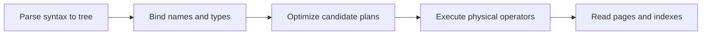

# Intro

The relational model organizes data into tables, relates rows through keys, and enforces constraints at the database boundary. SQL describes the result you want; the optimizer chooses scans, seeks, join order, and physical operators that preserve that result. Relational databases are the default when integrity constraints, multi-row transactions, and ad-hoc joins matter more than storing one access pattern in its final read shape.

<nav style="--card-accent: 249, 115, 22;" class="folder-structure-map" aria-label="SQL section map"><div class="folder-map-children"><article class="db-card folder-map-node"><div class="db-card-body"><div class="folder-map-node-heading"><span class="folder-map-node-title-group"><span class="db-card-icon" aria-hidden="true"><svg xmlns="http://www.w3.org/2000/svg" stroke-linejoin="round" stroke-linecap="round" stroke-width="2" stroke="currentColor" fill="none" viewBox="0 0 24 24"><path d="M14.5 2H6a2 2 0 0 0-2 2v16a2 2 0 0 0 2 2h12a2 2 0 0 0 2-2V7.5L14.5 2z"/><polyline points="14 2 14 8 20 8"/><line y2="13" y1="13" x2="8" x1="16"/><line y2="17" y1="17" x2="8" x1="16"/><line y2="9" y1="9" x2="8" x1="10"/></svg></span><span class="db-card-title" title="Database Locks">Database Locks</span></span></div><p class="db-card-summary">How the database engine serializes conflicting access to enforce isolation — lock modes, granularity, and escalation — and how locking differs from MVCC and from in-process locks.</p></div><span class="db-card-hit"><a class="internal-link" href="Home/Data Persistence/SQL/Database Locks.md" data-tooltip-position="top" aria-label="Database Locks">Database Locks</a></span></article><article class="db-card folder-map-node"><div class="db-card-body"><div class="folder-map-node-heading"><span class="folder-map-node-title-group"><span class="db-card-icon" aria-hidden="true"><svg xmlns="http://www.w3.org/2000/svg" stroke-linejoin="round" stroke-linecap="round" stroke-width="2" stroke="currentColor" fill="none" viewBox="0 0 24 24"><path d="M14.5 2H6a2 2 0 0 0-2 2v16a2 2 0 0 0 2 2h12a2 2 0 0 0 2-2V7.5L14.5 2z"/><polyline points="14 2 14 8 20 8"/><line y2="13" y1="13" x2="8" x1="16"/><line y2="17" y1="17" x2="8" x1="16"/><line y2="9" y1="9" x2="8" x1="10"/></svg></span><span class="db-card-title" title="Indexes">Indexes</span></span></div><p class="db-card-summary">Index structures across database engines and the operators, storage layouts, and mutation costs each structure serves.</p></div><span class="db-card-hit"><a class="internal-link" href="Home/Data Persistence/SQL/Indexes.md" data-tooltip-position="top" aria-label="Indexes">Indexes</a></span></article><article class="db-card folder-map-node"><div class="db-card-body"><div class="folder-map-node-heading"><span class="folder-map-node-title-group"><span class="db-card-icon" aria-hidden="true"><svg xmlns="http://www.w3.org/2000/svg" stroke-linejoin="round" stroke-linecap="round" stroke-width="2" stroke="currentColor" fill="none" viewBox="0 0 24 24"><path d="M14.5 2H6a2 2 0 0 0-2 2v16a2 2 0 0 0 2 2h12a2 2 0 0 0 2-2V7.5L14.5 2z"/><polyline points="14 2 14 8 20 8"/><line y2="13" y1="13" x2="8" x1="16"/><line y2="17" y1="17" x2="8" x1="16"/><line y2="9" y1="9" x2="8" x1="10"/></svg></span><span class="db-card-title" title="Normalization Denormalization">Normalization Denormalization</span></span></div><p class="db-card-summary">Structuring a relational schema to remove redundancy, trading read performance for fewer anomalies.</p></div><span class="db-card-hit"><a class="internal-link" href="Home/Data Persistence/SQL/Normalization Denormalization.md" data-tooltip-position="top" aria-label="Normalization Denormalization">Normalization Denormalization</a></span></article><article class="db-card folder-map-node"><div class="db-card-body"><div class="folder-map-node-heading"><span class="folder-map-node-title-group"><span class="db-card-icon" aria-hidden="true"><svg xmlns="http://www.w3.org/2000/svg" stroke-linejoin="round" stroke-linecap="round" stroke-width="2" stroke="currentColor" fill="none" viewBox="0 0 24 24"><path d="M14.5 2H6a2 2 0 0 0-2 2v16a2 2 0 0 0 2 2h12a2 2 0 0 0 2-2V7.5L14.5 2z"/><polyline points="14 2 14 8 20 8"/><line y2="13" y1="13" x2="8" x1="16"/><line y2="17" y1="17" x2="8" x1="16"/><line y2="9" y1="9" x2="8" x1="10"/></svg></span><span class="db-card-title" title="Replication">Replication</span></span></div><p class="db-card-summary">Keeping copies of data on multiple nodes to spread reads and survive failures.</p></div><span class="db-card-hit"><a class="internal-link" href="Home/Data Persistence/SQL/Replication.md" data-tooltip-position="top" aria-label="Replication">Replication</a></span></article><article class="db-card folder-map-node"><div class="db-card-body"><div class="folder-map-node-heading"><span class="folder-map-node-title-group"><span class="db-card-icon" aria-hidden="true"><svg xmlns="http://www.w3.org/2000/svg" stroke-linejoin="round" stroke-linecap="round" stroke-width="2" stroke="currentColor" fill="none" viewBox="0 0 24 24"><path d="M14.5 2H6a2 2 0 0 0-2 2v16a2 2 0 0 0 2 2h12a2 2 0 0 0 2-2V7.5L14.5 2z"/><polyline points="14 2 14 8 20 8"/><line y2="13" y1="13" x2="8" x1="16"/><line y2="17" y1="17" x2="8" x1="16"/><line y2="9" y1="9" x2="8" x1="10"/></svg></span><span class="db-card-title" title="Sharding">Sharding</span></span></div><p class="db-card-summary">Horizontal partitioning strategies, workload fit, and the operational threshold for splitting rows across database instances.</p></div><span class="db-card-hit"><a class="internal-link" href="Home/Data Persistence/SQL/Sharding.md" data-tooltip-position="top" aria-label="Sharding">Sharding</a></span></article></div><style>.db-card { position: relative; box-sizing: border-box; border: 1px solid var(--background-modifier-border, var(--lightgray, #d8dee9)); border-radius: var(--radius-m, 0.55rem); background-color: var(--background-primary, var(--light, #ffffff)); box-shadow: 0 0 0 rgba(0, 0, 0, 0); transition: border-color 150ms ease, background-color 150ms ease, box-shadow 150ms ease, transform 150ms ease; } .db-card::before { content: ""; position: absolute; inset: 0; border-radius: inherit; pointer-events: none; background: radial-gradient( ellipse 150% 175% at -22% -38%, rgba(var(--card-accent, 125, 125, 125), 0.09) 0%, rgba(var(--card-accent, 125, 125, 125), 0.04) 38%, rgba(var(--card-accent, 125, 125, 125), 0.014) 66%, transparent 90% ); opacity: 0.78; transition: opacity 150ms ease; } .db-card:hover, .db-card:focus-within { border-color: rgba(var(--card-accent, 125, 125, 125), 0.55); background-color: color-mix(in srgb, rgb(var(--card-accent, 125, 125, 125)) 2.5%, var(--background-primary, var(--light, #ffffff))); box-shadow: 0 0.45rem 1.1rem rgba(0, 0, 0, 0.08); transform: translateY(-0.125rem); } .db-card:hover::before, .db-card:focus-within::before { opacity: 1; } .db-card-body { position: relative; z-index: 0; box-sizing: border-box; display: flex; flex-direction: column; padding: var(--db-card-pad, 0.85rem 0.9rem); } .db-card-icon { display: flex; width: 1.1rem; height: 1.1rem; flex: 0 0 auto; color: rgb(var(--card-accent, 125, 125, 125)); } .db-card-icon svg { display: block; width: 100%; height: 100%; } .db-card-title { display: block; margin: 0; color: var(--text-normal, var(--dark, #1f2937)); font-size: 1rem; font-weight: 700; line-height: 1.25; } p.db-card-summary { margin: 0.45rem 0 0; color: var(--text-muted, var(--darkgray, #5f6b7a)); font-size: 0.875rem; line-height: 1.45; } .db-card-hit { position: absolute; inset: 0; z-index: 1; } .db-card-hit a { position: absolute; inset: 0; min-width: 2.75rem; min-height: 2.75rem; border-radius: var(--radius-m, 0.55rem); background: transparent !important; font-size: 0; } .db-card-hit a:focus-visible { outline: 2px solid rgb(var(--card-accent, 125, 125, 125)); outline-offset: -0.3rem; } @media (prefers-reduced-motion: reduce) { .db-card { transition: none; } .db-card::before { transition: none; } .db-card:hover, .db-card:focus-within { transform: none; } } .folder-structure-map { --card-accent: 16, 185, 129; --map-gap: 0.75rem; width: 100%; box-sizing: border-box; margin: 0.5rem 0 0.75rem; container-name: folder-map; container-type: inline-size; } .folder-map-children { display: flex; flex-wrap: wrap; gap: var(--map-gap); } .folder-map-node { flex: 1 1 12rem; min-height: 2.75rem; --db-card-pad: 0.5rem 0.75rem; } .folder-map-node .db-card-body { min-height: 2.75rem; justify-content: center; } .folder-map-node-heading { display: flex; align-items: center; justify-content: space-between; gap: 0.75rem; } .folder-map-node-title-group { display: flex; align-items: center; gap: 0.5rem; } .folder-map-node .db-card-title { white-space: nowrap; } .folder-map-node-count { display: block; flex: 0 0 auto; color: var(--text-muted, var(--darkgray, #5f6b7a)); font-size: 0.875rem; white-space: nowrap; } .folder-map-node .db-card-summary { display: none; } .folder-map-node-empty { cursor: default; } .folder-map-node-empty:hover, .folder-map-node-empty:focus-within { border-color: var(--background-modifier-border, var(--lightgray, #d8dee9)); background-color: var(--background-primary, var(--light, #ffffff)); box-shadow: 0 0 0 rgba(0, 0, 0, 0); transform: none; } .folder-map-node-empty:hover::before, .folder-map-node-empty:focus-within::before { opacity: 0.78; } .folder-structure-map .folder-map-node-empty .db-card-body { justify-content: center; align-items: center; text-align: center; } .folder-map-empty-text { color: var(--text-normal, var(--dark, #1f2937)); font-size: 1rem; font-weight: 400; font-style: normal; line-height: 1.25; } @container folder-map (min-width: 40rem) { .folder-map-node { min-height: 6rem; --db-card-pad: 0.85rem 0.9rem; } .folder-map-node .db-card-body { min-height: 6rem; justify-content: flex-start; } .folder-map-node .db-card-summary { display: block; } } @container folder-map (min-width: 64rem) { .folder-map-node, .folder-map-node .db-card-body { min-height: 6.75rem; } }</style></nav>

## Relational Boundary

Keep data relational when the database must reject invalid relationships, commit several row changes atomically, or support new query combinations without rebuilding the storage model. Denormalization can remove expensive joins from a hot path, but it creates duplicate state and a write-side consistency obligation; [[Data Persistence/SQL/Normalization Denormalization|normalization and denormalization]] owns that decision.

## Query Processing and Joins

SQL has a logical meaning and a separate physical plan. The common logical order is `FROM`/`JOIN` → `WHERE` → `GROUP BY` → `HAVING` → `SELECT` → `ORDER BY` → `LIMIT`/`TOP`. The optimizer may push predicates or reorder joins physically only when duplicates, `NULL`, and the final result remain equivalent.

```sql
SELECT department, COUNT(*) AS headcount
FROM employees
WHERE hire_date >= DATE '2024-01-01'
GROUP BY department
HAVING COUNT(*) > 5
ORDER BY headcount DESC;
```

`WHERE` cannot see `headcount` because projection happens later; `ORDER BY` generally can. Alias visibility is dialect-specific: PostgreSQL permits a simple output alias in `GROUP BY`, while SQL Server requires the original expression. Portable SQL repeats the grouped or aggregate expression.



Cardinality estimates connect the optimizer to storage. If a predicate is estimated at 10 rows but returns 1,000,000, a nested loop or join order that looked cheap can spill or repeat millions of probes. The SQL remains correct while the plan is expensive.

## Join Semantics

Assume `customers` contains Ada and Lin, while `orders` contains two rows for Ada and none for Lin. A left join returns Ada twice and extends Lin's missing order columns with `NULL`; joins do not deduplicate.

```sql
SELECT c.name, o.total
FROM customers AS c
LEFT JOIN orders AS o ON o.customer_id = c.id
ORDER BY c.id, o.total;
```

```text
name | total
Ada  | 40
Ada  | 70
Lin  | NULL
```

Putting `o.total >= 50` in `ON` preserves Lin as an unmatched left row. Putting it in `WHERE` removes Lin because `NULL >= 50` is unknown.

![[Assets/System Design 101/69d04f55628d30c022877891da37ee4804fccff9add65065e6573d63f24483e5.png]]

| Physical join | Strong fit | Cost to watch |
| --- | --- | --- |
| Nested loop | Small outer input with indexed inner probes | Repeated inner work when estimates are wrong |
| Hash join | Large equality joins with enough memory | Build memory and spills |
| Merge join | Inputs already ordered on the join key | Sorting when order is absent |

No join operator is universally fastest. Row counts, ordering, widths, indexes, memory, and cache state determine the plan.

## Transactions and Scale

[[Data Persistence/SQL/Database Locks|Database locks]] and MVCC enforce isolation inside one database; the same note contrasts pessimistic locks with optimistic version predicates for stale application writes. [[Data Persistence/SQL/Replication|Replication]] copies data for availability and read scale, while [[Data Persistence/SQL/Sharding|sharding]] partitions ownership when one primary can no longer handle the write or storage load.

## Questions

> [!QUESTION]- What is the difference between WHERE and HAVING?
> `WHERE` filters rows before grouping and cannot use aggregate results. `HAVING` filters groups after `GROUP BY` and can use aggregates such as `COUNT(*)`. Put non-aggregate predicates in `WHERE` so fewer rows enter grouping.

> [!QUESTION]- What is a stored procedure and how is it different from a function?
> A stored procedure can run multi-step data-changing logic and return result sets or output parameters. A function returns a scalar or table value for use in a query and is constrained by the engine's function rules. In SQL Server, eligible scalar UDFs can be inlined; older or ineligible scalar UDFs may execute row by row and inhibit parallel plans.

> [!QUESTION]- What is a Common Table Expression (CTE) and when should you use a temp table instead?
> A CTE is a statement-scoped named query expression. Do not assume it is materialized or reused. Use a temp table when you need a stable intermediate result, indexes on that result, or guaranteed reuse across several operations.

> [!QUESTION]- What are SQL Server transaction isolation levels?
> SQL Server provides `READ UNCOMMITTED`, `READ COMMITTED`, `REPEATABLE READ`, `SERIALIZABLE`, and `SNAPSHOT`. Read Committed Snapshot Isolation changes `READ COMMITTED` reads to statement-level row versions. `NOLOCK` is not a performance switch: it permits rolled-back, missing, and duplicate observations.

## References

- [Relational database design](https://learn.microsoft.com/azure/architecture/data-guide/relational-data/) — Microsoft guidance on relational structure, integrity, transactions, and workload fit.
- [Query processing architecture guide](https://learn.microsoft.com/sql/relational-databases/query-processing-architecture-guide?view=sql-server-ver17) — SQL Server's parse, bind, optimize, and execute pipeline.
- [PostgreSQL table expressions](https://www.postgresql.org/docs/current/queries-table-expressions.html) — primary reference for joined tables, filtering, grouping, and outer-join semantics.
- [PostgreSQL query path](https://www.postgresql.org/docs/current/query-path.html) — primary overview of parsing, planning, and execution.
- [PostgreSQL SELECT](https://www.postgresql.org/docs/current/sql-select.html) — documents output-name visibility in `ORDER BY` and `GROUP BY`.
- [SQL Server SELECT: GROUP BY](https://learn.microsoft.com/sql/t-sql/queries/select-group-by-transact-sql?view=sql-server-ver17) — documents SQL Server's restriction on aliases defined in the same select list.
- [Using EXPLAIN](https://www.postgresql.org/docs/current/using-explain.html) — shows how estimates and costs drive physical scan and join choices.
- [How SQL joins work (ByteByteGo, pinned source)](https://github.com/ByteByteGoHq/system-design-101/blob/b28380a4710c5ec9638ec037d4168e288f334cba/data/guides/how-do-sql-joins-work.md) — concise join-shape visual, reconciled here with duplicate and `NULL` semantics.
- [Visualizing a SQL query (ByteByteGo, pinned source)](https://github.com/ByteByteGoHq/system-design-101/blob/b28380a4710c5ec9638ec037d4168e288f334cba/data/guides/visualizing-a-sql-query.md) — editorial logical-pipeline overview; its incorrect clause-order image remains intentionally omitted.
