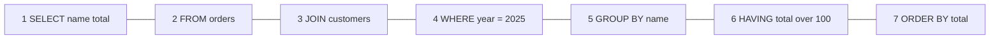
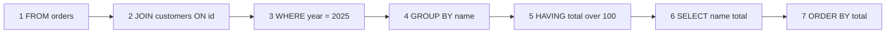
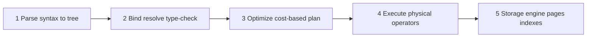

# Intro

The relational model organizes data into tables of rows and columns, with relationships expressed through keys rather than nesting. SQL (Structured Query Language) is the declarative standard for querying and manipulating that data: you describe _what_ you want, and the engine decides _how_ to get it. For backend engineers, SQL fluency is non-negotiable because most production systems store critical state in a relational database, and understanding how the engine actually executes queries is what separates correct code from performant code. Relational databases enforce a schema and provide ACID transactions by default across relational workloads; this lets you express complex multi-table queries without denormalizing your data model upfront.

<nav style="--card-accent: 249, 115, 22;" class="folder-structure-map" aria-label="SQL section map"><div class="folder-map-children"><article class="db-card folder-map-node"><div class="db-card-body"><div class="folder-map-node-heading"><span class="folder-map-node-title-group"><span class="db-card-icon" aria-hidden="true"><svg xmlns="http://www.w3.org/2000/svg" stroke-linejoin="round" stroke-linecap="round" stroke-width="2" stroke="currentColor" fill="none" viewBox="0 0 24 24"><path d="M14.5 2H6a2 2 0 0 0-2 2v16a2 2 0 0 0 2 2h12a2 2 0 0 0 2-2V7.5L14.5 2z"/><polyline points="14 2 14 8 20 8"/><line y2="13" y1="13" x2="8" x1="16"/><line y2="17" y1="17" x2="8" x1="16"/><line y2="9" y1="9" x2="8" x1="10"/></svg></span><span class="db-card-title" title="Database Locks">Database Locks</span></span></div><p class="db-card-summary">How the database engine serializes conflicting access to enforce isolation — lock modes, granularity, and escalation — and how locking differs from MVCC and from in-process locks.</p></div><span class="db-card-hit"><a class="internal-link" href="Home/Data Persistence/SQL/Database Locks.md" data-tooltip-position="top" aria-label="Database Locks">Database Locks</a></span></article><article class="db-card folder-map-node"><div class="db-card-body"><div class="folder-map-node-heading"><span class="folder-map-node-title-group"><span class="db-card-icon" aria-hidden="true"><svg xmlns="http://www.w3.org/2000/svg" stroke-linejoin="round" stroke-linecap="round" stroke-width="2" stroke="currentColor" fill="none" viewBox="0 0 24 24"><path d="M14.5 2H6a2 2 0 0 0-2 2v16a2 2 0 0 0 2 2h12a2 2 0 0 0 2-2V7.5L14.5 2z"/><polyline points="14 2 14 8 20 8"/><line y2="13" y1="13" x2="8" x1="16"/><line y2="17" y1="17" x2="8" x1="16"/><line y2="9" y1="9" x2="8" x1="10"/></svg></span><span class="db-card-title" title="Indexes">Indexes</span></span></div><p class="db-card-summary">A sorted B+ tree that avoids full table scans, trading write and storage overhead.</p></div><span class="db-card-hit"><a class="internal-link" href="Home/Data Persistence/SQL/Indexes.md" data-tooltip-position="top" aria-label="Indexes">Indexes</a></span></article><article class="db-card folder-map-node"><div class="db-card-body"><div class="folder-map-node-heading"><span class="folder-map-node-title-group"><span class="db-card-icon" aria-hidden="true"><svg xmlns="http://www.w3.org/2000/svg" stroke-linejoin="round" stroke-linecap="round" stroke-width="2" stroke="currentColor" fill="none" viewBox="0 0 24 24"><path d="M14.5 2H6a2 2 0 0 0-2 2v16a2 2 0 0 0 2 2h12a2 2 0 0 0 2-2V7.5L14.5 2z"/><polyline points="14 2 14 8 20 8"/><line y2="13" y1="13" x2="8" x1="16"/><line y2="17" y1="17" x2="8" x1="16"/><line y2="9" y1="9" x2="8" x1="10"/></svg></span><span class="db-card-title" title="Normalization Denormalization">Normalization Denormalization</span></span></div><p class="db-card-summary">Structuring a relational schema to remove redundancy, trading read performance for fewer anomalies.</p></div><span class="db-card-hit"><a class="internal-link" href="Home/Data Persistence/SQL/Normalization Denormalization.md" data-tooltip-position="top" aria-label="Normalization Denormalization">Normalization Denormalization</a></span></article><article class="db-card folder-map-node"><div class="db-card-body"><div class="folder-map-node-heading"><span class="folder-map-node-title-group"><span class="db-card-icon" aria-hidden="true"><svg xmlns="http://www.w3.org/2000/svg" stroke-linejoin="round" stroke-linecap="round" stroke-width="2" stroke="currentColor" fill="none" viewBox="0 0 24 24"><path d="M14.5 2H6a2 2 0 0 0-2 2v16a2 2 0 0 0 2 2h12a2 2 0 0 0 2-2V7.5L14.5 2z"/><polyline points="14 2 14 8 20 8"/><line y2="13" y1="13" x2="8" x1="16"/><line y2="17" y1="17" x2="8" x1="16"/><line y2="9" y1="9" x2="8" x1="10"/></svg></span><span class="db-card-title" title="Replication">Replication</span></span></div><p class="db-card-summary">Keeping copies of data on multiple nodes to spread reads and survive failures.</p></div><span class="db-card-hit"><a class="internal-link" href="Home/Data Persistence/SQL/Replication.md" data-tooltip-position="top" aria-label="Replication">Replication</a></span></article><article class="db-card folder-map-node"><div class="db-card-body"><div class="folder-map-node-heading"><span class="folder-map-node-title-group"><span class="db-card-icon" aria-hidden="true"><svg xmlns="http://www.w3.org/2000/svg" stroke-linejoin="round" stroke-linecap="round" stroke-width="2" stroke="currentColor" fill="none" viewBox="0 0 24 24"><path d="M14.5 2H6a2 2 0 0 0-2 2v16a2 2 0 0 0 2 2h12a2 2 0 0 0 2-2V7.5L14.5 2z"/><polyline points="14 2 14 8 20 8"/><line y2="13" y1="13" x2="8" x1="16"/><line y2="17" y1="17" x2="8" x1="16"/><line y2="9" y1="9" x2="8" x1="10"/></svg></span><span class="db-card-title" title="Sharding">Sharding</span></span></div><p class="db-card-summary">Horizontal partitioning that splits rows across independent instances to scale writes.</p></div><span class="db-card-hit"><a class="internal-link" href="Home/Data Persistence/SQL/Sharding.md" data-tooltip-position="top" aria-label="Sharding">Sharding</a></span></article></div><style>.db-card { position: relative; box-sizing: border-box; border: 1px solid var(--background-modifier-border, var(--lightgray, #d8dee9)); border-radius: var(--radius-m, 0.55rem); background-color: var(--background-primary, var(--light, #ffffff)); box-shadow: 0 0 0 rgba(0, 0, 0, 0); transition: border-color 150ms ease, background-color 150ms ease, box-shadow 150ms ease, transform 150ms ease; } .db-card::before { content: ""; position: absolute; inset: 0; border-radius: inherit; pointer-events: none; background: radial-gradient( ellipse 150% 175% at -22% -38%, rgba(var(--card-accent, 125, 125, 125), 0.09) 0%, rgba(var(--card-accent, 125, 125, 125), 0.04) 38%, rgba(var(--card-accent, 125, 125, 125), 0.014) 66%, transparent 90% ); opacity: 0.78; transition: opacity 150ms ease; } .db-card:hover, .db-card:focus-within { border-color: rgba(var(--card-accent, 125, 125, 125), 0.55); background-color: color-mix(in srgb, rgb(var(--card-accent, 125, 125, 125)) 2.5%, var(--background-primary, var(--light, #ffffff))); box-shadow: 0 0.45rem 1.1rem rgba(0, 0, 0, 0.08); transform: translateY(-0.125rem); } .db-card:hover::before, .db-card:focus-within::before { opacity: 1; } .db-card-body { position: relative; z-index: 0; box-sizing: border-box; display: flex; flex-direction: column; padding: var(--db-card-pad, 0.85rem 0.9rem); } .db-card-icon { display: flex; width: 1.1rem; height: 1.1rem; flex: 0 0 auto; color: rgb(var(--card-accent, 125, 125, 125)); } .db-card-icon svg { display: block; width: 100%; height: 100%; } .db-card-title { display: block; margin: 0; color: var(--text-normal, var(--dark, #1f2937)); font-size: 1rem; font-weight: 700; line-height: 1.25; } p.db-card-summary { margin: 0.45rem 0 0; color: var(--text-muted, var(--darkgray, #5f6b7a)); font-size: 0.875rem; line-height: 1.45; } .db-card-hit { position: absolute; inset: 0; z-index: 1; } .db-card-hit a { position: absolute; inset: 0; min-width: 2.75rem; min-height: 2.75rem; border-radius: var(--radius-m, 0.55rem); background: transparent !important; font-size: 0; } .db-card-hit a:focus-visible { outline: 2px solid rgb(var(--card-accent, 125, 125, 125)); outline-offset: -0.3rem; } @media (prefers-reduced-motion: reduce) { .db-card { transition: none; } .db-card::before { transition: none; } .db-card:hover, .db-card:focus-within { transform: none; } } .folder-structure-map { --card-accent: 16, 185, 129; --map-gap: 0.75rem; width: 100%; box-sizing: border-box; margin: 0.5rem 0 0.75rem; container-name: folder-map; container-type: inline-size; } .folder-map-children { display: flex; flex-wrap: wrap; gap: var(--map-gap); } .folder-map-node { flex: 1 1 12rem; min-height: 2.75rem; --db-card-pad: 0.5rem 0.75rem; } .folder-map-node .db-card-body { min-height: 2.75rem; justify-content: center; } .folder-map-node-heading { display: flex; align-items: center; justify-content: space-between; gap: 0.75rem; } .folder-map-node-title-group { display: flex; align-items: center; gap: 0.5rem; } .folder-map-node .db-card-title { white-space: nowrap; } .folder-map-node-count { display: block; flex: 0 0 auto; color: var(--text-muted, var(--darkgray, #5f6b7a)); font-size: 0.875rem; white-space: nowrap; } .folder-map-node .db-card-summary { display: none; } .folder-map-node-empty { cursor: default; } .folder-map-node-empty:hover, .folder-map-node-empty:focus-within { border-color: var(--background-modifier-border, var(--lightgray, #d8dee9)); background-color: var(--background-primary, var(--light, #ffffff)); box-shadow: 0 0 0 rgba(0, 0, 0, 0); transform: none; } .folder-map-node-empty:hover::before, .folder-map-node-empty:focus-within::before { opacity: 0.78; } .folder-structure-map .folder-map-node-empty .db-card-body { justify-content: center; align-items: center; text-align: center; } .folder-map-empty-text { color: var(--text-normal, var(--dark, #1f2937)); font-size: 1rem; font-weight: 400; font-style: normal; line-height: 1.25; } @container folder-map (min-width: 40rem) { .folder-map-node { min-height: 6rem; --db-card-pad: 0.85rem 0.9rem; } .folder-map-node .db-card-body { min-height: 6rem; justify-content: flex-start; } .folder-map-node .db-card-summary { display: block; } } @container folder-map (min-width: 64rem) { .folder-map-node, .folder-map-node .db-card-body { min-height: 6.75rem; } }</style></nav>

## Logical Query Execution Order

SQL is written in one order but executed in another.

- **How you WRITE it**



- **How the engine EXECUTES it**



### Rules of Thumb

Think of it as: **"The engine builds a table first, then decorates it."**

1. **FROM/JOIN first, SELECT near last.** The engine needs to know _which tables_ before it can do anything.
2. **WHERE before GROUP BY.** Filter rows _before_ grouping. Cheaper to discard rows early.
3. **HAVING is WHERE for groups.** Use it only when filtering on an aggregate; otherwise use `WHERE`.
4. **SELECT runs late.** Column aliases from `SELECT` are invisible to `WHERE` and `GROUP BY`, but visible to `ORDER BY`.
5. **ORDER BY then TOP/LIMIT last.** Sorting is expensive. Slicing happens only after everything else is settled.

A concrete example showing the difference between write order and execution order:

```sql
-- You write SELECT first, but the engine starts at FROM
SELECT department, COUNT(*) AS headcount
FROM employees
WHERE hire_date >= '2024-01-01'
GROUP BY department
HAVING COUNT(*) > 5
ORDER BY headcount DESC;

-- Engine order: FROM employees -> WHERE hire_date filter -> GROUP BY department
-- -> HAVING count filter -> SELECT columns -> ORDER BY headcount
-- The alias 'headcount' works in ORDER BY because SELECT runs before it.
-- The same alias fails in WHERE because SELECT hasn't run yet.
```

### Physical Query-Processing Pipeline

The logical clause order above is what a query _means_; the physical pipeline is how the engine actually _produces_ the result — and the cost-based optimizer is free to reorder work (swap join order, push predicates down, pick an index over a scan) as long as the logical result is preserved. The engine parses the text into a tree, binds names to real objects and type-checks them (SQL Server calls this algebrization; PostgreSQL runs a separate rewriter for views and rules), then the optimizer costs alternative plans and emits one plan of physical operators, which the executor runs against the storage engine's pages and indexes.



## Questions

> [!QUESTION]- What is the difference between WHERE and HAVING?
> `WHERE` filters rows before grouping and cannot reference aggregate functions. `HAVING` filters groups after `GROUP BY` and can use aggregates like `COUNT(*)` or `SUM(amount)`. If a condition doesn't depend on an aggregate, always put it in `WHERE` because it reduces the rows that enter the grouping step.

> [!QUESTION]- What is a stored procedure and how is it different from a function?
> A stored procedure executes multi-step logic, can modify data, and returns result sets or output parameters. A function returns a value (scalar or table) and is designed to be called inline in a query. In SQL Server, legacy (non-inlined) scalar UDFs are evaluated row-by-row and can inhibit parallel query plans. SQL Server 2019+ may inline eligible scalar UDFs, avoiding this. Inline table-valued functions (iTVFs) are expanded like macros and don't have the parallelism problem.

> [!QUESTION]- What is a Common Table Expression (CTE) and when should you use a temp table instead?
> A CTE is a named temporary result set defined with `WITH`, scoped to a single statement. It improves readability and enables recursive queries for hierarchical data. A CTE is generally treated like an inline view; don't assume it's materialized or reused across multiple references. If you reference the same CTE twice in a query, the optimizer may execute the underlying query twice. For guaranteed reuse of an expensive result, use a temp table instead.

> [!QUESTION]- What are SQL Server transaction isolation levels?
> The five isolation levels are: `READ UNCOMMITTED` (dirty reads allowed), `READ COMMITTED` (default, reads only committed data), `REPEATABLE READ` (re-reading a row returns the same data), `SERIALIZABLE` (full isolation, highest blocking), and `SNAPSHOT` (transaction-level consistent snapshot via row versioning in tempdb). Separately, Read Committed Snapshot Isolation (RCSI) is a database-level option (`ALTER DATABASE ... SET READ_COMMITTED_SNAPSHOT ON`) that makes `READ COMMITTED` use statement-level row versioning instead of shared locks, eliminating most reader-writer blocking without changing the isolation level name. Switching to `READ UNCOMMITTED` or `NOLOCK` is a common anti-pattern: you can read rolled-back, partially-written, or duplicate data.

> [!QUESTION]- How do you diagnose and optimize a slow query?
> Start with the execution plan (`SET STATISTICS IO ON` or the graphical plan in SSMS). Look for table scans on large tables (missing index), key lookups (a non-clustered index was used but the engine must go back to the clustered index, or the heap via RID lookup, for extra columns; fix by including those columns in the index), and fat arrows indicating large row estimates. Check for stale statistics (`UPDATE STATISTICS`) when cardinality estimates are wildly off. For repeated slow queries, investigate parameter sniffing: a plan compiled for one parameter value may be terrible for another, fixable with `OPTION (RECOMPILE)` or `OPTIMIZE FOR`.

## References

- [Query processing architecture guide (Microsoft Learn)](https://learn.microsoft.com/sql/relational-databases/query-processing-architecture-guide?view=sql-server-ver16) — parse → algebrize → optimize → execute; the source for the physical pipeline above.
- [Overview of PostgreSQL Internals (PostgreSQL docs)](https://www.postgresql.org/docs/current/overview.html) — the parser → rewriter → planner/optimizer → executor stages of a query's life.
- [WITH common\_table\_expression (T-SQL)](https://learn.microsoft.com/sql/t-sql/queries/with-common-table-expression-transact-sql?view=sql-server-ver16)
- [Joins — Microsoft Learn](https://learn.microsoft.com/sql/relational-databases/performance/joins?view=sql-server-ver16)
- [Execution plans overview](https://learn.microsoft.com/sql/relational-databases/performance/execution-plans?view=sql-server-ver16)
- [SQL Server index design guide](https://learn.microsoft.com/sql/relational-databases/sql-server-index-design-guide?view=sql-server-ver17)
- [Use The Index, Luke](https://use-the-index-luke.com/)
