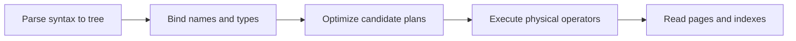

The relational model stores facts as rows, connects them through keys, and enforces declared constraints at the database boundary. SQL states the required result rather than an access path. The optimizer chooses scans, seeks, join order, and physical operators that preserve the query's semantics. A relational database is a strong default when integrity constraints, multi-row transactions, and new query combinations matter more than storing one access pattern in its final read shape.

<nav style="--card-accent: 249, 115, 22;" class="folder-structure-map" aria-label="SQL section map"><div class="folder-map-children"><article class="db-card folder-map-node"><div class="db-card-body"><div class="folder-map-node-heading"><span class="folder-map-node-title-group"><span class="db-card-icon" aria-hidden="true"><svg xmlns="http://www.w3.org/2000/svg" stroke-linejoin="round" stroke-linecap="round" stroke-width="2" stroke="currentColor" fill="none" viewBox="0 0 24 24"><path d="M14.5 2H6a2 2 0 0 0-2 2v16a2 2 0 0 0 2 2h12a2 2 0 0 0 2-2V7.5L14.5 2z"/><polyline points="14 2 14 8 20 8"/><line y2="13" y1="13" x2="8" x1="16"/><line y2="17" y1="17" x2="8" x1="16"/><line y2="9" y1="9" x2="8" x1="10"/></svg></span><span class="db-card-title" title="Database Locks">Database Locks</span></span></div><p class="db-card-summary">How the database engine serializes conflicting access to enforce isolation — lock modes, granularity, and escalation — and how locking differs from MVCC and from in-process locks.</p></div><span class="db-card-hit"><a class="internal-link" href="Home/Data Persistence/SQL/Database Locks.md" data-tooltip-position="top" aria-label="Database Locks">Database Locks</a></span></article><article class="db-card folder-map-node"><div class="db-card-body"><div class="folder-map-node-heading"><span class="folder-map-node-title-group"><span class="db-card-icon" aria-hidden="true"><svg xmlns="http://www.w3.org/2000/svg" stroke-linejoin="round" stroke-linecap="round" stroke-width="2" stroke="currentColor" fill="none" viewBox="0 0 24 24"><path d="M14.5 2H6a2 2 0 0 0-2 2v16a2 2 0 0 0 2 2h12a2 2 0 0 0 2-2V7.5L14.5 2z"/><polyline points="14 2 14 8 20 8"/><line y2="13" y1="13" x2="8" x1="16"/><line y2="17" y1="17" x2="8" x1="16"/><line y2="9" y1="9" x2="8" x1="10"/></svg></span><span class="db-card-title" title="Indexes">Indexes</span></span></div><p class="db-card-summary">Index structures across database engines and the operators, storage layouts, and mutation costs each structure serves.</p></div><span class="db-card-hit"><a class="internal-link" href="Home/Data Persistence/SQL/Indexes.md" data-tooltip-position="top" aria-label="Indexes">Indexes</a></span></article><article class="db-card folder-map-node"><div class="db-card-body"><div class="folder-map-node-heading"><span class="folder-map-node-title-group"><span class="db-card-icon" aria-hidden="true"><svg xmlns="http://www.w3.org/2000/svg" stroke-linejoin="round" stroke-linecap="round" stroke-width="2" stroke="currentColor" fill="none" viewBox="0 0 24 24"><path d="M14.5 2H6a2 2 0 0 0-2 2v16a2 2 0 0 0 2 2h12a2 2 0 0 0 2-2V7.5L14.5 2z"/><polyline points="14 2 14 8 20 8"/><line y2="13" y1="13" x2="8" x1="16"/><line y2="17" y1="17" x2="8" x1="16"/><line y2="9" y1="9" x2="8" x1="10"/></svg></span><span class="db-card-title" title="Normalization Denormalization">Normalization Denormalization</span></span></div><p class="db-card-summary">Structuring a relational schema to remove redundancy, trading read performance for fewer anomalies.</p></div><span class="db-card-hit"><a class="internal-link" href="Home/Data Persistence/SQL/Normalization Denormalization.md" data-tooltip-position="top" aria-label="Normalization Denormalization">Normalization Denormalization</a></span></article><article class="db-card folder-map-node"><div class="db-card-body"><div class="folder-map-node-heading"><span class="folder-map-node-title-group"><span class="db-card-icon" aria-hidden="true"><svg xmlns="http://www.w3.org/2000/svg" stroke-linejoin="round" stroke-linecap="round" stroke-width="2" stroke="currentColor" fill="none" viewBox="0 0 24 24"><path d="M14.5 2H6a2 2 0 0 0-2 2v16a2 2 0 0 0 2 2h12a2 2 0 0 0 2-2V7.5L14.5 2z"/><polyline points="14 2 14 8 20 8"/><line y2="13" y1="13" x2="8" x1="16"/><line y2="17" y1="17" x2="8" x1="16"/><line y2="9" y1="9" x2="8" x1="10"/></svg></span><span class="db-card-title" title="Replication">Replication</span></span></div><p class="db-card-summary">Keeping copies of data on multiple nodes to spread reads and survive failures.</p></div><span class="db-card-hit"><a class="internal-link" href="Home/Data Persistence/SQL/Replication.md" data-tooltip-position="top" aria-label="Replication">Replication</a></span></article><article class="db-card folder-map-node"><div class="db-card-body"><div class="folder-map-node-heading"><span class="folder-map-node-title-group"><span class="db-card-icon" aria-hidden="true"><svg xmlns="http://www.w3.org/2000/svg" stroke-linejoin="round" stroke-linecap="round" stroke-width="2" stroke="currentColor" fill="none" viewBox="0 0 24 24"><path d="M14.5 2H6a2 2 0 0 0-2 2v16a2 2 0 0 0 2 2h12a2 2 0 0 0 2-2V7.5L14.5 2z"/><polyline points="14 2 14 8 20 8"/><line y2="13" y1="13" x2="8" x1="16"/><line y2="17" y1="17" x2="8" x1="16"/><line y2="9" y1="9" x2="8" x1="10"/></svg></span><span class="db-card-title" title="Sharding">Sharding</span></span></div><p class="db-card-summary">Horizontal partitioning strategies, workload fit, and the operational threshold for splitting rows across database instances.</p></div><span class="db-card-hit"><a class="internal-link" href="Home/Data Persistence/SQL/Sharding.md" data-tooltip-position="top" aria-label="Sharding">Sharding</a></span></article></div><style>.db-card { position: relative; box-sizing: border-box; border: 1px solid var(--background-modifier-border, var(--lightgray, #d8dee9)); border-radius: var(--radius-m, 0.55rem); background-color: var(--background-primary, var(--light, #ffffff)); box-shadow: 0 0 0 rgba(0, 0, 0, 0); transition: border-color var(--dur-2, 140ms) var(--ease-out, cubic-bezier(0.22, 1, 0.36, 1)), background-color var(--dur-2, 140ms) var(--ease-out, cubic-bezier(0.22, 1, 0.36, 1)), box-shadow var(--dur-2, 140ms) var(--ease-out, cubic-bezier(0.22, 1, 0.36, 1)), transform var(--dur-2, 140ms) var(--ease-out, cubic-bezier(0.22, 1, 0.36, 1)); } .db-card::before { content: ""; position: absolute; inset: 0; border-radius: inherit; pointer-events: none; background: radial-gradient( ellipse 150% 175% at -22% -38%, rgba(var(--card-accent, 125, 125, 125), 0.09) 0%, rgba(var(--card-accent, 125, 125, 125), 0.04) 38%, rgba(var(--card-accent, 125, 125, 125), 0.014) 66%, transparent 90% ); opacity: 0.78; transition: opacity var(--dur-2, 140ms) var(--ease-out, cubic-bezier(0.22, 1, 0.36, 1)); } .db-card:hover, .db-card:focus-within { border-color: rgba(var(--card-accent, 125, 125, 125), 0.55); background-color: color-mix(in srgb, rgb(var(--card-accent, 125, 125, 125)) 2.5%, var(--background-primary, var(--light, #ffffff))); box-shadow: 0 0.45rem 1.1rem rgba(0, 0, 0, 0.08); transform: translateY(-0.125rem); } .db-card:hover::before, .db-card:focus-within::before { opacity: 1; } .db-card-body { position: relative; z-index: 0; box-sizing: border-box; display: flex; flex-direction: column; padding: var(--db-card-pad, 0.85rem 0.9rem); } .db-card-icon { display: flex; width: 1.1rem; height: 1.1rem; flex: 0 0 auto; color: rgb(var(--card-accent, 125, 125, 125)); } .db-card-icon svg { display: block; width: 100%; height: 100%; } .db-card-title { display: block; margin: 0; color: var(--text-normal, var(--dark, #1f2937)); font-size: 1rem; font-weight: 700; line-height: 1.25; } p.db-card-summary { margin: 0.45rem 0 0; color: var(--text-muted, var(--darkgray, #5f6b7a)); font-size: 0.875rem; line-height: 1.45; } .db-card-hit { position: absolute; inset: 0; z-index: 1; } .db-card-hit a { position: absolute; inset: 0; min-width: 2.75rem; min-height: 2.75rem; border-radius: var(--radius-m, 0.55rem); background: transparent !important; font-size: 0; } .db-card-hit a:focus-visible { outline: 2px solid rgb(var(--card-accent, 125, 125, 125)); outline-offset: -0.3rem; } @keyframes db-card-in { from { opacity: 0; transform: translateY(6px); } } .dc-topic-grid .db-card, .folder-map-children .db-card { animation: db-card-in var(--dur-3, 220ms) var(--ease-spring, cubic-bezier(0.34, 1.56, 0.64, 1)) backwards; } .dc-topic-grid .db-card:nth-child(2), .folder-map-children .db-card:nth-child(2) { animation-delay: calc(var(--stagger, 28ms) * 1); } .dc-topic-grid .db-card:nth-child(3), .folder-map-children .db-card:nth-child(3) { animation-delay: calc(var(--stagger, 28ms) * 2); } .dc-topic-grid .db-card:nth-child(4), .folder-map-children .db-card:nth-child(4) { animation-delay: calc(var(--stagger, 28ms) * 3); } .dc-topic-grid .db-card:nth-child(5), .folder-map-children .db-card:nth-child(5) { animation-delay: calc(var(--stagger, 28ms) * 4); } .dc-topic-grid .db-card:nth-child(6), .folder-map-children .db-card:nth-child(6) { animation-delay: calc(var(--stagger, 28ms) * 5); } .dc-topic-grid .db-card:nth-child(n+7), .folder-map-children .db-card:nth-child(n+7) { animation-delay: calc(var(--stagger, 28ms) * 6); } @media (prefers-reduced-motion: reduce) { .db-card { transition: none; } .db-card::before { transition: none; } .db-card:hover, .db-card:focus-within { transform: none; } .dc-topic-grid .db-card, .folder-map-children .db-card { animation: none; } } .folder-structure-map { --card-accent: 16, 185, 129; --map-gap: 0.75rem; width: 100%; box-sizing: border-box; margin: 0.5rem 0 0.75rem; container-name: folder-map; container-type: inline-size; } .folder-map-children { display: flex; flex-wrap: wrap; gap: var(--map-gap); } .folder-map-node { flex: 1 1 12rem; min-height: 2.75rem; --db-card-pad: 0.5rem 0.75rem; } .folder-map-node .db-card-body { min-height: 2.75rem; justify-content: center; } .folder-map-node-heading { display: flex; align-items: center; justify-content: space-between; gap: 0.75rem; } .folder-map-node-title-group { display: flex; align-items: center; gap: 0.5rem; } .folder-map-node .db-card-title { white-space: nowrap; } .folder-map-node-count { display: block; flex: 0 0 auto; color: var(--text-muted, var(--darkgray, #5f6b7a)); font-size: 0.875rem; white-space: nowrap; } .folder-map-node .db-card-summary { display: none; } .folder-map-node-empty { cursor: default; } .folder-map-node-empty:hover, .folder-map-node-empty:focus-within { border-color: var(--background-modifier-border, var(--lightgray, #d8dee9)); background-color: var(--background-primary, var(--light, #ffffff)); box-shadow: 0 0 0 rgba(0, 0, 0, 0); transform: none; } .folder-map-node-empty:hover::before, .folder-map-node-empty:focus-within::before { opacity: 0.78; } .folder-structure-map .folder-map-node-empty .db-card-body { justify-content: center; align-items: center; text-align: center; } .folder-map-empty-text { color: var(--text-normal, var(--dark, #1f2937)); font-size: 1rem; font-weight: 400; font-style: normal; line-height: 1.25; } @container folder-map (min-width: 40rem) { .folder-map-node { min-height: 6rem; --db-card-pad: 0.85rem 0.9rem; } .folder-map-node .db-card-body { min-height: 6rem; justify-content: flex-start; } .folder-map-node .db-card-summary { display: block; } } @container folder-map (min-width: 64rem) { .folder-map-node, .folder-map-node .db-card-body { min-height: 6.75rem; } }</style></nav>

# Relational Boundary

Relational storage fits data whose validity depends on relationships the database must reject when broken. It also supports several row changes under one commit decision and lets new joins emerge without rebuilding the stored shape. Denormalization can remove an expensive join from a measured hot path, but the duplicate state creates a write-side consistency obligation. [[Data Persistence/SQL/Normalization Denormalization|Normalization and denormalization]] explains how keys and dependencies set that boundary.

# Query Processing and Joins

SQL has declarative semantics and a separate physical plan. A useful logical order is `FROM`/`JOIN` → `WHERE` → `GROUP BY` → `HAVING` → `SELECT` → `ORDER BY` → `LIMIT`/`TOP`. The optimizer may push predicates or reorder joins physically only when duplicates, three-valued `NULL` logic, and the final result remain equivalent.

```sql
SELECT department, COUNT(*) AS headcount
FROM employees
WHERE hire_date >= DATE '2024-01-01'
GROUP BY department
HAVING COUNT(*) > 5
ORDER BY headcount DESC;
```

`WHERE` cannot use `headcount` because the output alias is defined later. `ORDER BY` generally can. Alias visibility is dialect-specific. PostgreSQL permits a simple output alias in `GROUP BY`, while SQL Server requires the original expression. Portable SQL repeats the grouped or aggregate expression.


```mermaid
graph LR
    P1["Parse syntax to tree"] --> P2["Bind names and types"] --> P3["Optimize candidate plans"] --> P4["Execute physical operators"] --> P5["Read pages and indexes"]
```

Cardinality estimates connect query semantics to physical cost. If a predicate is estimated at 10 rows but returns 1,000,000, a nested loop or join order that appeared cheap can repeat millions of probes or force downstream spills. The result remains correct. The chosen work is wrong for the actual row counts.

# Join Semantics

Suppose `customers` contains Ada and Lin, while `orders` contains two rows for Ada and none for Lin. A left join returns Ada twice and fills Lin's missing order columns with `NULL`. A join combines matching rows. It does not deduplicate them.

```sql
SELECT c.name, o.total
FROM customers AS c
LEFT JOIN orders AS o ON o.customer_id = c.id
ORDER BY c.id, o.total;
```

```text
name | total
Ada  | 40
Ada  | 70
Lin  | NULL
```

Putting `o.total >= 50` in `ON` preserves Lin as an unmatched left row. Putting it in `WHERE` removes Lin because `NULL >= 50` is unknown.

![[Assets/Data Persistence/Data Persistence-SQL-18120000.png|theme-aware]]

| Physical join | Strong fit | Cost to watch |
| --- | --- | --- |
| Nested loop | Small outer input with indexed inner probes | Repeated inner work when estimates are wrong |
| Hash join | Large equality joins with enough memory | Build memory and spills |
| Merge join | Inputs already ordered on the join key | Sorting when order is absent |

No physical join is universally fastest. Input size, ordering, row width, indexes, available memory, and cache state determine which operator is cheapest for one execution.

# Transactions and Scale

[[Data Persistence/SQL/Database Locks|Database locks]] and MVCC enforce isolation inside one database. That note also contrasts pessimistic locks with optimistic version predicates for stale application writes. [[Data Persistence/SQL/Replication|Replication]] copies data for availability and eligible read traffic, while [[Data Persistence/SQL/Sharding|sharding]] partitions ownership when one primary can no longer carry the measured write or storage load.

# Questions

> [!QUESTION]- What is the difference between WHERE and HAVING?
> `WHERE` filters source rows before grouping and cannot use aggregate results. `HAVING` filters groups after `GROUP BY` and can test aggregates such as `COUNT(*)`. A non-aggregate predicate belongs in `WHERE` when it can reduce the rows entering the grouping step without changing semantics.

> [!QUESTION]- What is the difference between a stored procedure and a function?
> A stored procedure runs as a separate database operation. It can execute several statements, change data, and return result sets or output parameters. A function returns a scalar or table value and can be used inside a query, so the database limits what it can do. SQL Server may inline an eligible scalar UDF. Otherwise, the function may run once per row and limit plan choices such as parallelism.

> [!QUESTION]- What is a Common Table Expression (CTE), and when is a temp table a better fit?
> A CTE gives a name to a query result for one statement. It does not automatically store the result or guarantee that repeated references reuse the same work. A temp table is usually better when the intermediate result must be inspected, indexed, reused across statements, or optimized with its own statistics.

> [!QUESTION]- What are SQL Server transaction isolation levels?
> SQL Server provides `READ UNCOMMITTED`, `READ COMMITTED`, `REPEATABLE READ`, `SERIALIZABLE`, and `SNAPSHOT`. Enabling Read Committed Snapshot Isolation changes `READ COMMITTED` reads to statement-level row versions. `NOLOCK` is not a general performance switch: it permits observations of rolled-back work and can return missing or duplicate rows while data changes concurrently.

# References

- [Intro to SQL](https://www.khanacademy.org/computing/computer-programming/sql)
- [PostgreSQL table expressions](https://www.postgresql.org/docs/current/queries-table-expressions.html)
