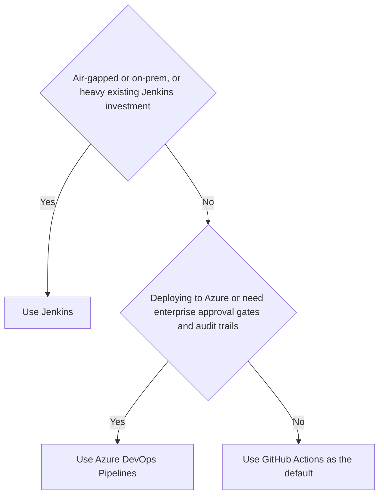

# CI/CD Tools

CI/CD pipelines automate the path from code commit to production deployment. CI (Continuous Integration) runs builds and tests on every commit to catch regressions early. CD (Continuous Delivery/Deployment) automates the release process so that every passing build can be deployed with minimal manual intervention.

The three dominant tools for .NET teams are GitHub Actions, Azure DevOps Pipelines, and Jenkins. They solve the same problem with different tradeoffs around hosting, cost, and ecosystem integration.

> [!NOTE]
> **The two "CD"s are different.** _Continuous **Delivery**_ means every passing build is _automatically made ready_ to release, but a human clicks the button to push to production (a manual approval gate). _Continuous **Deployment**_ removes that gate — every commit that passes the pipeline goes to production automatically. Deployment requires more trust in your tests, observability, and rollback (it pairs naturally with [[DevOps/Deployment Strategies/Deployment Strategies|canary/blue-green deployments]] and feature flags). Most teams practice continuous _delivery_; continuous _deployment_ is the further, optional step.

## CI, Delivery, and Deployment

Use one immutable artifact to make the boundary operational. A commit produces `checkout-api@sha256:8f31c20000000000000000000000000000000000000000000000000000000000`; CI compiles it, runs tests, scans dependencies, and publishes that exact digest. Continuous delivery promotes the same digest through staging and leaves production behind an approval gate. Continuous deployment removes that last human gate when automated checks, rollback, and on-call ownership are good enough. Rebuilding after approval breaks the evidence chain because production no longer runs the bytes that passed the earlier checks.

![[Assets/System Design 101/f804ed9753569b53ead6d128845cb77c151b4b3482a716fd05ae267e1bb60175.png]]

## Commit-to-Production Stages and Gates

| Stage | Input and output | Gate | Failure response |
| --- | --- | --- | --- |
| Build | Source commit to signed package or image digest | Reproducible build and provenance | Stop; do not publish a partial artifact |
| Verify | Same digest plus unit, integration, security, and policy results | Required evidence passes | Fix the commit or explicitly accept tracked risk |
| Deploy | Same digest plus environment configuration | Readiness and smoke checks | Remove the new instances from traffic |
| Release | Healthy deployment plus traffic or feature policy | SLO and business guardrails | Shift traffic back or disable the feature |

Build-time checks prove properties of the artifact. Deployment-time checks prove the artifact can start and serve in a particular environment. Before promotion, record the previous digest, backward-compatible database state, rollback command, and the metric threshold that stops the rollout. A pipeline that cannot identify the running digest or reverse its last traffic change is not ready for unattended deployment.

![[Assets/System Design 101/809457b84cae7c3fc6f3d613b0868c197439c85837613e6c3ed314485f4608a4.png]]

## Netflix Delivery Pipeline Case Study

Netflix's published pipeline is useful as a historical trace, not a current tool prescription. A Gradle build produced application packages; Bakery created an immutable Amazon Machine Image; Spinnaker coordinated deployment; Atlas supplied telemetry; Kayenta compared canary and baseline metrics; PagerDuty carried failed automation into incident response. Each boundary exchanged an immutable artifact or explicit evidence instead of rebuilding the application.

The transferable rule is to separate packaging, rollout, analysis, and response. Adopt the named stack only when its operational cost fits; a smaller team can preserve the same boundaries with a container registry, a managed deployment service, an SLO query, and one paging system.

![[Assets/System Design 101/150184c4075c71457db5a4e85b4cfc57410246975c11291af2560a7228efd2d5.png]]

## GitHub Actions

**Architecture**: YAML workflows stored in `.github/workflows/`. Triggered by events (push, PR, schedule, manual). Runs on GitHub-hosted runners (Ubuntu, Windows, macOS) or self-hosted runners.

```yaml
name: Build and Test
on:
  push:
    branches: [main]
  pull_request:
    branches: [main]
jobs:
  build:
    runs-on: ubuntu-latest
    steps:
    - uses: actions/checkout@v4
    - uses: actions/setup-dotnet@v4
      with:
        dotnet-version: '8.0.x'
    - run: dotnet restore
    - run: dotnet build --no-restore
    - run: dotnet test --no-build --verbosity normal
```

**Strengths**: Zero infrastructure to manage. Tight GitHub integration (PR checks, branch protection, OIDC for cloud auth). Marketplace with 20k+ actions. Free for public repos; 2,000 minutes/month free for private repos.

**Weaknesses**: GitHub-hosted runners have limited customization. Complex pipelines with many jobs can be slow to iterate on. Vendor lock-in to GitHub.

**Best for**: Teams already on GitHub, open-source projects, and teams that want zero infrastructure overhead.

## Azure DevOps Pipelines

**Architecture**: YAML pipelines stored in the repo or classic UI-based pipelines. Runs on Microsoft-hosted agents or self-hosted agents. Integrates with Azure Boards, Repos, Artifacts, and Test Plans.

```yaml
trigger:
  branches:
    include:
    - main
pool:
  vmImage: 'ubuntu-latest'
steps:
- task: UseDotNet@2
  inputs:
    version: '8.0.x'
- script: dotnet restore
- script: dotnet build --no-restore
- script: dotnet test --no-build
- task: PublishTestResults@2
  inputs:
    testResultsFormat: 'VSTest'
    testResultsFiles: '**/*.trx'
```

**Strengths**: Deep Azure integration (deploy to AKS, App Service, Azure Functions natively). Built-in test result publishing and code coverage. Enterprise features (approvals, environments, deployment gates). Works with any git host.

**Weaknesses**: More complex to set up than GitHub Actions. UI can be confusing (classic vs YAML pipelines). Slower iteration cycle for pipeline changes.

**Best for**: Enterprise .NET teams deploying to Azure, organizations that need approval gates and audit trails, teams using Azure Boards for work tracking.

## Jenkins

**Architecture**: Self-hosted Java application. Pipelines defined in `Jenkinsfile` (Groovy DSL). Massive plugin ecosystem (1,800+ plugins). Runs on your own infrastructure.

```groovy
pipeline {
    agent any
    stages {
        stage('Build') {
            steps {
                sh 'dotnet restore'
                sh 'dotnet build --no-restore'
            }
        }
        stage('Test') {
            steps {
                sh 'dotnet test --no-build'
            }
        }
    }
}
```

**Strengths**: Full control over infrastructure. No per-minute costs. Runs anywhere (on-prem, air-gapped environments). Huge plugin ecosystem.

**Weaknesses**: High operational overhead (upgrades, plugin compatibility, security patches). Groovy DSL is verbose and error-prone. No built-in secret management. Requires dedicated DevOps expertise to maintain.

**Best for**: On-premises or air-gapped environments, organizations with existing Jenkins investment, teams that need full infrastructure control.

## Comparison

| Tool | Hosting | .NET Support | Docker Native | Cost Model | Best For |
|------|---------|-------------|---------------|------------|----------|
| GitHub Actions | Cloud (GitHub) | Excellent | Yes | Per-minute (free tier) | GitHub-native teams |
| Azure DevOps | Cloud (Microsoft) | Excellent | Yes | Per-parallel-job | Enterprise Azure teams |
| Jenkins | Self-hosted | Good (plugins) | Yes (plugin) | Infrastructure cost | On-prem, air-gapped |

## Decision Rule



## Pitfalls

### Secret Leakage in Logs

**What goes wrong**: a pipeline step prints environment variables or request bodies to the log, exposing API keys, connection strings, or tokens. CI logs are often accessible to all team members and sometimes public.

**Why it happens**: debugging steps (`env`, `printenv`, verbose HTTP logging) are added during troubleshooting and not removed.

**Mitigation**: use the CI platform's secret masking (GitHub Actions masks secrets automatically; Azure DevOps masks pipeline variables marked as secret). Never print environment variables in pipeline steps. Audit pipeline logs before making a repo public. **Better still, eliminate long-lived cloud credentials entirely with OIDC**: GitHub Actions and Azure DevOps can exchange a short-lived, workload-scoped token with AWS/Azure/GCP via federated identity (workload identity federation), so there's no static `AWS_SECRET_ACCESS_KEY` or service-principal secret stored in the repo to leak or rotate.

### Flaky Tests Blocking Deploys

**What goes wrong**: a test that passes 90% of the time fails randomly in CI, blocking the deployment pipeline. The team learns to re-run the pipeline instead of fixing the test, eroding trust in CI.

**Why it happens**: tests depend on timing, external services, or shared state that is not properly isolated.

**Mitigation**: quarantine flaky tests immediately (mark as skipped with a tracking issue). Fix the root cause: use test containers for external dependencies, mock time-dependent behavior, and isolate shared state between tests.

### Config Drift Between Environments

**What goes wrong**: the pipeline deploys successfully to staging but fails in production because of a configuration difference (different connection string format, missing environment variable, different secret name).

**Mitigation**: use infrastructure-as-code (Bicep, Terraform) to define environment configuration. Promote the same artifact through environments — never rebuild for production. Use environment-specific variable groups in Azure DevOps or environment secrets in GitHub Actions.

## Questions

> [!QUESTION]- What makes a CI pipeline 'good' vs 'fast but unreliable'?
> A good CI pipeline: (1) runs in < 10 minutes (fast enough to not block the developer), (2) has zero flaky tests (every failure is a real failure), (3) masks secrets and never logs sensitive data, (4) promotes the same artifact through environments (no rebuilds), (5) has clear failure messages that point to the root cause. A fast but unreliable pipeline trains developers to ignore failures and re-run instead of fix — which defeats the purpose of CI.

## References

- [GitHub Actions documentation](https://docs.github.com/en/actions) — official GitHub Actions docs; covers workflow syntax, runners, secrets, and OIDC authentication
- [Azure DevOps Pipelines](https://learn.microsoft.com/en-us/azure/devops/pipelines/) — official Azure DevOps docs; covers YAML pipelines, environments, and Azure deployment tasks
- [Martin Fowler — Continuous Integration](https://martinfowler.com/articles/continuousIntegration.html) — canonical CI definition and practices by the originator of the concept
- [Jenkins documentation](https://www.jenkins.io/doc/) — official Jenkins docs; covers pipeline syntax, plugins, and administration
- [SLSA provenance](https://slsa.dev/spec/v1.0/provenance) — the supply-chain specification for binding an artifact to its build inputs and process.
- [Netflix: Spinnaker, global continuous delivery](https://netflixtechblog.com/spinnaker-global-continuous-delivery-a4f7578067b7) — primary description of Netflix's delivery platform and immutable-image flow.
- [Netflix: Automated Canary Analysis with Kayenta](https://netflixtechblog.com/automated-canary-analysis-at-netflix-with-kayenta-3260bc7acc69) — primary explanation of metric-based canary analysis.
- [ByteByteGo: CI/CD simplified](https://github.com/ByteByteGoHq/system-design-101/blob/b28380a4710c5ec9638ec037d4168e288f334cba/data/guides/cicd-simplified-visual-guide.md) — source contribution for the CI, delivery, and deployment boundary.
- [ByteByteGo: CI/CD pipeline](https://github.com/ByteByteGoHq/system-design-101/blob/b28380a4710c5ec9638ec037d4168e288f334cba/data/guides/cicd-pipeline-explained-in-simple-terms.md) — source contribution for artifact lineage, stages, and gates.
- [ByteByteGo: Netflix CI/CD pipeline](https://github.com/ByteByteGoHq/system-design-101/blob/b28380a4710c5ec9638ec037d4168e288f334cba/data/guides/netflix-tech-stack-cicd-pipeline.md) — source contribution for the bounded Netflix case study.
