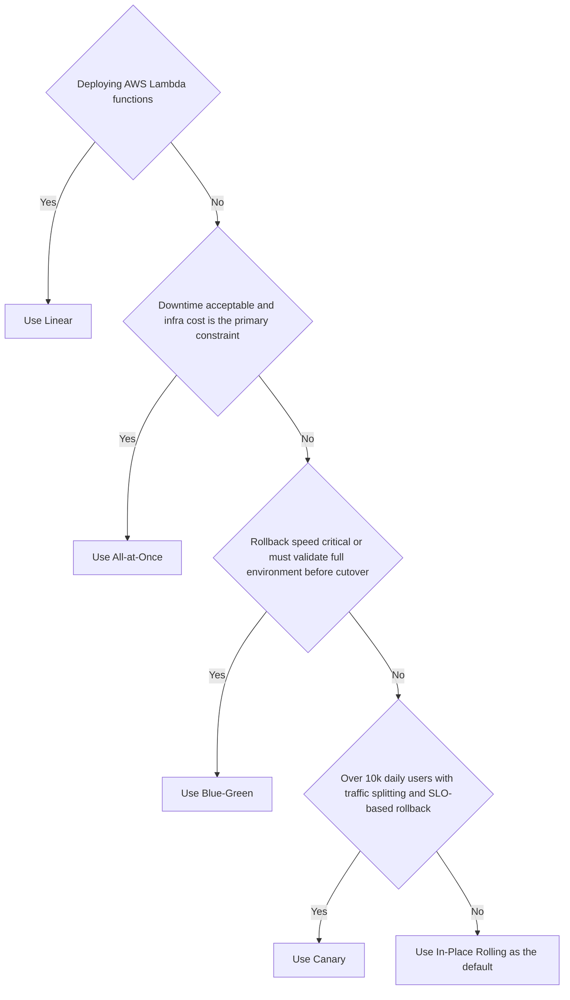

# Deployment Strategies

Deployment strategies control how new versions of software reach production. The right strategy balances risk tolerance, infrastructure cost, and rollback speed. A strategy is only as good as your monitoring — without metrics and alerts, you cannot detect a bad deploy fast enough to stop it.

The five main strategies differ on one axis: **how much of your fleet runs the new version at any given moment** during the rollout.

## Deployment, Traffic, Experiment, and Feature Boundaries

These controls solve different problems and should be composed deliberately:

| Control | Changes | Proves | Rollback |
| --- | --- | --- | --- |
| Rolling or recreate deployment | Which artifact runs on instances | The new process starts and stays ready | Redeploy the prior artifact |
| Blue-green or canary traffic shift | Which healthy version receives requests | Production behavior at controlled blast radius | Reweight traffic |
| Shadow traffic | A copy of requests reaches a non-serving version | Compatibility, performance, and side effects under realistic input | Stop mirroring |
| A/B experiment | Stable cohorts receive different experiences | A causal product hypothesis | End assignment or select a winner |
| Feature flag | Code path exposure inside a deployed artifact | Controlled release independent of deployment | Disable the flag |

Every rollout needs backward-compatible database changes, enough spare capacity for overlap, a previous artifact that still works, and an SLO threshold with an observation window. Clean up old ReplicaSets, environments, experiment assignments, and flags after the decision; otherwise the safety mechanisms become permanent operational state.

## All-at-Once (Big Bang)

Replace every instance simultaneously. The old version stops; the new version starts.

**Mechanism**: Stop all instances → deploy new artifact → start all instances. In Kubernetes, set the Deployment strategy to `Recreate`; the controller terminates the old Pods before it creates Pods for the new revision.

```yaml
strategy:
  type: Recreate
```

**Scenario**: A startup with a single EC2 instance and a 2 AM maintenance window. Downtime is acceptable; infrastructure cost is the constraint.

**Risks**:

- Full downtime during the swap
- If the new version is broken, 100% of users are affected immediately
- Rollback requires another full deploy cycle

**When to use**: Internal tools, dev/staging environments, or services where brief downtime is contractually acceptable and infrastructure cost matters more than availability.

## In-Place (Rolling)

Replace instances one at a time (or in small batches), keeping the rest serving traffic.

**Mechanism**: Take one instance out of the load balancer → deploy new version → health check → put back in → repeat. Kubernetes `RollingUpdate` with `maxUnavailable: 1` and `maxSurge: 1` does this natively.

```yaml
strategy:
  type: RollingUpdate
  rollingUpdate:
    maxUnavailable: 1
    maxSurge: 1
```

**Scenario**: A SaaS app with 10 pods. Rolling update replaces pods one by one over ~5 minutes. At any point, 9 pods serve traffic. Users see no downtime.

**Risks**:

- During rollout, old and new versions run simultaneously — your API must be backward-compatible (no breaking schema changes)
- Rollback requires another rolling update in reverse (slow)
- If a bug only manifests under load, it may not surface until most pods are updated

**When to use**: Default strategy for most web services. Works well when you can guarantee API backward compatibility between adjacent versions.

## Blue-Green

Maintain two identical environments (blue = current, green = new). Switch traffic atomically by updating the load balancer.

**Mechanism**: Blue serves 100% of traffic. Deploy new version to green. Run smoke tests on green. Flip the load balancer to green. Blue becomes the standby.

```bash
# AWS ALB target group swap
aws elbv2 modify-listener \
  --listener-arn $LISTENER_ARN \
  --default-actions Type=forward,TargetGroupArn=$GREEN_TG_ARN
```

**Scenario**: A fintech app processing payments. Zero-downtime is non-negotiable. Blue-green lets you validate green with synthetic transactions before switching. If green fails, flip back to blue in seconds.

**Risks**:

- Double infrastructure cost during the transition (two full environments)
- Database migrations must be backward-compatible with both versions simultaneously
- Session state tied to blue instances is lost on cutover (use external session stores)

**When to use**: High-availability services where rollback speed matters more than infrastructure cost. Ideal when you have stateless services and an external session/state store.

## Canary

Route a small percentage of real traffic to the new version, monitor, then gradually increase.

**Mechanism**: Deploy new version alongside old. Route 5% of traffic to new (by weight in the load balancer or service mesh). Monitor error rates, latency, and business metrics. If healthy, increase to 20% → 50% → 100%. If unhealthy, route 0% back to old.

```yaml
# Kubernetes with Argo Rollouts
strategy:
  canary:
    steps:
    - setWeight: 5
    - pause: {duration: 10m}
    - setWeight: 20
    - pause: {duration: 10m}
    - setWeight: 100
```

**Scenario**: An e-commerce platform with 500k daily users. A new checkout flow is deployed to 5% of users. After 10 minutes, error rate on the canary is 0.3% vs 0.1% baseline — automated rollback triggers. Only 25k users were exposed to the bug.

**Risks**:

- Requires sophisticated traffic splitting (service mesh, weighted load balancer, or feature flags)
- Monitoring must be granular enough to detect issues at 5% traffic
- Longer rollout window means old and new versions coexist for hours

**When to use**: High-traffic services where you want real-user validation before full rollout. Pairs well with feature flags and automated rollback on SLO breach.

### Netflix Canary Case Study

Netflix combined failure-seeking operational practice with automated progressive delivery. Spinnaker controlled the rollout, Atlas provided time-series measurements, and Kayenta scored the canary against a baseline before traffic advanced. The useful mechanism is the closed loop: an explicit cohort, comparable telemetry, a pass/fail rule, and an automatic traffic reversal. The tool names are historical evidence, not a recommendation to reproduce Netflix's stack.

![[Assets/System Design 101/150184c4075c71457db5a4e85b4cfc57410246975c11291af2560a7228efd2d5.png]]

## Shadow Traffic and A/B Experiments

Kubernetes Deployments directly implement `Recreate` and `RollingUpdate`; they do not by themselves provide blue-green, canary analysis, shadowing, or experiment assignment. Those need traffic infrastructure such as a gateway, service mesh, progressive-delivery controller, or application feature system.

Shadow requests must not create production side effects: suppress writes, payments, messages, and emails, or route them to isolated dependencies. A/B assignment must be sticky and measured long enough for statistical power. Use shadowing to validate technical behavior, canary to protect reliability, and A/B only after the candidate is operationally safe.

## Linear

Increase traffic to the new version in fixed increments on a fixed schedule (e.g., +10% every 10 minutes).

**Mechanism**: Same as canary but automated and time-driven rather than metric-driven. AWS CodeDeploy's `Linear10PercentEvery10Minutes` is the canonical implementation.

**Scenario**: A Lambda function update. CodeDeploy shifts 10% of invocations to the new version every 10 minutes. After 100 minutes, 100% of traffic is on the new version. CloudWatch alarms trigger automatic rollback if error rate spikes.

**Risks**:

- Less adaptive than canary — traffic increases on schedule even if early signals are ambiguous
- Requires automated rollback hooks (CloudWatch alarms → CodeDeploy rollback)
- Not suitable for services where 10% traffic is too small to surface bugs

**When to use**: Serverless functions and AWS Lambda deployments where CodeDeploy integration is native. Good when you want predictable rollout timelines over adaptive ones.

## Comparison

| Strategy | Downtime | Rollback Speed | Infra Cost | Risk Level | Best For |
|----------|----------|----------------|------------|------------|----------|
| All-at-Once | Full | Slow (redeploy) | Lowest | Highest | Dev/staging, internal tools |
| In-Place (Rolling) | None | Slow (re-roll) | Low | Medium | Default for most web services |
| Blue-Green | None | Instant (flip) | 2× during deploy | Low | High-availability, payment flows |
| Canary | None | Fast (re-weight) | Low–medium | Lowest | High-traffic, user-facing features |
| Linear | None | Fast (re-weight) | Low | Low | Lambda, AWS CodeDeploy workloads |

## Decision Rule



## References

- [Martin Fowler — BlueGreenDeployment](https://martinfowler.com/bliki/BlueGreenDeployment.html) — canonical definition of blue-green by the originator; explains the environment swap pattern and database migration considerations
- [Martin Fowler — CanaryRelease](https://martinfowler.com/bliki/CanaryRelease.html) — canonical canary definition; covers traffic splitting, monitoring requirements, and when canary is worth the complexity
- [AWS — Deployment Methods](https://docs.aws.amazon.com/whitepapers/latest/practicing-continuous-integration-continuous-delivery/deployment-methods.html) — AWS whitepaper covering all major strategies with diagrams and AWS-specific implementation guidance
- [Kubernetes — Rolling Updates](https://kubernetes.io/docs/tutorials/kubernetes-basics/update/update-intro/) — how Kubernetes implements rolling/in-place deploys natively with `maxUnavailable` and `maxSurge`
- [Argo Rollouts](https://argoproj.github.io/rollouts/) — Kubernetes controller for advanced canary and blue-green deployments with automated analysis
- [Kubernetes Deployment strategies](https://kubernetes.io/docs/concepts/workloads/controllers/deployment/#strategy) — official boundary for rolling and recreate behavior.
- [Netflix: Automated Canary Analysis with Kayenta](https://netflixtechblog.com/automated-canary-analysis-at-netflix-with-kayenta-3260bc7acc69) — primary description of canary scoring against a baseline.
- [ByteByteGo: common deployment strategies](https://github.com/ByteByteGoHq/system-design-101/blob/b28380a4710c5ec9638ec037d4168e288f334cba/data/guides/top-5-most-used-deployment-strategies.md) — source contribution for the deployment and release matrix; its visual was rejected by the audit.
- [ByteByteGo: Kubernetes deployment strategies](https://github.com/ByteByteGoHq/system-design-101/blob/b28380a4710c5ec9638ec037d4168e288f334cba/data/guides/kubernetes-deployment-strategies.md) — source contribution for the Kubernetes boundary and shadow/A/B distinction; its visual was rejected by the audit.
- [ByteByteGo: Netflix CI/CD pipeline](https://github.com/ByteByteGoHq/system-design-101/blob/b28380a4710c5ec9638ec037d4168e288f334cba/data/guides/netflix-tech-stack-cicd-pipeline.md) — source contribution for the historical Netflix canary case study.

## Questions

> [!QUESTION]- When would you choose canary over blue-green deployment?
>
> - Blue-green gives instant rollback by switching traffic back to the old environment, but requires running two full environments simultaneously.
> - Canary gradually shifts traffic to the new version, catching issues in production with real users before full rollout.
> - Choose canary when you need production validation with real traffic patterns that staging cannot replicate.
> - Choose blue-green when you need atomic cutover and can afford double infrastructure cost during the switch.
> - Canary requires traffic splitting infrastructure (service mesh, load balancer rules, or a progressive delivery controller like Argo Rollouts).
> - Canary shrinks blast radius but stretches the deployment window and leans on monitoring automation to catch regressions; blue-green is simpler but doubles infrastructure cost during the switch.

> [!QUESTION]- What failure mode makes rolling deployments unsafe for database schema changes?
>
> - Rolling deployments run old and new code side by side during the rollout window.
> - A destructive schema change (dropping a column, renaming a table, changing a constraint) breaks the old instances still serving traffic.
> - Safe approach: expand-and-contract migrations — add the new column first, deploy code that writes to both, then remove the old column in a later release.
> - If schema changes are not backward-compatible, rolling deployment causes partial failures, data corruption, or 500 errors from old instances.
> - Expand-and-contract spreads one change across several deploys and adds migration bookkeeping, but it is the only safe path to zero-downtime schema evolution under rolling deploys.

> [!QUESTION]- How do you decide between A/B testing and canary when both are available?
>
> - Canary validates operational health — does the new version crash, timeout, or degrade throughput.
> - A/B testing validates user behavior — does the new version improve conversion, engagement, or other business metrics.
> - Use canary first to confirm the release is safe, then A/B test to measure business impact.
> - A/B testing requires statistically significant traffic volumes and longer observation windows than canary health checks.
> - Canary can auto-rollback on error rate spikes in minutes; A/B tests typically run days or weeks.
> - Running both gives the most confidence but demands traffic management, metric pipelines, and longer release cycles — justified for high-impact user-facing changes, overkill for an internal service.
