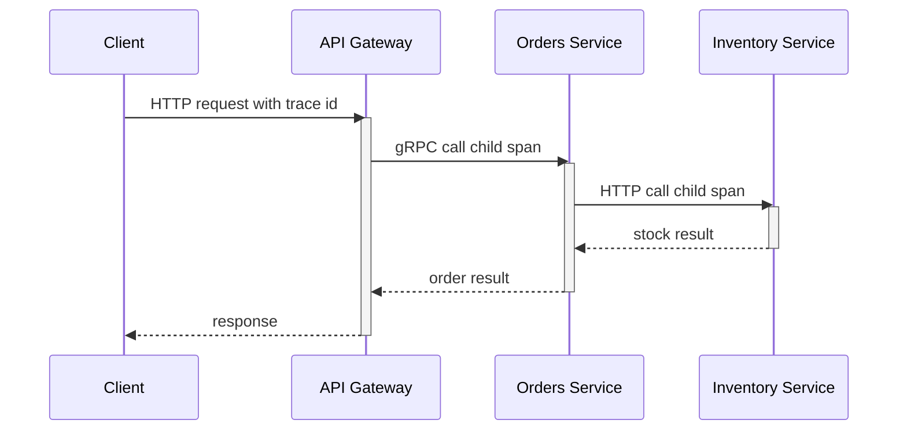

Observability is the ability to understand a system's internal state from its external outputs: metrics, logs, and traces. In distributed systems, failures are emergent, cross service boundaries, and rarely show up as a single obvious exception, so observability is how you move from symptoms to causes quickly. You cannot fix what you cannot see, and you cannot scale what you cannot measure. Reach for observability from day one: retrofitting it after incidents and growth is significantly harder because the missing telemetry was never emitted.

# The Three Pillars

The three pillars are complementary signals, not competing tools.

## Metrics

Metrics are numeric measurements over time that answer "how much" and "how often".

- **Counter**: cumulative value that only goes up (for example total requests, total errors).
- **Gauge**: current point-in-time value that can go up or down (for example queue length, active connections).
- **Histogram**: distribution of observed values into buckets (for example request latency) so your backend can estimate percentiles like p50, p95, and p99.

For service-level health, use the RED method:

- **Rate**: requests per second.
- **Errors**: failed requests per second or error percentage.
- **Duration**: latency distribution (not only average; percentiles matter).

For resource-level health, use the USE method:

- **Utilization**: how busy a resource is.
- **Saturation**: queued work / backlog (pressure).
- **Errors**: resource-specific failures.

Core interview metrics you should always name for APIs:

- Request rate
- Error rate
- Latency p50/p95/p99
- Saturation signals (CPU, thread pool queue, DB pool exhaustion)

## Logs

Logs are structured event records that answer "what exactly happened" at a point in time.

- **Unstructured logs** (free text) are easy to write but hard to query.
- **Structured logs** (usually JSON with named properties) are queryable and aggregation-friendly.

Use log levels intentionally:

- `Trace` (`Verbose` in Serilog): very detailed diagnostics, usually disabled in production.
- `Debug`: development diagnostics.
- `Information`: normal business flow (request started/completed, key state transitions).
- `Warning`: degraded but recoverable behavior.
- `Error`: failed operation.
- `Critical` (`Fatal` in Serilog): process/service cannot continue safely.

In distributed systems, correlation IDs are essential in practice: every service should log the same request identifier so operators can reconstruct one end-to-end user request across many log streams.

### Log Ingestion and Indexing Pipeline

An ELK implementation makes the boundaries concrete: applications emit structured events; Beats or Elastic Agent collect them; Logstash can buffer and transform; Elasticsearch indexes selected fields; Kibana queries and visualizes them. OpenTelemetry Collector is an alternative vendor-neutral collection and routing layer, not another name for Elasticsearch.

Normalize timestamps, service identity, severity, trace ID, and schema version before indexing. Drop or redact secrets and regulated fields at the earliest boundary. Use a durable buffer for bursts, a dead-letter path for malformed events, index lifecycle policies for retention, and explicit handling when downstream storage is unavailable. Indexing every field increases cost and mapping risk; index only fields used for filtering or aggregation and retain the original event according to policy.

![[Assets/DevOps/DevOps-Observability-18120000-2.jpg]]

## Traces

Traces represent a single request journey across services and dependencies.

- A **trace** is the full end-to-end operation.
- A **span** is one timed unit of work within that trace.
- Parent-child span relationships encode causal flow between components.
- Trace context propagation (`traceparent`) carries trace id, parent span id, and trace flags across HTTP/gRPC boundaries; `tracestate` can carry vendor-specific context.

Distributed tracing reconstructs the critical path of a request so you can answer where latency is introduced, where errors originate, and which dependency is responsible.



# Signal Shape and Correlation

| Signal | Shape | Correlation and cardinality | Retention and sampling | Best question |
| --- | --- | --- | --- | --- |
| Metric | Aggregated numeric series | Bounded labels such as service, route, and status class | Long retention is affordable; preserve counters and histograms | Is the system healthy, and how large is the problem? |
| Log | Discrete structured event | Trace ID plus stable fields; user IDs belong here only under privacy policy | Index short; archive selectively; sample repetitive success events | What exact state or error occurred? |
| Trace | Causal tree of timed spans | Trace/span IDs join services and selected logs | Tail sampling can retain errors and slow traces | Where did this request spend time or fail? |

Propagate W3C trace context, attach the trace ID to structured logs, and derive exemplars or links from metrics to traces where the backend supports them. Never put unbounded request, user, or container IDs in metric labels. Sampling should preserve the rare failures the system exists to explain; uniform head sampling can discard them before their outcome is known.

# Collection-to-Action Pipeline

Telemetry moves through six boundaries: emit, collect, buffer/transform, store, query, and act. The application emits a stable schema; an agent or OpenTelemetry Collector batches and retries; the backend enforces retention and indexing; queries power dashboards and alerts; automation creates a ticket, pages an owner, or applies a safe remediation. Best-effort diagnostic telemetry should apply backpressure at collectors and buffers, then sample or shed according to an explicit priority policy rather than take the production request path down.

Audit, security, financial, or regulatory records can be part of a durable or fail-closed business contract rather than disposable telemetry. Route those records through a separately capacity-planned durable log or transaction/outbox path, define acknowledgement and recovery semantics, and fail the protected operation when policy requires the record to be retained. Do not silently drop them under the generic telemetry-shedding rule.

Choose retention by investigation window and compliance, not habit. Make alert ownership explicit and alert on a user-visible symptom or an exhausted error budget. A dashboard with no decision or owner is decoration.

![[Assets/DevOps/DevOps-Observability-18120000-1.png]]

# Push versus Pull Metrics

Prometheus pull works when targets are discoverable and the collector can reach them: each scrape also proves target reachability, while the server owns retry pace and backpressure. Push works across restrictive network boundaries or for event-driven delivery, but the sender now owns retry, queueing, authentication, and stale-series cleanup. For short-lived batch jobs, push only job-level terminal metrics to a Pushgateway; do not turn it into a general event store.

Use pull as the default for long-running discoverable services. Use push when topology makes pull impossible or the protocol is already an authenticated telemetry stream, then define expiration and failed-delivery behavior. Neither model permits unbounded labels.

![[Assets/DevOps/DevOps-Observability-18120000.png]]

# Diagnosing CPU and Runtime Pressure

High processor utilization means work is consuming CPU time, but the percentage alone does not identify whether the work is useful. I/O blocking is different: a request can be slow while CPU remains low because threads are waiting for a socket, disk, database connection, or lock. Classify the signals before changing code or capacity.

| Evidence | Likely interpretation | Next check |
| --- | --- | --- |
| High CPU and rising request rate | More useful work or overload | Throughput, queue depth, latency, and CPU per request |
| High CPU, flat traffic, one hot method | Algorithmic loop or unexpectedly expensive path | Time-bounded CPU trace and recent code changes |
| High CPU with allocation rate and GC time rising | Allocation-driven processor work | Allocation profile, object lifetime, and Gen 2 collections |
| Low CPU with rising latency and thread-pool queue | Blocking I/O, sync-over-async, or downstream saturation | Thread stacks, dependency spans, and connection-pool metrics |
| High CPU with lock or spin frames | Contention or busy waiting | Lock profile, thread dump, and critical-section ownership |

## Bounded Evidence Sequence

Collect runtime counters first to classify the interval, then capture a short trace that includes the same request mix:

```bash
dotnet-counters monitor --process-id <pid> \
  --duration 00:00:30 \
  --refresh-interval 1 \
  --counters System.Runtime Microsoft.AspNetCore.Hosting

dotnet-trace collect --process-id <pid> \
  --duration 00:00:30 \
  --format speedscope \
  --output checkout.nettrace
```

Record UTC start and end timestamps for both captures. Compare them with request rate, p95/p99 latency, dependency latency, allocation rate, time in GC, thread-pool queue length, and process CPU from the same load-test or incident window. A counter captured during a quiet period and a trace captured during a burst do not describe the same failure.

Allocation rate and GC time separate useful application work from runtime work. Rising allocations with more Gen 2 collections can make CPU climb even when request rate is flat. A low CPU percentage with long database spans points elsewhere: the process is waiting, not consuming a full processor.

## Checkout Serialization Decision

Suppose checkout p99 rises from 180 ms to 1.4 s while traffic stays flat. The aligned counter window shows CPU rising from 0.8 to 1.9 cores, allocation rate tripling, and more time in GC. The trace attributes most samples and allocations to JSON serialization.

Benchmark a serializer change under the same request payloads and concurrency. Source-generated `System.Text.Json` metadata or reusable serialization options are justified if CPU per request, allocation rate, and p99 all fall in the comparison window. Extra capacity may relieve the symptom, but it does not establish that capacity was the cause. Change one variable and compare the same measurements.

## Failure Boundaries

- Do not treat a single process snapshot as a trend; compare rates over a fixed interval.
- Do not infer processor pressure from latency alone; blocked I/O can be slow while CPU stays low.
- Do not assume more replicas help when every request waits on the same database, lock, or partition.
- Do not capture an unbounded production trace; define duration, destination, access policy, and cleanup.
- Do not optimize the hottest method until the trace covers the user-visible slowdown and the measurements share a window.

# .NET Observability

OpenTelemetry gives .NET services stable signal APIs and an interoperable export protocol. It reduces backend-specific re-instrumentation, but changing backends can still require exporter, collector, query, dashboard, sampling, and semantic-convention work.

The following `Program.cs` registers automatic ASP.NET Core, `HttpClient`, gRPC client, Entity Framework Core, and runtime instrumentation. It also registers the custom `ActivitySource` and `Meter` that the endpoint uses, emits bounded metric dimensions, and writes structured JSON logs with trace and span IDs in logging scopes.

```csharp
using System.Diagnostics;
using System.Diagnostics.Metrics;
using Microsoft.Extensions.Logging;
using OpenTelemetry.Metrics;
using OpenTelemetry.Resources;
using OpenTelemetry.Trace;

const string serviceName = "checkout-api";
const string instrumentationName = "Checkout.Api";

using var activitySource = new ActivitySource(instrumentationName);
using var meter = new Meter(instrumentationName, "1.0.0");

var checkoutRequests = meter.CreateCounter<long>(
    "checkout.requests",
    unit: "{request}",
    description: "Number of completed checkout requests.");
var checkoutDuration = meter.CreateHistogram<double>(
    "checkout.duration",
    unit: "s",
    description: "Checkout request duration.");

var builder = WebApplication.CreateBuilder(args);

builder.Logging.ClearProviders();
builder.Logging.Configure(options =>
    options.ActivityTrackingOptions =
        ActivityTrackingOptions.TraceId |
        ActivityTrackingOptions.SpanId);
builder.Logging.AddJsonConsole(options => options.IncludeScopes = true);

builder.Services
    .AddOpenTelemetry()
    .ConfigureResource(resource => resource.AddService(serviceName))
    .WithTracing(tracing => tracing
        .AddAspNetCoreInstrumentation()
        .AddHttpClientInstrumentation()
        .AddGrpcClientInstrumentation()
        .AddEntityFrameworkCoreInstrumentation()
        .AddSource(instrumentationName)
        .AddOtlpExporter())
    .WithMetrics(metrics => metrics
        .AddAspNetCoreInstrumentation()
        .AddHttpClientInstrumentation()
        .AddRuntimeInstrumentation()
        .AddMeter(instrumentationName)
        .AddOtlpExporter());

var app = builder.Build();

app.MapPost(
    "/checkout",
    async (CheckoutRequest request, ILoggerFactory loggerFactory,
        CancellationToken cancellationToken) =>
    {
        var logger = loggerFactory.CreateLogger("Checkout");
        var startedAt = Stopwatch.GetTimestamp();
        var outcome = "accepted";

        using var activity = activitySource.StartActivity("checkout.create");
        activity?.SetTag("checkout.item_count", request.Items.Count);

        try
        {
            await Task.Delay(TimeSpan.FromMilliseconds(5), cancellationToken);

            var orderId = Guid.NewGuid();
            logger.LogInformation(
                "Checkout accepted for {ItemCount} items as {OrderId}",
                request.Items.Count,
                orderId);

            return Results.Accepted(
                $"/orders/{orderId}",
                new CheckoutResult(orderId, "accepted"));
        }
        catch (OperationCanceledException)
        {
            outcome = "cancelled";
            activity?.SetStatus(ActivityStatusCode.Error, "cancelled");
            throw;
        }
        finally
        {
            var tags = new TagList { { "outcome", outcome } };
            checkoutRequests.Add(1, tags);
            checkoutDuration.Record(
                Stopwatch.GetElapsedTime(startedAt).TotalSeconds,
                tags);
        }
    });

app.Run();

internal sealed record CheckoutRequest(IReadOnlyList<CheckoutItem> Items);
internal sealed record CheckoutItem(string Sku, int Quantity);
internal sealed record CheckoutResult(Guid OrderId, string Status);
```

`outcome` is bounded, so it is safe as a metric dimension. `ItemCount` is a small aggregate suitable for a span tag or log property. Order IDs, customer IDs, raw URLs, request bodies, authentication tokens, and SKUs should not become metric dimensions. Put identifiers in access-controlled logs only when the investigation and retention policy requires them; do not emit secrets at all.

OTLP is the default in the example because a collector gives the platform one place for authentication, batching, retries, sampling, and backend routing. Direct Prometheus scraping is reasonable when the scraper can reach each service and the deployment accepts an application-owned scrape endpoint. In that case, replace the metrics `.AddOtlpExporter()` with `.AddPrometheusExporter()` and call `app.MapPrometheusScrapingEndpoint()`. This changes only the metrics path; traces still need OTLP or another trace exporter.

# Pitfalls

## Logging Everything or Logging Nothing

Logging every payload and every debug event explodes storage and query cost; logging almost nothing leaves teams blind during incidents. Use strategic sampling and retain high-value structured events at 100% while sampling noisy verbose events.

## Unstructured Logs You Cannot Query

Free-form text logs block fast incident response because operators cannot reliably filter by tenant, endpoint, or correlation key. Prefer structured logs with stable property names and consistent schema across services.

## Missing Correlation IDs Across Services

Without propagated trace and correlation IDs, each service log appears correct in isolation but impossible to stitch into one request narrative. Ensure incoming IDs are accepted, propagated, and included in all logs and spans.

## Alert Fatigue from Noisy Metrics

If thresholds are too sensitive or static, teams get constant false positives and start ignoring alerts. Define SLO-based thresholds, use burn-rate style alerting where possible, and segment alerts by service criticality.

# Tradeoffs

- **High-cardinality labels on metrics**
  - Benefit: better drill-down during incident analysis.
  - Cost or risk: expensive storage and slower queries.
  - Decision rule: keep labels bounded; move highly variable identifiers to logs and traces.
- **100% trace sampling**
  - Benefit: full forensic visibility.
  - Cost or risk: high ingest and storage cost.
  - Decision rule: use sampling by default and increase sampling during incidents.
- **Long log retention**
  - Benefit: better historical investigations.
  - Cost or risk: compliance and storage burden.
  - Decision rule: keep raw logs for short retention and archive aggregates longer.

# Questions

> [!QUESTION]- How do you diagnose an intermittent p95/p99 latency bottleneck in a multi-service system?
> Start from traces and filter to the slow requests — the p99, not the average — to see which span dominates. Correlate with per-service RED metrics to tell whether the latency is isolated or systemic, then walk the dependency spans (DB, cache, external API) to find where it originates. Pull structured logs by the same trace ID to check for edge-case payloads or retries on those requests. Traces locate the delay, metrics size its effect, and logs expose the state around it.

> [!QUESTION]- When should you use RED vs USE?
> RED — Rate, Errors, Duration — is for customer-facing endpoints and request pipelines: it tells you what users are experiencing. USE — Utilization, Saturation, Errors — is for the resources underneath: CPU, thread pools, queue depth, DB connection pools. You want both, because they pair causally: RED is the symptom at the service boundary, USE is the pressure source beneath it. A rising p99 traced to a saturated connection pool is the canonical chain.

> [!QUESTION]- Why instrument with OpenTelemetry from day one instead of adding observability later?
> Instrumenting early establishes telemetry contracts and historical baselines before the system becomes difficult to change. Retrofitting during an incident requires invasive changes across several services and still cannot recover signals that were never emitted. OpenTelemetry also reduces the application changes needed to switch backends, although exporters, collector routing, queries, dashboards, and sampling policies may still change.

# References

- [OpenTelemetry for .NET (official docs)](https://opentelemetry.io/docs/languages/dotnet/) — documents the .NET SDK, instrumentation, exporters, and signal-specific setup.
- [dotnet-counters diagnostic tool](https://learn.microsoft.com/en-us/dotnet/core/diagnostics/dotnet-counters) — Microsoft reference for observing runtime counters such as allocation rate, GC activity, and thread-pool behavior.
- [dotnet-trace diagnostic tool](https://learn.microsoft.com/en-us/dotnet/core/diagnostics/dotnet-trace) — Microsoft reference for collecting bounded .NET runtime traces and converting them for profile analysis.
- [.NET metrics instrumentation](https://learn.microsoft.com/en-us/dotnet/core/diagnostics/metrics-instrumentation) — Microsoft guidance for `Meter`, counters, histograms, dimensions, and custom instrumentation.
- [ASP.NET Core observability example with OpenTelemetry and Prometheus (Microsoft Learn)](https://learn.microsoft.com/dotnet/core/diagnostics/observability-prgrja-example) — supplies an end-to-end .NET metrics and tracing example with Prometheus collection.
- [W3C Trace Context](https://www.w3.org/TR/trace-context/) — defines the interoperable `traceparent` and `tracestate` headers used for cross-service correlation.
- [Prometheus ASP.NET Core exporter README (OpenTelemetry .NET)](https://github.com/open-telemetry/opentelemetry-dotnet/tree/main/src/OpenTelemetry.Exporter.Prometheus.AspNetCore) — documents the exporter endpoint, registration, and hosting constraints for ASP.NET Core.
- [Google SRE Book — Monitoring Distributed Systems](https://sre.google/sre-book/monitoring-distributed-systems/) — grounds alerting and dashboard design in user-visible symptoms, actionable signals, and the four golden signals.
- [OpenTelemetry signals](https://opentelemetry.io/docs/concepts/signals/) — official definitions and relationships for traces, metrics, and logs.
- [Prometheus: when to use the Pushgateway](https://prometheus.io/docs/practices/pushing/) — official limits and lifecycle risks of pushed metrics.
- [OpenTelemetry Collector](https://opentelemetry.io/docs/collector/) — official receive, process, and export pipeline boundaries.
- [Elastic ingestion tools](https://www.elastic.co/guide/en/observability/current/ingest-logs-metrics-uptime.html) — official Elastic ingestion and indexing paths.
- [ByteByteGo: logs, traces, and metrics](https://github.com/ByteByteGoHq/system-design-101/blob/b28380a4710c5ec9638ec037d4168e288f334cba/data/guides/logging-tracing-metrics.md) — provides a compact comparison of the three signal types.
- [ByteByteGo: push versus pull metrics](https://github.com/ByteByteGoHq/system-design-101/blob/b28380a4710c5ec9638ec037d4168e288f334cba/data/guides/push-vs-pull-in-metrics-collecting-systems.md) — source contribution for the collection selector.
- [ByteByteGo: cloud monitoring](https://github.com/ByteByteGoHq/system-design-101/blob/b28380a4710c5ec9638ec037d4168e288f334cba/data/guides/cloud-monitoring-cheat-sheet.md) — source contribution for the collection-to-action pipeline.
- [ByteByteGo: high CPU cases](https://github.com/ByteByteGoHq/system-design-101/blob/b28380a4710c5ec9638ec037d4168e288f334cba/data/guides/top-9-cases-behind-100-cpu-usage.md) — surveys application and runtime causes of high processor utilization.
- [ByteByteGo: ELK](https://github.com/ByteByteGoHq/system-design-101/blob/b28380a4710c5ec9638ec037d4168e288f334cba/data/guides/what-is-elk-stack-and-why-is-it-so-popular-for-log-management.md) — source contribution for the log-ingestion example.
