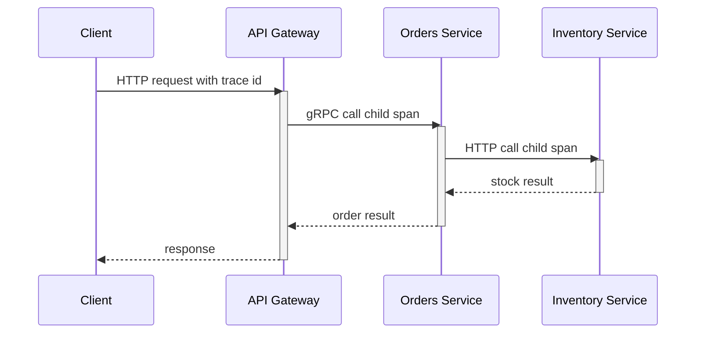

# Intro

Observability is the ability to understand a system's internal state from its external outputs: metrics, logs, and traces. In distributed systems, failures are emergent, cross service boundaries, and rarely show up as a single obvious exception, so observability is how you move from symptoms to causes quickly. You cannot fix what you cannot see, and you cannot scale what you cannot measure. Reach for observability from day one: retrofitting it after incidents and growth is significantly harder because the missing telemetry was never emitted.

## The Three Pillars

The three pillars are complementary signals, not competing tools.

### Metrics

Metrics are numeric measurements over time that answer "how much" and "how often".

- **Counter**: cumulative value that only goes up (for example total requests, total errors).
- **Gauge**: current point-in-time value that can go up or down (for example queue length, active connections).
- **Histogram**: distribution of observed values into buckets (for example request latency) so your backend can estimate percentiles like p50, p95, and p99.

For service-level health, use the RED method:

- **Rate**: requests per second.
- **Errors**: failed requests per second or error percentage.
- **Duration**: latency distribution (not only average; percentiles matter).

For resource-level health, use the USE method:

- **Utilization**: how busy a resource is.
- **Saturation**: queued work / backlog (pressure).
- **Errors**: resource-specific failures.

Core interview metrics you should always name for APIs:

- Request rate
- Error rate
- Latency p50/p95/p99
- Saturation signals (CPU, thread pool queue, DB pool exhaustion)

### Logs

Logs are structured event records that answer "what exactly happened" at a point in time.

- **Unstructured logs** (free text) are easy to write but hard to query.
- **Structured logs** (usually JSON with named properties) are queryable and aggregation-friendly.

Use log levels intentionally:

- `Trace` (`Verbose` in Serilog): very detailed diagnostics, usually disabled in production.
- `Debug`: development diagnostics.
- `Information`: normal business flow (request started/completed, key state transitions).
- `Warning`: degraded but recoverable behavior.
- `Error`: failed operation.
- `Critical` (`Fatal` in Serilog): process/service cannot continue safely.

In distributed systems, correlation IDs are essential in practice: every service should log the same request identifier so operators can reconstruct one end-to-end user request across many log streams.

#### Log Ingestion and Indexing Pipeline

An ELK implementation makes the boundaries concrete: applications emit structured events; Beats or Elastic Agent collect them; Logstash can buffer and transform; Elasticsearch indexes selected fields; Kibana queries and visualizes them. OpenTelemetry Collector is an alternative vendor-neutral collection and routing layer, not another name for Elasticsearch.

Normalize timestamps, service identity, severity, trace ID, and schema version before indexing. Drop or redact secrets and regulated fields at the earliest boundary. Use a durable buffer for bursts, a dead-letter path for malformed events, index lifecycle policies for retention, and explicit handling when downstream storage is unavailable. Indexing every field increases cost and mapping risk; index only fields used for filtering or aggregation and retain the original event according to policy.

![[Assets/System Design 101/e02dde606c2771cde74766a7b33faf462ab59e9f13eb474645bdfade8c75995d.jpg]]

### Traces

Traces represent a single request journey across services and dependencies.

- A **trace** is the full end-to-end operation.
- A **span** is one timed unit of work within that trace.
- Parent-child span relationships encode causal flow between components.
- Trace context propagation (`traceparent`) carries trace id, parent span id, and trace flags across HTTP/gRPC boundaries; `tracestate` can carry vendor-specific context.

Distributed tracing reconstructs the critical path of a request so you can answer where latency is introduced, where errors originate, and which dependency is responsible.

## Signal Shape and Correlation

| Signal | Shape | Correlation and cardinality | Retention and sampling | Best question |
| --- | --- | --- | --- | --- |
| Metric | Aggregated numeric series | Bounded labels such as service, route, and status class | Long retention is affordable; preserve counters and histograms | Is the system healthy, and how large is the problem? |
| Log | Discrete structured event | Trace ID plus stable fields; user IDs belong here only under privacy policy | Index short; archive selectively; sample repetitive success events | What exact state or error occurred? |
| Trace | Causal tree of timed spans | Trace/span IDs join services and selected logs | Tail sampling can retain errors and slow traces | Where did this request spend time or fail? |

Propagate W3C trace context, attach the trace ID to structured logs, and derive exemplars or links from metrics to traces where the backend supports them. Never put unbounded request, user, or container IDs in metric labels. Sampling should preserve the rare failures the system exists to explain; uniform head sampling can discard them before their outcome is known.

The source visual for this comparison was rejected because its topology did not match the verified OpenTelemetry signal model; the table is rebuilt from primary specifications.

## Collection-to-Action Pipeline

Telemetry moves through six boundaries: emit, collect, buffer/transform, store, query, and act. The application emits a stable schema; an agent or OpenTelemetry Collector batches and retries; the backend enforces retention and indexing; queries power dashboards and alerts; automation creates a ticket, pages an owner, or applies a safe remediation. Backpressure belongs at collectors and buffers, not in the request path. A queue protects against a short backend outage, but once full it must shed telemetry rather than take production down.

Choose retention by investigation window and compliance, not habit. Make alert ownership explicit and alert on a user-visible symptom or an exhausted error budget. A dashboard with no decision or owner is decoration.

![[Assets/System Design 101/c17b0fea47b51ea2363baad05c7a519ce318cc777a53004fbfb824c888601983.png]]

> [!WARNING] Non-normative source visual
> The provider names and category groupings are historical and should not drive a product choice. Use the visual only for the emit → collect → buffer/transform → store → query → act flow, then verify current product names, supported signals, retention, and alerting contracts in provider documentation.

## Push versus Pull Metrics

Prometheus pull works when targets are discoverable and the collector can reach them: each scrape also proves target reachability, while the server owns retry pace and backpressure. Push works across restrictive network boundaries or for event-driven delivery, but the sender now owns retry, queueing, authentication, and stale-series cleanup. For short-lived batch jobs, push only job-level terminal metrics to a Pushgateway; do not turn it into a general event store.

Use pull as the default for long-running discoverable services. Use push when topology makes pull impossible or the protocol is already an authenticated telemetry stream, then define expiration and failed-delivery behavior. Neither model permits unbounded labels.

![[Assets/System Design 101/51d727bf3bda3570c7c7f0e5fe2cb6b95e4c69072df19e58e5ad7575499dbcdb.png]]

## Focused Runbooks and Implementation

Use [[CPU Saturation Runbook]] to separate utilization, runnable work, I/O wait, cgroup throttling, allocation pressure, and hot code before changing capacity. It includes a bounded Linux and .NET evidence sequence and keeps the rejected source visual out of the diagnostic model.

Use [[NET Observability]] for OpenTelemetry registration, ASP.NET Core instrumentation, custom `Meter` and `ActivitySource` signals, Prometheus or OTLP export, and structured logging examples. Keep signal names and bounded dimensions stable so the backend remains replaceable.

## Pitfalls

### Logging Everything or Logging Nothing

Logging every payload and every debug event explodes storage and query cost; logging almost nothing leaves teams blind during incidents. Use strategic sampling and retain high-value structured events at 100% while sampling noisy verbose events.

### Unstructured Logs You Cannot Query

Free-form text logs block fast incident response because operators cannot reliably filter by tenant, endpoint, or correlation key. Prefer structured logs with stable property names and consistent schema across services.

### Missing Correlation IDs Across Services

Without propagated trace and correlation IDs, each service log appears correct in isolation but impossible to stitch into one request narrative. Ensure incoming IDs are accepted, propagated, and included in all logs and spans.

### Alert Fatigue from Noisy Metrics

If thresholds are too sensitive or static, teams get constant false positives and start ignoring alerts. Define SLO-based thresholds, use burn-rate style alerting where possible, and segment alerts by service criticality.

## Tradeoffs

- **High-cardinality labels on metrics**
  - Benefit: better drill-down during incident analysis.
  - Cost or risk: expensive storage and slower queries.
  - Decision rule: keep labels bounded; move highly variable identifiers to logs and traces.
- **100% trace sampling**
  - Benefit: full forensic visibility.
  - Cost or risk: high ingest and storage cost.
  - Decision rule: use sampling by default and increase sampling during incidents.
- **Long log retention**
  - Benefit: better historical investigations.
  - Cost or risk: compliance and storage burden.
  - Decision rule: keep raw logs for short retention and archive aggregates longer.

## Questions

> [!QUESTION]- How do you diagnose an intermittent p95/p99 latency bottleneck in a multi-service system?
> Start from traces and filter to the slow requests — the p99, not the average — to see which span dominates. Correlate with per-service RED metrics to tell whether the latency is isolated or systemic, then walk the dependency spans (DB, cache, external API) to find where it originates. Pull structured logs by the same trace ID to check for edge-case payloads or retries on those requests. The point is using all three pillars together: traces locate it, metrics size it, logs explain it — guessing from one dashboard is how you waste an hour.

> [!QUESTION]- When should you use RED vs USE?
> RED — Rate, Errors, Duration — is for customer-facing endpoints and request pipelines: it tells you what users are experiencing. USE — Utilization, Saturation, Errors — is for the resources underneath: CPU, thread pools, queue depth, DB connection pools. You want both, because they pair causally: RED is the symptom at the service boundary, USE is the pressure source beneath it. A rising p99 traced to a saturated connection pool is the canonical chain.

> [!QUESTION]- Why instrument with OpenTelemetry from day one instead of adding observability later?
> Instrumenting early bakes telemetry into your contracts and code paths before the system is complex enough to need it — and before an incident, when there's no time to add it. Retrofitting is worse than it sounds: no historical baselines to compare against, and invasive changes across many services at once, usually under pressure. Going vendor-neutral with OpenTelemetry also keeps your backend choice open, so you can switch APMs without re-instrumenting. The telemetry you never emitted is exactly the data you'll wish you had at 3am.

## References

- [OpenTelemetry for .NET (official docs)](https://opentelemetry.io/docs/languages/dotnet/)
- [ASP.NET Core observability example with OpenTelemetry and Prometheus (Microsoft Learn)](https://learn.microsoft.com/dotnet/core/diagnostics/observability-prgrja-example)
- [W3C Trace Context (traceparent and tracestate)](https://www.w3.org/TR/trace-context/)
- [Prometheus ASP.NET Core exporter README (OpenTelemetry .NET)](https://github.com/open-telemetry/opentelemetry-dotnet/tree/main/src/OpenTelemetry.Exporter.Prometheus.AspNetCore)
- [Google SRE Book: Monitoring Distributed Systems (practitioner)](https://sre.google/sre-book/monitoring-distributed-systems/)
- [OpenTelemetry signals](https://opentelemetry.io/docs/concepts/signals/) — official definitions and relationships for traces, metrics, and logs.
- [Prometheus: when to use the Pushgateway](https://prometheus.io/docs/practices/pushing/) — official limits and lifecycle risks of pushed metrics.
- [OpenTelemetry Collector](https://opentelemetry.io/docs/collector/) — official receive, process, and export pipeline boundaries.
- [Elastic ingestion tools](https://www.elastic.co/guide/en/observability/current/ingest-logs-metrics-uptime.html) — official Elastic ingestion and indexing paths.
- [ByteByteGo: logs, traces, and metrics](https://github.com/ByteByteGoHq/system-design-101/blob/b28380a4710c5ec9638ec037d4168e288f334cba/data/guides/logging-tracing-metrics.md) — source contribution for signal comparison; its visual was rejected by the audit.
- [ByteByteGo: push versus pull metrics](https://github.com/ByteByteGoHq/system-design-101/blob/b28380a4710c5ec9638ec037d4168e288f334cba/data/guides/push-vs-pull-in-metrics-collecting-systems.md) — source contribution for the collection selector.
- [ByteByteGo: cloud monitoring](https://github.com/ByteByteGoHq/system-design-101/blob/b28380a4710c5ec9638ec037d4168e288f334cba/data/guides/cloud-monitoring-cheat-sheet.md) — source contribution for the collection-to-action pipeline.
- [ByteByteGo: high CPU cases](https://github.com/ByteByteGoHq/system-design-101/blob/b28380a4710c5ec9638ec037d4168e288f334cba/data/guides/top-9-cases-behind-100-cpu-usage.md) — source contribution for the evidence-first CPU runbook; its visual was rejected by the audit.
- [ByteByteGo: ELK](https://github.com/ByteByteGoHq/system-design-101/blob/b28380a4710c5ec9638ec037d4168e288f334cba/data/guides/what-is-elk-stack-and-why-is-it-so-popular-for-log-management.md) — source contribution for the log-ingestion example.
