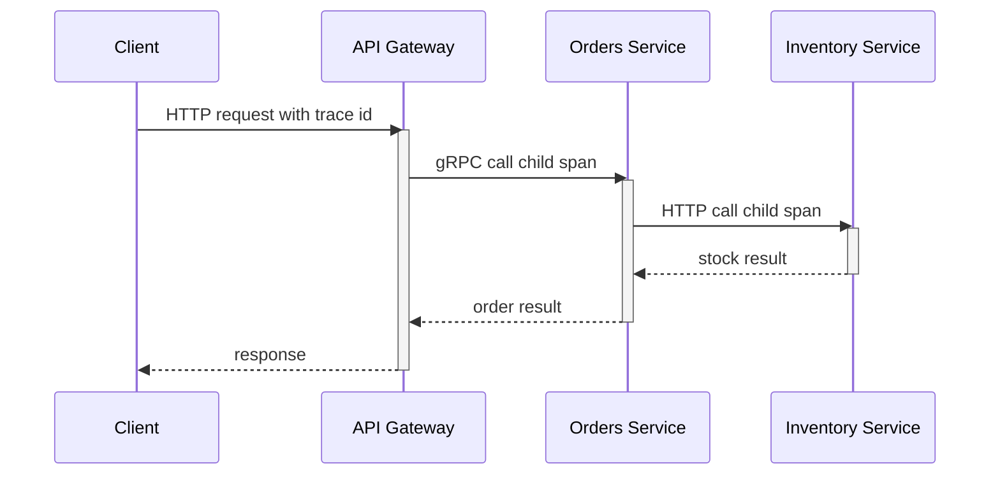

# Intro

Observability is the ability to understand a system's internal state from its external outputs: metrics, logs, and traces. In distributed systems, failures are emergent, cross service boundaries, and rarely show up as a single obvious exception, so observability is how you move from symptoms to causes quickly. You cannot fix what you cannot see, and you cannot scale what you cannot measure. Reach for observability from day one: retrofitting it after incidents and growth is significantly harder because the missing telemetry was never emitted.

## The Three Pillars

The three pillars are complementary signals, not competing tools.

### Metrics

Metrics are numeric measurements over time that answer "how much" and "how often".

- **Counter**: cumulative value that only goes up (for example total requests, total errors).
- **Gauge**: current point-in-time value that can go up or down (for example queue length, active connections).
- **Histogram**: distribution of observed values into buckets (for example request latency) so your backend can estimate percentiles like p50, p95, and p99.

For service-level health, use the RED method:

- **Rate**: requests per second.
- **Errors**: failed requests per second or error percentage.
- **Duration**: latency distribution (not only average; percentiles matter).

For resource-level health, use the USE method:

- **Utilization**: how busy a resource is.
- **Saturation**: queued work / backlog (pressure).
- **Errors**: resource-specific failures.

Core interview metrics you should always name for APIs:

- Request rate
- Error rate
- Latency p50/p95/p99
- Saturation signals (CPU, thread pool queue, DB pool exhaustion)

### Logs

Logs are structured event records that answer "what exactly happened" at a point in time.

- **Unstructured logs** (free text) are easy to write but hard to query.
- **Structured logs** (usually JSON with named properties) are queryable and aggregation-friendly.

Use log levels intentionally:

- `Trace` (`Verbose` in Serilog): very detailed diagnostics, usually disabled in production.
- `Debug`: development diagnostics.
- `Information`: normal business flow (request started/completed, key state transitions).
- `Warning`: degraded but recoverable behavior.
- `Error`: failed operation.
- `Critical` (`Fatal` in Serilog): process/service cannot continue safely.

In distributed systems, correlation IDs are essential in practice: every service should log the same request identifier so operators can reconstruct one end-to-end user request across many log streams.

### Traces

Traces represent a single request journey across services and dependencies.

- A **trace** is the full end-to-end operation.
- A **span** is one timed unit of work within that trace.
- Parent-child span relationships encode causal flow between components.
- Trace context propagation (`traceparent`) carries trace id, parent span id, and trace flags across HTTP/gRPC boundaries; `tracestate` can carry vendor-specific context.

Distributed tracing reconstructs the critical path of a request so you can answer where latency is introduced, where errors originate, and which dependency is responsible.



## OpenTelemetry in Practice

OpenTelemetry is the vendor-neutral standard for telemetry instrumentation and export.

- **API + SDK**: consistent model to create metrics, logs, and traces.
- **Instrumentation packages** in .NET cover common libraries (`ASP.NET Core`, `HttpClient`, `gRPC`, `EF Core`, runtime/process metrics); runtime auto-instrumentation is a separate deployment model.
- **Exporters** let you route the same telemetry to different backends (for example Jaeger, Prometheus, Datadog, Azure Monitor) without changing application code.

Minimal .NET tracing and metrics setup:

```csharp
using OpenTelemetry.Metrics;
using OpenTelemetry.Resources;
using OpenTelemetry.Trace;

var builder = WebApplication.CreateBuilder(args);

builder.Services
    .AddOpenTelemetry()
    .ConfigureResource(resource => resource.AddService("checkout-api"))
    .WithTracing(tracing => tracing
        .AddAspNetCoreInstrumentation()
        .AddHttpClientInstrumentation()
        .AddGrpcClientInstrumentation()
        .AddEntityFrameworkCoreInstrumentation()
        .AddSource("Checkout.Api")
        .AddOtlpExporter())
    .WithMetrics(metrics => metrics
        .AddAspNetCoreInstrumentation()
        .AddRuntimeInstrumentation()
        .AddHttpClientInstrumentation()
        .AddMeter("Checkout.Api")
        .AddPrometheusExporter());
```

The key senior signal in interviews: instrument from day one with standard telemetry contracts, then choose backends based on team and platform constraints.

Prometheus export also needs a mapped scrape endpoint in ASP.NET Core:

```csharp
var app = builder.Build();
app.MapPrometheusScrapingEndpoint();
```

If `MapPrometheusScrapingEndpoint()` is unavailable in your package version, use middleware instead:

```csharp
app.UseOpenTelemetryPrometheusScrapingEndpoint();
```

Prometheus ASP.NET Core exporter support can be version-sensitive and may require prerelease packages. The exporter documentation recommends considering OTLP export for production scenarios, so teams often route metrics to an OpenTelemetry Collector and expose them to Prometheus there.

## .NET Implementation Patterns

### Custom Metrics with Meter API

```csharp
using System.Diagnostics;
using System.Diagnostics.Metrics;

var meter = new Meter("Checkout.Api", "1.0.0");
Counter<long> ordersCreated = meter.CreateCounter<long>("orders_created_total");
Histogram<double> checkoutLatencyMs = meter.CreateHistogram<double>("checkout_latency_ms");

public IResult CreateOrder(OrderRequest request)
{
    var startedAt = Stopwatch.GetTimestamp();

    // Business logic...

    ordersCreated.Add(1, new KeyValuePair<string, object?>("tenant", request.TenantId));
    var elapsedMs = Stopwatch.GetElapsedTime(startedAt).TotalMilliseconds;
    checkoutLatencyMs.Record(elapsedMs);

    return Results.Ok();
}
```

### Custom Tracing with ActivitySource

```csharp
using System.Diagnostics;

public static class Telemetry
{
    public static readonly ActivitySource ActivitySource = new("Checkout.Api");
}

public async Task ReserveInventoryAsync(string sku, int quantity)
{
    using var activity = Telemetry.ActivitySource.StartActivity("ReserveInventory");
    activity?.SetTag("inventory.sku", sku);
    activity?.SetTag("inventory.quantity", quantity);

    await _inventoryClient.ReserveAsync(sku, quantity);
}
```

### Structured Logging with Serilog

```csharp
using Serilog;
using Serilog.Formatting.Compact;

builder.Host.UseSerilog((_, config) => config
    .Enrich.FromLogContext()
    .Enrich.WithProperty("service", "checkout-api")
    .WriteTo.Console(new RenderedCompactJsonFormatter()));

app.UseSerilogRequestLogging();

app.MapPost("/checkout", (CheckoutRequest request, ILogger<Program> logger) =>
{
    logger.LogInformation(
        "Checkout started for {CustomerId} with {ItemCount} items",
        request.CustomerId,
        request.Items.Count);

    return Results.Accepted();
});
```

Example JSON event shape emitted by structured logging:

```json
{
  "@t": "2026-02-28T12:30:45.1234567Z",
  "@i": "f2a8a4c1",
  "@m": "Checkout started for 42 with 3 items",
  "CustomerId": 42,
  "ItemCount": 3
}
```

## Pitfalls

### Logging Everything or Logging Nothing

Logging every payload and every debug event explodes storage and query cost; logging almost nothing leaves teams blind during incidents. Use strategic sampling and retain high-value structured events at 100% while sampling noisy verbose events.

### Unstructured Logs You Cannot Query

Free-form text logs block fast incident response because operators cannot reliably filter by tenant, endpoint, or correlation key. Prefer structured logs with stable property names and consistent schema across services.

### Missing Correlation IDs Across Services

Without propagated trace and correlation IDs, each service log appears correct in isolation but impossible to stitch into one request narrative. Ensure incoming IDs are accepted, propagated, and included in all logs and spans.

### Alert Fatigue from Noisy Metrics

If thresholds are too sensitive or static, teams get constant false positives and start ignoring alerts. Define SLO-based thresholds, use burn-rate style alerting where possible, and segment alerts by service criticality.

## Tradeoffs

- **High-cardinality labels on metrics**
  - Benefit: better drill-down during incident analysis.
  - Cost or risk: expensive storage and slower queries.
  - Decision rule: keep labels bounded; move highly variable identifiers to logs and traces.
- **100% trace sampling**
  - Benefit: full forensic visibility.
  - Cost or risk: high ingest and storage cost.
  - Decision rule: use sampling by default and increase sampling during incidents.
- **Long log retention**
  - Benefit: better historical investigations.
  - Cost or risk: compliance and storage burden.
  - Decision rule: keep raw logs for short retention and archive aggregates longer.

## Questions

> [!QUESTION]- How do you diagnose an intermittent p95/p99 latency bottleneck in a multi-service system?
> Start from traces and filter to the slow requests — the p99, not the average — to see which span dominates. Correlate with per-service RED metrics to tell whether the latency is isolated or systemic, then walk the dependency spans (DB, cache, external API) to find where it originates. Pull structured logs by the same trace ID to check for edge-case payloads or retries on those requests. The point is using all three pillars together: traces locate it, metrics size it, logs explain it — guessing from one dashboard is how you waste an hour.

> [!QUESTION]- When should you use RED vs USE?
> RED — Rate, Errors, Duration — is for customer-facing endpoints and request pipelines: it tells you what users are experiencing. USE — Utilization, Saturation, Errors — is for the resources underneath: CPU, thread pools, queue depth, DB connection pools. You want both, because they pair causally: RED is the symptom at the service boundary, USE is the pressure source beneath it. A rising p99 traced to a saturated connection pool is the canonical chain.

> [!QUESTION]- Why instrument with OpenTelemetry from day one instead of adding observability later?
> Instrumenting early bakes telemetry into your contracts and code paths before the system is complex enough to need it — and before an incident, when there's no time to add it. Retrofitting is worse than it sounds: no historical baselines to compare against, and invasive changes across many services at once, usually under pressure. Going vendor-neutral with OpenTelemetry also keeps your backend choice open, so you can switch APMs without re-instrumenting. The telemetry you never emitted is exactly the data you'll wish you had at 3am.

## References

- [OpenTelemetry for .NET (official docs)](https://opentelemetry.io/docs/languages/dotnet/)
- [ASP.NET Core observability example with OpenTelemetry and Prometheus (Microsoft Learn)](https://learn.microsoft.com/dotnet/core/diagnostics/observability-prgrja-example)
- [W3C Trace Context (traceparent and tracestate)](https://www.w3.org/TR/trace-context/)
- [Prometheus ASP.NET Core exporter README (OpenTelemetry .NET)](https://github.com/open-telemetry/opentelemetry-dotnet/tree/main/src/OpenTelemetry.Exporter.Prometheus.AspNetCore)
- [Google SRE Book: Monitoring Distributed Systems (practitioner)](https://sre.google/sre-book/monitoring-distributed-systems/)
