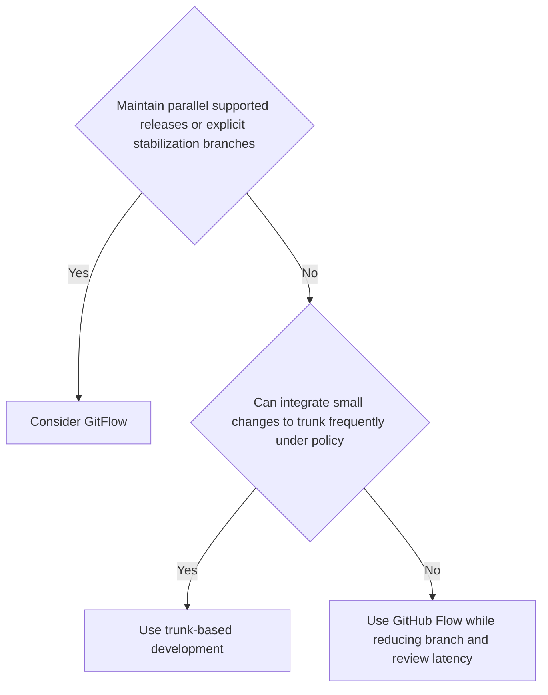

A branching strategy defines how a team uses Git branches to manage parallel development, releases, and hotfixes. The right strategy depends on team size, release cadence, and CI/CD maturity. A mismatch between strategy and team workflow creates merge conflicts, long-lived branches, and integration pain.

# GitFlow

**Mechanism**: Two permanent branches (`main` and `develop`) plus three types of short-lived branches (`feature/*`, `release/*`, `hotfix/*`). Features branch off `develop`, are merged back to `develop`, then batched into a `release/*` branch for stabilization, then merged to both `main` and `develop`.

**Coordination fit**: Teams that maintain several supported versions or stabilize scheduled releases independently of ongoing development. Team size alone does not justify the extra permanent branches.

**CI/CD compatibility**: CI can validate `develop`, release, and hotfix branches. Delivery or deployment may be automated or manually approved; GitFlow itself does not require manual CD, but its stabilization branches commonly encode an additional release gate.

**Risks**: Long-lived `develop` branch accumulates divergence from `main`. Feature branches can live for weeks, creating large merge conflicts. Release stabilization adds overhead. Not suited for continuous deployment.

**When to use**: Products with versioned releases (mobile apps, packaged software, APIs with breaking-change versioning). Avoid for web services that deploy continuously.

# Trunk-Based Development

**Mechanism**: Developers integrate into `main` frequently, either directly under policy or through short-lived branches. Incomplete work can be hidden with feature flags, branch-by-abstraction, dark endpoints, or other incremental techniques. CI runs on every trunk change.

**Coordination fit**: Teams that can keep changes small, integrate frequently, and repair a broken trunk quickly. It can work at many team sizes, but organization size does not prove that the necessary build, ownership, and rollout controls exist.

**CI/CD compatibility**: Excellent. Every commit to `main` can trigger a deployment pipeline. Continuous deployment is natural.

**Risks**: Broken commits affect everyone quickly. Large changes need an incremental integration technique; feature flags are one option, not a universal requirement. CI must return feedback before the team's integration queue grows—under ten minutes is a useful target for many validation paths, not a hard boundary.

**When to use**: Web services, SaaS products, and any team practicing continuous deployment. The default choice for modern cloud-native development.

# Feature Branch Workflow (GitHub Flow)

**Mechanism**: `main` is always deployable. Developers create short-lived feature branches, open a pull request, get review, and merge to `main`. No `develop` branch. Deployments happen from `main` after merge.

**Coordination fit**: Teams that want pull-request review while keeping `main` deployable and avoiding permanent integration branches. The fit depends on review latency and branch lifetime more than headcount.

**CI/CD compatibility**: Good. CI runs on PRs; CD deploys from `main` after merge.

**Risks**: As PRs stay open, divergence and review scope grow. Two or three days is a useful warning threshold for some teams, not a rule; measure merge conflicts, review latency, and stale branches. Incomplete work needs an incremental integration or exposure mechanism, which may be a feature flag but need not be one.

**When to use**: Teams that want the simplicity of trunk-based development but need a PR review gate before merging. The most common strategy for open-source projects and small product teams.

# Comparison

| Strategy | Long-lived Branches | Release Cadence | CI/CD Fit | Coordination fit |
|----------|--------------------|-----------------|-----------|-----------|
| GitFlow | Yes (`develop`, `main`, sometimes releases) | Scheduled or multi-version | More branch gates | Parallel release stabilization |
| Trunk-Based | No | Frequent | Direct trunk feedback | Small changes and rapid repair |
| GitHub Flow | No permanent integration branch | Frequent | PR checks then deploy from `main` | Review gate with short-lived branches |

# Decision Rule



# Pitfalls

## Long-Lived Feature Branches

**What goes wrong**: a feature branch lives for 2+ weeks. By the time it merges, `main` has diverged significantly. The merge conflict is large, the review is hard, and integration bugs appear that weren't visible in isolation.

**Why it happens**: features are scoped too large, or the team lacks feature flags to ship incomplete work.

**Mitigation**: set a branch-age target from the team's integration cadence and alert when branches exceed it. Break large features into smaller vertical slices that can merge independently. Use feature flags or another incremental exposure technique when unfinished code must reach `main` safely.

## Inconsistent Branch Naming

**What goes wrong**: branches named `fix`, `johns-branch`, `temp`, `wip`. No one can tell what a branch is for, who owns it, or whether it is safe to delete.

**Mitigation**: enforce a naming convention: `feature/TICKET-123-short-description`, `fix/TICKET-456-bug-name`, `hotfix/TICKET-789-critical-fix`. Automate enforcement with a pre-push hook or CI check.

# Example: Trunk-Based Development with Feature Flag

```bash
# Short-lived branch: created, reviewed, merged, and deleted promptly
git checkout -b feature/PROJ-123-add-payment-method

# Small, focused commit
git commit -m 'feat: add PayPal payment method behind feature flag'

# Merge to main via PR (CI must pass)
git push origin feature/PROJ-123-add-payment-method
# Open PR, get review, merge, delete branch
```

```csharp
// Feature flag hides incomplete work from users
if (_featureFlags.IsEnabled("PayPalPayment", userId))
{
    // New PayPal integration — only visible to opted-in users
    return await _payPalGateway.ChargeAsync(amount);
}
return await _stripeGateway.ChargeAsync(amount);  // existing path
```

# Merge vs Rebase

`git merge` creates a commit with both histories as parents and preserves the identity and topology of published commits. `git rebase` copies a private sequence onto a new base, producing new commit IDs that are easier to review as a linear series. The content result can be equivalent; the collaboration contract is not.

Use rebase to clean up commits that only you own before review. Use merge when preserving branch topology matters or when collaborators may already reference the commits. Never rebase a published shared branch: another developer's descendant commits still point to the old identities, forcing recovery or duplicate history. If a rebase conflict is unclear, abort, inspect the branch, and choose a merge instead of guessing through it.

```bash
git fetch origin
git rebase origin/main
```

If the rebase stops on a conflict that cannot be resolved safely, return the branch to its pre-rebase state:

```bash
git rebase --abort
```

To preserve both histories instead, merge:

```bash
git switch main
git merge --no-ff feature/payment-method
```

# Questions

> [!QUESTION]- Why does GitFlow create integration problems for teams practicing continuous deployment?
> GitFlow's long-lived `develop` branch accumulates divergence from `main` over days or weeks. Feature branches branch off `develop`, so they also diverge. When multiple features merge back, conflicts compound. The `release/*` stabilization phase adds a manual gate that prevents continuous deployment. For web services that deploy multiple times per day, GitFlow's overhead is pure cost with no benefit. Use trunk-based development or GitHub Flow instead.

> [!QUESTION]- What does trunk-based development require that makes it unsuitable for all teams?
> Trunk-based development needs small integrable changes, a protected and quickly repaired trunk, and feedback fast enough that developers do not stack work on an unknown result. Feature flags are one way to separate deployment from exposure, but branch-by-abstraction and dark code paths can serve the same purpose. A ten-minute CI target is a useful heuristic, not a definition. Teams with slow review or validation can use GitHub Flow while measuring and reducing that latency.

# References

- [Trunk Based Development](https://trunkbaseddevelopment.com/) — practitioner site for trunk-based development; covers feature flags, branch by abstraction, and team scaling
- [A successful Git branching model (nvie)](https://nvie.com/posts/a-successful-git-branching-model/) — the original GitFlow post by Vincent Driessen; includes the author's 2020 note recommending trunk-based development for web services
- [Atlassian — Comparing workflows](https://www.atlassian.com/git/tutorials/comparing-workflows) — comparison of branching strategies with diagrams and team-size guidance
- [Martin Fowler — Feature Branch](https://martinfowler.com/bliki/FeatureBranch.html) — canonical analysis of feature branches, their risks, and when they are justified
- [Git: rebase](https://git-scm.com/docs/git-rebase) — official mechanics, conflict recovery, and the published-history warning.
- [Git: merge](https://git-scm.com/docs/git-merge) — official parent topology and merge behavior.
- [ByteByteGo: merge versus rebase](https://github.com/ByteByteGoHq/system-design-101/blob/b28380a4710c5ec9638ec037d4168e288f334cba/data/guides/git-merge-vs-git-rebate.md) — source contribution for the decision rule; its visual was rejected by the audit.
