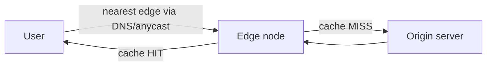

# Intro

A CDN (Content Delivery Network) is a globally distributed network of caching servers ("edge" nodes) that store copies of your content close to users, so requests are served from a nearby city instead of a single origin on the other side of the planet. The payoff is **lower latency** (physics: less distance = less round-trip time), **less origin load** (the edge absorbs most traffic), and **resilience** (the edge keeps serving even if the origin is busy or briefly down). Originally for static assets (images, JS, CSS, video), modern CDNs also accelerate dynamic content and run code at the edge.

## How It Works

A user's request resolves — usually via [[DNS]] (GeoDNS/anycast) — to the nearest edge node rather than the origin:

- **Cache hit** — the edge has a fresh copy and returns it immediately (most requests).
- **Cache miss** — the edge fetches from the **origin**, stores it per the caching headers, and serves it. Subsequent users in that region hit the warm cache.

Edge selection is typically **anycast** (one IP announced from many locations; the network routes to the closest) or **GeoDNS** (DNS returns the nearest edge's address) — see [[DNS|DNS as a traffic director]].

## What the CDN Caches and For How Long

CDNs obey the same [[Data Persistence/Caching|HTTP caching]] semantics your app already sets:

- **`Cache-Control: max-age` / `s-maxage`** — `s-maxage` targets _shared_ caches (the CDN) specifically, letting the edge cache longer than browsers.
- **`ETag` / `Last-Modified`** — let the edge revalidate cheaply with the origin (`304 Not Modified`) instead of refetching.
- **`Vary`** — the edge keys the cache on the listed headers (e.g. `Accept-Encoding`); a careless `Vary: User-Agent` shreds the hit rate.
- **Cache key** — by default the URL; CDNs let you customize it (ignore tracking query params, include a device class, etc.).

## Invalidation

The hard part, as always, is invalidation. Two strategies:

- **TTL expiry** — let content age out naturally. Simple, but stale until it expires.
- **Purge / invalidation** — explicitly evict a URL or tag when content changes. Effective but rate-limited and not instant across all edges.
- **Cache-busting / immutable URLs** — the dominant pattern for assets: embed a content hash in the filename (`app.9f2c1.js`) and serve it `Cache-Control: immutable, max-age=31536000`. A new version is a _new URL_, so there's nothing to invalidate — the old file simply stops being referenced.

## Beyond Static Caching

- **Dynamic acceleration** — even uncacheable responses benefit: the CDN terminates TLS at the edge and reuses warm, optimized backbone connections to the origin, cutting handshake and routing latency.
- **Edge compute** — run code at the edge (Cloudflare Workers, Lambda@Edge, Fastly Compute) for auth, A/B testing, redirects, personalization, and API responses — close to the user, off the origin.
- **Security** — CDNs are a natural place for **TLS termination**, **DDoS absorption** (huge distributed capacity soaks up [[UDP|volumetric floods]]), **WAF**, and bot mitigation.

## Pitfalls

- **Caching personalized or private content** — caching a response that includes a user's name/cart at a _shared_ edge can leak it to other users. Mark per-user responses `Cache-Control: private, no-store` and never cache anything behind auth without a per-user cache key.
- **Forgetting `Vary` / cache-key hygiene** — serving a brotli body to a gzip-only client (missing `Vary: Accept-Encoding`), or letting unique query strings (tracking params) fragment the cache into millions of one-hit entries that never warm.
- **No explicit `Cache-Control`** — CDNs may apply heuristic freshness and serve stale content, or refuse to cache and hammer the origin. Always set headers deliberately (the same trap as [[Data Persistence/Caching|application caching]]).
- **Thundering herd on the origin** — when a popular object expires, many edges miss simultaneously and stampede the origin. Mitigate with origin shield (a mid-tier cache), request coalescing, and stale-while-revalidate.
- **Stale after deploy** — shipping new HTML that references old cached assets (or vice versa). Cache-busted asset URLs + short-TTL/`no-cache` HTML avoids version skew.

## Tradeoffs

| Concern | With a CDN | Without |
|---|---|---|
| Latency for distant users | Low (served from nearby edge) | High (every hop to origin) |
| Origin load & cost | Low (edge absorbs traffic) | High (all traffic hits origin) |
| Static asset delivery | Ideal | Wasteful |
| Highly dynamic, per-user data | Limited benefit (mostly TLS/route optimization) | — |
| Operational complexity | Cache rules, purges, version skew | Simpler, but doesn't scale globally |

**Decision rule**: put a CDN in front of any internet-facing app with a meaningful static footprint or a geographically spread audience — it's one of the highest-leverage performance and resilience wins available. Cache aggressively with content-hashed immutable URLs; keep per-user/dynamic responses uncached or private.

## Questions

> [!QUESTION]- Why does a CDN reduce latency, and what determines a cache hit?
> Latency is dominated by distance (round-trip time grows with how far light/packets travel). A CDN serves content from an edge node geographically near the user instead of a distant origin, cutting RTT. Whether a request is a **hit** depends on the cache key (usually the URL) and freshness: if a fresh copy exists per the `Cache-Control`/`ETag` headers, it's served from the edge; otherwise the edge fetches from origin (a miss) and caches the result.

> [!QUESTION]- How do you push a change live when content is cached on a CDN?
> Either purge/invalidate the specific URL or cache tag (explicit but rate-limited and not instantaneous everywhere), or — better for static assets — use **content-hashed, immutable URLs** so a new version is a brand-new URL that nothing stale points to. For HTML that references those assets, keep a short TTL or `no-cache` so it picks up the new asset URLs promptly.

> [!QUESTION]- What content should you NOT cache on a CDN, and why?
> Per-user or sensitive responses (anything containing a logged-in user's data, or behind auth) must not sit in a _shared_ edge cache, or one user's data can be served to another. Mark them `Cache-Control: private` / `no-store`, or only cache with a per-user cache key. Static, public, identical-for-everyone content is the ideal CDN candidate.

## References

- [What is a CDN? (Cloudflare Learning)](https://www.cloudflare.com/learning/cdn/what-is-a-cdn/) — accessible overview of edge caching, anycast, and benefits.
- [HTTP caching (RFC 9111)](https://www.rfc-editor.org/rfc/rfc9111) — the freshness/validation model CDNs implement (`s-maxage`, `ETag`, `Vary`).
- [Caching best practices & cache-busting (Jake Archibald)](https://jakearchibald.com/2016/caching-best-practices/) — the immutable-URL + content-hash strategy explained.
- [Amazon CloudFront / cache behaviors (AWS)](https://docs.aws.amazon.com/AmazonCloudFront/latest/DeveloperGuide/Introduction.html) — a production CDN's cache-key, TTL, and invalidation model.
