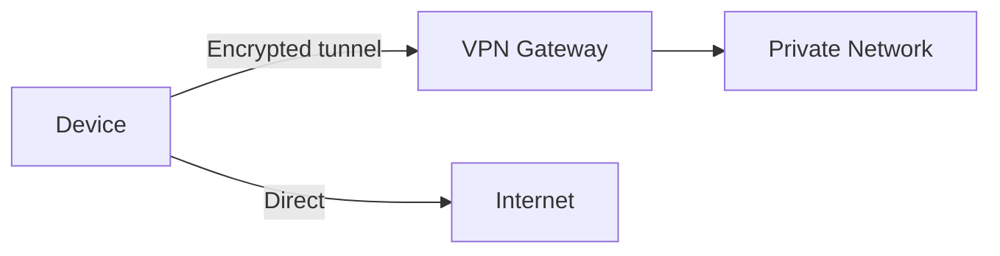

# Intro

A VPN (Virtual Private Network) creates an encrypted tunnel between two endpoints so traffic flows as if both are on the same private network, even over the public internet. You reach for it to access private resources remotely, connect geographically separated offices, or secure traffic over untrusted networks (public Wi-Fi, cloud provider links).

The key engineering work is not just encryption — it is routing, DNS, identity, and split-tunnel policy: deciding which traffic goes through the tunnel and which goes directly to the internet.

## How It Works

A VPN wraps (encapsulates) packets inside an encrypted outer packet. The outer packet travels over the public internet to the VPN gateway, which decrypts it and forwards the inner packet to the private network.



**Split tunneling:** only traffic destined for private resources goes through the tunnel; internet traffic goes directly. This reduces gateway load and latency for non-private traffic.

**Full tunneling:** all traffic goes through the gateway. Useful when you need to enforce corporate security policies on all outbound traffic.

## VPN Types

**Client VPN (remote access)**
A single device connects to a gateway. Common for remote workers accessing corporate resources. The device gets a virtual IP on the private network.

**Site-to-site VPN**
Two networks connect via gateways. Traffic between the networks flows through the tunnel transparently. Used to connect branch offices or cloud VPCs to on-premises networks.

**Mesh VPN (overlay)**
Instead of routing everything through a central gateway (hub-and-spoke), every device connects **directly** to every other (peer-to-peer), with a coordination plane handling key exchange and NAT traversal. Tailscale/Netbird (WireGuard-based) popularized this: lower latency (no gateway hop), no single chokepoint, at the cost of a control plane that manages identities.

## Beyond the VPN: Zero Trust (ZTNA)

The traditional VPN model is **"authenticate once, get the whole network"** — a flat trust boundary where a compromised laptop can reach everything. **Zero Trust Network Access (ZTNA)** replaces it with _per-application_, continuously-verified access: every request is authenticated and authorized against identity + device posture, and a user reaches only the specific apps they're entitled to, never the underlying network. The mantra is "never trust, always verify." Many "modern VPN" products (Tailscale, Cloudflare Access, Zscaler) are really ZTNA overlays. This matters because the classic VPN's all-or-nothing network access is one of the biggest **lateral-movement** risks in breaches.

## Protocols

**IPsec**
The traditional standard. Operates at the network layer (Layer 3). Supports two modes:

- _Transport mode_: encrypts only the payload, used for host-to-host.
- _Tunnel mode_: encrypts the entire packet, used for site-to-site and client VPN.

IPsec is complex to configure (IKE negotiation, SA management) but is widely supported by hardware appliances and cloud providers (AWS VPN, Azure VPN Gateway).

**WireGuard**
A modern, minimal protocol (~4,000 lines of code vs IPsec's ~400,000). Uses state-of-the-art cryptography (ChaCha20, Curve25519, BLAKE2). Faster handshake, simpler configuration, and better performance than IPsec in most benchmarks. Supported natively in Linux kernel since 5.6. Used by Tailscale, Cloudflare WARP, and many cloud providers.

**OpenVPN**
TLS-based, runs over UDP or TCP. Highly portable and widely supported. Slower than WireGuard due to TLS overhead and userspace implementation.

| Protocol | Layer | Complexity | Performance | Use case |
|----------|-------|------------|-------------|----------|
| IPsec | 3 | High | Good | Enterprise, hardware appliances |
| WireGuard | 3 | Low | Excellent | Modern deployments, cloud |
| OpenVPN | App | Medium | Moderate | Legacy, cross-platform |

## Tradeoffs

**IPsec vs WireGuard vs OpenVPN**: see the protocol comparison table in the Protocols section. Decision rule: default to WireGuard for new deployments (simpler, faster, smaller attack surface — ~4,000 lines vs ~400,000 for IPsec). Use IPsec when you need hardware appliance compatibility or regulatory mandate. Use OpenVPN only as a fallback for environments where WireGuard is not yet supported.

**Full tunnel vs split tunnel**: full tunnel routes all traffic through the VPN gateway, enforcing corporate security policies (content filtering, DLP) on all outbound traffic at the cost of increased gateway load and latency for internet traffic. Split tunnel routes only private-destined traffic through the VPN, reducing gateway bandwidth cost, but requires precise ACLs — overly broad rules can expose private resources to the internet.

WireGuard peer configuration (client side):

```text
[Interface]
PrivateKey = <client-private-key>
Address = 10.0.0.2/24
DNS = 10.0.0.1

[Peer]
PublicKey = <server-public-key>
Endpoint = vpn.example.com:51820
AllowedIPs = 10.0.0.0/24   # split tunnel: only private subnet
PersistentKeepalive = 25
```

## Questions

> [!QUESTION]- What is split tunneling and when would you use it?
> Split tunneling routes only traffic destined for private resources through the VPN; internet traffic goes directly. Use it to reduce gateway bandwidth cost and latency for internet-bound traffic. Avoid it when corporate policy requires all traffic to pass through security inspection (content filtering, DLP).

> [!QUESTION]- Why does WireGuard have a smaller attack surface than IPsec?
> WireGuard is ~4,000 lines of code (auditable by a small team) vs IPsec's ~400,000 lines. Fewer lines means fewer potential vulnerabilities. WireGuard also uses a fixed, modern cryptographic suite (ChaCha20, Curve25519, BLAKE2) with no negotiation — removing cipher selection as an attack vector.

> [!QUESTION]- What causes DNS leaks in a VPN setup, and how do you fix them?
> DNS queries bypass the encrypted tunnel — typically because the OS sends DNS requests to the default interface rather than the VPN interface. Fix: route DNS through the tunnel by setting DNS to an internal server and ensuring DNS requests use the VPN's routing table, or by running a local DNS resolver that forces all queries through the tunnel.

## Pitfalls

**DNS leaks**
If DNS queries bypass the tunnel, they reveal browsing activity to the ISP even when traffic is encrypted. Fix: route DNS through the tunnel or use a DNS server inside the private network.

**Split-tunnel misconfiguration**
Overly broad split-tunnel rules can expose private resources to the internet. Overly narrow rules force unnecessary traffic through the gateway, increasing latency and cost.

**MTU issues**
VPN encapsulation adds overhead (20–60 bytes per packet). If the MTU is not adjusted, large packets get fragmented, degrading performance. Fix: set the VPN interface MTU to account for encapsulation overhead (e.g., 1420 for WireGuard over a 1500-byte Ethernet link).

## References

- [WireGuard official site](https://www.wireguard.com/) — protocol design, performance benchmarks, and implementation guide for the modern VPN standard.
- [IPsec architecture (RFC 4301)](https://www.rfc-editor.org/rfc/rfc4301) — the authoritative specification for IPsec tunnel and transport modes.
- [Virtual private network (Wikipedia)](https://en.wikipedia.org/wiki/Virtual_private_network) — overview of VPN types, protocols, and use cases.
- [WireGuard vs OpenVPN vs IPsec (Tailscale blog)](https://tailscale.com/blog/how-tailscale-works) — practitioner comparison of VPN protocols with real-world performance data.
