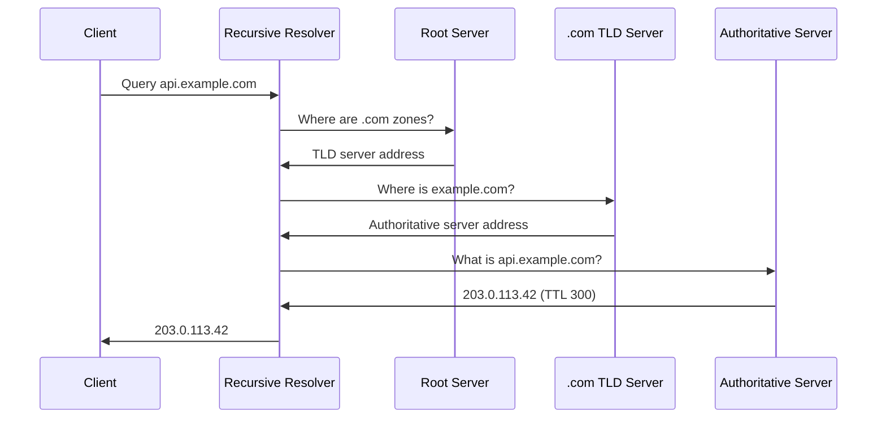

DNS (Domain Name System) is the internet's distributed directory service. Applications usually resolve names through local cache, static host maps, or recursive resolvers before opening transport connections.

DNS is hierarchical and distributed. Most queries are cache hits; misses can require referrals from root to TLD to authoritative servers.



If a name is a CNAME, the resolver follows the chain and returns the terminal record set subject to TTL and loop limits. NXDOMAIN and NODATA can be negative-cached for SOA-derived intervals, so disappearance is not instant.

![[Assets/System Design 101/dfaafd9073b0a72bc05c758dc1162a3f470a0cf903a50156e6d6107f79f1fdd0.png]]

# Resolution and Transport

Classic DNS commonly uses UDP for ordinary queries, while TCP is an equally valid transport that general-purpose implementations must support and is required for truncation recovery (`TC=1`) and zone transfers. Encrypted resolver protocols start on their own transports: DoT uses TLS and DoH maps DNS messages onto HTTPS.

| Type | Lookup direction | Payload | Example |
|---|---|---|---|
| `A` | Name → address | IPv4 | `api.example.com → 203.0.113.42` |
| `AAAA` | Name → address | IPv6 | `api.example.com → 2001:db8::1` |
| `CNAME` | Alias → target | Name | `www.example.com → example.com` |
| `MX` | Mail domain → exchanger | Hostnames with preference | `example.com → 10 mail.example.com` |
| `TXT` | Name → text values | One or more strings | SPF, DKIM selectors, verification |
| `NS` | Zone → nameserver | Hostname | Delegates `example.com` |
| `SOA` | Zone metadata | Serial, refresh, retry timers | Drives negative TTL behavior |
| `PTR` | Reversed name → host | Domain name | `42.113.0.203.in-addr.arpa → api.example.com` |
| `SRV` | Service locator | Target, port, priority | `_sip._tcp.example.com → 10 5 5060 sip1.example.com` |

![[Assets/System Design 101/cf648ed0a8c256e338b080a139796886987b527a7e761d913b98e38092984af0.png]]

# Cache Windows, Failover, and Traffic Steering

DNS operations are cache operations. An authoritative change is only the beginning: recursive resolvers, operating systems, browsers, and applications may continue using the previous answer until its TTL expires. A safe migration controls the cache window before changing the destination and keeps the old destination healthy while stale answers remain possible.

Suppose `api.example.com` has a TTL of 86,400 seconds and must move from `203.0.113.10` to `203.0.113.20`:

1. Lower the TTL to 300 seconds while the old address is still authoritative.
2. Wait at least 86,400 seconds: one complete old-TTL window. A resolver that cached the old record immediately before the reduction can legally keep it for that long.
3. Verify the reduced TTL through several recursive resolvers with `dig @resolver api.example.com A`.
4. Change the address and keep both old and new endpoints able to serve traffic for the expected stale-answer window.
5. Monitor traffic, errors, certificate coverage, and dependencies from both destinations.
6. Raise the TTL only after rollback is no longer likely.

Negative answers have their own SOA-derived cache lifetime. Creating a previously missing name can remain invisible until cached NXDOMAIN or NODATA answers expire.

Traffic-steering mechanisms have different boundaries:

| Mechanism | What changes | Boundary to remember |
|---|---|---|
| Multiple A/AAAA records | Returns several addresses | Clients choose and cache differently; this is not health-aware by itself |
| Weighted answer | Returns destinations in configured proportions | Resolver caching and client concentration make percentages approximate |
| Geographic or latency policy | Chooses an answer from resolver or client-network signals | Resolver location may not equal user location; EDNS Client Subnet has privacy and cache costs |
| Health-aware failover | Stops returning a failed endpoint | Existing caches still contain the failed answer until TTL expiry |
| Anycast | BGP advertises one address from many sites | Routing selects the site; DNS still returns the same address |

Short TTLs speed answer changes but increase authoritative and recursive query load. Long TTLs improve cache efficiency but extend rollback and failover windows. Pick the TTL from the recovery contract, not a universal number.

## Diagnostic sequence

```bash
dig api.example.com A
dig @1.1.1.1 api.example.com A
dig +trace api.example.com
dig example.com SOA
dig +dnssec api.example.com A
dig -x 203.0.113.20
```

Compare the local answer with a known recursive resolver, then use `+trace` to inspect delegation and authoritative data. Check the returned TTL, CNAME chain, authoritative nameservers, and SOA serial before blaming application networking. A correct authoritative answer with a stale recursive answer is a cache-window problem; different authoritative answers usually indicate incomplete zone publication or split-horizon policy.

# DNS Security and Encrypted Transport

DNS security has two different channels. DNSSEC authenticates signed record sets so a validating resolver can detect forged or modified DNS data. DNS-over-TLS (DoT) and DNS-over-HTTPS (DoH) encrypt the connection between a client and its recursive resolver. Neither control provides the other's guarantee.

## DNSSEC data authentication

An authoritative zone signs record sets with a zone-signing key. The resolver obtains the corresponding DNSKEY record and validates a chain of DS delegations from a configured trust anchor, normally the DNS root. A valid signature proves that the signed answer came from the key owner and was not changed; it does not hide the queried name or make the returned service trustworthy.

```text
root trust anchor
  -> DS for .com
  -> DNSKEY for .com
  -> DS for example.com
  -> DNSKEY for example.com
  -> RRSIG over api.example.com A
```

An authenticated denial response uses NSEC or NSEC3 records to prove that a requested name or type does not exist. Operators must rotate keys without breaking the DS/DNSKEY chain, monitor signature expiry, and verify positive and negative answers before a registrar or DNS-provider migration.

## Encrypted resolver transport

DoT carries DNS messages over TLS, conventionally on port 853. DoH carries DNS requests over HTTPS and can share port 443 with other web traffic. Both authenticate the configured resolver's TLS endpoint and protect the client-resolver hop from passive observation and on-path modification.

After that hop, the resolver still performs recursion and contacts authoritative infrastructure. DoT or DoH does not authenticate those answers, constrain what the resolver returns, or hide queries from the resolver. DNSSEC validation at the resolver or validating client authenticates signed data across those hops.

## Threat-to-control map

| Threat | Primary control | Residual boundary |
|---|---|---|
| Blind forged UDP response | Query-ID/source-port entropy; DNSSEC validation | Unsigned zones cannot provide DNSSEC authenticity |
| On-path observation between client and resolver | DoT or DoH | The recursive resolver still sees the query |
| Malicious or compromised resolver returning a signed-zone forgery | DNSSEC validation | The resolver can still block, delay, or alter unsigned data |
| Stale but correctly signed answer | TTL and signature validity | DNSSEC authenticates data; it does not guarantee freshness beyond protocol validity |
| Domain points to a malicious service | TLS/application authentication and authorization | DNSSEC authenticates the DNS owner, not the service's business behavior |

# Pitfalls

- Long TTLs preserve stale answers longer than expected.
- CNAME at zone apex cannot coexist with other zone-root records.
- DNSSEC is not payload confidentiality.
- Encrypted resolver transport moves trust to the configured recursive resolver; it does not make that resolver invisible or infallible.

# Operations Questions

> [!QUESTION]- Why does DNS migration feel delayed?
> Because recursive and client caches hold old TTLs; lowering TTL at cutover does not rewrite already-cached answers instantly.

> [!QUESTION]- Why can authoritative data be correct while clients still use old IPs?
> Those clients or resolvers still hold old cached records; the old value remains valid until TTL expiry and resolver policies permit refresh.

# References

- [DNS concepts (RFC 1034)](https://www.rfc-editor.org/rfc/rfc1034) — hierarchy, zone boundaries, and delegations.
- [DNS message format and records (RFC 1035)](https://www.rfc-editor.org/rfc/rfc1035) — query behavior and record structure.
- [DNS Transport over TCP (RFC 7766)](https://www.rfc-editor.org/rfc/rfc7766.html) — requires general-purpose DNS implementations to support TCP and permits using it without a preceding UDP attempt.
- [Negative caching (RFC 2308)](https://www.rfc-editor.org/rfc/rfc2308) — NXDOMAIN/NODATA cache semantics.
- [DNSSEC (RFC 4033)](https://www.rfc-editor.org/rfc/rfc4033) — trust chain and signature model.
- [DNS over TLS (RFC 7858)](https://www.rfc-editor.org/rfc/rfc7858) — encrypted resolver transport.
- [DNS over HTTPS (RFC 8484)](https://www.rfc-editor.org/rfc/rfc8484) — HTTPS-mapped DNS request model.
- [Route 53 routing policies](https://docs.aws.amazon.com/Route53/latest/DeveloperGuide/routing-policy.html) — concrete weighted, latency, geolocation, failover, and multivalue answer policies with their operating boundaries.
