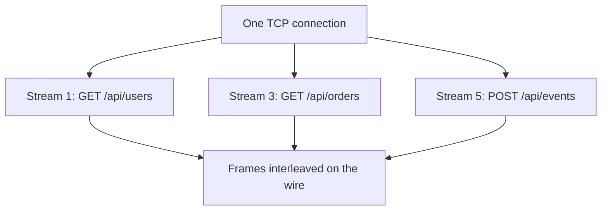

HTTP/2 carries many independent HTTP streams over one TCP connection. Its binary framing removes HTTP/1.1's response-order dependency and HPACK compresses repeated fields. TCP still delivers one ordered byte stream, so a lost segment can delay every HTTP/2 stream on that connection.

The current specification is RFC 9113, which supersedes the original RFC 7540. Methods, fields, and status semantics remain HTTP. Framing and connection behavior change.

See [[HTTP]] for the foundational HTTP concepts that HTTP/2 builds on.

# The HTTP/1.1 Bottleneck

Two HTTP/1.1 costs matter when a page or API opens many concurrent exchanges:

1. **Ordered responses on a connection:** without pipelining, a client waits for one response before sending the next request. Pipelining permits several outstanding requests, but responses must stay in request order, so a slow first response still blocks later ones. Browsers instead used several TCP connections per origin, which isolates some waiting at the cost of more connection state.

2. **Repeated fields:** HTTP/1.1 sends textual fields with each message. Cookies and other repeated metadata can outweigh a small payload.

# How HTTP/2 Works

**Binary framing layer**
HTTP/2 splits messages into typed binary frames. Each frame carries a stream ID, allowing one connection to interleave work from several exchanges.

**Multiplexing**
Multiple streams share a single TCP connection. Frames from different streams are interleaved, so stream 1's response frames can arrive between stream 3's request frames. Multiplexing removes HTTP/1.1's response-order dependency. Streams can still wait on flow-control credit, scheduling, server work, and TCP packet recovery.



**HPACK header compression**
Headers are compressed using a static table and a connection-specific dynamic table. Sensitive values such as `Authorization` credentials should be excluded from dynamic indexing according to the threat model. HPACK's never-indexed literal tells each intermediary not to add the field to its dynamic table and to preserve that treatment when re-encoding it. The field name can still use a static-table index, and the literal value's length remains observable. Never-indexed limits reuse through shared compression state rather than hiding all size information.

# Server Push and Prioritization Caveats

HTTP/2 still specifies server push: a server can send a promised request and response before the client asks. The mechanism was difficult to operate well because the server lacks the browser's complete cache state, pushed bytes compete with more urgent responses, and intermediaries handle push inconsistently. Chrome removed HTTP/2 push support, and other major browsers no longer make it a dependable web optimization. This is browser-product behavior, not an HTTP/3 deprecation of the concept. HTTP/3 also defines push.

Prefer preload hints and ordinary cacheable responses for web delivery. They let the browser decide whether and when to fetch a resource.

The original HTTP/2 dependency tree allowed clients to express stream relationships and weights, but deployments implemented it inconsistently. RFC 9218 defines the simpler extensible-priority scheme using urgency and incremental delivery. A priority signal is advice, not a guarantee: the server, proxy, and congestion controller still decide scheduling. Test the full path before relying on it for user-visible ordering.

# How HTTP/2 Is Negotiated (ALPN)

For HTTPS, the TLS handshake negotiates HTTP/2 through ALPN. The `ClientHello` advertises protocol identifiers such as `h2` and `http/1.1`. The server selects one as part of the same handshake. Browsers use this TLS path for HTTP/2.

Cleartext HTTP/2 (`h2c`) exists, including an HTTP/1.1 upgrade path and prior-knowledge use. Browsers do not expose it for ordinary web navigation. It appears mainly on controlled service hops, including some [[gRPC]] deployments behind a trusted ingress.

# HTTP/2 Vs HTTP/1.1

| Feature | HTTP/1.1 | HTTP/2 |
|---------|----------|--------|
| Connections per origin | Commonly several parallel connections | Commonly one multiplexed connection |
| Request multiplexing | No independent streams. Optional pipelining keeps responses ordered | Yes |
| Header format | Plain text, repeated in full | Binary, HPACK compressed |
| Server push | No | Yes (limited adoption) |
| Head-of-line blocking | Response ordering on a pipelined connection, plus TCP connection-wide loss recovery | TCP connection-wide loss recovery. Independent streams remove HTTP response ordering |
| TLS requirement | Optional | Required in practice (browsers enforce) |

# HTTP/2 In .NET

Kestrel supports HTTP/2 directly. A listener can offer HTTP/1.1 and HTTP/2 over TLS:

```csharp
builder.WebHost.ConfigureKestrel(options =>
{
    options.ListenAnyIP(443, listenOptions =>
    {
        listenOptions.UseHttps();
        listenOptions.Protocols = HttpProtocols.Http1AndHttp2;
    });
});
```

`HttpClient` still defaults requests to HTTP/1.1. The request version and policy state whether negotiation may move upward or fall back:

```csharp
var client = new HttpClient
{
    DefaultRequestVersion = HttpVersion.Version20,
    DefaultVersionPolicy = HttpVersionPolicy.RequestVersionOrHigher
};
```

# Pitfalls

**TCP head-of-line blocking remains**
HTTP/2 eliminates HTTP/1.1's ordered-response head-of-line blocking but not TCP-layer blocking. A single lost packet can delay data for all streams on the connection until TCP retransmits it. Under high packet loss, HTTP/2 can perform worse than HTTP/1.1 with multiple connections. HTTP/3 uses QUIC streams so loss on one request stream does not block unrelated request streams at the transport layer. Ordered delivery still blocks later bytes within the affected stream.

**Single connection amplifies TCP congestion**
HTTP/1.1 uses multiple connections, so congestion on one does not affect others. HTTP/2's single connection means a congestion event affects all streams simultaneously.

**Server push cache invalidation**
Pushed resources may already be in the client's cache. The server has no way to know, so it wastes bandwidth pushing resources the client doesn't need. Most production deployments disable server push.

# HTTP/3 Boundary

HTTP/3 keeps HTTP semantics but replaces HTTP/2's framing-over-TCP with HTTP framing over QUIC. QUIC uses UDP datagrams while providing its own reliable streams, congestion control, connection IDs, and TLS 1.3 handshake.

- Loss on one QUIC stream does not block delivery on unrelated request streams. The affected stream still has ordered-delivery head-of-line blocking, and QPACK or control-stream dependencies can delay field decoding or connection progress.
- Connection IDs allow migration between network paths, such as Wi-Fi to cellular, without identifying the connection only by IP and port.
- TLS 1.3 is integrated into QUIC. There is no separate plaintext QUIC mode.
- UDP-blocking networks, middleboxes, observability tooling, CPU cost, and server/CDN support can force fallback to HTTP/2.
- HTTP/2 server push is not a reason to migrate: major browsers removed or disabled it, and HTTP/3 also has a push mechanism that applications should not assume is useful.

# Questions

> [!QUESTION]- When can HTTP/1.1 be necessary or perform better than HTTP/2?
> HTTP/1.1 remains necessary across a server or intermediary that cannot negotiate HTTP/2. On a lossy path without HTTP/3, several HTTP/1.1 connections can also isolate TCP loss better than one HTTP/2 connection, though extra connections add handshake and congestion-control cost. The choice should follow measurements across the real path.

# References

- [HTTP/2](https://www.rfc-editor.org/rfc/rfc9113)
- [HPACK: Header Compression for HTTP/2](https://www.rfc-editor.org/rfc/rfc7541)
- [Extensible Prioritization Scheme for HTTP](https://www.rfc-editor.org/rfc/rfc9218)
- [HTTP/2 in ASP.NET Core](https://learn.microsoft.com/aspnet/core/fundamentals/servers/kestrel/http2)
