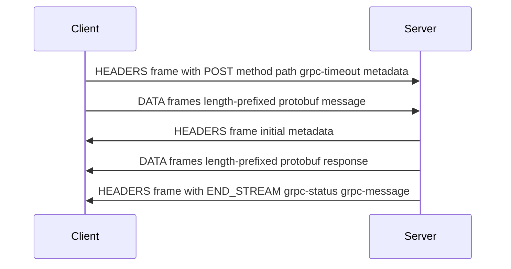

gRPC is a contract-first RPC framework. A service definition declares methods and message types. Tooling generates clients and server bases for the selected languages. Protocol Buffers is the default interface definition language and message encoding, while [[HTTP 2]] supplies multiplexed streams and flow control.

The framework fits services whose clients and servers can share a versioned contract. Its harder production problems sit outside serialization: deadlines, ambiguous failures, connection-aware load balancing, schema evolution, and telemetry.

# How It Works

## gRPC over HTTP/2

Each gRPC call occupies one HTTP/2 stream, represented by frames inside a connection. Independent streams can make progress without waiting for an earlier HTTP response to finish. They still share the underlying TCP connection, so packet loss can stall every stream on that connection.



The final gRPC status normally travels in HTTP/2 trailers rather than being expressed only by the HTTP status code. A transport-level load balancer cannot inspect that application status or distribute individual streams because it sees connections. GRPC-Web uses its own framing so browser clients can receive equivalent status information despite browser API limits around trailers.

## Flow Control and Backpressure

HTTP/2 flow control maintains connection and stream windows. When available credit is exhausted, further writes wait until the receiver consumes data and sends `WINDOW_UPDATE`. This creates transport backpressure, although application code still needs bounded buffering before it reaches the stream writer.

Kestrel's default initial stream window is 768 KiB. Larger windows can reduce stop-start transfer for large messages, but they also allow more memory to be buffered per active stream. `InitialConnectionWindowSize` must be at least as large as `InitialStreamWindowSize`.

# Streaming Patterns

| Pattern | Client sends | Server sends | Typical use |
|---|---|---|---|
| Unary | One message | One message | Commands and point lookups |
| Server streaming | One message | A message stream | Incremental query results or event feeds |
| Client streaming | A message stream | One message | Incremental upload or aggregation |
| Bidirectional | A message stream | A message stream | Long-lived conversations with independent flow in each direction |

## Server Streaming Example

```proto
service OrderService {
  rpc ListOrders (ListOrdersRequest) returns (stream OrderResponse);
}
```

```csharp
// Server
public override async Task ListOrders(
    ListOrdersRequest request,
    IServerStreamWriter<OrderResponse> responseStream,
    ServerCallContext context)
{
    await foreach (var order in _repository.GetOrdersAsync(
        request.CustomerId, context.CancellationToken))
    {
        await responseStream.WriteAsync(order);
    }
}

// Client
using var call = client.ListOrders(new ListOrdersRequest { CustomerId = "cust-42" });
await foreach (var order in call.ResponseStream.ReadAllAsync())
{
    Console.WriteLine($"Order {order.Id}: {order.Total}");
}
```

Only one write may be pending on a request or response stream. Multiple producers therefore need one serialization point, such as a bounded `Channel<T>` drained by a single writer task.

# .NET Integration

## Channel Management

A `GrpcChannel` owns the HTTP transport used by generated clients. Channels and clients are safe for concurrent use, and reusing them avoids repeating connection and TLS setup for every call.

```csharp
var handler = new SocketsHttpHandler
{
    PooledConnectionIdleTimeout = Timeout.InfiniteTimeSpan,
    KeepAlivePingDelay = TimeSpan.FromSeconds(60),
    KeepAlivePingTimeout = TimeSpan.FromSeconds(30),
    EnableMultipleHttp2Connections = true
};

var channel = GrpcChannel.ForAddress("https://order-service:5001", new GrpcChannelOptions
{
    HttpHandler = handler
});
var client = new OrderService.OrderServiceClient(channel);
```

HTTP/2 peers negotiate a maximum number of concurrent streams. Many servers use 100 by default. `EnableMultipleHttp2Connections = true` lets the handler open another connection after that negotiated limit is reached instead of leaving new calls queued behind long-lived streams. `GrpcChannel` configures this behavior for its default handler, while a custom handler must set it explicitly.

Keep-alive pings can keep an otherwise idle connection ready, but only when the server and intermediaries accept the policy. A server that rejects excessive pings may send `GOAWAY` and close the connection.

## Deadline Propagation

gRPC does not set a deadline by default. A stalled call can therefore keep request state and downstream work alive until another timeout or connection failure ends it. Each operation needs a deliberate deadline derived from its latency budget.

```csharp
// Manual: set deadline on outgoing call
var reply = await client.GetOrderAsync(
    request,
    deadline: DateTime.UtcNow.AddSeconds(5));

// Automatic: propagate incoming deadline to downstream calls
services.AddGrpcClient<OrderServiceClient>(o =>
        o.Address = new Uri("https://order-service:5001"))
    .EnableCallContextPropagation();
```

`EnableCallContextPropagation` forwards the current server call's deadline and cancellation into an outgoing call. A shorter explicit child deadline still wins. Across process boundaries, gRPC propagates the remaining timeout rather than an absolute timestamp, avoiding dependence on synchronized clocks.

## Interceptors

Interceptors wrap gRPC calls at the generated-client or service-method boundary. Server interceptors receive typed messages and call context, while ASP.NET Core middleware runs at the HTTP pipeline boundary.

- Use **middleware** for connection-wide HTTP concerns and authentication infrastructure shared with other ASP.NET Core endpoints.
- Use **interceptors** for per-RPC metrics, metadata policy, status mapping, or cross-cutting logic that needs the gRPC method and call context.

Interceptor order is observable. Keep a short chain and test the registration path used by the client factory or channel rather than relying on visual order alone.

## Error Model and Retries

gRPC defines application status codes separate from HTTP status: `OK`, `NOT_FOUND`, `INVALID_ARGUMENT`, `DEADLINE_EXCEEDED`, `UNAVAILABLE`, and others. A .NET server can throw `RpcException`. The client receives an `RpcException` and inspects `StatusCode`. Structured error details may use the `google.rpc.Status` model, subject to library support and metadata size limits.

Built-in retries are configured declaratively through the service config:

```csharp
var channel = GrpcChannel.ForAddress(address, new GrpcChannelOptions
{
    ServiceConfig = new ServiceConfig
    {
        MethodConfigs = { new MethodConfig
        {
            Names = { MethodName.Default },
            RetryPolicy = new RetryPolicy
            {
                MaxAttempts = 4,
                InitialBackoff = TimeSpan.FromSeconds(1),
                BackoffMultiplier = 2,
                RetryableStatusCodes = { StatusCode.Unavailable }  // only safe codes
            }
        }}
    }
});
```

A retryable status code describes the failure, not whether repeating the operation is safe. Retry only calls whose contract is idempotent or deduplicated, and cap attempts within the deadline. An ambiguous failure on a write can otherwise apply the change twice, the [[RPC|RPC delivery-semantics]] problem. Hedging sends overlapping attempts and therefore belongs only on operations that tolerate concurrent duplication.

# Pitfalls

## L4 Load Balancing Sees Connections, Not Calls

An L4 load balancer chooses a backend for each TCP connection. All RPCs multiplexed on that connection follow the same route, so a small number of long-lived channels can produce uneven backend load.

An HTTP/2-aware L7 proxy can balance calls before a stream is established. Client-side load balancing is the other common design: the channel resolves endpoints and selects one for each new call. Once a streaming call begins, its messages remain on the selected backend.

## Missing Deadlines Leave Work Without a Budget

Suppose service A gives an operation two seconds. Service B spends part of that budget, then calls C without propagating the deadline. A may abandon the result while C keeps running with no knowledge that the original budget expired.

Client-factory context propagation carries the remaining deadline into downstream gRPC calls. Application code must also pass `ServerCallContext.CancellationToken` to database, HTTP, and other cancellable operations. Cancellation is cooperative. A token cannot stop code that ignores it.

## Proto Field Numbers Are Wire Identities

Renumbering a field deletes one wire identity and creates another. Reusing the old number for a different meaning can cause parse failures, data loss, or values being interpreted under the wrong schema. Field names are not present in the binary key.

Existing field numbers must not change. After deleting a field, reserve its number and, where JSON or text-format compatibility matters, its name:

```proto
message UserRequest {
  reserved 5;
  reserved "old_field_name";
  string user_id = 1;
}
```

## Browser Transports Support Fewer Streaming Shapes

Mainstream gRPC-Web clients support unary calls and, with the compatible transport mode, server streaming. They do not expose native client streaming or bidirectional streaming through current browser APIs.

Browser requirements belong in the contract decision. A service can expose supported gRPC-Web methods, add ASP.NET Core JSON transcoding for mapped HTTP/JSON endpoints, or define a separate WebSocket protocol when full duplex browser messaging is the real requirement.

# Tradeoffs

| Criterion | gRPC | REST/JSON |
|---|---|---|
| Contract | Service definition and message schema required | OpenAPI is optional |
| Payload | Protobuf is compact for many schemas | JSON is text and easy to inspect |
| Streaming | All 4 patterns natively | Workarounds needed via SSE or WebSocket |
| Browser support | Requires gRPC-Web or JSON transcoding | Native |
| Human-readable wire format | No | Yes |
| Generic HTTP tooling | Requires gRPC-aware reflection or schema support | Broad curl, proxy, and browser support |
| HTTP caching | Unary calls use POST and do not gain normal HTTP response caching by default | Cache semantics are available when the API uses them correctly |

gRPC is a strong fit for controlled service estates that benefit from generated contracts or streaming. REST-style HTTP APIs remain easier to expose to arbitrary clients and intermediaries. A gateway can serve both boundaries, but it also creates two observable protocols whose errors, timeouts, and compatibility rules need deliberate mapping.

# References

- [gRPC Core Concepts](https://grpc.io/docs/what-is-grpc/core-concepts/)
- [gRPC over HTTP/2](https://github.com/grpc/grpc/blob/master/doc/PROTOCOL-HTTP2.md)
- [gRPC performance best practices with ASP.NET Core](https://learn.microsoft.com/aspnet/core/grpc/performance)
- [Our journey to gRPC](https://dropbox.tech/infrastructure/courier-dropbox-migration-to-grpc)
