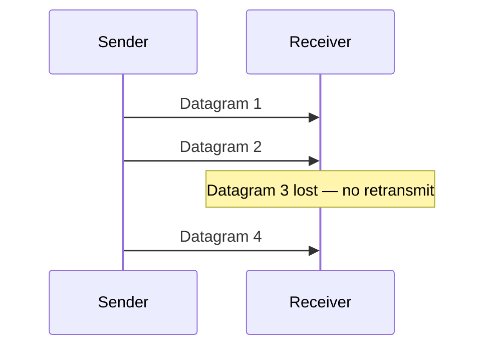

UDP (User Datagram Protocol) is a connectionless transport protocol that sends independent datagrams with no delivery guarantees. There is no handshake, no acknowledgment, no retransmission, and no ordering. You reach for it when lower connection-establishment and transport-retransmission overhead matters and the workload can define its own recovery: DNS retries lost queries, critical game or telemetry events add sequencing, acknowledgments, and bounded retries, while stale media or state samples can be dropped.

# How It Works

UDP adds a minimal 8-byte header (source port, destination port, length, checksum) to the payload and sends it. The receiver either gets it or doesn't. No state is maintained between sender and receiver.



# When to Use UDP

**Real-time audio/video:** a retransmitted audio packet from 200ms ago is useless — the conversation has moved on. Applications implement their own loss concealment (interpolation, FEC) rather than waiting for TCP retransmission.

**Online gaming:** game state updates (player positions, inputs) are time-sensitive. A missed update is replaced by the next one. Games implement their own reliability for critical events (hit registration) on top of UDP.

**DNS:** queries are small (fit in one datagram) and fast. If a query is lost, the client retries. The overhead of a TCP connection is not justified.

**QUIC (HTTP/3):** QUIC is built on UDP and implements its own reliable, ordered, multiplexed streams — getting TCP's reliability without TCP's head-of-line blocking.

**Multicast / broadcast:** UDP can send **one datagram to many receivers** — _broadcast_ to a whole subnet, or _multicast_ to a group that subscribed to a multicast address (`224.0.0.0/4`). TCP is strictly point-to-point and cannot do this. It's used for service discovery (mDNS/Bonjour, SSDP), IPTV, and market-data feeds where one stream fans out to thousands of subscribers without the sender tracking each.

# UDP Workloads and Their Recovery Layer

"Uses UDP" says nothing about how a workload handles loss:

| Workload | What UDP carries | Missing layer above UDP |
|---|---|---|
| Interactive media | RTP media packets; or QUIC packets carrying reliable media-control/application streams | Jitter buffer, sequence numbers, loss concealment/FEC; QUIC supplies ACKs, retransmission, encryption, and congestion control |
| DNS | A query and response, usually with EDNS to advertise a larger UDP payload | Client timeout/retry; servers signal truncation for TCP fallback, and clients must support TCP |
| Market data | Sequenced multicast feed updates | Gap detection, duplicate suppression, snapshot/recovery channel; order-entry FIX sessions are separate reliable connections |
| IoT telemetry/control | Small device reports or commands | Message IDs, bounded retry, deduplication, authentication/encryption, and an expiry rule for stale commands |

Generic "video streaming uses UDP" is too broad. RTP/WebRTC and QUIC-based delivery do; HLS and DASH segments are commonly fetched over HTTP on reliable transports. The reviewed use-case visual is excluded because it erases that distinction and labels a FIX client path as UDP multicast.

# Reliability above UDP

A game can use two logical channels over one UDP socket:

```text
snapshot: seq=104, player=(412,88)       drop if late; interpolate from 103 to 105
event:    id=580, seq=23, hit(target=7)  ACK with receive bitmap; retry before 80 ms deadline
event:    id=580                         duplicate after retry; acknowledge, do not apply twice
```

Snapshots are unreliable and replaceable. The receiver keeps a small sequence window, rejects packets older than the window, and interpolates through isolated gaps. Critical events are reliable but need not share one global order: sequence numbers expose gaps, selective ACKs report which events arrived, retransmission deadlines stop stale work, and stable event IDs make retries idempotent. If every event must be ordered, delivery pauses behind a missing earlier event—the same head-of-line cost TCP provides.

![[Assets/Networks/Networks-UDP-18120000.png]]

Reliability does not excuse an unpaced sender. Measure RTT and loss, cap bytes in flight, reduce the sending rate on congestion, and bound retransmissions. Also keep datagrams below the path MTU; IP fragmentation turns one missing fragment into a lost whole datagram. Use QUIC when you need secure, congestion-controlled reliable streams plus independent ordering. Use TCP when one reliable ordered byte stream is enough and UDP traversal or a custom protocol would add complexity without a latency benefit.

# C# Example

```csharp
// Sender
using var udp = new UdpClient();
var bytes = Encoding.UTF8.GetBytes("ping");
await udp.SendAsync(bytes, bytes.Length, "127.0.0.1", 9000);

// Receiver
using var server = new UdpClient(9000);
var result = await server.ReceiveAsync();
var message = Encoding.UTF8.GetString(result.Buffer);
Console.WriteLine($"Received: {message} from {result.RemoteEndPoint}");
```

# Pitfalls

**No congestion control**
UDP does not back off under network congestion. A UDP sender that floods the network can starve TCP connections sharing the same link. Applications using UDP for high-throughput transfers should implement their own congestion control (as QUIC does).

**Datagram size limits**
For IPv4 with its minimum 20-byte header, the maximum UDP application payload is 65,507 bytes: the 65,535-byte IPv4 packet limit minus the IP and UDP headers. That number is not universal; IPv6 uses different payload accounting and has an optional jumbogram extension. In practice, keep each datagram below the measured path MTU—often roughly 1,200 to 1,400 bytes on Internet paths—because one lost IP fragment discards the entire datagram.

**No built-in security**
UDP has no authentication or encryption. Use DTLS (Datagram TLS) for encrypted UDP, or build on QUIC which includes TLS 1.3.

**Amplification / reflection attacks**
Because UDP is connectionless, the source address is trivially **spoofed** — there's no handshake to prove the sender. An attacker sends a small query with the victim's IP as the source to a server that returns a large response (DNS, NTP, memcached), and the server unwittingly floods the victim. The _amplification factor_ (response ÷ request size) can be 50× or more, making UDP the basis of the largest DDoS attacks. Mitigations: rate-limit responses, disable open recursion/`monlist`, and deploy source-address validation (BCP 38) at the network edge.

# Questions

> [!QUESTION]- When is UDP preferable to TCP, and what reliability mechanisms do applications add on top?
> UDP is preferable when the application benefits from lower connection-establishment and transport-retransmission overhead and can own recovery. DNS retries lost queries; games and telemetry can sequence, acknowledge, and retry critical events; stale media or state samples can be dropped. Applications may also add FEC (Forward Error Correction) for loss recovery. QUIC is the canonical example — it builds reliable ordered streams on UDP while avoiding TCP's head-of-line blocking.

> [!QUESTION]- Why does UDP have no congestion control, and what are the consequences?
> UDP sends at whatever rate the application dictates. Under congestion, UDP traffic doesn't back off — it can starve TCP connections sharing the same link. Applications using UDP for sustained traffic must implement congestion control (QUIC does this). Small datagrams are not inherently harmless: many DNS, telemetry, or game-state packets can aggregate into a high packet and byte rate, so pacing must account for the whole flow.

> [!QUESTION]- What is QUIC and why is it built on UDP rather than TCP?
> QUIC (HTTP/3) implements reliable, ordered, multiplexed streams on top of UDP. It's built on UDP to avoid TCP's head-of-line blocking (a lost TCP segment blocks all streams; QUIC streams are independent), to enable faster connection establishment (0-RTT resumption), and to allow protocol evolution without OS kernel changes. TLS 1.3 is built into QUIC — there's no separate TLS handshake.

# References

- [UDP specification (RFC 768)](https://www.rfc-editor.org/rfc/rfc768) — the original 3-page UDP specification; notable for its brevity.
- [UDP Usage Guidelines (RFC 8085)](https://www.rfc-editor.org/rfc/rfc8085) — IETF requirements for congestion control, message sizing, reliability, checksums, and middlebox behavior.
- [RTP specification (RFC 3550)](https://www.rfc-editor.org/rfc/rfc3550) — sequence numbers, timestamps, reception reports, and loss/jitter behavior for real-time media.
- [DNS over TCP Requirements (RFC 7766)](https://www.rfc-editor.org/rfc/rfc7766) — requires general-purpose DNS implementations to support TCP, not just UDP retry behavior.
- [Extension Mechanisms for DNS (EDNS(0), RFC 6891)](https://www.rfc-editor.org/rfc/rfc6891) — how DNS peers advertise UDP payload size and avoid relying on the original 512-byte limit.
- [UdpClient class (Microsoft Learn)](https://learn.microsoft.com/en-us/dotnet/api/system.net.sockets.udpclient) — .NET API reference for sending and receiving UDP datagrams.
- [TCP vs UDP (Cloudflare Learning)](https://www.cloudflare.com/learning/ddos/glossary/user-datagram-protocol-udp/) — accessible comparison of TCP and UDP with use case guidance.
- [QUIC and HTTP/3 (RFC 9000)](https://www.rfc-editor.org/rfc/rfc9000) — how QUIC builds reliable, multiplexed streams on top of UDP to get the best of both protocols.
- [ByteByteGo: What Protocol Does Online Gaming Use?](https://github.com/ByteByteGoHq/system-design-101/blob/b28380a4710c5ec9638ec037d4168e288f334cba/data/guides/what-protocol-does-online-gaming-use-to-transmit-data.md) — source for separating unreliable snapshots from reliable event delivery and for the imported diagram.
- [ByteByteGo: Top 4 Most Popular Use Cases for UDP](https://github.com/ByteByteGoHq/system-design-101/blob/b28380a4710c5ec9638ec037d4168e288f334cba/data/guides/top-4-most-popular-use-cases-for-udp.md) — source reviewed for workload coverage; its inaccurate transport diagram is intentionally excluded.
