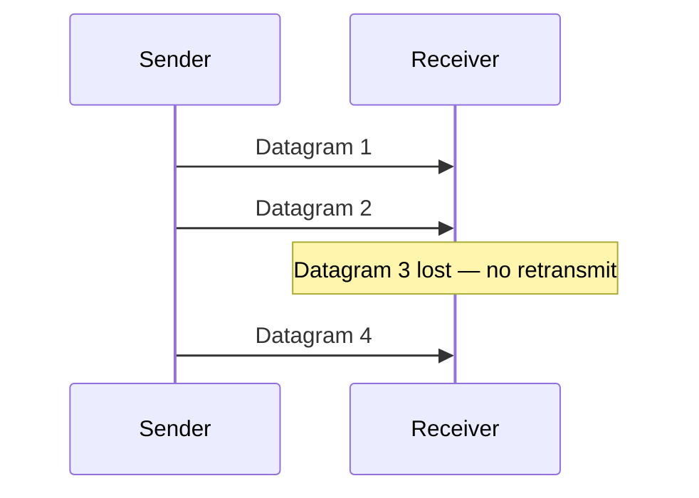

UDP carries independent datagrams without establishing a transport connection. It does not acknowledge, retransmit, order, or pace them. That small contract is useful when stale data is replaceable, multicast is required, or another protocol such as QUIC supplies the missing machinery. The application otherwise owns loss recovery, duplicate handling, ordering, deadlines, and congestion response.

# How It Works

UDP prepends an 8-byte header containing source port, destination port, length, and checksum. IPv6 requires a nonzero UDP checksum by default. Narrowly specified tunnel encapsulations can use a zero checksum only under additional applicability and safety constraints. The checksum is normally used in IPv4 as well. UDP establishes no end-to-end connection and keeps little transport state. The network can still lose, duplicate, reorder, or fragment the resulting IP packet.


```mermaid
sequenceDiagram
  participant Sender
  participant Receiver

  Sender->>Receiver: Datagram 1
  Sender->>Receiver: Datagram 2
  Note over Receiver: Datagram 3 lost — no retransmit
  Sender->>Receiver: Datagram 4
```

# When to Use UDP

**Real-time audio/video:** a late media packet may be less useful than the next one. RTP/WebRTC systems use sequence numbers, jitter buffers, loss concealment, and sometimes FEC so playback can continue without waiting for every missing packet.

**Online gaming:** replaceable state snapshots can tolerate gaps, while critical events need IDs, acknowledgment, deduplication, and bounded retry. Keeping those classes separate avoids making fresh state wait behind stale state.

**DNS:** many exchanges fit in one UDP datagram and use a timeout plus retry. General-purpose DNS implementations must also support TCP for truncated or otherwise unsuitable UDP responses, so UDP is a first path rather than the whole protocol contract.

**QUIC, as used by HTTP/3:** QUIC uses UDP as an evolvable packet substrate, then adds encryption, congestion control, acknowledgment, retransmission, and ordering within each stream. Loss in one stream does not block delivery in an unrelated stream.

**Multicast / broadcast:** UDP supports one-to-many delivery through IPv4 broadcast and IP multicast, including IPv4 group addresses in `224.0.0.0/4`. TCP connections are point-to-point. Service discovery and market-data feeds can therefore fan out without one TCP connection per receiver, but membership, loss recovery, and access control remain separate concerns.

# UDP Workloads and Their Recovery Layer

"Uses UDP" describes the packet substrate, not the workload's delivery contract:

| Workload | What UDP carries | Missing layer above UDP |
|---|---|---|
| Interactive media | RTP media packets, or QUIC packets carrying reliable media-control/application streams | Jitter buffer, sequence numbers, loss concealment/FEC. QUIC supplies ACKs, retransmission, encryption, and congestion control |
| DNS | A query and response, usually with EDNS to advertise a larger UDP payload | Client timeout/retry. Servers signal truncation for TCP fallback, and clients must support TCP |
| Market data | Sequenced multicast feed updates | Gap detection, duplicate suppression, snapshot/recovery channel. Order-entry FIX sessions are separate reliable connections |
| IoT telemetry/control | Small device reports or commands | Message IDs, bounded retry, deduplication, authentication/encryption, and an expiry rule for stale commands |

Generic "video streaming uses UDP" is too broad. RTP/WebRTC and QUIC-based delivery do. HLS and DASH segments are commonly fetched over HTTP on reliable transports.

# Reliability above UDP

A game can use two logical channels over one UDP socket:

```text
snapshot: seq=104, player=(412,88)       drop if late; interpolate from 103 to 105
event:    id=580, seq=23, hit(target=7)  ACK with receive bitmap; retry before 80 ms deadline
event:    id=580                         duplicate after retry; acknowledge, do not apply twice
```

Snapshots are replaceable. The receiver can keep a small sequence window, reject stale packets, and interpolate through isolated gaps. Critical events need a different policy: sequence numbers expose gaps, selective acknowledgments report arrivals, retry deadlines prevent stale work, and stable event IDs make duplicates harmless. A global order recreates head-of-line blocking. Independent channels preserve only the order each operation actually needs.

![[Assets/Networks/Networks-UDP-18120000.png|theme-aware]]

Reliability logic does not excuse an unpaced sender. A sustained UDP flow must measure path feedback, cap bytes in flight, reduce its rate under congestion, and bound retransmissions. Datagrams should also fit the path MTU because losing one IP fragment discards the entire datagram. QUIC already supplies secure, congestion-controlled streams with independent ordering. TCP is simpler when one reliable ordered byte stream matches the workload.

# C# Example

```csharp
// Sender
using var udp = new UdpClient();
var bytes = Encoding.UTF8.GetBytes("ping");
await udp.SendAsync(bytes, bytes.Length, "127.0.0.1", 9000);

// Receiver
using var server = new UdpClient(9000);
var result = await server.ReceiveAsync();
var message = Encoding.UTF8.GetString(result.Buffer);
Console.WriteLine($"Received: {message} from {result.RemoteEndPoint}");
```

# Pitfalls

**No congestion control**
UDP does not reduce its sending rate under congestion. An application that emits sustained traffic must pace and adapt the flow, or it can worsen loss and crowd out responsive transports sharing the path. QUIC includes that control. Bare UDP does not.

**Datagram size limits**
Without IPv6 jumbograms, the theoretical UDP payload limit is 65,507 bytes over IPv4 and 65,527 bytes over IPv6. Those are protocol ceilings, not safe Internet message sizes. Keep each datagram within the effective path MTU and account for IP, UDP, tunneling, and security overhead. One missing fragment loses the whole datagram.

**No built-in security**
UDP authenticates and encrypts nothing. A protocol can add DTLS, an application-specific authenticated format, or a transport such as QUIC with integrated TLS. Encryption alone does not prevent replay or amplification. The surrounding protocol must define those boundaries.

**Amplification / reflection attacks**
Where networks do not validate source addresses, an attacker can forge a victim's address in a small UDP request and direct a larger response at that victim. Connectionless request/response services therefore need response-size limits, rate limits, validation tokens or cookies where appropriate, and restricted recursion or administration features. Source-address validation at network edges removes the forged-source path.

# References

- [User Datagram Protocol](https://www.rfc-editor.org/rfc/rfc768)
- [UDP Usage Guidelines](https://www.rfc-editor.org/rfc/rfc8085)
- [QUIC: A UDP-Based Multiplexed and Secure Transport](https://www.rfc-editor.org/rfc/rfc9000)
- [UdpClient class](https://learn.microsoft.com/dotnet/api/system.net.sockets.udpclient)
