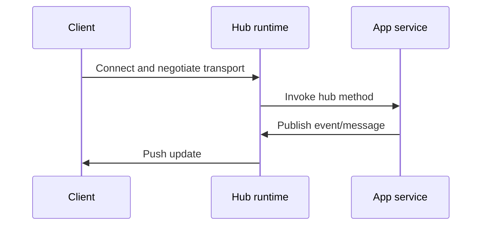

SignalR is ASP.NET Core's real-time communication framework for bidirectional server/client messaging over persistent connections. It is the default choice when the server must push updates immediately (chat, live dashboards, collaborative workflows, notifications) without polling-heavy architectures. Suppose a stock dashboard has 50,000 concurrent browser clients and otherwise polls every five seconds: that polling design creates 10,000 requests per second before accounting for retries or headers. SignalR can replace those repeated requests with pushed updates, but a target such as sub-100 ms delivery is a workload-specific service objective to measure under load, not a framework guarantee. SignalR hides transport negotiation details behind hubs, but production success still depends on scaling, connection lifecycle handling, and clear authorization boundaries.

# How It Works

## Mental Model



SignalR negotiates the best available transport (WebSockets first, then fallback options). Hub methods are invoked per call on transient hub instances, and outbound messages are routed through `Clients.*` targets (`All`, `User`, `Group`, etc.).

## Example

Hub:

```csharp
public sealed class ChatHub : Hub
{
    public async Task Send(string message)
    {
        await Clients.All.SendAsync("message", message);
    }
}
```

Register in ASP.NET Core pipeline:

```csharp
builder.Services.AddSignalR();

var app = builder.Build();
app.MapHub<ChatHub>("/hubs/chat");
app.Run();
```

## Pushing from outside a hub

Most real apps push messages from a controller or background service, not from inside a hub method. Inject **`IHubContext<THub>`** to do that:

```csharp
public sealed class PriceUpdater(IHubContext<PriceHub> hub)
{
    public Task BroadcastAsync(decimal price, CancellationToken ct) =>
        hub.Clients.All.SendAsync("price", price, ct);
}
```

## Streaming and client results

- **Streaming**: a hub method returning `IAsyncEnumerable<T>` (or accepting a `ChannelReader<T>`) streams items incrementally instead of one big payload — good for live feeds and large transfers with backpressure.
- **Client results (.NET 7+)**: the server can _invoke a method on a client and await its return value_ with `Clients.Client(id).InvokeAsync<T>(...)` — turning the normally fire-and-forget push into a request/response.

## Connection lifecycle

Override `OnConnectedAsync` / `OnDisconnectedAsync` to manage group membership and presence. The client supports **automatic reconnect** (`.WithAutomaticReconnect()`), but reconnection assigns a **new `ConnectionId`**, so re-add the connection to its groups on reconnect. SignalR has no built-in durable replay: a message sent while a client is disconnected is not replayed when it returns. Delivery guarantees depend on the configured path; the Redis Pub/Sub transport used by the Redis backplane is formally at-most-once and loses messages that a subscriber misses during a disconnect or outage. Persist anything that must survive a disconnect (DB/queue) and replay it explicitly.

## Redis backplane request and delivery path

A Redis backplane solves cross-node routing; it does not make chat messages durable. One scale-out path is:

1. The client negotiates a transport, authenticates, and opens a connection to node A. SignalR associates its user identifier, groups, and connection ID with that live connection.
2. Bob invokes `SendMessage`. Node A authorizes the conversation and commits `{ messageId, conversationId, senderId, body, createdAt }` to durable storage. If persistence and publication must be atomic across a crash, an outbox publishes after the database commit.
3. Node A sends a delivery envelope through SignalR. The Redis backplane uses Pub/Sub to fan it to the app nodes; node B recognizes Alice's connection and pushes the envelope over her active transport.
4. Alice renders the message and invokes an explicit `Ack(messageId)`. The server records the acknowledgement independently. Completion of `Clients.User(...).SendAsync(...)` means the server-side send path completed, not that Alice displayed or persisted the message.
5. After a disconnect, Alice queries durable storage from her last acknowledged sequence and catches up. Redis Pub/Sub cannot replay anything published while node B or Alice was unavailable.

![[Assets/System Design 101/71bfda81fdab5f6bd0bc5da137a853e99122045f1a85a5cf1431d057f11f9363.jpg]]

The diagram combines Pub/Sub and Redis data structures in one product. A SignalR Redis backplane specifically uses transient Pub/Sub; message history needs a separate durable design. Redis Streams or another broker/store can provide persistence, but that is not the behavior of the backplane configured by `AddStackExchangeRedis`.

# Pitfalls

- Assuming hub instances are stateful leads to lost data because hubs are transient per invocation; keep connection/session state in `Context.Items` or external stores. For example, if a team stores a shopping cart in a hub field, the next invocation receives a new hub instance and observes an empty cart. The defect can remain hidden until a multi-call workflow or reconnect path exercises it.
- Skipping `await` on `SendAsync` can drop messages when hub execution completes before send operations finish.
- Treating groups as authorization boundaries is unsafe: groups are routing constructs, not security policy enforcement.
- Multi-node deployments fail unpredictably without a scale-out plan (Azure SignalR Service or backplane) and correct session-affinity assumptions. A 4-node deployment without a backplane delivers messages only to clients connected to the originating node — roughly 75% of connected clients silently miss every broadcast, and the bug only manifests under load when connections distribute across nodes. The fix is a **backplane** (`AddStackExchangeRedis(...)`) that fans every message out to all nodes, **or** Azure SignalR Service which offloads connections entirely. Either way self-hosted SignalR needs **sticky sessions** (ARR affinity), because the initial negotiate and the transport connection must land on the same node — unless you disable the negotiate step or use the managed service.
- Forgetting that the transport **falls back** (WebSockets → Server-Sent Events → Long Polling) when WebSockets are unavailable. Long Polling especially amplifies the sticky-session requirement and the cost of a missing backplane; verify your proxy/load balancer allows WebSocket upgrades so you actually get the fast transport.

# Tradeoffs

- SignalR vs polling: SignalR gives lower latency and better network efficiency for frequent updates, while polling is simpler for low-frequency/eventually-consistent scenarios.
- Azure SignalR Service vs self-managed backplane: managed service reduces operational burden and sticky-session complexity, while self-managed options provide more infrastructure control.
- JSON vs MessagePack protocol: JSON is easier to debug and interoperate with, while MessagePack reduces payload size for high-throughput workloads.

# Questions

> [!QUESTION]- When is SignalR a good fit?
>
> - Use SignalR when clients need server-pushed updates with low latency (chat, collaboration, live telemetry).
> - It is most valuable when update frequency is high enough that polling wastes bandwidth or increases staleness.
> - If updates are rare and latency tolerance is high, simpler HTTP polling can be cheaper to operate.

> [!QUESTION]- What is the first scaling problem you will hit?
>
> - Cross-node message fan-out: messages sent on one server do not automatically reach clients connected to another node.
> - Plan scale-out early with Azure SignalR Service or a supported backplane, then validate routing under load tests.
> - Also validate sticky-session requirements for your chosen topology and transport strategy.

> [!QUESTION]- Why are SignalR groups not enough for authorization?
>
> - Groups control message routing, not permission checks.
> - Membership can change/rejoin over reconnect paths, so relying on groups alone risks privilege drift.
> - Enforce security with authentication and policy/role-based authorization on hub methods.

# References

- [ASP.NET Core SignalR](https://learn.microsoft.com/aspnet/core/signalr/introduction?view=aspnetcore-10.0) - Official architecture and transport overview.
- [Use hubs in SignalR for ASP.NET Core](https://learn.microsoft.com/aspnet/core/signalr/hubs?view=aspnetcore-10.0) - Hub lifecycle, targeting APIs, and error handling.
- [Scale ASP.NET Core SignalR](https://learn.microsoft.com/aspnet/core/signalr/scale?view=aspnetcore-10.0) - Scale-out models, sticky sessions, and hosting constraints.
- [Redis backplane for ASP.NET Core SignalR](https://learn.microsoft.com/en-us/aspnet/core/signalr/redis-backplane?view=aspnetcore-10.0) - Backplane configuration, same-datacenter guidance, and message loss during Redis outages.
- [Redis Pub/Sub delivery semantics](https://redis.io/docs/latest/develop/pubsub/#delivery-semantics) - Official at-most-once semantics and the distinction from persisted Redis Streams.
- [Authentication and authorization in SignalR](https://learn.microsoft.com/aspnet/core/signalr/authn-and-authz?view=aspnetcore-10.0) - Auth flows, token handling, and security rules.
- [Build a simple chat application (ByteByteGo, pinned source)](https://github.com/ByteByteGoHq/system-design-101/blob/b28380a4710c5ec9638ec037d4168e288f334cba/data/guides/build-a-simple-chat-application.md) - Provenance for the Redis chat visual; the note separates transient backplane delivery from durable history and explicit acknowledgement.
- [Scaling SignalR at production scale (Ably)](https://ably.com/topic/scaling-signalr) - Practical scaling tradeoffs and operational pitfalls.
