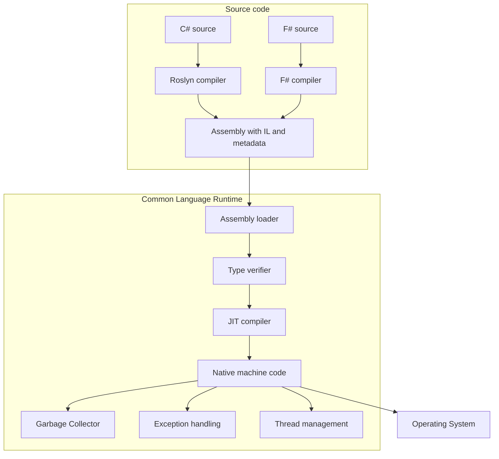

# Intro

The CLR (Common Language Runtime) is the execution engine of .NET. It takes the CPU-independent bytecode (IL) produced by language compilers and turns it into native machine code at runtime, while also providing memory management, type safety, exception handling, threading, and interoperability services. Every C#, F#, and VB.NET program runs inside the CLR — it is the reason .NET code is portable across platforms and why you do not manage memory manually.

The key insight: .NET compilers do not produce native binaries. They produce **assemblies** containing **IL (Intermediate Language)** plus metadata. The CLR loads those assemblies and compiles IL to native code on the target machine using **JIT (Just-In-Time) compilation** or, for ahead-of-time scenarios, **AOT (Ahead-of-Time) compilation** (ReadyToRun, NativeAOT).

## How It Works



**Startup sequence:**

1. OS loads the executable; the CLR host (`dotnet.exe` or embedded host) initializes.
2. The assembly loader reads the `.dll`/`.exe`, validates the PE header, and loads IL + metadata into memory.
3. The type verifier checks that IL is type-safe before execution (skipped for trusted/AOT code).
4. The JIT compiler translates each method's IL to native code on first call and caches the result. Subsequent calls go directly to native code.
5. The GC manages heap allocations; the thread pool manages worker threads.

**Key CLR subsystems:**

| Subsystem | What it does |
|---|---|
| JIT compiler | Translates IL → native code per method on first call |
| Garbage Collector | Tracks heap objects, reclaims unreachable memory in generations |
| Type system | Enforces type safety, loads metadata, supports reflection |
| Exception handling | Structured exception handling (SEH) with stack unwinding |
| Thread pool | Manages worker and I/O completion threads |
| Interop | P/Invoke and COM interop for calling native code |

## Managed vs Unmanaged Code

**Managed code** runs under the CLR. The runtime provides:

- Automatic memory management (GC)
- Type safety and bounds checking
- Structured exception handling
- JIT/AOT compilation

**Unmanaged code** runs directly as native machine code (C/C++ binaries, OS APIs). It does not benefit from CLR services and requires explicit memory management. .NET can call unmanaged code via P/Invoke:

```csharp
using System.Runtime.InteropServices;

[DllImport("kernel32.dll", SetLastError = true)]
static extern bool Beep(uint dwFreq, uint dwDuration);

Beep(440, 500); // A4 note for 500ms
```

## JIT vs AOT

| Mode | When compiled | Startup | Peak throughput | Binary size |
|---|---|---|---|---|
| JIT (default) | At runtime, per method | Slower (first call) | High (tiered compilation) | Small IL assembly |
| ReadyToRun | At publish time, partial | Faster | Similar to JIT | Larger |
| NativeAOT | At publish time, full | Fastest | No JIT overhead | Largest |

**Decision rule**: use JIT for most server workloads (tiered compilation optimizes hot paths). Use NativeAOT for CLI tools, serverless cold-start-sensitive functions, or embedded scenarios where startup time and binary size matter.

### Tiered Compilation

"JIT optimizes hot paths" works because the JIT compiles each method **twice**:

- **Tier 0** — a quick, minimally-optimized compile on first call, so startup is fast.
- **Tier 1** — once a method is called enough times (or loops enough), it's recompiled with full optimizations in the background and the call site is swapped to the fast version.
- **OSR (On-Stack Replacement)** lets a long-running loop that started in Tier 0 jump to optimized code _mid-execution_, without waiting for the next call — important for `Main`-style hot loops.
- **Dynamic PGO** (default in .NET 8) instruments Tier 0 code to gather real call/branch data, then feeds it into Tier 1 for guided devirtualization and inlining. `ReadyToRun` images participate as a pre-baked Tier-0-equivalent.

### Assembly Loading and the Type System

The loader resolves and loads assemblies (IL + metadata) into an **`AssemblyLoadContext`**. A _collectible_ `AssemblyLoadContext` can be unloaded, which is how plugin hosts load and later drop assemblies without recycling the process. At the type-system level the CLR represents each loaded type by a **MethodTable** (vtable, interface map, type flags); every reference-type object carries an **object header** (sync-block index used for `lock`/hash code) plus a MethodTable pointer. [[Generics]] are instantiated lazily: the runtime shares one JIT-compiled body across all reference-type arguments but generates a specialized body per value-type argument (why `List<int>` is as fast as hand-written code).

### Memory Model and Exceptions

The CLR defines a memory model that governs how writes become visible across threads; `volatile`, `Interlocked`, and explicit memory barriers (`Thread.MemoryBarrier`) are the tools for ordering guarantees the JIT/CPU would otherwise be free to reorder. Exceptions use a **two-pass model**: a first pass walks up the stack evaluating `catch`/`when` filters to _select_ a handler (the stack is still intact, which is why filters see the original state), then a second pass unwinds, running `finally` blocks on the way to the chosen handler.

## Pitfalls

**Assuming JIT is free** — the first call to a method triggers JIT compilation. In latency-sensitive scenarios (serverless cold starts, first request after deploy), this adds measurable overhead. Mitigate with ReadyToRun or NativeAOT publishing, or warm-up requests.

**Blocking the thread pool** — the CLR thread pool uses hill-climbing to tune thread count. Blocking threads with synchronous I/O or `Thread.Sleep` starves the pool and degrades throughput. Use `async/await` to release threads during I/O waits.

**Finalizer abuse** — objects with finalizers are promoted to the next GC generation before collection, increasing memory pressure. Prefer `IDisposable` + `using` for deterministic cleanup; use finalizers only as a safety net for unmanaged resources.

## Questions

> [!QUESTION]- What is managed vs unmanaged code? Why does unmanaged interop require careful lifetime management?
> Managed code runs under the .NET runtime (CLR) and benefits from runtime services like type safety checks, exception handling, garbage collection, and JIT/AOT compilation.
> Unmanaged code runs directly as native machine code under the OS (for example, C/C++ binaries). It does not run under the CLR and typically requires explicit resource and lifetime management.
> P/Invoke calls into native libraries require marshaling data across the managed/unmanaged boundary, which adds overhead and risks memory corruption if signatures are wrong.
> Use `SafeHandle` (not raw `IntPtr`) to wrap unmanaged handles — it ensures deterministic release even if exceptions occur and prevents handle recycling attacks.
> Interop lets you reuse native libraries and OS APIs, but every boundary crossing costs marshaling overhead and opens the door to bugs (dangling pointers, double-free) the GC cannot prevent.

> [!QUESTION]- What is the CLR and IL? How does JIT compilation affect startup vs steady-state performance, and when is NativeAOT a better choice?
> The CLR (Common Language Runtime) is the execution engine of .NET. It loads assemblies, verifies and executes IL, compiles IL to native code (JIT or AOT), manages memory (GC), handles exceptions, supports threading and interop, and provides other runtime services.
> IL (also called CIL or MSIL) is the CPU-independent intermediate instruction set produced by .NET language compilers and stored in assemblies together with metadata. The CLR turns IL into native code for the current platform.
> JIT compilation adds latency on first method call. Tiered compilation mitigates this: Tier 0 compiles quickly with minimal optimization, then hot methods are recompiled at Tier 1 with full optimization — giving fast startup and high steady-state throughput.
> NativeAOT eliminates JIT entirely by compiling to native code at publish time — fastest startup, smallest working set, but no runtime code generation (limits reflection, dynamic assembly loading, and some serialization patterns).
> JIT with tiered compilation is the right default for long-running server workloads; NativeAOT wins for CLI tools, serverless cold-start SLAs, and embedded scenarios where startup and binary size matter more than runtime flexibility.

> [!QUESTION]- When would you choose NativeAOT over JIT compilation?
> NativeAOT eliminates JIT startup cost and produces a self-contained native binary — ideal for CLI tools, serverless functions with cold-start SLAs, or embedded scenarios. The cost is longer publish time, larger binary, and loss of runtime reflection-heavy features (dynamic code generation, some serialization patterns). For long-running server workloads, JIT with tiered compilation typically wins on peak throughput.

> [!QUESTION]- Why does the GC use generations?
> Most objects die young (short-lived allocations like request-scoped objects). Generational GC exploits this by collecting Gen 0 (newest, smallest) most frequently and cheaply. Long-lived objects are promoted to Gen 1 and Gen 2, which are collected less often. This reduces the cost of GC for the common case while still reclaiming long-lived garbage.

## Links

- [Common Language Runtime (CLR) overview — Microsoft Learn](https://learn.microsoft.com/en-us/dotnet/standard/clr) — official overview of CLR responsibilities, managed execution, and assembly loading.
- [.NET Runtime architecture — Microsoft Learn](https://learn.microsoft.com/en-us/dotnet/core/introduction) — covers the relationship between CLR, BCL, and the SDK.
- [Managed execution process — Microsoft Learn](https://learn.microsoft.com/en-us/dotnet/standard/managed-execution-process) — step-by-step walkthrough from source code to running application.
- [NativeAOT deployment — Microsoft Learn](https://learn.microsoft.com/en-us/dotnet/core/deploying/native-aot/) — when and how to use ahead-of-time compilation.
- [Fundamentals of garbage collection — Microsoft Learn](https://learn.microsoft.com/en-us/dotnet/standard/garbage-collection/fundamentals) — generational GC, LOH, and GC modes explained.
