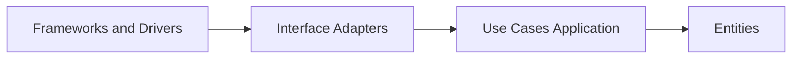

Clean Architecture, popularized by Robert C. Martin, keeps business policy independent of delivery technology. Its Dependency Rule is strict: source dependencies point inward, so inner policy code cannot name a web framework, database adapter, or UI type. That separation keeps domain behavior testable while outer details change. It earns its cost in systems with substantial business rules and a longer life than the current infrastructure stack.

# How Dependencies Point Inward

## The Dependency Rule in Practice

Code at the center defines policy. Code farther out supplies details. A use case may depend on an `IOrderRepository` contract, while the EF Core repository depends on and implements that contract. The application owns the boundary. Storage, HTTP, and messaging remain replaceable adapters.

When the rule holds, an MVC endpoint can become a Minimal API or gRPC adapter without rewriting domain rules. EF Core can give way to Dapper or Cosmos DB without changing use-case code. Entity and use-case tests also run without booting ASP.NET Core.

## Four Concentric Layers

- **Entities**: Enterprise-wide business rules and domain objects that hold the most stable invariants.
- **Use Cases / Application**: Application-specific rules that orchestrate entities and define input and output boundaries.
- **Interface Adapters**: Controllers, presenters, and gateways that translate between external contracts and use-case models.
- **Frameworks and Drivers**: ASP.NET Core, EF Core, queues, and third-party services at the outer edge.



The arrows show source dependencies, not runtime call direction. Control may enter through a controller and leave through a repository, but every type-level dependency still points toward policy. Inner projects therefore compile without outer packages.

# Clean Architecture Vs Simple Layered Architecture

A traditional layered system often points dependencies from UI to business logic to data access. That arrangement can pull repository contracts and ORM behavior into the business layer. Clean Architecture keeps many of the same responsibilities but moves ownership of boundary contracts inward: domain or use-case code defines what it needs, and infrastructure implements it. Layering separates responsibilities. Clean Architecture also constrains source dependencies. [[Software Architecture/Application Architecture/Layered Architecture]] covers the broader model and the relationship among its traditional and inward-facing variants.

# .NET Project Structure

```text
src
  Ordering Domain
    Entities
    ValueObjects
    Exceptions
  Ordering Application
    Abstractions
    UseCases
    DTOs
  Ordering Infrastructure
    Persistence
    ExternalServices
  Ordering WebAPI
    Controllers
    Contracts
    CompositionRoot
```

Project references carry the rule into the build:

- `Ordering Domain` references nothing from other projects.
- `Ordering Application` references only `Ordering Domain`.
- `Ordering Infrastructure` references `Ordering Application` and `Ordering Domain`.
- `Ordering WebAPI` references `Ordering Application` and `Ordering Infrastructure`; only its composition root names concrete adapters while wiring them into DI.

## C# Use Case Example

```csharp
namespace Ordering.Application.Abstractions;

public interface IOrderRepository
{
    Task AddAsync(Order order, CancellationToken cancellationToken);
    Task<bool> ExistsByExternalIdAsync(string externalId, CancellationToken cancellationToken);
    Task SaveChangesAsync(CancellationToken cancellationToken);
}
```

```csharp
namespace Ordering.Domain.Entities;

public sealed class Order
{
    private readonly List<OrderLine> _lines = new();

    public Guid Id { get; }
    public string ExternalId { get; }
    public string CustomerId { get; }
    public decimal TotalAmount => _lines.Sum(x => x.UnitPrice * x.Quantity);
    public IReadOnlyCollection<OrderLine> Lines => _lines;

    private Order(Guid id, string externalId, string customerId)
    {
        Id = id;
        ExternalId = externalId;
        CustomerId = customerId;
    }

    public static Order Create(Guid id, string externalId, string customerId, IEnumerable<OrderLineInput> lines)
    {
        ArgumentNullException.ThrowIfNull(lines);
        var materialized = lines.ToList();
        if (string.IsNullOrWhiteSpace(externalId))
            throw new DomainException("External id is required");
        if (string.IsNullOrWhiteSpace(customerId))
            throw new DomainException("Customer id is required");
        if (materialized.Count == 0)
            throw new DomainException("Order must contain at least one line");

        var order = new Order(id, externalId, customerId);
        foreach (var line in materialized)
        {
            if (line is null)
                throw new DomainException("Order lines cannot contain null values");
            if (string.IsNullOrWhiteSpace(line.Sku))
                throw new DomainException("Line SKU is required");
            if (line.Quantity <= 0)
                throw new DomainException($"Invalid quantity for sku {line.Sku}");
            if (line.UnitPrice < 0)
                throw new DomainException($"Invalid unit price for sku {line.Sku}");

            order._lines.Add(new OrderLine(line.Sku, line.Quantity, line.UnitPrice));
        }

        return order;
    }
}

public sealed record OrderLineInput(string Sku, int Quantity, decimal UnitPrice);
public sealed record OrderLine(string Sku, int Quantity, decimal UnitPrice);

public sealed class DomainException : Exception
{
    public DomainException(string message) : base(message) { }
}
```

```csharp
using Ordering.Application.Abstractions;
using Ordering.Domain.Entities;

namespace Ordering.Application.UseCases;

public sealed record PlaceOrderCommand(
    string ExternalId,
    string CustomerId,
    IReadOnlyList<OrderLineInput> Lines);

public sealed class PlaceOrderUseCase
{
    private readonly IOrderRepository _orderRepository;

    public PlaceOrderUseCase(IOrderRepository orderRepository)
    {
        _orderRepository = orderRepository;
    }

    public async Task<Guid> ExecuteAsync(PlaceOrderCommand command, CancellationToken cancellationToken)
    {
        if (await _orderRepository.ExistsByExternalIdAsync(command.ExternalId, cancellationToken))
            throw new InvalidOperationException($"Order {command.ExternalId} already exists");

        var order = Order.Create(
            Guid.NewGuid(),
            command.ExternalId,
            command.CustomerId,
            command.Lines);

        if (order.TotalAmount > 100000m)
            throw new InvalidOperationException("Manual approval required for high value orders");

        await _orderRepository.AddAsync(order, cancellationToken);
        await _orderRepository.SaveChangesAsync(cancellationToken);

        return order.Id;
    }
}
```

```csharp
using Microsoft.EntityFrameworkCore;
using Ordering.Application.Abstractions;
using Ordering.Domain.Entities;

namespace Ordering.Infrastructure.Persistence;

public sealed class EfOrderRepository : IOrderRepository
{
    private readonly OrderingDbContext _dbContext;

    public EfOrderRepository(OrderingDbContext dbContext)
    {
        _dbContext = dbContext;
    }

    public Task AddAsync(Order order, CancellationToken cancellationToken)
        => _dbContext.Orders.AddAsync(order, cancellationToken).AsTask();

    public Task<bool> ExistsByExternalIdAsync(string externalId, CancellationToken cancellationToken)
        => _dbContext.Orders.AnyAsync(x => x.ExternalId == externalId, cancellationToken);

    public Task SaveChangesAsync(CancellationToken cancellationToken)
        => _dbContext.SaveChangesAsync(cancellationToken);
}
```

The important edge is visible in the types. `PlaceOrderUseCase` depends on `IOrderRepository`. `EfOrderRepository` points back to the Application and Domain contracts it implements and persists.

The existence read is advisory fast feedback, not the uniqueness guarantee. Infrastructure must enforce a unique database constraint on `ExternalId` and translate a duplicate-key failure into the same application conflict, because two requests can pass the pre-check concurrently.

# Pitfalls

## Over Engineering Simple CRUD

A thin endpoint that copies fields into one table does not become safer because it gained a command, use case, and pair of ports. Those boundaries charge maintenance cost before there is policy to protect. Start with a thinner design and introduce a use-case boundary when behavior or invariants give it a real job.

## Framework Leakage into Domain and Use Cases

EF mapping attributes on entities and ASP.NET request models passed into use cases make outer technology part of the inner API. The shortcut is cheap once and expensive on every later change. Mapping belongs in Interface Adapters or Infrastructure, while project-reference rules keep Domain and Application free of web and ORM assemblies.

## Treating Clean Architecture as Folder Naming

Names such as Domain, Application, and Infrastructure prove nothing when use cases still depend on EF Core or concrete HTTP clients. Validate project references in CI. Architecture tests with **NetArchTest** or **ArchUnitNET** can fail the build when inner layers reference outer packages, turning the Dependency Rule into an executable constraint.

## Premature Abstraction Everywhere

Dependency inversion does not require an interface for every class. Interfaces belong at boundaries where an inner policy must describe an outer capability, or where multiple behaviors genuinely exist. Concrete implementation details inside one boundary can stay concrete.

# Tradeoffs

| Criterion | Clean Architecture | Layered | Vertical Slice |
|---|---|---|---|
| Dependency direction | Strict inward rule with policy at center | Usually top-down layering | Feature-scoped dependency chains per slice |
| Domain protection | Strong for rich business rules and invariants | Moderate and often erodes over time | Strong per feature if slices keep domain boundaries |
| Delivery speed for simple CRUD | Slower due to more boundaries and wiring | Fastest to start | Fast for incremental feature delivery |
| Change isolation | High for framework or database swaps | Medium because data concerns often leak upward | High for localized feature changes |
| Cognitive load | Higher at first due to ports adapters and composition root | Lower initial mental model | Medium with many slices and duplicated patterns |
| Best fit | Long-lived systems with complex policy | Small-to-medium apps with simple behavior | Product teams optimizing for independent feature flow |

Start with a simpler layered or vertical-slice structure when the domain is shallow. Tighten the dependency boundaries when stable policy, expected infrastructure churn, or fast isolated tests make the added indirection cheaper than continued coupling.

# Questions

> [!QUESTION]- How does Clean Architecture differ from traditional N Layer, and when does the extra indirection pay off?
> Traditional N Layer commonly points dependencies from UI through business logic to data access. Clean Architecture points source dependencies toward policy instead, so inner layers own the contracts that outer adapters implement. The extra boundary pays off when business rules are valuable, isolated tests matter, or infrastructure is likely to change. A short-lived service with shallow rules usually pays the wiring cost without receiving much protection.

# References

- [The Clean Architecture](https://blog.cleancoder.com/uncle-bob/2012/08/13/the-clean-architecture.html)
- [Jason Taylor Clean Architecture template](https://github.com/jasontaylordev/CleanArchitecture)
