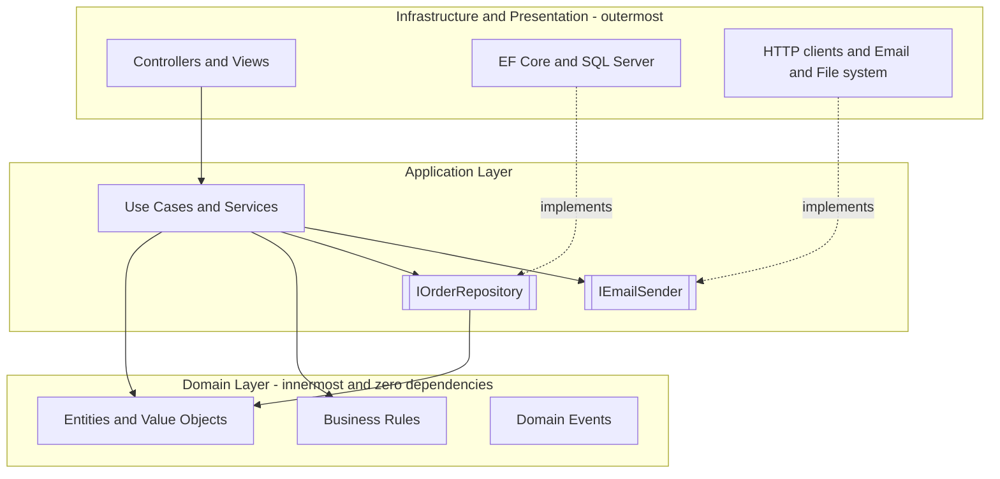
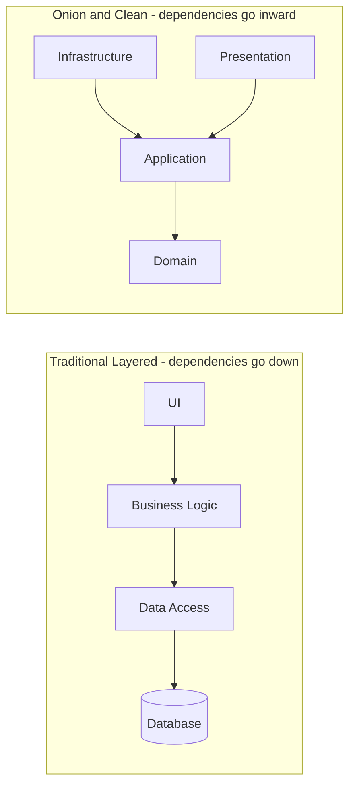

Layered architecture groups code by responsibility and defines which groups may depend on which. Traditional layering points dependencies downward, usually from presentation through business logic to data access. Onion and Clean variants reverse selected edges so infrastructure depends on inner policy. The useful part is the boundary: business rules stop drifting into controllers and persistence code.

# Layer Responsibilities

A common four-layer split looks like this:

| Layer | Responsibility | Examples |
|-------|---------------|---------|
| **Presentation** | Handle input, render output | ASP.NET Core controllers, Razor views, Blazor components |
| **Application** | Orchestrate use cases, coordinate domain + infrastructure | Service classes, CQRS handlers, DTOs |
| **Domain** | Business rules, entities, invariants | Entities, value objects, domain events, domain services |
| **Infrastructure** | Technical details: persistence, messaging, external APIs | EF Core `DbContext`, HTTP clients, email senders |

# Dependency Rule

In an inward-facing layered design, the Domain knows nothing about databases, frameworks, or UI. Infrastructure implements interfaces owned by inner layers. Traditional N Layer uses a different rule, shown in the next comparison: dependencies move down the stack, often including a business-layer dependency on data access.



# Traditional Vs Onion/Clean



Traditional layering makes the business layer a client of the data-access layer. A change to that lower layer's public contract can therefore ripple upward, even when the database engine itself remains hidden. Onion and Clean designs invert ownership of the boundary: an inner layer defines the persistence capability it needs, and Infrastructure implements it. Database-specific changes can then stay behind the adapter.

# Layered, Hexagonal, Onion, and Clean

These names overlap, but they are not synonyms. Layered architecture is the broad structure. Hexagonal, Onion, and Clean describe stronger ways to protect policy from outer details.

- **Traditional layered (N Layer)** uses a top-down chain: UI → Business → Data. It is easy to read, but the business layer remains a client of data access.
- **Hexagonal (Ports and Adapters, Alistair Cockburn)** separates the application from outside actors. The application exposes or consumes **ports**, and adapters connect HTTP, persistence, tests, or other technologies. The `IOrderRepository` and `IEmailSender` interfaces in the diagrams are ports.
- **Onion (Jeffrey Palermo)** draws dependencies as concentric rings with the domain model at the center. Outer infrastructure depends on inner interfaces.
- **Clean (Robert C. Martin)** names the rings Entities, Use Cases, Interface Adapters, and Frameworks, then applies the Dependency Rule across every boundary.

The choice is less about diagram shape than the dependency contract the code actually enforces. [[Software Architecture/Application Architecture/Clean Architecture]] covers the most explicit inward rule. The same module-boundary discipline also matters inside a [[Software Architecture/System Architecture/Modular Monolith]], where compile-time references determine whether modules remain independent.

# .NET Example

```csharp
// Domain layer — no dependencies on EF Core or ASP.NET
public class Order
{
    public int Id { get; private set; }
    public Money Total { get; private set; } = Money.Zero;

    public void AddItem(Product product, int quantity)
    {
        // Business rule: enforce invariants here
        if (quantity <= 0) throw new DomainException("Quantity must be positive");
        Total = Total.Add(product.Price.Multiply(quantity));
    }
}

// Application layer — depends on domain + abstractions
public class PlaceOrderHandler(IOrderRepository orders, IEmailSender email)
{
    public async Task HandleAsync(PlaceOrderCommand cmd, CancellationToken ct)
    {
        var order = new Order();
        foreach (var item in cmd.Items)
            order.AddItem(item.Product, item.Quantity);

        await orders.SaveAsync(order, ct);
        await email.SendConfirmationAsync(cmd.CustomerEmail, order, ct);
    }
}

// Infrastructure layer — implements application abstractions
public class EfOrderRepository(AppDbContext db) : IOrderRepository
{
    public async Task SaveAsync(Order order, CancellationToken ct)
        => await db.Orders.AddAsync(order, ct);
}
```

This sketch only stages the entity in EF Core. A complete transaction or Unit of Work must call `SaveChangesAsync(ct)` before sending the external confirmation. Otherwise the email can describe an order that was never committed.

# Pitfalls

**Anemic domain model.** Service classes accumulate the rules while Domain objects become data bags. The project references may be correct, yet there is little policy at the center for the architecture to protect.

**Layer bypass.** A controller that calls repositories directly now coordinates application behavior at the HTTP boundary. Either route the operation through an application use case or remove the unused layer. A ceremonial boundary is worse than an honest, smaller structure.

**Over-engineering small apps.** Four projects and an interface for every class add ceremony to a three-endpoint CRUD API. A thin structure is enough until behavior becomes complex enough to need isolation.

# Questions

> [!QUESTION]- What is the difference between traditional layered and Onion/Clean Architecture?
> Traditional layering points from UI to Business Logic to Data Access, so the business layer consumes the lower data API. Onion and Clean move the persistence contract inward and make Infrastructure implement it. Both separate responsibilities. Only the inward form prevents source dependencies from pulling infrastructure types into policy.

# References

- [Common web application architectures](https://learn.microsoft.com/en-us/dotnet/architecture/modern-web-apps-azure/common-web-application-architectures)
- [Onion Architecture](https://jeffreypalermo.com/2008/07/the-onion-architecture-part-1/)
