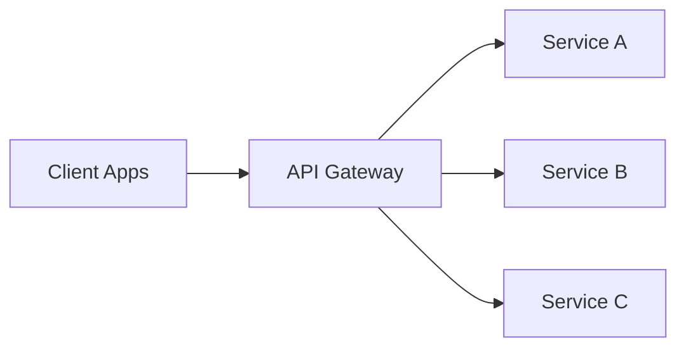

A client sends `GET /orders/42` to one public endpoint. The API gateway terminates TLS, authenticates the caller, checks the route quota, selects the Orders service, and forwards the request with its deadline and trace context. Clients no longer need internal service addresses or a separate authentication and throttling implementation for every backend.

That consistency costs another network hop and another component that can reject or delay every request. In a .NET system the gateway is often a reverse proxy such as YARP. It may shape a response, but the Orders service still decides whether an order can be refunded and the Inventory service still decides which reservation wins.

# What Happens Before a Request Reaches a Service



- **Request routing:** match the host, path, headers, or method to a downstream service.
- **Authentication and authorization:** validate credentials and reject requests that fail coarse route policy.
- **Rate limiting and quotas:** stop one caller from exhausting shared downstream capacity.
- **Request and response transformation:** adapt an external contract without exposing internal endpoint churn.
- **[[Software Architecture/Distributed Systems/Load Balancing]]:** choose a healthy instance within the selected service.
- **[[Software Architecture/Patterns/Resilience Patterns/Circuit Breaker|Circuit breaking]] and retry policy:** stop waiting on a failed dependency and retry only when replay is safe.
- **TLS termination:** keep certificate and HTTPS policy at the edge rather than copying it into every service.
- **[[DevOps/Observability]]:** attach correlation context and record the edge view of latency and failures.

## How `GET /mobile/orders/42` Fans Out

For `GET /mobile/orders/42`, the edge path is concrete:

1. Terminate TLS and enforce request-size and protocol limits.
2. Authenticate the caller and apply a coarse-grained route policy.
3. Rate-limit by tenant or credential before consuming downstream capacity.
4. Route to `Orders`, or fan out to `Orders`, `Payments`, and `Shipping` when the endpoint owns a mobile projection.
5. Propagate trace and cancellation context. Cap every downstream timeout inside the client deadline.
6. Return a complete, explicitly partial, or failed response. A missing dependency must never disappear silently.

Routing and edge policy are ordinary gateway work. Composition is a separate choice because it concentrates latency and downstream failure in one request path. Caching and retries add still more state. If a response needs three independent dependencies that are each 99.9% available, the combined path is less available than any one of them unless partial results are valid.

## Reverse Proxy, Gateway, and Load Balancer Capability Overlap

![[Assets/Software Architecture/Software Architecture-API Gateway-18120000-1.png]]

The image describes roles rather than exclusive product categories. NGINX, Envoy, YARP, and managed gateways can cover more than one column.

| Capability | Reverse proxy | API gateway | Load balancer |
|---|---|---|---|
| Hide backend addresses and terminate TLS | Common | Common | Common for proxy load balancers |
| Route by host, path, or header | Common at L7 | Core | L7 only |
| Auth, quotas, API keys, contract lifecycle | Possible with modules | Core | Usually outside scope |
| Compose multiple APIs | Possible in custom code | Optional | Outside scope |
| Health-aware distribution across equivalent instances | Possible | Often delegated or built in | Core |

The deployment shape defines the blast radius. A global edge proxy can affect every route. A domain gateway can fail only one group of APIs, while a per-service load balancer sits in front of one replica pool. The product name alone does not reveal how much traffic one deployment can interrupt.

# When the Gateway Does More Than Route

## One Public Route Maps to One Service

Clients call one host. Route rules then dispatch the request to an internal service after the edge policy passes. This works well when:

- backend services remain private.
- access and throttling policy must be consistent.
- the public API needs to evolve independently from internal addresses.

## One Client Request Fans Out

Aggregation trades server-side fan-out for fewer client round trips. For example, a mobile order page may need data from `Orders`, `Payments`, and `Shipping`. The gateway can call those services in parallel and return one screen-shaped payload.

That code should remain response-oriented. It may combine reads and describe a partial result. It should not decide how an order changes state.

## Transport Work Stops at the Edge

Offloading keeps transport policy at the boundary: TLS, compression, CORS, header normalization, and request-size limits. Services then receive traffic that already satisfies the edge contract, and one policy deployment can cover every route behind that gateway.

## A BFF Follows One Client

Separate gateways or route sets by client only after their needs have clearly diverged. Payload shape may be enough. Separate release schedules or teams can also force the split. A mobile checkout BFF, for example, can fetch order, inventory, loyalty, and payment-method data in parallel and return a payload sized for a constrained network.

Domain decisions still belong to the owning service. `CanRefundOrder` does not belong in a client adapter, because that would let mobile and web acquire different refund rules.

## Netflix API Evolution: Aggregation to Federation

![[Assets/Software Architecture/Software Architecture-API Gateway-18120000.png]]

The visual compresses several distinct systems into one evolution story. With federation, domains own their schema contributions and resolver behavior. A shared registry checks whether those contributions compose, and the graph gateway executes the resulting plan.

Federation does not remove network cost. A query that crosses five subgraphs can still produce fan-out latency or an N+1 call pattern. Query limits and tracing make that cost visible. Batching may reduce it. A BFF follows a client, while federation follows domain ownership. Stacking both only makes sense when each layer has a distinct job and a measured benefit.

# Routing with YARP

YARP supplies the proxy mechanics through ASP.NET Core: routes, destination clusters, transforms, and health-aware selection.

```csharp
var builder = WebApplication.CreateBuilder(args);

builder.Services
    .AddReverseProxy()
    .LoadFromConfig(builder.Configuration.GetSection("ReverseProxy"));

var app = builder.Build();
app.MapReverseProxy();
app.Run();
```

```json
{
  "ReverseProxy": {
    "Routes": {
      "orders": {
        "ClusterId": "orders-cluster",
        "Match": { "Path": "/api/orders/{**catch-all}" },
        "Transforms": [{ "PathRemovePrefix": "/api" }]
      }
    },
    "Clusters": {
      "orders-cluster": {
        "Destinations": {
          "orders-a": { "Address": "https://orders.internal/" }
        }
      }
    }
  }
}
```

YARP does not add authentication or authorization by default. When the host configures them, authentication runs before proxying and authorization follows route or endpoint metadata. Trace context continues downstream, but bearer tokens and request bodies stay out of default logs. Edge rate limits protect client-facing capacity. Destination health should eject one bad instance rather than hide a fleet-wide failure. Retries are limited to replayable requests. An uncertain `POST` needs an end-to-end idempotency contract.

YARP is one implementation, not the pattern. Payment state and inventory invariants remain in their domain services regardless of which proxy sits at the edge.

# The Gateway Handles Ingress; the Mesh Handles Service Traffic

An API gateway and a service mesh govern different traffic planes, so they commonly coexist.

- **Gateway (north-south):** handles traffic entering from clients, including public API exposure and edge access policy.
- **Service mesh (east-west):** handles traffic between internal services, including mTLS and traffic shifting.

The gateway applies rules to traffic entering the system. The mesh applies rules to calls between services. Retries need one configured layer: two gateway attempts multiplied by three mesh attempts can send six calls to the same dependency.

# What the Extra Hop Buys

- **Direct calls or a gateway:** direct calls save one hop, but clients inherit service discovery and repeat edge policy.
- **One gateway or several BFFs:** one gateway is easier to operate. BFFs earn their cost when client contracts or ownership genuinely differ.
- **Gateway transformation or service-owned contracts:** a thin transform can shield clients from endpoint churn. A growing translation layer usually signals a poor service boundary.

# How Gateways Become Bottlenecks

1. **The gateway becomes a monolith.** Every feature enters one deployment, so a small change can affect all consumers. Keep the edge stateless and split it only after different teams or traffic patterns need independent releases and scaling.

2. **Business logic moves to the edge.** Aggregation slowly becomes orchestration, then starts making domain decisions. The gateway owns transport policy and response shaping. The service owns its invariants.

3. **The extra hop hides tail latency.** Serialization and downstream calls accumulate at p95 and p99, especially under fan-out. End-to-end traces should expose each child call. Cap fan-out depth and use a cache only when its freshness contract is explicit.

4. **Nobody is accountable for a route group.** Conflicting rules or accidental exposure follow when changes have no reviewing team. Validate configuration in CI and require each public route group to name the team that approves and operates it.

# References

- [Gateway Routing pattern](https://learn.microsoft.com/azure/architecture/patterns/gateway-routing)
- [YARP documentation](https://learn.microsoft.com/aspnet/core/fundamentals/servers/yarp/getting-started)
- [Backends for Frontends](https://samnewman.io/patterns/architectural/bff/)
