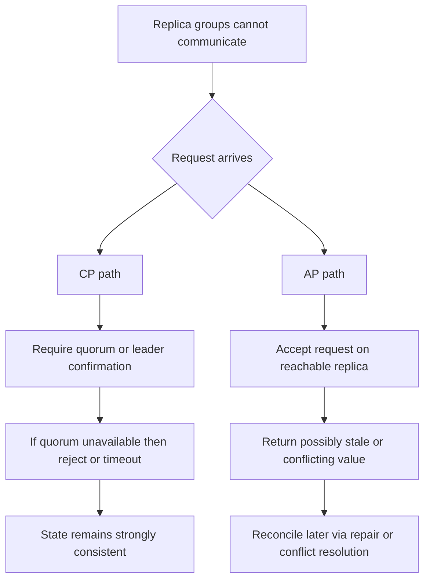

CAP describes the choice forced by a network partition. A replicated data system can preserve **strong consistency** or guarantee a non-error response in finite time to every request received by a non-failing node, but it cannot guarantee both while the replicas cannot communicate.

A partition is a partial failure. Some nodes are still running and can receive requests, yet messages between groups are lost or delayed long enough that neither side can know the other's current state. CAP is therefore a way to define failure behavior for each operation: reject work whose correctness cannot be proved, or accept it and reconcile divergent state later.

# What CAP Actually Means

## Definitions in Operational Terms

- **Consistency (C):** every successful read observes the most recent successful write, as if one current value existed. Otherwise the operation returns an error. This is linearizability, not the constraint-preservation meaning of C in [[Data Persistence/ACID]].
- **Availability (A):** Every request received by a non-failing node must receive a non-error response in finite time.
- **Partition tolerance (P):** consistency and availability guarantees are evaluated while the network may lose an arbitrary number of messages between nodes.

"Pick any two" is the wrong mental model for a replicated system. Once replicas communicate over a network, partitions are part of the failure model. During one, the actual choice is:

- preserve **C** by rejecting or delaying operations that cannot be coordinated.
- preserve **A** by responding from reachable state and accepting possible staleness or conflict.

Outside the partition window, the same system may provide both properties. CAP does not describe ordinary latency or steady-state availability.

# Why Consistency and Availability Diverge During a Partition

Consider two replicas, `R1` and `R2`, that serve the same key.

1. Client writes `x=5` to `R1`.
2. A network partition isolates `R1` from `R2`.
3. Another client reads from `R2`.

If `R2` answers, it may return the old value `x=4`. That preserves availability and breaks linearizability. If it waits for `R1` or refuses the read, it protects consistency by making this request path unavailable.

No local test can tell `R2` whether `R1` is unreachable or merely slow. Without communication, it cannot always answer and also prove that its value is current.

# CP Vs AP With Concrete Systems

## CP Behavior (Consistency First During a Partition)

Coordination services such as ZooKeeper or etcd commonly take this posture. Majority-quorum relational deployments can do the same for protected operations.

- A leader or quorum must confirm a protected write.
- A node without that confirmation rejects or delays the write.
- Linearizable reads may also require leader or quorum contact.

The system avoids split-brain writes, which is the right trade for locks and leader election. The isolated side stops serving some operations. Its rule is blunt: an unprovable write is rejected.

## AP Behavior (Availability First During a Partition)

The original Amazon Dynamo design is the standard example. Some Cassandra configurations and other multi-writer topologies can also accept work through reachable replicas.

- Reachable replicas accept a write without full coordination.
- Versions may diverge during the partition.
- Repair and conflict policy reconcile them later.

Traffic continues, but clients may observe stale data or the result of conflict resolution. Accepting the write is only half the design. The other half is a deterministic repair rule.

# CAP Is About Partition Time, Not Normal Time

A CP system can look consistent and available while its quorum is healthy. An AP system can also look fully current when replication is fast. CAP constrains the failure window, not the happy path. The useful design question is what each operation does when the network splits.

## Partition-time Choice and the False CA Option

| Partitioned operation | Preserve CAP consistency | Preserve CAP availability |
|---|---|---|
| `ReserveInventory` cannot reach a quorum | Reject or wait. Do not confirm an unprovable reservation | Accept locally and reconcile competing reservations later |
| `GetRecommendations` loses the fresh replica | Reject rather than return stale data | Return a reachable replica's stale result |

"CA" is not a third partition-time mode for replicated data. If both isolated sides answer, neither can learn the other's latest write or prove that its own value is current. A single-node database can be consistent and normally available while reachable, but there is no second replica to continue through a network split.

CAP availability is stricter than an uptime SLO. Every request to every non-failed node must receive a non-error response in finite time. A service may still meet `99.99%` monthly uptime while rejecting a small set of partitioned writes. Those operations are CP even though the service is not considered down by its operational dashboard.

# Normal-time Tradeoffs

CAP covers partition-time behavior. PACELC adds the ordinary case: after choosing availability or consistency under partition, a system still trades latency against consistency while the network is healthy. Database configuration affects both. Classify the operation and its selected consistency level instead of assigning one `CP` or `AP` label to a product.

| Operation | Correctness requirement | Reasonable posture |
| --- | --- | --- |
| Reserve inventory | Do not confirm overlapping reservations | Quorum or leader confirmation. Reject when safety cannot be proved |
| Read product recommendations | A stale result is acceptable | Read a nearby replica and repair asynchronously |
| Read own profile after update | The user should see their write | Session guarantee without global linearizability |
| Append a ledger entry | Preserve ordering and uniqueness | Strong write coordination, idempotency, and an authoritative store |

Product names do not settle these choices. SQL Server Availability Groups with synchronous commit favor consistency for protected writes, but failover mode and read routing change the behavior. Cosmos DB exposes several consistency levels. Cassandra quorum values and topology determine which replicas must overlap. Redis used as a cache often tolerates staleness because an authoritative database remains the source of truth. The architecture record needs the actual topology, quorum, read mode, region, and fallback policy.

In a multi-region profile service, a write can go to the primary region and return a session token. The next read carries that token, giving the same client read-your-writes without waiting for every region. Anonymous recommendation reads may use the nearest replica with a five-minute freshness budget. One product now makes two different consistency choices because the operations protect different things.

# Pitfalls

## Pitfall 1: Treating CAP as "Pick Two of Three"

This framing suggests that a replicated system can permanently choose C and A while ignoring P. The network makes that choice unavailable. State the partition policy instead: which operations reject work to preserve consistency, and which keep serving with a repair rule.

## Pitfall 2: Treating CAP Choice as System-wide and Static

An architecture labeled entirely `CP` or `AP` hides operation-level decisions. A ledger append and a recommendation read have different correctness budgets. Record the invariant and allowed stale window for each path.

## Pitfall 3: Ignoring Reconciliation Design in AP Paths

An AP write path without a conflict strategy merely postpones the failure. Duplicate orders or lost preference updates surface later, after both writes were acknowledged. Define the merge rule, [[Software Architecture/Distributed Systems/Idempotency|idempotency keys]], version metadata, and repair telemetry before accepting partitioned writes.

# References

- [Towards Robust Distributed Systems](https://people.eecs.berkeley.edu/~brewer/cs262b-2004/PODC-keynote.pdf)
- [Brewer's Conjecture and the Feasibility of Consistent, Available, Partition-Tolerant Web Services](https://doi.org/10.1145/564585.564601)
- [Consistency Tradeoffs in Modern Distributed Database System Design](https://www.cs.umd.edu/~abadi/papers/abadi-pacelc.pdf)
