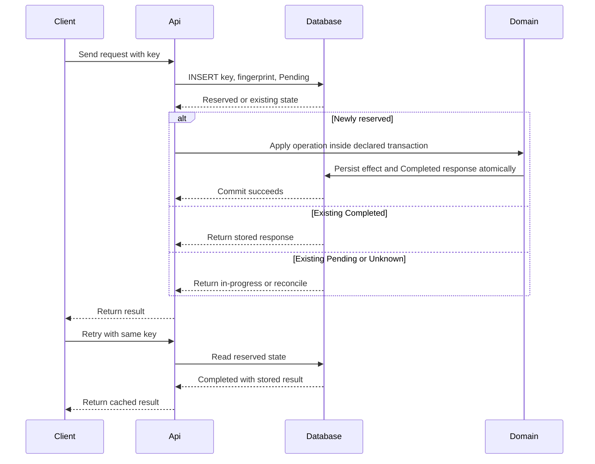

Idempotency means applying the same logical operation multiple times produces the same final state as applying it once. In distributed systems this is not optional because retries, timeouts, dropped acknowledgments, and at least once delivery are normal operating conditions, not edge cases. You reach for idempotency on any retriable operation such as API writes, message consumers, payment captures, and order creation. Without it, retries become dangerous and can double charge customers, create duplicate orders, or drift state across services.

# Mechanism

Idempotency is implemented at the boundary where duplicates can enter the system, then reinforced at persistence boundaries so duplicates cannot corrupt state.

## Natural idempotency

- `SET balance = 100` is idempotent because repeating it keeps the same result.
- `INCREMENT balance by 100` is not idempotent because each retry changes state again.
- HTTP `PUT` and `DELETE` are idempotent by semantics.
- HTTP `POST` is not idempotent by default because each call usually creates a new server side effect.

## Idempotency keys

For non-idempotent operations, the client sends a unique key per logical operation in `Idempotency-Key`.

Server flow:

1. Read `Idempotency-Key`.
2. Lookup key in a durable store.
3. If key exists and request fingerprint matches, return stored response.
4. If the key does not exist, atomically insert `Pending` with the request fingerprint.
5. Apply the domain effect and transition `Pending -> Completed(response)` in one declared transaction when both live in the same database.
6. If the effect crosses a resource boundary, persist an explicit intermediate or unknown state and use that resource's own idempotency/reconciliation contract.

This turns ambiguous network outcomes into deterministic behavior for retries.

## Database level techniques

- **UPSERT**: `INSERT ... ON CONFLICT DO UPDATE` protects read model and projection handlers from duplicate writes.
- **Unique constraints**: enforce one row per business identity such as `merchant_id + client_operation_id`.
- **Conditional updates**: optimistic concurrency like `UPDATE ... WHERE version = @expectedVersion` prevents repeated stale updates from silently overwriting new state.

```sql
CREATE TABLE payments (
    payment_id UUID PRIMARY KEY,
    merchant_id UUID NOT NULL,
    client_operation_id TEXT NOT NULL,
    amount_cents BIGINT NOT NULL,
    status TEXT NOT NULL,
    version INT NOT NULL,
    created_utc TIMESTAMPTZ NOT NULL,
    UNIQUE (merchant_id, client_operation_id)
);
```



Idempotency is especially important for [[Software Architecture/Distributed Systems/Message Queues/Message Queues|Message Queues]] consumers and for multi step workflows like [[Software Architecture/Distributed Systems/Distributed Transactions]] where partial failures are expected.

# HTTP Methods and Idempotency

- **Idempotent by spec**: `GET`, `PUT`, `DELETE`, `HEAD`, `OPTIONS`.
- **Not idempotent by default**: `POST`, `PATCH`.

Interview critical distinction:

- `PUT` is idempotent because it replaces the representation with a full target state.
- `PATCH` applies a delta, and applying the same delta repeatedly can compound side effects unless the patch document itself is designed to be idempotent.

Even with idempotent methods, distributed replicas can still show temporary divergence depending on [[Software Architecture/Distributed Systems/Consistency Models]], so method semantics and system consistency level are separate concerns.

# Payment implementation boundary

Payment endpoints need a durable local attempt and a provider that honors the same idempotency key. The provider call must run outside local database transactions, and timeouts must be represented as unknown outcomes rather than rolled-back evidence. [[Software Architecture/Distributed Systems/Payment Systems#Durable Idempotency|Payment Systems]] owns the complete reserve-call-reconcile sequence and the narrow effect guarantee.

# Common Applications

| Case | Operation identity | Duplicate effect to prevent | Dedupe and atomic boundary | Returned result | Retention |
|---|---|---|---|---|---|
| Public API `POST` | Tenant + endpoint + `Idempotency-Key` + request hash | Two resources or external calls | Unique key record committed before the operation; store completion with response | Replay the original status and body; reject same key with different hash | At least the documented client retry window |
| Payment charge | Merchant + payment attempt ID | Double charge | Local payment-attempt row plus the same provider idempotency key | Same payment ID and terminal/pending state | Through charge, dispute, and reconciliation horizon |
| Order command | Order ID + command ID | Duplicate state transition or inventory reservation | Inbox row and order transition in one transaction | Existing order version and outcome | Longer than broker redelivery and replay retention |
| Account balance | Account + ledger entry ID | Double credit or debit | Unique immutable ledger entry in the ledger transaction | Existing ledger entry and resulting balance/version | Permanent financial record |
| Database import | Source dataset + source row/version | Duplicate entity or repeated update | Unique source identity or upsert constraint with version check | Existing/upserted entity identity | Source replay and backfill horizon |
| Message consumer | Subscriber + event ID | Repeated email, shipment, or projection update | Consumer inbox and business write in one transaction; acknowledge afterward | Usually acknowledgement; optionally stored processing outcome | Broker retention plus operational replay window |

HTTP method semantics are only a starting point. `PUT` and `DELETE` are idempotent in the protocol's intended effect, but triggers, audit events, and external calls can still repeat unless the implementation shares an operation identity and atomic boundary. `POST` can be made idempotent with a key and stored result. Retention is part of the guarantee: deleting the key before a late retry makes the same request new again.

# Pitfalls

## Message handlers not idempotent under at least once delivery

- **What goes wrong**: duplicate events apply side effects multiple times, such as multiple shipment records.
- **Why it happens**: brokers redeliver when ack is lost or consumer crashes after processing.
- **How to avoid it**: persist processed message ids, use upserts, and make handlers safe to replay.

## Idempotency key scope set incorrectly

- **What goes wrong**: broad scope blocks legitimate operations or narrow scope fails to deduplicate retries.
- **Why it happens**: key design ignores tenant and operation boundaries.
- **How to avoid it**: scope keys by business boundary like tenant plus operation id and enforce payload hash checks.

## Check then process race window

- **What goes wrong**: two concurrent duplicates both pass pre check and both charge.
- **Why it happens**: non atomic check then execute logic without a uniqueness barrier.
- **How to avoid it**: move gate into atomic insert or unique constraint with transaction and conflict handling.

## Idempotent is not safe

- **What goes wrong**: teams assume idempotent operations have no side effects.
- **Why it happens**: confusion between HTTP safe and HTTP idempotent semantics.
- **How to avoid it**: remember `DELETE` is idempotent but still mutates state and can require authorization and auditing.

# Tradeoffs

| Approach | Benefit | Cost | Use when |
|---|---|---|---|
| Idempotency key in application layer | Works for non idempotent `POST` and external side effects, returns exact prior response | Requires durable key store, TTL cleanup, response caching, and payload hash validation | Public APIs and payment workflows where clients retry on timeout |
| Database constraints and UPSERT | Strong deduplication at data boundary, simple correctness model | Does not by itself replay exact HTTP response and may not cover external calls already made | Duplicate creation risk is mostly within one database boundary |
| Conditional updates with optimistic concurrency | Prevents stale duplicate writes from overwriting fresh state | Requires version columns and explicit conflict handling in callers | State transitions where repeated updates must enforce expected version |

Decision rule: start with database uniqueness for core entities, add idempotency keys for externally visible `POST` operations and third party side effects, then use optimistic concurrency for high contention aggregate updates.

# Questions

> [!QUESTION]- Why is idempotency essential for reliable retry strategies, and what happens without it?
>
> - Retries are a certainty in distributed systems because clients cannot always distinguish failure from delayed success.
> - Idempotency converts ambiguous outcomes into deterministic behavior, so retries do not amplify side effects.
> - Without it, transient faults become correctness bugs such as duplicate charges or duplicate shipment commands.
> - Idempotency also improves operational recovery because replay jobs and dead letter reprocessing become safe.
> - Stronger idempotency guarantees cost extra storage, key lifecycle management, and stricter request validation.

> [!QUESTION]- How do you implement idempotency for a payment endpoint that processes charges through a third party provider?
> Reserve a durable local attempt, commit, then call a provider that honors the same key outside the database transaction. A timeout becomes an unknown outcome that is reconciled with the same provider key; it is not evidence that no charge happened. [[Software Architecture/Distributed Systems/Payment Systems#Durable Idempotency|Payment Systems]] contains the complete sequence and its boundary-specific guarantee.

# References

- [Stripe API docs Idempotent requests](https://docs.stripe.com/api/idempotent_requests) - Anchor source with concrete semantics for key reuse, result caching, TTL, and retry behavior.
- [Stripe engineering blog Designing robust and predictable APIs with idempotency](https://stripe.com/blog/idempotency) - Practitioner writeup on failure modes and retry design tradeoffs from production payment APIs.
- [Microsoft Learn Recommendations for handling transient faults](https://learn.microsoft.com/azure/well-architected/design-guides/handle-transient-faults#implementing-retries) - Reliability guidance that explicitly calls out idempotency as prerequisite for safe retries.
- [Microsoft Learn Data platform for mission critical workloads on Azure idempotent message processing](https://learn.microsoft.com/azure/architecture/reference-architectures/containers/aks-mission-critical/mission-critical-data-platform#idempotent-message-processing) - Practical cloud architecture guidance for dedup in at least once messaging.
- [Chris Richardson Idempotent Consumer pattern](https://microservices.io/post/microservices/patterns/2020/10/16/idempotent-consumer.html) - Practitioner pattern for implementing duplicate safe message handlers.
- [IETF RFC 9110 HTTP Semantics](https://www.rfc-editor.org/rfc/rfc9110.html#name-idempotent-methods) - Protocol level definition of idempotent methods and their intended behavior.
- [Top cases to apply idempotency](https://github.com/ByteByteGoHq/system-design-101/blob/b28380a4710c5ec9638ec037d4168e288f334cba/data/guides/top-6-cases-to-apply-idempotency.md) - ByteByteGo provenance for the application matrix; its incorrect HTTP-method visual was rejected.
