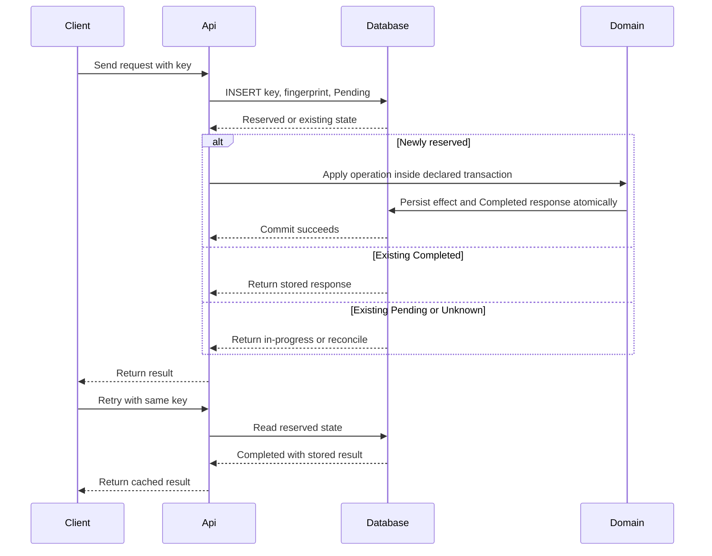

An operation is idempotent when repeating the same logical request has the same intended effect as applying it once. Distributed systems need this property because a timeout hides whether an operation failed or succeeded and its acknowledgement was lost. Safe retries require a stable operation identity, durable duplicate detection, and an atomic boundary around the protected effect.

# Recording One Durable Effect

Idempotency belongs where duplicates enter the system and where the effect becomes durable. An in-memory check on one server is insufficient because concurrent requests or another instance can pass it.

## Natural Idempotency

- `SET balance = 100` is idempotent because repeating it keeps the same result.
- `INCREMENT balance by 100` is not idempotent because each retry changes state again.
- HTTP `PUT` and `DELETE` have idempotent intended effects by protocol semantics.
- HTTP `POST` has no idempotency guarantee unless the application adds one.

## Idempotency Keys

For an operation that is not naturally idempotent, the client sends one `Idempotency-Key` for the logical request and reuses it on every retry. Reusing a key with a different payload is a conflict, not a new operation.

Server flow:

1. Read `Idempotency-Key` and compute the request fingerprint.
2. Look up the key in a durable store.
3. For an existing key, compare fingerprints and reject a mismatch.
4. Replay the stored response for `Completed`.
5. For `Pending`, wait or return an in-progress response according to the API contract. Do not apply the effect again.
6. For `Unknown`, reconcile through the downstream resource's operation identity before deciding the result.
7. If the key does not exist, atomically insert `Pending` with the fingerprint.
8. Apply the domain effect and transition `Pending -> Completed(response)` in one declared transaction when both live in the same database. Effects that cross a resource boundary require an explicit intermediate or `Unknown` state.

The stored state turns an ambiguous timeout into a deterministic retry result. `Pending` still needs an expiry or reconciliation policy because a process may fail after reserving the key.

## Database-level Techniques

- **UPSERT:** `INSERT ... ON CONFLICT DO UPDATE` makes projection or import writes replayable when the update itself is stable.
- **Unique constraint:** one row per business identity, such as `merchant_id + client_operation_id`, closes the concurrent check-then-insert race.
- **Conditional update:** `UPDATE ... WHERE version = @expectedVersion` rejects a stale transition instead of silently overwriting newer state.

```sql
CREATE TABLE payments (
    payment_id UUID PRIMARY KEY,
    merchant_id UUID NOT NULL,
    client_operation_id TEXT NOT NULL,
    amount_cents BIGINT NOT NULL,
    status TEXT NOT NULL,
    version INT NOT NULL,
    created_utc TIMESTAMPTZ NOT NULL,
    UNIQUE (merchant_id, client_operation_id)
);
```


```mermaid
sequenceDiagram
    participant Client
    participant Api
    participant Database
    participant Domain
    Client->>Api: Send request with key
    Api->>Database: INSERT key, fingerprint, Pending
    Database-->>Api: Reserved or existing state
    alt Newly reserved
        Api->>Domain: Apply operation inside declared transaction
        Domain->>Database: Persist effect and Completed response atomically
        Database-->>Api: Commit succeeds
    else Existing Completed
        Database-->>Api: Return stored response
    else Existing Pending or Unknown
        Database-->>Api: Return in-progress or reconcile
    end
    Api-->>Client: Return result
    Client->>Api: Retry with same key
    Api->>Database: Read reserved state
    Database-->>Api: Completed with stored result
    Api-->>Client: Return cached result
```

The same reservation-and-commit pattern applies to [[Software Architecture/Distributed Systems/Message Queues/Message Queues|Message Queues]] consumers and multi-step [[Software Architecture/Distributed Systems/Distributed Transactions]], where redelivery and partial failure are normal.

# HTTP Methods and Idempotency

- **Idempotent by specification:** `GET`, `HEAD`, `OPTIONS`, `TRACE`, `PUT`, `DELETE`.
- **No general idempotency guarantee:** `POST`, `PATCH`, `CONNECT`.

`PUT` usually replaces a representation with a target state, so repeating it has the same intended effect. A `PATCH` document may assign a stable value or apply a compounding delta. Its semantics decide whether repetition is safe.

Protocol semantics do not guarantee immediate visibility. Replicas can still diverge under weaker consistency models, so method idempotency and read consistency remain independent properties.

# Durable Attempts Around an External Payment Call

Payment endpoints need a durable local attempt and a provider that honors the same key. The provider call runs outside the local database transaction. A timeout records an unknown outcome, not evidence that the charge failed.

# Common Applications

| Case | Operation identity | Duplicate effect to prevent | Dedupe and atomic boundary | Returned result | Retention |
|---|---|---|---|---|---|
| Public API `POST` | Tenant + endpoint + `Idempotency-Key` + request hash | Two resources or external calls | Unique key record committed before the operation. Store completion with response | Replay the original status and body. Reject same key with different hash | At least the documented client retry window |
| Payment charge | Merchant + payment attempt ID | Double charge | Local payment-attempt row plus the same provider idempotency key | Same payment ID and terminal/pending state | Through charge, dispute, and reconciliation horizon |
| Order command | Order ID + command ID | Duplicate state transition or inventory reservation | Inbox row and order transition in one transaction | Existing order version and outcome | Longer than broker redelivery and replay retention |
| Account balance | Account + ledger entry ID | Double credit or debit | Unique immutable ledger entry in the ledger transaction | Existing ledger entry and resulting balance/version | Permanent financial record |
| Database import | Source dataset + source row/version | Duplicate entity or repeated update | Unique source identity or upsert constraint with version check | Existing/upserted entity identity | Source replay and backfill horizon |
| Message consumer | Subscriber + event ID | Repeated email, shipment, or projection update | Consumer inbox and business write in one transaction. Acknowledge afterward | Usually acknowledgement. Optionally stored processing outcome | Broker retention plus operational replay window |

HTTP method semantics cover only the intended server effect. Triggers, audit events, and external calls can still repeat unless the operation identity reaches each effect and same-database writes commit atomically. Deleting a key before a late retry makes the request new again.

# Pitfalls

## Message Handlers under At-least-once Delivery

A broker redelivers when an acknowledgement is lost or a consumer crashes after processing. Persist the subscriber and event ID with the business write, then acknowledge after commit. An upsert helps only when every repeated side effect is itself safe.

## Incorrect Key Scope

A global key can block another tenant's legitimate request. A key scoped too narrowly misses a retry through another route. Scope the key to the tenant and logical operation, and reject payload hash mismatches.

## Check-then-process Race

Two concurrent requests can both observe a missing key and perform the effect. An atomic insert or unique constraint must reserve the identity before processing. A separate read followed by an insert leaves the race open.

## Idempotent is Not Safe

Idempotent does not mean read-only. `DELETE` has an idempotent intended effect and still mutates state, so authorization and auditing remain necessary.

# Tradeoffs

| Approach | Benefit | Cost | Use when |
|---|---|---|---|
| Idempotency key in application layer | Makes `POST` and external effects replayable and can return the original response | Requires durable key storage, retention cleanup, response caching, and payload hash validation | Public APIs and payment workflows where clients retry on timeout |
| Database constraints and UPSERT | Strong deduplication at the database, simple correctness model | Does not by itself replay exact HTTP response and may not cover external calls already made | Duplicate creation risk is mostly within one database |
| Conditional updates with optimistic concurrency | Prevents stale duplicate writes from overwriting fresh state | Requires version columns and explicit conflict handling in callers | State transitions where repeated updates must enforce expected version |

Start with database uniqueness for core entities. Add idempotency keys where callers retry externally visible operations, especially `POST` and third-party effects. Use optimistic concurrency when a transition must also prove it was based on the expected version.

# References

- [Idempotent methods in HTTP](https://www.rfc-editor.org/rfc/rfc9110.html#name-idempotent-methods)
- [Stripe idempotent requests](https://docs.stripe.com/api/idempotent_requests)
- [Idempotent Consumer pattern](https://microservices.io/post/microservices/patterns/2020/10/16/idempotent-consumer.html)
