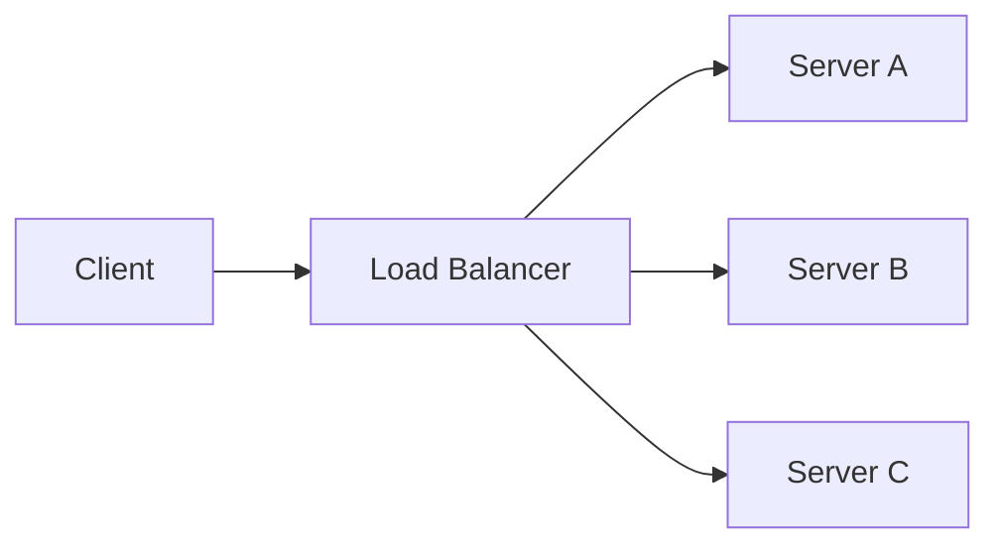

# Intro

Load balancing distributes incoming traffic across multiple service instances so one instance does not become a bottleneck or a single point of failure. In system design interviews, this is usually the first infrastructure building block because it enables [[Horizontal Scaling|horizontal scale]] without changing client behavior. It matters for availability, failure isolation, and predictable latency under burst traffic. Reach for it as soon as a service runs on more than one instance, especially for AI APIs where request cost varies by prompt size and model path.

## Mechanism

Load balancers can operate at different layers, and that layer choice drives what routing decisions are possible.

- **L4 transport layer**
  - Routes using connection metadata such as source and destination IP, port, and protocol.
  - Works for TCP and UDP.
  - Fast and lightweight because it does not parse application payloads.
  - Cannot route by HTTP path, header, host, or cookie.
- **L7 application layer**
  - Understands HTTP and can route by host, path, method, header, or cookie.
  - Supports advanced traffic policies such as canary, A/B, and auth edge checks.
  - Adds processing overhead versus L4.

Practical interview rule: pick L4 for high-throughput generic transport routing, pick L7 when business routing logic depends on request content.

## Algorithms

No single algorithm is best; choose based on workload shape and fairness goals.

Algorithm | How it routes | Prefer when | Main risk
\--- | --- | --- | ---
Round robin | Cycles requests evenly across instances. | Backend instances are similar and request cost is roughly uniform. | Slow instances still get equal share and can queue up.
Weighted round robin | Round robin with per-instance weight multipliers. | Instance sizes differ, such as mixed VM sizes or mixed CPU generations. | Static weights drift from real capacity after noisy-neighbor effects or throttling.
Least connections | Picks the instance with the fewest active connections. | Connection duration varies, such as streaming or long-running AI completions. | Connection count may not reflect CPU or memory cost for short but expensive requests.
IP hash | Deterministically maps client IP to backend. | You need simple affinity without external session storage. | NAT gateways can collapse many users to one IP and create hotspots.
Consistent hashing | Maps keys to a hash ring with minimal remapping when nodes change. | Cache locality, shard affinity, and gradual scale changes matter. | Too few virtual nodes or poor weights can skew ring ownership, and hot keys can still create hotspots even with a balanced ring.
Least latency or least response time | Uses measured latency, often combined with in-flight work. | Backends have variable network or processing time and measurements are timely. | Noisy or stale measurements can chase transient winners and oscillate traffic.
Session affinity | Reuses a cookie or key-to-backend mapping; this is a constraint layered on an algorithm. | A legacy service still holds session state locally. | Reduces failover freedom and can preserve hotspots after capacity changes.

![[Assets/System Design 101/6ffd8fc456eddf8c90190c14b087f823d3a664693903428b8879d65b3c2106fc.png]]

The visual is an orientation map. "Sticky round robin" means affinity over a base algorithm, and IP or URL hashing is not the same as a consistent-hash ring. Whatever algorithm is selected, health eligibility comes first: choose only among ready backends, then apply weights, connection counts, latency, or hashing. A perfect algorithm still routes failures if readiness is wrong.

For AI inference endpoints, request duration and compute cost vary heavily, so pick the algorithm by measuring p95 and p99 latency, error rate, and backend saturation under representative load instead of assuming one default winner.

## Health Checks

Health checks decide whether an instance should stay in the active pool.

- **Active health checks**
  - The load balancer probes endpoints such as `/health/live` and `/health/ready` on a fixed interval.
  - It uses threshold logic, for example three consecutive failures means out of rotation.
  - It can use timeout budgets to detect hung instances.
- **Passive health checks**
  - The load balancer watches real request failures like timeouts and TCP resets, and L7 proxies or gateways can also track elevated HTTP 5xx rates when configured.
  - Useful when synthetic probes pass but real traffic fails.

Typical state transition:

1. Instance fails probes or exceeds passive error thresholds.
2. LB marks it unhealthy and removes it from new request routing.
3. Existing requests are drained, failed, or retried according to policy.
4. Instance must pass recovery criteria before re-entry.

Important implementation point: readiness must reflect whether routing away from this instance can improve service. Check instance-local initialization and selectively check dependencies; a globally shared dependency in every probe can remove the whole fleet at once.

## Cloud load-balancer capability mapping

Select capabilities before provider product names:

| Decision | Options | Consequence |
|---|---|---|
| Protocol layer | L4 TCP/UDP or L7 HTTP | L7 enables content routing and HTTP policy; L4 supports generic transport with less parsing |
| Reachability | Internal or internet-facing | Changes addressing, firewall exposure, and trust boundary |
| Scope | Zonal, regional, or global | Wider scope can improve failover and proximity but adds control-plane and cross-region complexity |
| Data path | Proxy or pass-through/direct server return | Proxy centralizes TLS and observability; pass-through preserves source/data-path properties but exposes more backend responsibility |
| TLS boundary | Terminate, re-encrypt, or pass through | Determines certificate ownership, inspection, and end-to-end encryption |
| Affinity | None, cookie, source hash, or application key | Improves locality but couples sessions to backend availability |

Only then map to a service. Azure Load Balancer is an L4 family with regional public/internal variants and a cross-region global tier; Application Gateway is regional L7, while Front Door is a global HTTP edge. Similar provider names do not imply identical health, source-IP, cross-zone, or failover semantics; verify the selected SKU and test a backend failure.

## Health, routing, TLS, zones, and affinity are separate controls

| Control | Problem solved | Cost introduced |
|---|---|---|
| Active and passive health | Stop routing to failed or degraded instances | Probe traffic, thresholds, and false positive/negative tuning |
| L7 routing | Send hosts, paths, or headers to different pools | HTTP parsing, route configuration, and a larger policy surface |
| TLS termination | Centralize certificates and cryptographic work | Key custody, renewal, and a new plaintext or re-encryption boundary |
| Cross-zone balancing | Use healthy capacity across zones | Inter-zone latency/egress and larger failure coupling |
| Session affinity | Keep a client on one backend | Uneven load, slow draining, and weaker failover |

Do not bundle these under "add a load balancer." For a stateless API, enable health-aware distribution and TLS at the documented trust boundary, leave affinity off, and decide cross-zone routing from failure tests and egress cost. For a stateful legacy application, affinity can be a migration bridge, but shared state is the durable fix.

## .NET health boundary

ASP.NET Core exposes liveness and readiness through health checks, but the signal must match the routing decision. [[NET Health Checks]] contains the focused implementation and explains why a globally shared dependency in every readiness probe can evict the whole fleet during one shared outage.

## Pitfalls

### Sticky sessions can defeat balancing goals

- **What goes wrong**: load concentrates on a subset of instances while others stay underused.
- **Why**: affinity preserves client-to-instance mapping even as traffic patterns change.
- **Mitigation**: externalize session state, shorten affinity TTL, and apply affinity only when strictly required.

### Readiness does not represent routing eligibility

- **What goes wrong**: an instance that cannot serve stays in rotation, or a shared dependency outage evicts every replica.
- **Why**: one `/health` endpoint is used for process restart, routing, and dependency monitoring.
- **Mitigation**: keep liveness dependency-free; make readiness instance-specific and include a dependency only when another replica can serve successfully. Monitor shared dependencies separately.

### Thundering herd when recovering instances

- **What goes wrong**: a recovered instance receives too much traffic too quickly and fails again.
- **Why**: immediate full reintroduction with cold caches and cold code paths.
- **Mitigation**: use slow-start ramp-up, pre-warm caches and model clients, and cap concurrent requests during warmup.

### TLS termination in the wrong place

- **What goes wrong**: security boundaries become unclear or latency increases unexpectedly.
- **Why**: inconsistent decisions between edge termination, re-encryption, and passthrough.
- **Mitigation**: define trust boundaries early, document where certificates live, and use mTLS internally when compliance requires it.

## Tradeoffs

Decision | Option A | Option B | How to choose
\--- | --- | --- | ---
Layer | L4 | L7 | Need content-aware routing and edge features versus lower overhead data-plane routing
Session model | Sticky sessions | Stateless with shared store | Migration speed versus long-term resilience and autoscaling quality
TLS strategy | Terminate at LB | End-to-end encryption to service | Operational simplicity versus stricter east-west security requirements
Health model | Active only | Active plus passive | Simplicity versus better detection of real user-facing failures

## Questions

> [!QUESTION]- How do you pick a load-balancing algorithm for requests with highly variable duration, like AI inference?
> Round robin is the right default when instances are similar and requests cost about the same, but it falls apart when duration varies — exactly the inference case, where one long completion ties up an instance while round robin keeps handing it new work. Least-connections handles that better by routing to the instance with the fewest in-flight requests, which tracks real load when durations are uneven. The catch is that connection count doesn't capture per-request CPU cost, so a few short-but-expensive prompts can still skew it. For inference you validate the choice by measuring p95/p99 latency and backend saturation under representative load rather than trusting any default.

> [!QUESTION]- When do you choose an L4 load balancer over L7?
> L4 balances on connection metadata — IP, port, protocol — without reading the payload, so it's fast and works for any TCP/UDP traffic, but it can't decide based on HTTP path, host, or headers. L7 parses HTTP, so it can route by path or header and do canary, A/B, and edge auth, at the cost of more processing per request. Choose L4 when you need raw throughput and generic transport routing; choose L7 the moment routing depends on request content. Plenty of systems use both — L4 at the edge for raw distribution, L7 deeper for content-aware routing.

> [!QUESTION]- Why must readiness checks differ from liveness checks behind a load balancer?
> They drive different actions. Liveness asks whether the process can make progress and commonly triggers restart, so it stays local and dependency-free. Readiness asks whether this instance should receive new traffic. It can include instance-specific initialization or a dependency failure unique to this replica, but blindly checking a database shared by every replica can evict the entire fleet. Keep shared-dependency health observable and put it in readiness only when routing elsewhere can help.

## References

- [Azure Load Balancer overview](https://learn.microsoft.com/azure/load-balancer/load-balancer-overview) — official docs covering L4 vs L7 load balancing, health probes, and SKU differences in Azure.
- [ASP.NET Core health checks](https://learn.microsoft.com/aspnet/core/host-and-deploy/health-checks) — how to implement health check endpoints that load balancers and orchestrators use for routing decisions.
- [NGINX HTTP load balancing guide](https://docs.nginx.com/nginx/admin-guide/load-balancer/http-load-balancer/) — practical configuration guide for round-robin, least-connections, and IP-hash algorithms in NGINX.
- [Xabaril ASP.NET Core Diagnostics Health Checks](https://github.com/Xabaril/AspNetCore.Diagnostics.HealthChecks) — community library providing health check integrations for databases, message queues, and external services.
- [Google SRE book chapter on handling overload](https://sre.google/sre-book/handling-overload/) — production-grade strategies for load shedding, client-side throttling, and graceful degradation under overload.
- [Azure Front Door overview](https://learn.microsoft.com/en-us/azure/frontdoor/front-door-overview) — official global HTTP edge scope, routing, health probes, and TLS capabilities.
- [AWS Elastic Load Balancing product comparison](https://docs.aws.amazon.com/elasticloadbalancing/latest/userguide/what-is-load-balancing.html) — official distinction among application, network, gateway, and classic load balancers.
- [Google Cloud load balancing overview](https://cloud.google.com/load-balancing/docs/load-balancing-overview) — official mapping of global/regional, internal/external, proxy/pass-through, L4/L7 capabilities.

### ByteByteGo provenance

- [Top load-balancing algorithms](https://github.com/ByteByteGoHq/system-design-101/blob/b28380a4710c5ec9638ec037d4168e288f334cba/data/guides/top-6-load-balancing-algorithms.md) — provenance for the algorithm visual; affinity and hashing caveats are made explicit.
- [Cloud load-balancer cheat sheet](https://github.com/ByteByteGoHq/system-design-101/blob/b28380a4710c5ec9638ec037d4168e288f334cba/data/guides/cloud-load-balancer-cheat-sheet.md) — editorial lead for capability selection; its dated and incorrect provider mapping was rejected.
- [Load-balancer use cases](https://github.com/ByteByteGoHq/system-design-101/blob/b28380a4710c5ec9638ec037d4168e288f334cba/data/guides/load-balancer-realistic-use-cases-you-may-not-know.md) — provenance for separate controls; its unrelated HTTP-status visual was rejected.
