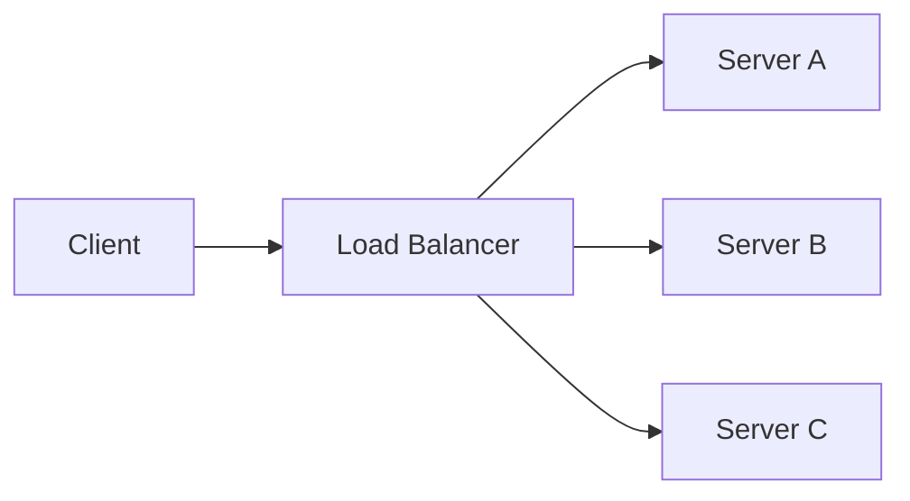

Load balancing assigns each new connection or request to one eligible backend in a replica pool. It gives clients one stable endpoint while the service gains [[Software Architecture/Distributed Systems/Scalability Patterns/Horizontal Scaling|horizontal scale]] and can remove failed replicas from rotation.

It does not create capacity or availability by itself. An overloaded pool remains overloaded, a bad readiness signal can empty the pool, and a single load-balancer instance simply moves the point of failure. The design must cover backend eligibility, routing policy, overload behavior, and failure of the balancing tier.

# Routing Decision

Routing happens in two steps. Health policy first removes destinations that should not receive new work. The balancing algorithm then selects from the remaining pool.

| Layer | Visible input | Useful when | Boundary |
| --- | --- | --- | --- |
| L4 transport | Source and destination address, port, protocol, connection state | Generic TCP or UDP distribution and connection-level routing | Cannot choose by HTTP host, path, header, or cookie |
| L7 application | Parsed HTTP request data | Content routing, canaries, edge authentication, or HTTP policy | Adds protocol processing and makes the balancer part of the application request path |

```mermaid
flowchart LR
    C[Client] --> LB[Load Balancer]
    LB --> A[Server A]
    LB --> B[Server B]
    LB --> D[Server C]
```

L4 is the smaller contract when transport metadata is enough. L7 becomes necessary as soon as the decision depends on HTTP content. A system may use both, for example an L4 edge in front of regional L7 proxies.

# Algorithms

The algorithm encodes an assumption about work. A good choice makes that assumption explicit and tests it against the real request distribution.

Algorithm | How it routes | Prefer when | Main risk
\--- | --- | --- | ---
Round robin | Cycles evenly through the pool. | Instances and request costs are similar. | A slow instance still receives an equal share.
Weighted round robin | Cycles according to configured capacity weights. | Instance sizes differ in a stable, measurable way. | Static weights become stale under throttling or noisy neighbors.
Least connections | Selects the backend with the fewest active connections. | One active connection roughly represents one active request, as with non-multiplexed long-lived streams. | HTTP/2 or gRPC multiplexing and idle keep-alive pools break that proxy.
IP hash | Maps a client address to a backend. | Coarse affinity is required and client addresses are well distributed. | NAT can collapse many clients onto one address and create a hotspot.
Consistent hashing | Maps an application key onto a ring. | Cache locality or shard affinity must survive membership changes. | Uneven tokens and hot keys still skew traffic.
Least latency or least response time | Uses recent response measurements, often with in-flight work. | Backend performance varies and measurements remain fresh. | Delayed signals can make traffic chase a temporary winner.
Session affinity | Constrains future requests to a prior backend. | Local session state must survive during a legacy migration. | Failover weakens and existing hotspots persist.

![[Assets/Software Architecture/Software Architecture-Load Balancing-18120000.png]]

The visual is an orientation map. Sticky round robin is affinity layered over a base algorithm. IP or URL hashing is not a consistent-hash ring. Health eligibility still comes first. No selection policy can compensate for a pool containing backends that cannot serve.

AI inference exposes the weakness of simple proxies for work. Token count, batching, model choice, and cache hits change request cost. Least connections can be a better starting point than round robin only when connections approximate active requests. For multiplexed HTTP/2 or gRPC traffic, prefer least outstanding requests or streams, or scheduler-visible model concurrency. Representative p95 and p99 latency together with backend saturation still decide whether that signal works.

# Health and Overload

Load balancing consumes readiness as a routing signal. [[Software Architecture/Distributed Systems/Health Checks]] separates readiness from restart-oriented liveness and from passive failure evidence. The important boundary is whether sending the request elsewhere can improve the result.

Removing every replica because one shared database is unavailable replaces controlled application failures with an empty pool. Failure and recovery thresholds add hysteresis, while slow start limits traffic to a cold backend after it re-enters rotation.

Balancing also stops helping once all eligible backends are saturated. That path needs bounded queues, admission control, or load shedding. Sending the same excess work to a different replica only moves the queue.

# Deployment Controls

Cloud product names hide several independent decisions:

| Control | Options | Consequence |
|---|---|---|
| Protocol layer | L4 TCP/UDP or L7 HTTP | L7 enables content routing and HTTP policy. L4 supports generic transport with less parsing |
| Reachability | Internal or internet-facing | Changes addressing, firewall exposure, and trust boundary |
| Scope | Zonal, regional, or global | Wider scope can improve failover and proximity but adds control-plane and cross-region complexity |
| Data path | Proxy or pass-through/direct server return | Proxy centralizes TLS and observability. Pass-through preserves source/data-path properties but exposes more backend responsibility |
| TLS boundary | Terminate, re-encrypt, or pass through | Determines certificate ownership, inspection, and end-to-end encryption |
| Affinity | None, cookie, source hash, or application key | Improves locality but couples sessions to backend availability |
| Zone policy | Local-zone preference or cross-zone balancing | Trades fault isolation and egress cost against access to spare capacity |

These controls should be selected before a provider SKU. Azure Load Balancer is an L4 family with regional public and internal variants plus a cross-region tier. Application Gateway is regional L7, while Front Door is a global HTTP edge. AWS and Google Cloud divide the same capabilities differently. Similar names do not guarantee the same source-IP, health, cross-zone, or failover behavior.

The balancing tier needs its own availability story. Managed services usually replicate the data plane, while self-hosted proxies need multiple instances and a separate mechanism for directing clients to them. Health probes, TLS termination, cross-zone routing, and affinity remain separate controls even when one product exposes all of them.

# How Load Distribution Breaks

| Failure | Mechanism | Repair |
| --- | --- | --- |
| Sticky sessions concentrate load | Affinity keeps clients on old assignments after traffic or capacity changes | Externalize session state. Keep affinity narrow and short-lived during migration |
| A shared outage empties the pool | Readiness checks treat a fleet-wide dependency failure as an instance defect | Include a dependency only when another backend can serve more successfully |
| A recovered backend fails again | Full traffic arrives before caches, connections, or model clients are warm | Require sustained recovery and ramp traffic up gradually |
| TLS creates an accidental plaintext hop | Termination location and trust boundary were left implicit | Document certificate custody and choose termination, re-encryption, or passthrough deliberately |
| Graceful shutdown still drops work | The backend is killed before it drains existing connections | Remove it from eligibility, wait for propagation, drain, then terminate |

# References

- [NGINX HTTP load balancing guide](https://docs.nginx.com/nginx/admin-guide/load-balancer/http-load-balancer/)
- [Handling overload](https://sre.google/sre-book/handling-overload/)
- [Azure Load Balancer overview](https://learn.microsoft.com/azure/load-balancer/load-balancer-overview)
