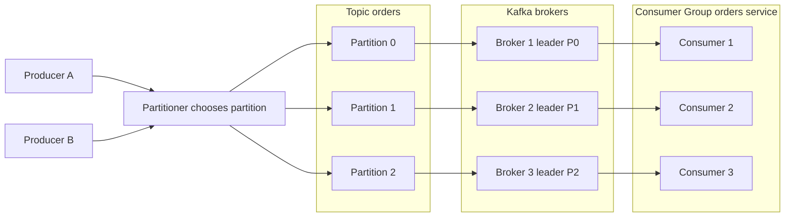

Apache Kafka is a distributed event streaming platform built around an append-only commit log: producers append records to topic partitions, and consumers read at their own pace using offsets.
It matters because it combines durability, high throughput, and replayability, which makes it the backbone of many event-driven architectures at scale.
You reach for Kafka when you need independent producers and consumers, long-lived event history, and horizontal scaling without losing per-key ordering.
Common use cases include [[Software Architecture/Patterns/Architectural Patterns/Event Sourcing|Event Sourcing]], stream processing, log aggregation, change data capture, and real-time analytics.

# Core Architecture



## Topics

- A **topic** is a logical channel, for example `orders`, `payments`, or `inventory_changes`.
- Topics decouple producers from consumers in both time and deployment.
- Consumers subscribe and process independently.

## Partitions

- A topic is split into **partitions**, and each partition is an ordered, immutable append-only log.
- Kafka guarantees ordering only inside one partition.
- Partitions are the scaling unit for storage and throughput.

## Producers

- Producers append records to topic partitions.
- A producer can provide a **partition key**.
- The producer partitioner hashes that key to pick a partition.
- Same key maps to the same partition for a stable partitioner algorithm and unchanged partition count.
- Mixed clients or custom partitioners can change mapping behavior.

## Consumer Groups

- A **consumer group** is one logical application reading a topic.
- Each partition is assigned to exactly one consumer within the group at any time.
- This gives parallel processing while preserving ordering per partition.
- If consumers exceed partition count, extras are idle.

## Offsets

- Every record in a partition has an increasing **offset**.
- Consumers track current offset per partition.
- Offsets allow replay, rewind, backfill, and fast catch-up.
- Commit timing determines whether your system behaves as at-most-once or at-least-once.

## Brokers, Leaders, and Followers

- **Brokers** are Kafka servers that store partition replicas.
- Each partition has one leader replica and zero or more follower replicas.
- Leaders serve writes and, by default, client reads; configured replica selection can route eligible reads to followers.
- Followers replicate from leaders and can be promoted after failures.

## ZooKeeper to KRaft

- Kafka historically depended on ZooKeeper for cluster metadata and controller coordination.
- Kafka 4.x is KRaft-only, so Kafka now manages cluster metadata through its own Raft-based controller quorum.
- Legacy ZooKeeper clusters must migrate to KRaft on a Kafka 3.x release that supports both modes before upgrading to Kafka 4.x.

## Semantics checklist

Before choosing configuration values, keep five boundaries straight:

- A record is an opaque key/value envelope plus headers and timestamp; the broker does not understand the business payload.
- Ordering is per partition, not per topic.
- An offset identifies a position inside one partition; it is not a global event ID.
- A consumer group shares partitions among its members; separate groups receive independent copies of the logical stream.
- Replication protects broker storage. It does not prove that a producer sent a record or that a consumer committed its external side effect.

# Delivery Semantics

Kafka delivery guarantees come from producer acknowledgement settings, replication health, and consumer offset management.

## At-most-once

- Consumer commits offset before processing.
- Crash between commit and processing causes data loss.
- Use only when losing some events is acceptable.

## At-least-once

- Consumer processes first, then commits.
- Crash after processing and before commit causes duplicates.
- This is the most common production model.
- Consumers must be idempotent.

## Exactly-once

- Use Kafka transactions with idempotent producer in a consume-process-produce flow between Kafka topics.
- Typical requirements include `enable.idempotence=true`, a configured `transactional.id`, `acks=all`, and consumers reading transactional output with `isolation.level=read_committed`.
- Commit consumed offsets as part of the same transaction so output records and source offsets are atomic.
- Idempotent producer alone does not provide end-to-end exactly-once processing.
- This gives exactly-once processing semantics for Kafka-to-Kafka pipelines.
- External side effects like database updates or HTTP calls still require idempotency or an outbox pattern.
- Tradeoff is higher latency and complexity, so use only when business impact justifies it.

## `acks` setting

- `acks=0`: fire-and-forget, no broker acknowledgement, highest throughput and highest loss risk.
- `acks=1`: leader acknowledgement only, can lose data if leader fails before followers replicate.
- `acks=all`: waits for acknowledgements from all in-sync replicas, safest choice for critical data.

# Partition Key Design

Partition key strategy determines both ordering behavior and workload balance.

- With a stable partitioner and partition count, messages with the same key go to the same partition. Producer order across retries also requires idempotence or at most one in-flight request per connection.
- Wrong key design creates hot partitions and throughput bottlenecks.
- Example: a single customer ID producing most events sends most load to one partition.

Design strategies:

- Use domain key when strict local ordering is required, for example `customer_id`.
- Use composite keys like `customer_id:region` when one dimension is too skewed.
- Validate key distribution with load tests and partition-level metrics before production rollout.

# Producer, broker, and consumer loss windows

![[Assets/Software Architecture/Software Architecture-Kafka-18120000.png]]

Message loss is not one failure mode. Locate the acknowledgement boundary first:

| Window | Failure | Control |
|---|---|---|
| Producer before broker acknowledgement | Client crashes or exhausts retries before a successful send | Treat send failure as unknown until the application reconciles by business ID; enable idempotence and bounded retries |
| Leader after acknowledgement | Leader fails before enough replicas retain the write | Use `acks=all`, an appropriate replication factor, and `min.insync.replicas` |
| Consumer before processing | Offset committed too early | Disable automatic commit and commit only after the required effect succeeds |
| Consumer after effect, before offset commit | Record is processed twice after restart | Make the effect idempotent or atomically couple it with an inbox/outbox boundary |

`acks=all` means all current in-sync replicas acknowledge, not all configured replicas. If `min.insync.replicas=2`, a critical topic can reject writes when fewer than two replicas are in sync instead of acknowledging a single-copy write.

# Kafka use cases by workload requirement

Choose Kafka for its log semantics, not because a workload is merely "real time."

| Workload | Kafka property that matters | Constraint to check |
|---|---|---|
| Change data capture | Durable ordered history per table/key | Source connector semantics and schema evolution |
| Event sourcing feed | Replay and independent consumer offsets | The domain still needs an authoritative event model and snapshots |
| Stream processing | Partitioned parallelism and retained inputs | State stores, checkpoints, and end-to-end side effects |
| Log or telemetry aggregation | High sequential throughput | Retention cost and whether loss is acceptable |
| Fan-out integration events | Independent consumer groups | Contract governance and per-key ordering |

A simple work queue with per-message priorities, arbitrary routing, or short retention may fit RabbitMQ or Service Bus better. The workload requirement selects the broker.

# Schema evolution

Kafka retains old records while producers and consumers deploy independently. [[Software Architecture/Distributed Systems/Event Schema Evolution|Event Schema Evolution]] owns writer/reader resolution, compatibility policy, registry behavior, retained-record replay, and breaking-change migrations. Kafka itself is schema-agnostic; Schema Registry-aware serializers embed or associate a schema identifier with each record.

# Why Kafka achieves high throughput

Kafka combines several mechanisms rather than one trick:

- Append-only partition logs turn writes into mostly sequential I/O.
- The operating-system page cache serves hot data and avoids a separate application cache.
- Producers batch records and optionally compress a batch, reducing syscalls and network bytes.
- Brokers transfer batches without parsing application payloads.
- Partitions distribute storage and consumer work across brokers.

Each mechanism has a cost. Larger batches improve throughput but add linger latency; more partitions raise metadata, file, and rebalance overhead; compression spends CPU. Measure record size, batch size, partition throughput, and consumer lag instead of copying a benchmark configuration.

# .NET consumer boundary

The Confluent .NET client exposes Kafka's group, partition, and offset model through a poll loop. Advance the offset only after the business effect or an owned quarantine path is durable:

```csharp
using Confluent.Kafka;

var config = new ConsumerConfig
{
    BootstrapServers = "kafka:9092",
    GroupId = "billing-v1",
    EnableAutoCommit = false,
    AutoOffsetReset = AutoOffsetReset.Earliest
};

using var consumer = new ConsumerBuilder<string, string>(config).Build();
consumer.Subscribe("orders.v1");

while (!cancellationToken.IsCancellationRequested)
{
    var record = consumer.Consume(cancellationToken);

    try
    {
        var order = OrderPlaced.Parse(record.Message.Value);
        await handler.HandleAsync(order, cancellationToken);
        consumer.Commit(record);
    }
    catch (InvalidOrderEventException error)
    {
        await quarantine.PublishAsync(record, error.Code, cancellationToken);
        consumer.Commit(record);
    }
}
```

The quarantine record must retain the original topic, partition, offset, key, payload, schema identifier, and stable reason before the source offset advances. Transient failures leave the offset uncommitted and use bounded retry or pause/resume. Business handlers remain idempotent because a crash can happen after the effect but before the commit.

Track lag by group and partition, oldest-record age, rebalance duration, quarantine rate, processing latency, and commit failures. Lag measures work not yet acknowledged; it does not prove that a projection is correct.

# Pitfalls

## Hot partitions from bad key design

- **What goes wrong:** one partition receives disproportionate load, so one consumer instance does most work.
- **Why it happens:** key hashing is deterministic and intentionally keeps equal keys together.
- **How to avoid or detect:** monitor per-partition throughput and lag, redesign keys, and use composite keys when skew is persistent.

## Consumer lag grows unnoticed

- **What goes wrong:** real-time pipeline becomes delayed and downstream SLAs fail.
- **Why it happens:** processing time per record exceeds ingest rate or partition assignment is unbalanced.
- **How to avoid or detect:** track lag alerts and inspect consumer groups regularly.

```bash
kafka-consumer-groups.sh --bootstrap-server localhost:9092 --group orders-worker --describe
```

## Too many partitions

- **What goes wrong:** increased leader election time, metadata overhead, and file handle pressure.
- **Why it happens:** each partition carries control-plane and storage overhead across brokers and clients.
- **How to avoid or detect:** size partition count from throughput targets and future growth ranges, not arbitrary large defaults.

## Ignoring `acks=all` for critical data

- **What goes wrong:** acknowledged writes can still be lost on leader failure.
- **Why it happens:** weaker ack modes return success before enough replication.
- **How to avoid or detect:** enforce `acks=all` for critical topics and combine with idempotent producer defaults.

# Questions

> [!QUESTION]- How do you design a Kafka topic to keep per-customer ordering while handling high throughput?
> Use `customer_id` when all events for one customer require one partition order. Size partitions from measured consumer throughput and scale a consumer group only to the partition count. If a hot customer forces a composite key such as `customer_id:region`, the guarantee is now only per customer per region; any cross-region customer order must be serialized by another sequencer, version check, or downstream merge rule. Keep consumers [[Software Architecture/Distributed Systems/Idempotency|idempotent]] because retries and rebalances can repeat records.

> [!QUESTION]- Compare at-most-once, at-least-once, and exactly-once in Kafka — which fits payment events?
> At-most-once commits the offset before processing, so a crash loses events — almost never acceptable for payments. At-least-once processes first and commits after, so a crash before commit reprocesses; it's the common production default and safe as long as handlers are idempotent. Exactly-once is real but narrow: Kafka transactions plus an idempotent producer give atomic consume-process-produce, but only for Kafka-to-Kafka flows — a database write or HTTP call inside the handler still needs its own idempotency or an outbox. For payments, the usual answer is at-least-once with strict idempotency (dedupe on a payment ID), reaching for exactly-once only when a duplicate side effect is too costly to risk and the whole flow stays inside Kafka.

# References

- [Apache Kafka Documentation](https://kafka.apache.org/documentation/) — official docs; the anchor source for topics, partitions, replication, delivery semantics, and configuration.
- [Confluent Kafka .NET Client Documentation](https://docs.confluent.io/kafka-clients/dotnet/current/overview.html) — official `Confluent.Kafka` client reference covering `ProducerConfig`/`ConsumerConfig`, idempotence, and offset management.
- [The Log: What every software engineer should know about real-time data's unifying abstraction](https://engineering.linkedin.com/distributed-systems/log-what-every-software-engineer-should-know-about-real-time-datas-unifying) — Jay Kreps' foundational essay on the log abstraction Kafka is built on.
- [The Apache Kafka Monitoring Blog Post to End Most Posts](https://www.confluent.io/blog/blog-post-on-monitoring-an-apache-kafka-deployment-to-end-most-blog-posts/) — Confluent practitioner deep-dive on metrics, consumer lag, and operating a Kafka cluster in production.
- [Kafka design](https://kafka.apache.org/documentation/#design) — Apache's design reference for the log, batching, page cache, replication, and consumer groups.
- [Apache Kafka 4.0.0 release announcement](https://kafka.apache.org/blog/2025/03/18/apache-kafka-4.0.0-release-announcement/) — official explanation of Kafka's KRaft-only architecture from version 4.0 onward.
- [Kafka broker configuration](https://kafka.apache.org/41/configuration/broker-configs/) — official broker settings, including preferred read-replica selection.
- [Kafka producer configuration](https://kafka.apache.org/documentation/#producerconfigs) — official definitions for `acks`, idempotence, retries, batching, and compression.
- [Kafka consumer configuration](https://kafka.apache.org/documentation/#consumerconfigs) — official offset-commit and isolation settings that shape delivery behavior.
- [Confluent poison pill handling](https://www.confluent.io/blog/spring-kafka-can-your-kafka-consumers-handle-a-poison-pill/) — practical quarantine and deserialization-failure handling; the boundary applies beyond the Java example.

## ByteByteGo provenance

- [Can Kafka lose messages?](https://github.com/ByteByteGoHq/system-design-101/blob/b28380a4710c5ec9638ec037d4168e288f334cba/data/guides/can-kafka-lose-messages.md) — editorial lead for the producer, broker, and consumer failure matrix.
- [Top Kafka use cases](https://github.com/ByteByteGoHq/system-design-101/blob/b28380a4710c5ec9638ec037d4168e288f334cba/data/guides/top-5-kafka-use-cases.md) — provenance for workload examples; broker choice remains requirements-driven.
- [Kafka 101](https://github.com/ByteByteGoHq/system-design-101/blob/b28380a4710c5ec9638ec037d4168e288f334cba/data/guides/the-ultimate-kafka-101-you-cannot-miss.md) — provenance for the semantics checklist; its defective record-label visual was rejected.
- [Avro migration](https://github.com/ByteByteGoHq/system-design-101/blob/b28380a4710c5ec9638ec037d4168e288f334cba/data/guides/smooth-data-migration-with-avro.md) — provenance for the writer/reader schema example.
- [Why Kafka is fast](https://github.com/ByteByteGoHq/system-design-101/blob/b28380a4710c5ec9638ec037d4168e288f334cba/data/guides/why-is-kafka-fast.md) — editorial lead for the throughput mechanisms; its defective diagram was rejected.
