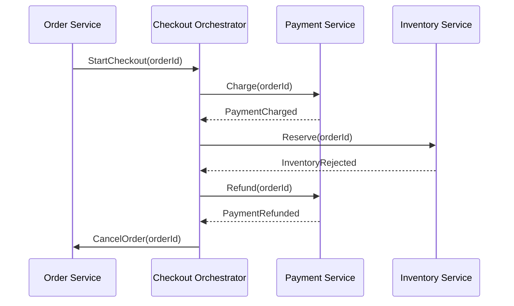

Orchestration coordinates a distributed workflow through an orchestrator that decides which participant acts next. The orchestrator owns the process state and sends commands; services still own and commit their local business state. It is not a global database transaction, and durable orchestration does not remove eventual consistency.

# Order Workflow

The process record advances only after durable outcomes. If inventory rejects the reservation, the orchestrator records the compensation path, requests a refund, and cancels the order. Commands and replies need stable workflow and message identifiers because timeouts can cause retries after a participant has already succeeded.

# Where It Fits

Orchestration suits ordered, long-running, or regulated workflows whose current state must be queried: checkout, account opening, fulfillment, and saga compensation. Its advantages are an explicit state machine, one place for deadlines and recovery policy, and a per-instance audit trail.

The costs are coupling participants to the orchestrator's command contract, operating a durable process store, and concentrating workflow throughput and availability. A crashed orchestrator must resume from persisted state; an ambiguous timeout must reconcile the participant's actual outcome before compensation; and a duplicated command must be harmless. Replication removes a process-level single point of failure only when state ownership and leader/fencing behavior are sound.

Observability follows the workflow instance: persist state transitions, propagate trace and causation IDs, expose stuck-step age and retry counts, and alert on exhausted compensation. Compensation is a business action such as refunding rather than a byte-for-byte rollback, so irreversible side effects need an explicit forward recovery.

# Boundary with Choreography

[[Software Architecture/Distributed Systems/Choreography|Choreography]] lets participants react to events without one component deciding the next step. Prefer it for independent fan-out. Prefer orchestration when sequence, deadlines, compensation, or an operator-visible process state are part of the business contract. A workflow can orchestrate `Charge -> Reserve -> Ship` and then publish `OrderCompleted` for choreographed email and analytics reactions.

# Questions

> [!QUESTION]- What must survive an orchestrator restart?
> The workflow instance, completed-step outcomes, pending commands, deadlines, retry attempts, and compensation progress must be durable. Recovery must distinguish “not attempted” from “attempted but reply lost” and rely on idempotent participants or outcome reconciliation.

> [!QUESTION]- When does orchestration add value over event fan-out?
> It adds value when the business process requires ordered decisions, explicit completion state, timeouts, or compensations. Independent reactions to a completed fact do not need a central decision maker.

# References

- [Saga distributed transactions pattern (Azure Architecture Center)](https://learn.microsoft.com/en-us/azure/architecture/reference-architectures/saga/saga) — Microsoft’s reference architecture compares orchestration and choreography and describes compensation, retries, and workflow failures.
- [Saga pattern (microservices.io)](https://microservices.io/patterns/data/saga.html) — Chris Richardson’s primary pattern catalog describes orchestrator-driven saga commands and local transactions.
- [OpenTelemetry trace semantic conventions](https://opentelemetry.io/docs/specs/semconv/general/trace/) — the project’s normative conventions for correlating work across spans and process boundaries.
