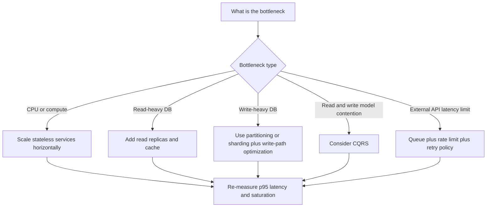

# Intro

Scalability is a system's ability to keep serving requests as load grows by adding resources, without a proportional drop in reliability or latency. In interviews, this matters because most "works at 1k RPS" designs fail when asked "how does this reach 10x?" The goal is not just to survive spikes, but to scale in a way that is cost-efficient and operationally predictable. You start thinking about scalability as soon as you can identify request volume, traffic shape, data growth, and the first likely bottleneck.

Concrete interview lens: if checkout traffic grows from 1,000 RPS to 10,000 RPS, a good answer is not "add more servers" but "measure where saturation appears first, then apply the right pattern for that bottleneck."

<nav style="--card-accent: 234, 179, 8;" class="folder-structure-map" aria-label="Scalability Patterns section map">
<article class="db-card folder-map-node">

<svg xmlns="http://www.w3.org/2000/svg" stroke-linejoin="round" stroke-linecap="round" stroke-width="2" stroke="currentColor" fill="none" viewBox="0 0 24 24"><path d="M14.5 2H6a2 2 0 0 0-2 2v16a2 2 0 0 0 2 2h12a2 2 0 0 0 2-2V7.5L14.5 2z"/><polyline points="14 2 14 8 20 8"/><line y2="13" y1="13" x2="8" x1="16"/><line y2="17" y1="17" x2="8" x1="16"/><line y2="9" y1="9" x2="8" x1="10"/></svg>Horizontal Scaling

Horizontal scaling adds more service instances behind a load balancer, requiring stateless design and externalized state to grow capacity.

<a class="internal-link" href="Home/Software Architecture/Distributed Systems/Scalability Patterns/Horizontal Scaling.md" data-tooltip-position="top" aria-label="Horizontal Scaling">Horizontal Scaling</a></article><article class="db-card folder-map-node">

<svg xmlns="http://www.w3.org/2000/svg" stroke-linejoin="round" stroke-linecap="round" stroke-width="2" stroke="currentColor" fill="none" viewBox="0 0 24 24"><path d="M14.5 2H6a2 2 0 0 0-2 2v16a2 2 0 0 0 2 2h12a2 2 0 0 0 2-2V7.5L14.5 2z"/><polyline points="14 2 14 8 20 8"/><line y2="13" y1="13" x2="8" x1="16"/><line y2="17" y1="17" x2="8" x1="16"/><line y2="9" y1="9" x2="8" x1="10"/></svg>Vertical Scaling

Vertical scaling gives a single node more CPU, RAM, or disk, the simplest first move for monoliths and managed databases.

<a class="internal-link" href="Home/Software Architecture/Distributed Systems/Scalability Patterns/Vertical Scaling.md" data-tooltip-position="top" aria-label="Vertical Scaling">Vertical Scaling</a></article>
</nav>

## Core Patterns

| Pattern | Primary bottleneck addressed | How it helps | Tradeoff and interview caveat |
|---|---|---|---|
| Horizontal scaling (stateless services behind LB, see [[Load Balancing]]) | App CPU and request concurrency | Add service instances behind a load balancer to increase throughput and availability | Requires stateless handlers; sticky sessions can hurt elasticity |
| Database read replicas | Read-heavy relational load | Offload read queries from primary to replicas | Replica lag can break read-after-write expectations |
| Database sharding | Write throughput and dataset size | Partition data by key so writes and storage spread across shards | Rebalancing, cross-shard queries, and hotspot keys add major complexity |
| CQRS (see [[CQRS]]) | Read/write contention with different query needs | Separate write model from read model to optimize each independently | Eventual consistency and projection maintenance must be explicit |
| Caching (see [[Data Persistence/Caching\|Caching]]) | Repeated expensive reads | Serve hot data from in-memory cache to reduce DB/API pressure | Cache invalidation and staleness policy drive correctness risk |
| CDN | Static asset latency and origin egress | Move static content to edge locations close to users | Cache-control mistakes can serve stale or private content |
| Async processing and message queues (see [[Software Architecture/Distributed Systems/Message Queues/Message Queues\|Message Queues]]) | Synchronous dependency latency and burst traffic | Buffer work, decouple producers/consumers, smooth spikes | Requires idempotency, retry policy, and dead-letter handling |
| Connection pooling | Expensive connection setup and DB connection limits | Reuse open connections to reduce handshake cost and limit churn | Pool exhaustion often appears as latency spikes before hard failures |
| Event-Driven Architecture (see [[Software Architecture/System Architecture/Event-Driven Architecture\|Event-Driven Architecture]]) | Tight coupling between services | Publish events so services scale and evolve independently | Ordering, duplication, and schema evolution must be designed upfront |
| Load shedding and rate limiting | Overload collapse during spikes | Reject or defer excess traffic early to protect critical paths | Requires clear priority rules and client retry behavior |

### Pattern Walkthrough (Quick Explanations)

1. Horizontal scale works best when each request can be handled by any instance, so session and cache state must be externalized.
2. Read replicas are usually your first database scale step for read-heavy APIs, but you must call out replication lag.
3. Sharding is usually late-stage because operational and data-model complexity is high.
4. CQRS helps when read models and write invariants conflict; it is not mandatory for every CRUD app.
5. Caching is often the highest ROI pattern when read repetition is high and staleness tolerance exists.
6. CDN is often a high-ROI optimization for cacheable static assets and can reduce origin cost.
7. Queues protect upstream systems from spikes and third-party slowness.
8. Connection pooling is usually low-effort, high-impact hygiene before more dramatic architecture changes.
9. Event-driven design scales team autonomy and workload isolation, but consistency guarantees must be explicit.

## Measurement and bottleneck migration

![[Assets/System Design 101/78cc77c1ac6e94aa62c92b43e52db37d4c4d1fd6a999cbb7ce4f21e2ad845c43.png]]

The strategies in the visual solve different measured bottlenecks; they are not a checklist. Use an explicit measurement contract:

- **Offered load:** work presented to the system.
- **Throughput:** completed useful work per unit time.
- **Latency:** a distribution such as p50, p95, and p99.
- **Capacity:** highest sustained offered load that still meets latency, error, and resource limits.
- **Saturation:** constrained resource or queue that stops throughput from rising.
- **Scalability:** how capacity and unit cost change after adding resources or changing architecture.

Define success before the test: `2x ASP.NET Core instances should deliver at least 1.7x completed checkout throughput, p99 below 400 ms, errors below 0.1%, and database connections below 80% of the limit for 30 minutes`.

At 1,000 RPS, increase load in steps while recording request rate, completed orders, latency, errors, CPU, allocations, thread-pool queue, database connections, lock wait, cache hit ratio, dependency latency, and queue age. If application CPU reaches 85% and throughput rises when instances double, horizontal scale addressed the current bottleneck. If database lock wait dominates at 2,500 RPS, more application replicas now increase contention. Apply one change, verify the expected capacity gain, then locate the next bottleneck.

## Scaling Decision Framework

Start with telemetry and saturation, not architecture fashion.

## .NET operating guidance

Use `dotnet-counters` for runtime counters, OpenTelemetry for request and dependency traces and metrics, and the database's own wait and query telemetry. A low application CPU value does not prove spare capacity when threads are blocked on connections. Platform scaling features are useful only when their signal matches the saturated resource; CPU-based autoscaling does not fix a database lock or third-party quota.

Track cost per completed operation, not only instance count. Cache, replicas, queues, and sharding move cost into invalidation, replication, backlog, and routing. Keep a rollback threshold when a change worsens tail latency or errors, and re-run the same workload after each change because the bottleneck moves.

## Tradeoffs

| Choice | Better when | Worse when |
|---|---|---|
| Vertical vs horizontal app scaling | You need immediate capacity and low migration risk | Single-node ceiling and blast radius become dominant |
| Read replicas vs caching for reads | Queries are complex and freshness matters more than latency | Cache hit ratio is high and stale-tolerant reads dominate |
| Sharding vs larger primary DB | Write throughput and data size exceed one node limits | Team is small and cross-shard operations are frequent |
| Sync calls vs queue-based async | User needs immediate result and latency budget allows it | Dependency is slow or rate-limited and bursty traffic is expected |

## Pitfalls

1. **Scaling before finding the real bottleneck**\
   What goes wrong: teams add app instances while p95 remains high.\
   Why: the bottleneck is often DB lock contention, external API latency, or connection saturation.\
   Mitigation: baseline telemetry first, then scale the saturated component.

2. **Premature sharding**\
   What goes wrong: delivery speed drops and incident complexity rises.\
   Why: shard routing, cross-shard queries, and resharding become permanent operational overhead.\
   Mitigation: exhaust simpler options first (indexes, read replicas, caching, partitioning, queueing).

3. **Stateful services that cannot scale horizontally**\
   What goes wrong: sticky sessions and per-node memory state cause uneven load and failover pain.\
   Why: user session or cache state is stored in-process.\
   Mitigation: externalize session to Redis and keep handlers stateless.

4. **Ignoring database bottlenecks while scaling app tier**\
   What goes wrong: more app instances generate more DB pressure and failures happen faster.\
   Why: DB CPU, locks, or connection limits were already near saturation.\
   Mitigation: profile queries, add indexes, tune pools, use read replicas, then scale app tier.

## Questions

> [!QUESTION]- When would you choose read replicas instead of CQRS for a scaling problem?
> **Expected answer:**
>
> - Choose read replicas when main pressure is read throughput on an existing relational model.
> - Choose CQRS when read/write models diverge and read projections need different shape or storage.
> - Mention consistency behavior: replicas have lag; CQRS read models are eventually consistent by design.
> - Mention complexity: replicas are simpler operationally than full CQRS/event projection pipelines.
>   **Why this is strong:** It balances architecture fit, consistency, and operational cost.

## References

- [System Design Primer - Scalability](https://github.com/donnemartin/system-design-primer#scalability)
- [Azure Architecture Center - Design to scale out](https://learn.microsoft.com/azure/architecture/guide/design-principles/scale-out)
- [Azure App Service - Scale up and scale out](https://learn.microsoft.com/azure/app-service/manage-scale-up)
- [Amazon Builders Library - Using load shedding to avoid overload](https://aws.amazon.com/builders-library/using-load-shedding-to-avoid-overload/)
- [ASP.NET Core distributed caching guidance](https://learn.microsoft.com/aspnet/core/performance/caching/distributed?view=aspnetcore-10.0)
- [Google SRE: Service Level Objectives](https://sre.google/sre-book/service-level-objectives/) — defines measurable service indicators, objectives, and evaluation windows for availability and latency.
- [Google SRE: Monitoring Distributed Systems](https://sre.google/sre-book/monitoring-distributed-systems/) — primary guidance for latency, traffic, errors, and saturation signals used to locate bottlenecks.
- [OpenTelemetry metrics](https://opentelemetry.io/docs/concepts/signals/metrics/) — official metric instruments and aggregation model.
- [.NET diagnostic tools](https://learn.microsoft.com/dotnet/core/diagnostics/) — official counters, traces, dumps, and performance-investigation tools.
- [Azure load testing](https://learn.microsoft.com/azure/app-testing/load-testing/overview-what-is-azure-load-testing) — official distributed load-test and monitoring workflow.

### ByteByteGo provenance

- [Scalability strategies](https://github.com/ByteByteGoHq/system-design-101/blob/b28380a4710c5ec9638ec037d4168e288f334cba/data/guides/8-must-know-scalability-strategies.md) — provenance for the strategy visual, used as a bottleneck map rather than a checklist.
- [System design cheat sheet](https://github.com/ByteByteGoHq/system-design-101/blob/b28380a4710c5ec9638ec037d4168e288f334cba/data/guides/system-design-cheat-sheet.md) — editorial lead for the operational definitions; its defective scalability and availability visual was rejected.
- [Architectural scalability crash course](https://github.com/ByteByteGoHq/system-design-101/blob/b28380a4710c5ec9638ec037d4168e288f334cba/data/guides/a-crash-course-on-architectural-scalability.md) — provenance for economic repetition and bottleneck migration; its imprecise definition visual was rejected.
