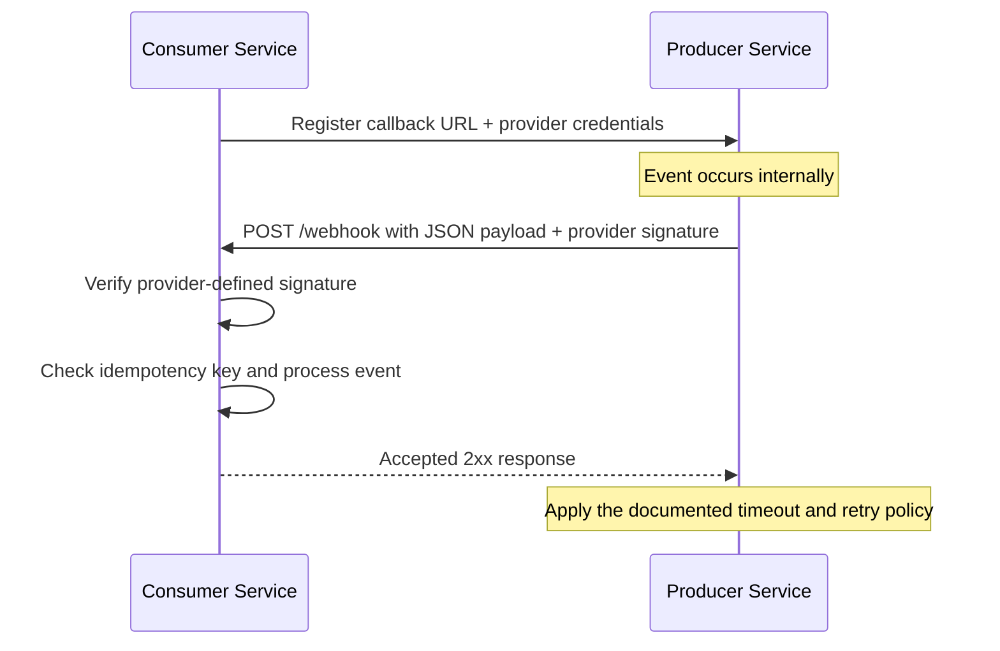

A webhook is a provider-initiated HTTP callback to a consumer-registered endpoint. It replaces repeated polling on the common path with near-real-time delivery and works across organizational boundaries where a shared broker is unavailable.

The callback is only a transport. Reliability comes from the surrounding contract: authentication, acknowledgement semantics, stable delivery IDs, retry limits, replay, and reconciliation. A producer may retry after losing the response even when the consumer already committed the event, so duplicate delivery is normal.

The flow below models a provider that signs the raw JSON body with HMAC-SHA256, accepts a successful `2xx` response, and retries transient delivery failures with exponential backoff. Each provider defines these details independently.



Webhooks provide an HTTP delivery mechanism within [[Software Architecture/System Architecture/Event-Driven Architecture]]. Within one controlled platform, [[Software Architecture/Distributed Systems/Message Queues/Message Queues|Message Queues]] usually provide stronger durability, fan-out, back-pressure, and replay. A common boundary pattern accepts an external webhook, commits it to an inbox, then republishes it to the internal broker.

In the sequence diagram, processing means the idempotency gate and durable acceptance step. Downstream business work stays outside the request path.

# ASP.NET Core Receiver

The receiver authenticates the provider's exact raw bytes before parsing JSON. Reserializing first can change whitespace or property order and invalidate a correct signature.

```csharp
using System.Security.Cryptography;
using System.Text;

app.MapPost("/webhooks/provider", async (
    HttpRequest request,
    IWebhookInbox inbox,
    IConfiguration configuration,
    CancellationToken ct) =>
{
    await using var buffer = new MemoryStream();
    await request.Body.CopyToAsync(buffer, ct);
    var body = buffer.ToArray();

    if (!request.Headers.TryGetValue("X-Signature", out var supplied) ||
        !Convert.TryFromHexString(
            supplied.ToString(),
            new byte[32],
            out var written) ||
        written != 32)
    {
        return Results.Unauthorized();
    }

    var secret = Encoding.UTF8.GetBytes(
        configuration["Webhooks:Secret"]!);
    var expected = HMACSHA256.HashData(secret, body);
    var actual = Convert.FromHexString(supplied.ToString());

    if (!CryptographicOperations.FixedTimeEquals(expected, actual))
    {
        return Results.Unauthorized();
    }

    var accepted = await inbox.StoreIfNewAsync(
        body,
        request.Headers,
        ct);

    return accepted ? Results.Accepted() : Results.Ok();
});
```

The signed input must match the provider contract. Many providers sign `timestamp + "." + rawBody` instead of the body alone. Timestamp skew is checked before a unique provider event ID and the payload are committed to an inbox or durable queue. Business processing runs afterward. The HTTP path ends once durable ownership has transferred.

# Delivery Contract

![[Assets/Software Architecture/Software Architecture-Webhooks-18120000.png]]

The visual shows direction, not reliability. Long polling intervals and conditional requests can make polling cheap. Webhook delivery can become expensive when slow endpoints trigger concurrent retries.

| Question | Polling | Webhook |
|---|---|---|
| Freshness | Bounded by the interval plus API latency | Usually near real-time, bounded by delivery and retry delay |
| Missed changes | Fetch from a durable source cursor or `updated_since` window | Producer must retain deliveries or expose replay/reconciliation |
| Duplicate work | Overlapping windows repeat records | At-least-once retries repeat events |
| Load owner | Consumer chooses interval and batch size | Producer controls fan-out and retry schedule |
| Failure recovery | Resume from cursor after outage | Replay by event ID, dead-letter inspection, or reconciliation poll |

A durable webhook contract defines all of the following:

1. Sign the exact body plus a timestamp and identify the signing key version.
2. Assign a stable event or delivery ID and document retry and ordering scope.
3. Retry transient failures with bounded exponential backoff and jitter. Classify permanent failures instead of retrying every `4xx`.
4. Require the receiver to persist the event before returning success and process it idempotently.
5. Expose delivery logs, manual replay, retention, timeout, and terminal failure behavior.
6. Provide a cursor-based list API so consumers can reconcile gaps after outages.

An hourly billing export may be simpler as polling because the consumer controls timing and batch size. A `PaymentCaptured` integration can use a signed webhook for latency, then periodically call `GET /events?after=<cursor>` to repair gaps. Push handles the fast path. Pull supplies the audit path.

# Transport Choice

| Approach | Direction | Latency | Complexity | Connection | Best fit |
| --- | --- | --- | --- | --- | --- |
| **Webhooks** | Push (server to server) | Near real-time | Moderate (retry, signatures, idempotency) | Per-event HTTP request | Cross-organization integrations, SaaS event delivery |
| **Polling** | Pull (consumer to producer) | Interval-bound delay | Low | Stateless per-request | Simple integrations, systems without webhook support |
| **SSE** | Push (server to browser) | Real-time | Low | Long-lived HTTP stream | One-directional browser notifications, dashboards |
| **WebSockets** | Bidirectional | Real-time | High (connection management, scaling) | Persistent TCP | Chat, collaborative editing, real-time bidirectional flows |

Webhooks fit server-to-server push across trust boundaries. Polling is smaller when freshness is loose or the producer offers no callback. SSE keeps a one-way browser stream open. WebSockets earn their connection-management cost only when both directions need low-latency messages.

# How Webhook Delivery Fails

| Failure | Mechanism | Repair |
| --- | --- | --- |
| Duplicate side effect | The producer retries after a timeout although the first request committed | Put the stable delivery ID under a durable unique constraint and make the state transition conditional |
| Retry storm | Slow synchronous work exceeds the provider timeout | Authenticate, commit the inbox record, return the accepted response, then process asynchronously |
| Forged event | The endpoint accepts an unsigned request or compares an HMAC with ordinary equality | Verify the provider-defined signed input and use constant-time comparison |
| Replay within a valid signature | A captured signed request is sent again | Enforce the signed timestamp or nonce contract and deduplicate the delivery ID |
| Permanent gap | The endpoint remains unavailable beyond the producer's retention or retry window | Monitor deliveries and reconcile from a cursor or provider replay facility |
| Secret rotation outage | Sender and receiver switch keys at different times | Carry a key identifier and accept old and new keys for a bounded overlap |

Ordering also needs a declared scope. Independent HTTP requests can arrive concurrently or out of order. Consumers either make transitions tolerant of reordering or serialize by an entity key after durable receipt.

# References

- [GitHub webhook best practices](https://docs.github.com/en/webhooks/using-webhooks/best-practices-for-using-webhooks)
- [Stripe webhook signatures](https://docs.stripe.com/webhooks/signature)
- [Standard Webhooks](https://www.standardwebhooks.com/)
