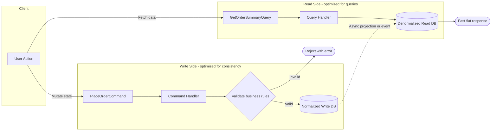

CQRS (Command Query Responsibility Segregation) gives state changes and reads different models. The write side protects business rules. The read side returns data in the shape each use case needs. This separation pays off when one shared model has become a compromise, not merely because reads outnumber writes.

# How Write and Read Models Diverge

The two sides have distinct contracts:

- Commands express intent and may change state after validation.
- Queries return data and must have no side effects.
- The write model protects business invariants.
- The read model is shaped for fast, task-focused queries.

CQRS does not prescribe storage. A write model is often transactional, while a read model may use projection tables or documents that avoid joins. Both can live in one relational database. Separate stores become useful only when scaling or operational ownership differs.

The bridge determines consistency. A synchronous projection updates both models in the request path, reducing staleness while coupling their latency and transaction behavior. An asynchronous projector consumes events later, which removes that request-path dependency but exposes lag and retry handling.

Message brokers, Event Sourcing, and multiple databases are optional infrastructure choices. None defines CQRS.

# Write and Read Models



The diagram shows a common asynchronous form. The write model enforces rules and the read model serves a flat view. Different schemas or technologies are possible, and asynchronous projection makes staleness part of the contract.

# ASP.NET Core Example (EF Core Writes + Dapper Reads)

The sample uses MediatR for handler dispatch. CQRS itself has no library dependency. Licensing and package terms can change, so current MediatR terms should be checked before adoption. Direct DI-wired handlers work too.

The command handler validates input and persists write-side state.

```csharp
using MediatR;
using Microsoft.EntityFrameworkCore;
public sealed record PlaceOrderCommand(Guid CustomerId, IReadOnlyList<OrderLineInput> Lines)
    : IRequest<Guid>;

public sealed record OrderLineInput(Guid ProductId, int Quantity);

public sealed class PlaceOrderHandler : IRequestHandler<PlaceOrderCommand, Guid>
{
    private readonly OrderingDbContext _db;
    private readonly IMediator _mediator;
    public PlaceOrderHandler(OrderingDbContext db, IMediator mediator)
    {
        _db = db;
        _mediator = mediator;
    }

    public async Task<Guid> Handle(PlaceOrderCommand request, CancellationToken ct)
    {
        if (request.Lines.Count == 0)
            throw new ValidationException("Order must contain at least one line.");

        var customer = await _db.Customers.SingleOrDefaultAsync(c => c.Id == request.CustomerId, ct);
        if (customer is null)
            throw new ValidationException("Customer does not exist.");

        var productIds = request.Lines.Select(x => x.ProductId).Distinct().ToArray();
        var products = await _db.Products
            .Where(p => productIds.Contains(p.Id))
            .ToDictionaryAsync(p => p.Id, ct);
        foreach (var line in request.Lines)
        {
            if (!products.TryGetValue(line.ProductId, out var p) || !p.IsActive)
                throw new ValidationException($"Product {line.ProductId} is unavailable.");
        }

        var order = Order.Create(request.CustomerId, request.Lines);
        _db.Orders.Add(order);
        await _db.SaveChangesAsync(ct);
        // In-process publish is awaited; use outbox + broker for truly asynchronous projection.
        await _mediator.Publish(new OrderPlaced(order.Id, customer.Name, order.Total, order.CreatedUtc), ct);
        return order.Id;
    }
}
```

The query handler reads a view shaped for one screen.

```csharp
using Dapper;
using MediatR;
using System.Data;
public sealed record GetOrderSummaryQuery(Guid OrderId) : IRequest<OrderSummaryDto?>;

public sealed record OrderSummaryDto(
    Guid OrderId,
    string CustomerName,
    decimal Total,
    string Status,
    DateTime CreatedUtc);

public sealed class GetOrderSummaryHandler : IRequestHandler<GetOrderSummaryQuery, OrderSummaryDto?>
{
    private readonly IDbConnection _connection;
    public GetOrderSummaryHandler(IDbConnection connection) => _connection = connection;

    public async Task<OrderSummaryDto?> Handle(GetOrderSummaryQuery request, CancellationToken ct)
    {
        const string sql = """
            SELECT
                order_id     AS OrderId,
                customer_name AS CustomerName,
                total_amount  AS Total,
                status        AS Status,
                created_utc   AS CreatedUtc
            FROM read.order_summary
            WHERE order_id = @OrderId;
            """;
        var cmd = new CommandDefinition(sql, new { request.OrderId }, cancellationToken: ct);
        return await _connection.QuerySingleOrDefaultAsync<OrderSummaryDto>(cmd);
    }
}
```

The projection uses PostgreSQL `ON CONFLICT` to make repeated delivery overwrite the same row:

```csharp
using MediatR;

public sealed record OrderPlaced(Guid OrderId, string CustomerName, decimal Total, DateTime CreatedUtc) : INotification;

public sealed class OrderSummaryProjection : INotificationHandler<OrderPlaced>
{
    private readonly IDbConnection _connection;
    public OrderSummaryProjection(IDbConnection connection) => _connection = connection;

    public Task Handle(OrderPlaced notification, CancellationToken cancellationToken)
    {
        const string upsert = """
            INSERT INTO read.order_summary (order_id, customer_name, total_amount, status, created_utc)
            VALUES (@OrderId, @CustomerName, @Total, 'Placed', @CreatedUtc)
            ON CONFLICT (order_id) DO UPDATE
            SET total_amount = EXCLUDED.total_amount,
                status = EXCLUDED.status;
            """;
        return _connection.ExecuteAsync(new CommandDefinition(upsert, new
        {
            notification.OrderId,
            notification.CustomerName,
            notification.Total,
            notification.CreatedUtc
        }, cancellationToken: cancellationToken));
    }
}
```

# CQRS and Event Sourcing

CQRS often appears with [[Software Architecture/Patterns/Architectural Patterns/Event Sourcing]] because an authoritative event stream can feed several read models and rebuild them later. The patterns remain independent.

- CQRS without Event Sourcing: write model persists current state (for example, relational tables), and emits events only as integration/projection signals.
- Event Sourcing without full CQRS: possible. Event streams can be queried directly, and specialized read projections are added when query needs grow.

Use both only when authoritative history and replay are requirements of the write model. CQRS by itself needs neither.

# Pitfalls

- **Stale reads**: a command may succeed before an asynchronous read model catches up. The interface needs an updating state or a deliberate read-your-own-write path, and operations need projection-lag monitoring.
- **Duplicate delivery**: a projector may commit and crash before acknowledging an event. Upserts or processed-event records make the handler idempotent, and replay tests exercise the same path.
- **Atomicity gap**: saving write state and publishing afterward can lose the notification. An outbox captures both in one transaction and publishes with retries.
- **Uniform adoption**: applying CQRS to every bounded context creates handlers and projections where ordinary CRUD would be easier to operate.

# Tradeoffs: CQRS Vs Simple CRUD

| Criterion | Simple CRUD model | CQRS model |
|---|---|---|
| Read/write ratio close to 1:1 | Usually sufficient | Often unnecessary complexity |
| Read-heavy workloads | Can degrade with heavy joins/index pressure | Read model can be denormalized for low-latency queries |
| Domain invariants and complex write rules | Possible but can bloat entity model | Write model stays explicit and invariant-focused |
| Operational complexity | Lower | Higher (projections, lag, retries, idempotency) |
| Independent scaling | Limited | Strong, especially with separate stores |

CQRS is worth considering when write invariants and query shapes pull the shared model in different directions. Independent scaling may strengthen the case, but a ratio alone is not enough.

# Questions

> [!QUESTION]- When is CQRS useful, and when does it add unnecessary complexity?
> CQRS is useful when the write side and the read side have clearly different needs. For example, writes may enforce order and payment rules, while reads need data prepared for fast searches and reports.
>
> It is not useful when the same model already handles both sides without difficulty. In that case, maintaining a separate read model and keeping it synchronized adds complexity without enough benefit.

# References

- [CQRS pattern](https://learn.microsoft.com/azure/architecture/patterns/cqrs)
- [CQRS](https://martinfowler.com/bliki/CQRS.html)
- [CQRS documents](https://cqrs.files.wordpress.com/2010/11/cqrs_documents.pdf)
