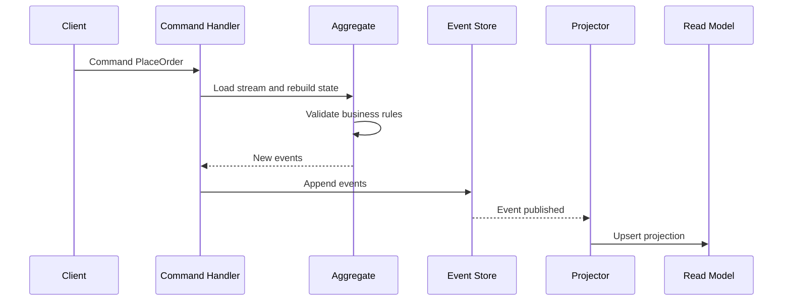

Event Sourcing makes an aggregate's ordered event stream the source of truth. Current state is rebuilt by applying those events rather than loading one mutable row. The history supports audit and point-in-time reconstruction, but its real cost appears in event compatibility, projection recovery, and day-to-day operations. It fits domains where that history has product or regulatory value. [[Software Architecture/Patterns/Architectural Patterns/CQRS]] often supplies separate read models, though it is not required.

# Rebuilding State from the Event Stream

## Core Flow

A command loads the aggregate's stream and applies its events in order. The rebuilt aggregate checks the requested transition and raises new events. The store appends those events only if the expected stream version still matches. Projectors then update read models from the committed facts.

## Why Append-only Matters

An append-only stream preserves the facts used to reach current state. It can explain a transition, reconstruct an earlier version, or feed a replacement projection. That value depends on stable ordering and readable historical schemas. Immutable bytes are useless if their meaning has drifted.

## State Reconstruction by Replay

Loading `order-123` might apply `OrderPlaced`, followed by several `ItemAdded` events and then `OrderShipped`. Applying the same ordered stream must produce the same aggregate state. Current clocks, random values, and external service calls therefore stay outside replay handlers.

## Projections and Read Models

Write-side aggregates enforce invariants. Projectors turn committed events into query shapes such as `OrderSummary` or `RevenueByDay`. Another consumer may maintain a search index. A read model is disposable only when the complete input history is replayable and projection code remains deterministic.

## Snapshots

Snapshots cache aggregate state at a known stream version, so loading applies only the remaining tail. They are performance artifacts. An incompatible snapshot can be discarded and rebuilt from the authoritative stream.

Historical event meaning must remain stable. Additive changes, upcasters, or new event types keep old streams readable without rewriting facts to match today's class model.

## Append and Projection Operations

Suppose `order-123` loads at version 17. The write attempts to append a batch with expected version 17. The store accepts the entire batch as the next versions or rejects it because another writer has advanced the stream. A stored envelope normally carries a stable event identifier, stream position, event type, schema version, and timestamp.

```csharp
public interface IEventStore
{
    Task<IReadOnlyList<StoredEvent>> ReadAsync(
        string streamId,
        long fromVersion,
        CancellationToken ct);

    Task AppendAsync(
        string streamId,
        long expectedVersion,
        IReadOnlyList<DomainEvent> events,
        CancellationToken ct);
}
```

A projector records how far it has processed. Committing the checkpoint with the read-model update avoids ambiguity. Otherwise a crash may deliver the last batch again, so handlers still need idempotent writes. Rebuild into a new projection version, validate it, and switch readers after it catches up. The working projection stays available during that process.

Replay cannot call a payment provider, send email, or read the current clock. External effects belong in live-delivery handlers that are excluded from rebuilds.

## Request-to-projection Sequence



# Event Sourcing Vs CRUD

CRUD stores the latest accepted state. Event Sourcing stores the ordered domain facts that produced it. An order row answers its current status. A well-designed event stream can also reconstruct earlier revisions and explain the accepted transitions.

![[Assets/Software Architecture/Software Architecture-Event Sourcing-18120000.jpg|theme-aware]]

The rebuild arrow is conditional. Replay is trustworthy only when ordering is stable, historical schemas remain readable, and handlers isolate external effects. A handler that calls today's tax API can produce a different result from the same stream. Snapshots shorten the work without replacing the stream.

| Question | CRUD state store | Event-sourced store |
|---|---|---|
| What is persisted? | Current row or document | Ordered immutable domain events |
| How is current state loaded? | Read the latest value | Replay events, usually from a snapshot plus the tail |
| How is history obtained? | Separate audit/history mechanism | Native stream, if events preserve business meaning |
| How is a read model repaired? | Recompute from available current data or backups | Replay into a new deterministic projection |
| Main operational risk | Lost history and in-place update mistakes | Schema evolution, replay cost, and projection lag |

# .NET Aggregate Example

The aggregate below changes state through the same event application path used during replay. A command raises a new event, applies it, and records it for append.

```csharp
public sealed class Order
{
    private readonly List<IDomainEvent> _uncommitted = [];
    private readonly List<(string Sku, int Quantity, decimal UnitPrice)> _items = [];

    public Guid Id { get; private set; }
    public bool IsPlaced { get; private set; }
    public bool IsShipped { get; private set; }
    public IReadOnlyCollection<IDomainEvent> UncommittedEvents => _uncommitted.AsReadOnly();

    public static Order Place(Guid orderId, DateTime utcNow)
    {
        if (orderId == Guid.Empty)
            throw new ArgumentException("Order id is required.", nameof(orderId));

        var order = new Order();
        order.Raise(new OrderPlaced(orderId, utcNow));
        return order;
    }

    public static Order FromHistory(IEnumerable<IDomainEvent> history)
    {
        var order = new Order();

        foreach (var @event in history)
        {
            order.Apply(@event);
        }

        return order;
    }

    public void AddItem(string sku, int quantity, decimal unitPrice, DateTime utcNow)
    {
        if (!IsPlaced || IsShipped || quantity <= 0 || unitPrice < 0)
        {
            throw new InvalidOperationException("Item cannot be added.");
        }

        Raise(new ItemAdded(Id, sku, quantity, unitPrice, utcNow));
    }

    public void ClearUncommittedEvents() => _uncommitted.Clear();

    private void Raise(IDomainEvent @event)
    {
        Apply(@event);
        _uncommitted.Add(@event);
    }

    private void Apply(IDomainEvent @event)
    {
        switch (@event)
        {
            case OrderPlaced placed:
                Id = placed.OrderId;
                IsPlaced = true;
                break;
            case ItemAdded added:
                _items.Add((added.Sku, added.Quantity, added.UnitPrice));
                break;
            case OrderShipped:
                IsShipped = true;
                break;
            default:
                throw new NotSupportedException(@event.GetType().Name);
        }
    }
}
```

`FromHistory` applies stored events without marking them uncommitted. `Raise` applies and records a new fact. If `Order-42` loads at version 7, `AddItem("SSD-1TB", 1, 89.00m, utcNow)` can append only against that version. A competing version 8 makes the append fail. Any retry must load fresh history and re-evaluate the command. The aggregate validates its in-memory state, while the expected-version check proves that the state was still current at commit.

# Event Sourcing + CQRS

Event Sourcing and [[Software Architecture/Patterns/Architectural Patterns/CQRS]] solve different concerns. Event Sourcing defines the write-side source of truth. CQRS lets projectors maintain query models apart from that write model. Either pattern can stand alone. Their combination is useful when both authoritative history and specialized reads are required.

# Where Event Sourcing Fits

Use Event Sourcing at an aggregate boundary when the event stream is the authoritative record of state transitions. Do not infer Event Sourcing merely because a system publishes events:

- **Event Sourcing** appends domain facts such as `OrderPlaced` and rebuilds aggregate state from that ordered stream.
- **Change Data Capture** reads mutations from a conventional database log. The database row remains the source of truth. The log is an integration feed.
- **Event notification** tells consumers that something changed, often requiring a callback to fetch current state.
- **Event-carried state transfer** includes enough state for consumers to update local copies, but the producer may still persist ordinary CRUD rows.
- **Integration events** cross bounded contexts. They are stable public contracts and need not match the finer-grained events used inside an event-sourced aggregate.

A payment ledger may justify immutable transitions and temporal reconstruction. An occasionally edited product description usually does not. An outbox makes publication from a CRUD service reliable. It does not turn the source database into an event store.

# Replay, Schema Evolution, and External Side Effects

Schema evolution and projection recovery are part of the pattern from the start. The ordered stream remains authoritative, aggregate replay stays deterministic, and rebuilding a projection cannot repeat live external effects.

# Tradeoffs

| Concern | Event Sourcing | Traditional CRUD |
|---|---|---|
| Source of truth | Immutable event history | Latest row/document state |
| Auditability | Native, complete timeline | Usually add separate audit table/log |
| Temporal queries | Natural via replay/as-of version | Hard, often requires custom history model |
| Write complexity | Higher: events, versions, projections | Lower: direct update/insert/delete |
| Read complexity | Higher with projection pipeline | Lower for straightforward queries |
| Operational model | Needs idempotency/replay tooling | Simpler operational story |

Prefer CRUD by default. Choose Event Sourcing only when immutable audit history, temporal reconstruction, or replay-based recovery are explicit and valuable requirements.

# References

- [Event Sourcing](https://martinfowler.com/eaaDev/EventSourcing.html)
- [Event Sourcing pattern](https://learn.microsoft.com/azure/architecture/patterns/event-sourcing)
