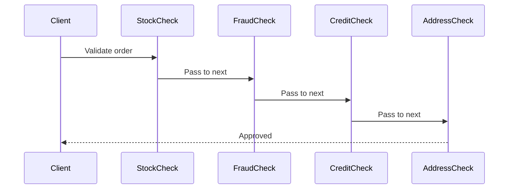

Airport security is a Chain of Responsibility. Your bag passes through ID verification, then X-ray scanning, then manual inspection, then customs. Each checkpoint either clears you or pulls you aside. Adding a new check — say, a bomb-sniffing dog — means inserting a new station in the line. No existing checkpoint changes. The passenger doesn’t decide which checks to go through; the chain decides.

The Chain of Responsibility pattern passes a request along a chain of handlers, where each handler decides whether to process the request or forward it to the next one. Handlers implement a common interface with a `Handle()` method and hold a reference to their successor. A handler either processes the request and stops the chain, or calls `next.Handle()` to continue. The sender doesn’t know which handler will process the request — or even how many handlers exist. In ASP.NET Core, **the middleware pipeline is this exact pattern**: `app.UseAuthentication()` → `app.UseAuthorization()` → `app.UseRateLimiting()` → your endpoint.



# Problem

`OrderValidator` has one massive `Validate()` method checking stock, fraud, credit, and address — all in sequence with nested if/else:

```csharp
public class OrderValidator
{
    private readonly IInventoryService _inventory;
    private readonly IFraudDetectionService _fraud;
    private readonly ICreditService _credit;
    private readonly IAddressVerificationService _address;

    // ⚠️ One method owns all validation logic — grows with every new check
    public async Task<ValidationResult> ValidateAsync(Order order)
    {
        // ⚠️ Stock check
        foreach (var item in order.Items)
        {
            if (!await _inventory.IsAvailableAsync(item.ProductId, item.Quantity))
                return ValidationResult.Fail($"Product {item.ProductId} out of stock");
        }

        // ⚠️ Fraud check — different logic, same method
        var fraudScore = await _fraud.GetScoreAsync(order.Customer.Id, order.Total);
        if (fraudScore > 0.8m)
            return ValidationResult.Fail("Order flagged for fraud review");

        // ⚠️ Credit check — only for B2B orders, but the condition is buried here
        if (order.IsBusinessOrder)
        {
            var creditLimit = await _credit.GetAvailableCreditAsync(order.Customer.Id);
            if (order.Total > creditLimit)
                return ValidationResult.Fail("Insufficient credit limit");
        }

        // ⚠️ Address verification — adding sanctions list check means editing this method
        var addressValid = await _address.VerifyAsync(order.ShippingAddress);
        if (!addressValid)
            return ValidationResult.Fail("Invalid shipping address");

        return ValidationResult.Success();
    }
}
```

Here's what breaks when requirements change: adding a sanctions list check requires editing `ValidateAsync` — touching all existing validation logic and risking regressions.

# Solution

Each validation becomes a handler in a chain. Handlers are composable and independently testable:

```csharp
public record ValidationContext(Order Order, List<string> Errors);

// Handler interface
public abstract class OrderValidationHandler
{
    private OrderValidationHandler? _next;

    public OrderValidationHandler SetNext(OrderValidationHandler next)
    {
        _next = next;
        return next; // ✅ fluent chaining: stock.SetNext(fraud).SetNext(credit).SetNext(address)
    }

    public async Task<bool> HandleAsync(ValidationContext context)
    {
        if (!await ValidateAsync(context))
            return false; // ✅ short-circuit — stop chain on failure

        return _next is null || await _next.HandleAsync(context);
    }

    protected abstract Task<bool> ValidateAsync(ValidationContext context);
}

// Concrete handlers — each focused on one concern
public class StockCheckHandler(IInventoryService inventory) : OrderValidationHandler
{
    protected override async Task<bool> ValidateAsync(ValidationContext ctx)
    {
        foreach (var item in ctx.Order.Items)
        {
            if (!await inventory.IsAvailableAsync(item.ProductId, item.Quantity))
            {
                ctx.Errors.Add($"Product {item.ProductId} out of stock");
                return false;
            }
        }
        return true;
    }
}

public class FraudCheckHandler(IFraudDetectionService fraud) : OrderValidationHandler
{
    protected override async Task<bool> ValidateAsync(ValidationContext ctx)
    {
        var score = await fraud.GetScoreAsync(ctx.Order.Customer.Id, ctx.Order.Total);
        if (score > 0.8m)
        {
            ctx.Errors.Add("Order flagged for fraud review");
            return false;
        }
        return true;
    }
}

public class CreditCheckHandler(ICreditService credit) : OrderValidationHandler
{
    protected override async Task<bool> ValidateAsync(ValidationContext ctx)
    {
        if (!ctx.Order.IsBusinessOrder) return true; // ✅ skip non-B2B orders cleanly

        var available = await credit.GetAvailableCreditAsync(ctx.Order.Customer.Id);
        if (ctx.Order.Total > available)
        {
            ctx.Errors.Add($"Insufficient credit: {ctx.Order.Total:C} requested, {available:C} available");
            return false;
        }
        return true;
    }
}

public class AddressVerificationHandler(IAddressVerificationService address) : OrderValidationHandler
{
    protected override async Task<bool> ValidateAsync(ValidationContext ctx)
    {
        if (!await address.VerifyAsync(ctx.Order.ShippingAddress))
        {
            ctx.Errors.Add("Invalid or undeliverable shipping address");
            return false;
        }
        return true;
    }
}

// ✅ Adding sanctions check = new handler class, zero changes to existing handlers
public class SanctionsCheckHandler(ISanctionsService sanctions) : OrderValidationHandler
{
    protected override async Task<bool> ValidateAsync(ValidationContext ctx)
    {
        if (await sanctions.IsOnListAsync(ctx.Order.Customer.Id))
        {
            ctx.Errors.Add("Customer is on sanctions list");
            return false;
        }
        return true;
    }
}

// Composition — chain built in DI or composition root
public class OrderValidationPipeline(
    StockCheckHandler stock,
    FraudCheckHandler fraud,
    CreditCheckHandler credit,
    AddressVerificationHandler address,
    SanctionsCheckHandler sanctions)
{
    private readonly OrderValidationHandler _chain = BuildChain(stock, fraud, credit, address, sanctions);

    private static OrderValidationHandler BuildChain(params OrderValidationHandler[] handlers)
    {
        for (int i = 0; i < handlers.Length - 1; i++)
            handlers[i].SetNext(handlers[i + 1]);
        return handlers[0];
    }

    public Task<bool> ValidateAsync(Order order) =>
        _chain.HandleAsync(new ValidationContext(order, []));
}
```

Adding a sanctions check now means one new `SanctionsCheckHandler` class — existing handlers never change.

# You Already Use This

**ASP.NET Core Middleware pipeline** — the canonical .NET Chain of Responsibility. `app.UseAuthentication()`, `app.UseAuthorization()`, `app.UseRateLimiting()` each register a handler. Each middleware calls `await next(context)` to continue the chain or returns early to short-circuit. The pipeline is built at startup; the chain runs on every request.

**`DelegatingHandler` in `HttpClient`** — each handler in the `HttpClient` pipeline is a chain link. Retry handlers, auth handlers, and circuit breakers each call `base.SendAsync(request, cancellationToken)` to continue or return early to short-circuit.

**MediatR `IPipelineBehavior<TRequest, TResponse>`** — MediatR's pipeline is a Chain of Responsibility. Each behavior calls `next()` to continue or returns early. Validation, logging, and caching behaviors compose into a pipeline around the handler.

**Polly `ResiliencePipeline`** — Polly's resilience strategies (retry, circuit breaker, timeout, rate limiter) compose into a pipeline. Each strategy handles the request or passes it to the next strategy.

# Pitfalls

**Chain ordering bugs** — the order of handlers is a business rule. Running fraud check before stock check means fraudulent orders consume inventory reservation time. Running credit check before fraud check means you query credit for fraudulent orders. Document the intended order and enforce it in the composition root, not scattered across handler registrations.

**Requests reaching no handler** — if all handlers pass the request along and the chain ends without processing, the request is silently ignored. Always have a terminal handler or a default behavior at the end of the chain. In validation pipelines, the absence of a rejection means success — make this explicit.

**Swallowed errors in async chains** — if a handler catches an exception and returns `false` instead of rethrowing, the caller loses the exception context. Decide upfront: does the chain use return values (validation) or exceptions (processing)? Don't mix both.

# Tradeoffs

| Concern | Chain of Responsibility | Monolithic method |
|---|---|---|
| Adding a new check | New handler class, zero changes | Edit existing method |
| Handler ordering | Explicit at composition | Implicit in method body |
| Short-circuiting | Each handler decides independently | Nested if/else |
| Testability | Each handler tested independently | Must test all checks together |
| Tracing a request | Follow the chain | Single method, easier to trace |

**Decision rule**: Use Chain of Responsibility when you have 3+ handlers that may process a request, the set of handlers changes over time, or handlers need to be independently testable. For 1-2 fixed checks, a simple method is less overhead. The signal is when you find yourself adding `else if` blocks to a validation or processing method.

# Questions

> [!QUESTION]- How does ASP.NET Core Middleware differ from a classical Chain of Responsibility?
> Classical CoR uses a linked list of handlers where each holds a reference to the next. ASP.NET Core Middleware uses a delegate pipeline: each middleware is a `Func<RequestDelegate, RequestDelegate>` that wraps the next `RequestDelegate`. The pipeline is compiled at startup into a single delegate chain. The difference: ASP.NET Core's pipeline is immutable after build (no dynamic handler insertion); classical CoR can be modified at runtime. ASP.NET Core's approach is more performant (no virtual dispatch per handler) but less flexible. The tradeoff: startup-time composition vs runtime flexibility.

> [!QUESTION]- When should a handler stop the chain vs pass the request along?
> Stop the chain when the handler has definitively handled the request — either successfully (order approved) or with a terminal failure (fraud detected, stop processing). Pass along when the handler's check passes and subsequent handlers may still reject. The key question: is this handler's decision final? Fraud detection is final (don't process fraudulent orders regardless of other checks). Stock check is final for that item but not for the order (other items may still be available). Design each handler to be authoritative about its own domain and ignorant of others.

> [!QUESTION]- How do you handle a request that should be processed by multiple handlers (not just the first one)?
> Change the chain to not short-circuit — every handler processes the request and the results are aggregated. This is the "collect all errors" variant of validation: instead of stopping at the first failure, all handlers run and all errors are collected. The tradeoff: short-circuiting is faster (stops at first failure) but gives less feedback; full traversal is slower but gives complete error information. For user-facing validation, full traversal is usually better UX. For security checks (fraud, sanctions), short-circuit immediately — don't reveal which check failed.

# References

- [Chain of Responsibility — refactoring.guru](https://refactoring.guru/design-patterns/chain-of-responsibility) — canonical pattern description with linked handler diagram and C# example
- [ASP.NET Core Middleware — Microsoft Learn](https://learn.microsoft.com/en-us/aspnet/core/fundamentals/middleware/) — Chain of Responsibility in the ASP.NET Core request pipeline
- [MediatR Pipeline Behaviors — GitHub](https://github.com/jbogard/MediatR/wiki/Behaviors) — Chain of Responsibility for CQRS command/query pipelines
- [Polly ResiliencePipeline — Microsoft Learn](https://learn.microsoft.com/en-us/dotnet/core/resilience/) — resilience strategies as a chain of responsibility
