A TV remote exposes "next channel" without exposing the channel store. The source might be a local list or a live feed. The traversal control stays the same. That cursor-like boundary is the Iterator pattern.

```mermaid
flowchart LR
    Client -->|foreach| IEnumerable
    IEnumerable -->|GetEnumerator| IEnumerator
    IEnumerator -->|MoveNext and Current| Element1["Order 1"]
    IEnumerator -->|MoveNext and Current| Element2["Order 2"]
    IEnumerator -->|MoveNext and Current| Element3["Order 3"]
    IEnumerator -->|MoveNext returns false| Done["End"]
```

Iterator provides sequential access while keeping the collection representation private. In C#, `IEnumerable<T>` produces an iterator and `IEnumerator<T>` tracks the current position. `foreach` consumes that contract, while `yield return` lets the compiler generate the state machine. `IAsyncEnumerable<T>` applies the same boundary when advancing may require asynchronous work.



# Problem

`OrderRepository` materializes the entire order history even when the caller needs only a few rows:

```csharp
public class OrderRepository
{
    // ⚠️ Loads ALL orders into memory before returning
    public async Task<List<Order>> GetOrderHistoryAsync(Guid customerId)
    {
        return await _db.Orders
            .Where(o => o.CustomerId == customerId)
            .OrderByDescending(o => o.CreatedAt)
            .ToListAsync(); // ⚠️ customer with 50,000 orders = 50,000 objects in memory
    }
}

public class OrderHistoryService
{
    public async Task<List<OrderSummary>> GetRecentOrdersAsync(Guid customerId, int count)
    {
        var allOrders = await _repository.GetOrderHistoryAsync(customerId); // ⚠️ loads all 50,000
        return allOrders.Take(count).Select(o => new OrderSummary(o)).ToList(); // uses 20
    }
}
```

A "load more" feature now forces pagination details into callers. The repository returned storage shape instead of traversal behavior.

# Solution

Expose a lazy `IAsyncEnumerable<T>` and keep paging inside the repository:

```csharp
public class OrderRepository
{
    // ✅ Returns IAsyncEnumerable — lazy, paginated, caller controls how many to consume
    public async IAsyncEnumerable<Order> GetOrderHistoryAsync(
        Guid customerId,
        [EnumeratorCancellation] CancellationToken ct = default)
    {
        const int pageSize = 100;
        int page = 0;

        while (true)
        {
            var batch = await _db.Orders
                .AsNoTracking()
                .Where(o => o.CustomerId == customerId)
                .OrderByDescending(o => o.CreatedAt)
                .ThenByDescending(o => o.Id) // unique tie-breaker for deterministic pages
                .Skip(page * pageSize)
                .Take(pageSize)
                .ToListAsync(ct);

            if (batch.Count == 0) yield break;

            foreach (var order in batch)
                yield return order; // ✅ caller receives one order at a time

            if (batch.Count < pageSize) yield break;
            page++;
        }
    }
}

public class OrderHistoryService
{
    // ✅ Takes only what it needs — no full load
    public async Task<List<OrderSummary>> GetRecentOrdersAsync(Guid customerId, int count)
    {
        if (count <= 0) return [];

        var summaries = new List<OrderSummary>(count);
        await foreach (var order in _repository.GetOrderHistoryAsync(customerId))
        {
            summaries.Add(new OrderSummary(order));
            if (summaries.Count >= count) break; // ✅ stops iteration early
        }
        return summaries;
    }

    // ✅ Synchronous iterator with yield return
    public IEnumerable<OrderSummary> GetOrderSummaries(IEnumerable<Order> orders)
    {
        foreach (var order in orders)
        {
            if (order.Status == OrderStatus.Cancelled) continue; // ✅ filter inline
            yield return new OrderSummary(order); // ✅ lazy — only computed when consumed
        }
    }
}
```

The caller consumes items through `await foreach`. Database paging remains an implementation detail.

This sample uses offset paging because the iterator boundary is the focus. Offset works for small or mostly static histories, but later pages cost more to scan and concurrent inserts can shift rows between pages even with deterministic ordering. A forward-only production stream should usually carry the last `(CreatedAt, Id)` pair and request the next keyset page instead.

# Enumeration and Streaming APIs in .NET

**`IEnumerable<T>` / `IEnumerator<T>` with `foreach`** is the standard synchronous contract. The loop obtains an enumerator and advances it through `MoveNext()`.

**`yield return`** turns a method body into a generated state machine. Local state survives between calls to `MoveNext()`, so values are produced only as the caller asks for them.

**`IAsyncEnumerable<T>` / `await foreach`** supports sources that wait between items. `Channel<T>.ReadAllAsync()` and EF Core `AsAsyncEnumerable()` expose this shape without requiring one large buffer.

**LINQ `IQueryable<T>`** is deferred query data rather than an iterator by itself. Execution begins when a terminal operation or enumeration asks the provider for results.

# Tradeoffs

**Use it when** sequential access is enough and exposing the underlying structure would couple callers to storage. It is especially useful for large or unbounded sequences. In C#, `yield return` usually removes any reason to implement `IEnumerator<T>` by hand.

**Avoid it when** callers need indexed access or a stable `Count`. A materialized list says that more clearly. Deferred execution also moves queries and exceptions to enumeration time. A second enumeration may repeat the work.

**Related patterns.** Iterator controls sequential _access_. **[[Software Architecture/Patterns/Design Patterns/Behavioral/Visitor]]** adds operations over elements, while **[[Software Architecture/Patterns/Design Patterns/Structural/Composite]]** supplies a tree that may be traversed. [[Programming/NET/CSharp/Fundamentals/Foreach|foreach & yield]] covers the language mechanics.

# Questions

> [!QUESTION]- What should determine whether an API returns `IEnumerable<T>`, `IReadOnlyList<T>`, or `IAsyncEnumerable<T>`?
> The return type should describe what the caller can safely rely on. `IReadOnlyList<T>` guarantees `Count` and indexed access, but it does not say whether values are computed lazily or represent a snapshot. If the method returns a materialized snapshot, that should be stated separately in the method's contract. `IEnumerable<T>` promises only synchronous enumeration, which may be lazy and repeat the underlying work when enumerated again. `IAsyncEnumerable<T>` fits a source that waits between items and should stream them instead of buffering the full result.

> [!QUESTION]- What does the compiler generate for a `yield return` method?
> The compiler generates a state-machine type that implements the enumeration contracts. Each `yield return` becomes a suspension point. `MoveNext()` resumes execution and `Current` exposes the yielded value. Locals that must survive suspension become fields on the generated object.

# References

- [Iterator pattern](https://refactoring.guru/design-patterns/iterator)
- [Iterator Pattern — Christopher Okhravi](https://www.youtube.com/watch?v=uNTNEfwYXhI\&list=PLrhzvIcii6GNjpARdnO4ueTUAVR9eMBpc\&index=16)
- [`IEnumerable<T>` — .NET Iterator interface](https://learn.microsoft.com/en-us/dotnet/api/system.collections.generic.ienumerable-1)
