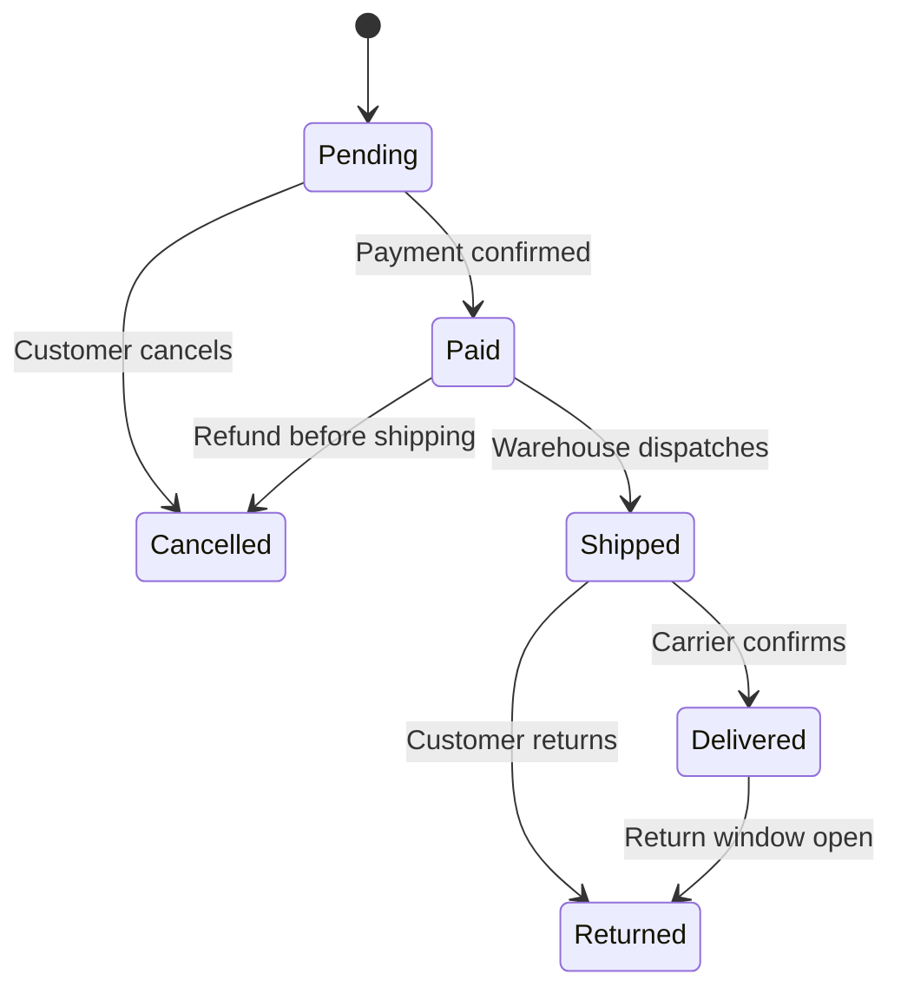

# State

Think of a vending machine. Press the same button and you get different results depending on what state the machine is in — idle shows a prompt, has-money dispenses a drink, out-of-stock shows an error. The button doesn’t change. The machine’s response changes because its internal state changed. That’s the State pattern.

The State pattern extracts state-specific behavior into separate state classes. The context object — your `Order` — holds a reference to its current state object and delegates all behavior to it. When the order transitions from Pending to Paid, the context swaps its state object, and suddenly `Ship()` does something different without any switch statement. The state objects themselves drive transitions: `PaidState.Ship()` changes the context’s state to `ShippedState`. This is key — the **object decides** its next state, not the caller. In C#, the compiler implements exactly this pattern for every `async` method: **`async`/`await` generates an `IAsyncStateMachine`** where each `await` point is a state transition.



> [!NOTE] State vs Strategy
> Identical class structure, different intent. **State** transitions are **driven by the object** — the order changes its own state from Pending to Paid. **Strategy** selection is **driven by the client** — the caller chooses which shipping algorithm to inject. If the object decides which "algorithm" to use next, it's State. If the caller decides, it's Strategy. See [[Strategy]].

## Problem

`Order.Ship()`, `Order.Cancel()`, `Order.Refund()` each have a massive switch on `Status` — scattered validation, easy to miss a transition:

```csharp
public class Order
{
    public OrderStatus Status { get; private set; } = OrderStatus.Pending;

    // ⚠️ Every method repeats the same switch — adding a new status means editing all methods
    public void Ship()
    {
        switch (Status)
        {
            case OrderStatus.Paid:
                Status = OrderStatus.Shipped;
                break;
            case OrderStatus.Pending:
                throw new InvalidOperationException("Cannot ship unpaid order");
            case OrderStatus.Shipped:
                throw new InvalidOperationException("Order already shipped");
            case OrderStatus.Delivered:
                throw new InvalidOperationException("Order already delivered");
            case OrderStatus.Cancelled:
                throw new InvalidOperationException("Cannot ship cancelled order");
            // ⚠️ Adding OrderStatus.OnHold requires editing Ship(), Cancel(), Refund(), Deliver()
        }
    }

    public void Cancel()
    {
        switch (Status) // ⚠️ same switch, different transitions
        {
            case OrderStatus.Pending:
            case OrderStatus.Paid:
                Status = OrderStatus.Cancelled;
                break;
            case OrderStatus.Shipped:
                throw new InvalidOperationException("Cannot cancel shipped order — use return");
            // ...
        }
    }
}
```

Here's what breaks when requirements change: adding `OrderStatus.OnHold` requires editing `Ship()`, `Cancel()`, `Refund()`, and `Deliver()` — four methods, each with its own switch.

## Solution

Each state becomes a class that knows its valid transitions:

```csharp
// State interface — defines all operations the order can perform
public interface IOrderState
{
    void Pay(Order order);
    void Ship(Order order);
    void Deliver(Order order);
    void Cancel(Order order);
    void Return(Order order);
    string StatusName { get; }
}

// Concrete states — each knows only its own valid transitions
public class PendingState : IOrderState
{
    public string StatusName => "Pending";

    public void Pay(Order order) => order.TransitionTo(new PaidState()); // ✅ valid transition
    public void Ship(Order order) => throw new InvalidOperationException("Pay first");
    public void Deliver(Order order) => throw new InvalidOperationException("Pay and ship first");
    public void Cancel(Order order) => order.TransitionTo(new CancelledState()); // ✅ valid
    public void Return(Order order) => throw new InvalidOperationException("Order not yet delivered");
}

public class PaidState : IOrderState
{
    public string StatusName => "Paid";

    public void Pay(Order order) => throw new InvalidOperationException("Already paid");
    public void Ship(Order order) => order.TransitionTo(new ShippedState()); // ✅ valid
    public void Deliver(Order order) => throw new InvalidOperationException("Ship first");
    public void Cancel(Order order) => order.TransitionTo(new CancelledState()); // ✅ valid (with refund)
    public void Return(Order order) => throw new InvalidOperationException("Not yet delivered");
}

public class ShippedState : IOrderState
{
    public string StatusName => "Shipped";

    public void Pay(Order order) => throw new InvalidOperationException("Already paid");
    public void Ship(Order order) => throw new InvalidOperationException("Already shipped");
    public void Deliver(Order order) => order.TransitionTo(new DeliveredState()); // ✅ valid
    public void Cancel(Order order) => throw new InvalidOperationException("Use return process");
    public void Return(Order order) => throw new InvalidOperationException("Not yet delivered");
}

public class DeliveredState : IOrderState
{
    public string StatusName => "Delivered";

    public void Pay(Order order) => throw new InvalidOperationException("Already paid");
    public void Ship(Order order) => throw new InvalidOperationException("Already delivered");
    public void Deliver(Order order) => throw new InvalidOperationException("Already delivered");
    public void Cancel(Order order) => throw new InvalidOperationException("Use return process");
    public void Return(Order order) => order.TransitionTo(new ReturnedState()); // ✅ valid
}

// ✅ Adding OnHoldState = one new class, zero changes to existing states
public class OnHoldState : IOrderState
{
    public string StatusName => "OnHold";

    public void Pay(Order order) => throw new InvalidOperationException("Resolve hold first");
    public void Ship(Order order) => throw new InvalidOperationException("Resolve hold first");
    public void Deliver(Order order) => throw new InvalidOperationException("Resolve hold first");
    public void Cancel(Order order) => order.TransitionTo(new CancelledState());
    public void Return(Order order) => throw new InvalidOperationException("Not yet delivered");
}

// Context — delegates to current state
public class Order
{
    private IOrderState _state = new PendingState();

    public string Status => _state.StatusName;

    internal void TransitionTo(IOrderState newState)
    {
        _state = newState;
        // ✅ Raise event, log transition, etc.
    }

    // ✅ Delegates to state — no switch statements
    public void Pay() => _state.Pay(this);
    public void Ship() => _state.Ship(this);
    public void Deliver() => _state.Deliver(this);
    public void Cancel() => _state.Cancel(this);
    public void Return() => _state.Return(this);
}
```

Adding `OnHoldState` now means one new class — existing states never change.

## You Already Use This

**`async`/`await` compiler-generated `IAsyncStateMachine`** — every `async` method is compiled into a class implementing `IAsyncStateMachine`. The `MoveNext()` method is a state machine with states for each `await` point. The compiler implements the State pattern for you: the method's execution state transitions from one `await` to the next. This is the State pattern at the language level.

**Polly `CircuitBreaker`** — the circuit breaker has three states: Closed (requests pass through), Open (requests fail fast), HalfOpen (one test request allowed). State transitions are driven by success/failure counts. Each state has different behavior for the same `Execute()` call.

**`TaskStatus` enum + `Task` state transitions** — a `Task` transitions through `Created → WaitingForActivation → Running → RanToCompletion/Faulted/Cancelled`. Each status represents a state with different behavior for `Wait()`, `Result`, and `ContinueWith()`.

## Pitfalls

**State explosion** — if you have 10 states and 8 operations, that's 80 methods to implement. Many will throw `InvalidOperationException`. Consider using a default base class that throws for all operations, with concrete states overriding only valid transitions. Or use a state machine library (`Stateless`) that defines transitions declaratively.

**Missing transitions** — if `PaidState.Cancel()` doesn't trigger a refund, the order is cancelled but the customer isn't refunded. State transitions often have side effects (send email, trigger refund, update inventory). Put side effects in `TransitionTo()` or in the state's transition method, not in the context.

**Serializing state** — if `Order` is persisted to a database, the current state must be serializable. Store the state name as a string and reconstruct the state object on load. Don't store the state object directly — it creates a tight coupling between the persistence model and the state class hierarchy.

## Tradeoffs

| Concern | State pattern | Enum + switch |
|---|---|---|
| Adding a new state | One new class, zero changes to existing | Edit every switch in every method |
| Adding a new operation | Add method to interface + all state classes | Add one method with a switch |
| Valid transition enforcement | Each state class defines its own | Switch in each method |
| Complexity | Many small classes | Few large methods |
| Readability | State behavior is localized | All behavior in one class |

**Decision rule**: Use State when you have 4+ states and 3+ operations, and the valid transitions differ significantly per state. For 2-3 states with simple transitions, an enum + switch is less overhead. The signal is when you find yourself copying the same switch statement into multiple methods. The `Stateless` library provides a declarative alternative that avoids the class proliferation.

## Questions

> [!QUESTION]- How does the `async`/`await` compiler implement the State pattern?
> The compiler transforms an `async` method into a struct implementing `IAsyncStateMachine`. The struct has a `state` field (an integer) representing the current position in the method. `MoveNext()` is a switch on `state`: each case resumes execution from the last `await` point. When an `await` suspends, the state is saved and `MoveNext()` returns. When the awaited task completes, `MoveNext()` is called again with the next state. Local variables become fields on the struct (captured state). This is exactly the State pattern: the method's execution state drives behavior, and transitions happen automatically at each `await`.

> [!QUESTION]- When should you use the `Stateless` library instead of hand-written state classes?
> When the state machine has many states and transitions that are better expressed declaratively. `Stateless` lets you define `machine.Configure(State.Paid).Permit(Trigger.Ship, State.Shipped).OnEntry(() => SendShipmentEmail())` — the transition table is explicit and readable. Hand-written state classes are better when each state has complex behavior beyond transitions (not just "what's the next state" but "what does Ship() do in this state"). The tradeoff: `Stateless` is concise for transition-heavy machines; hand-written classes are better for behavior-heavy states.

> [!QUESTION]- How do you handle state transitions that require async operations (e.g., sending a refund on cancel)?
> Make `TransitionTo()` async and await the side effects before completing the transition. Or use the Observer pattern: raise a `StatusChanged` event after transitioning, and let async observers handle side effects. The second approach keeps state transitions synchronous and side effects decoupled. The tradeoff: synchronous transitions are simpler but can't await side effects; event-based side effects are decoupled but harder to reason about ordering and failure handling.

## References

- [State Pattern — Christopher Okhravi](https://www.youtube.com/watch?v=N12L5D78MAA\&list=PLrhzvIcii6GNjpARdnO4ueTUAVR9eMBpc\&index=17) — video walkthrough of the State pattern with OOP examples
- [State — refactoring.guru](https://refactoring.guru/design-patterns/state) — canonical pattern description with context/state diagram and C# example
- [Async/await state machine — Microsoft Learn](https://learn.microsoft.com/en-us/dotnet/csharp/asynchronous-programming/task-asynchronous-programming-model) — how the compiler generates IAsyncStateMachine
- [Stateless — GitHub](https://github.com/dotnet-state-machine/stateless) — declarative state machine library for .NET
- [Polly CircuitBreaker — Microsoft Learn](https://learn.microsoft.com/en-us/dotnet/core/resilience/resilience-strategies) — State pattern for resilience: Closed/Open/HalfOpen states
