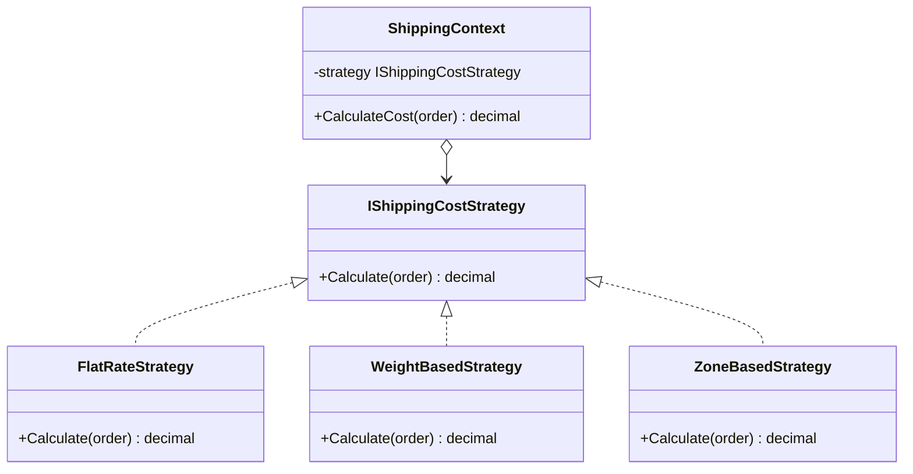

A route planner can optimize the same trip for time, distance, or toll cost. The navigation workflow stays put while the routing algorithm changes.

Strategy puts replaceable algorithms behind one contract. A context delegates the variable step to that contract, and a client or selection policy supplies the implementation. The context knows how to use an `IShippingCostStrategy`. It does not need the pricing rules for flat-rate or zone-based shipping. This boundary is useful when algorithms change independently of the workflow around them.



> [!NOTE] Strategy vs State vs Command
> Strategy varies an algorithm chosen for a context. [[Software Architecture/Patterns/Design Patterns/Behavioral/State]] models behavior that follows an internal mode and transition rules. [[Software Architecture/Patterns/Design Patterns/Behavioral/Command]] packages a request so it can be queued, logged, or invoked later.

# Problem

`ShippingService.CalculateCost()` has an if/else chain — adding a new strategy means editing the method:

```csharp
public class ShippingService
{
    // ⚠️ Adding "same-day delivery" requires editing this method
    public decimal CalculateCost(Order order, string strategy)
    {
        if (strategy == "flat_rate")
        {
            return 9.99m;
        }
        else if (strategy == "weight_based")
        {
            var weightKg = order.Items.Sum(i => i.Product.WeightKg * i.Quantity);
            return weightKg * 2.50m;
        }
        else if (strategy == "zone_based")
        {
            var zone = GetShippingZone(order.ShippingAddress);
            return zone switch { 1 => 5.99m, 2 => 9.99m, 3 => 14.99m, _ => 19.99m };
        }
        else if (strategy == "free" && order.Customer.Tier == CustomerTier.Gold)
        {
            return 0m;
        }
        // ⚠️ String comparison — typos cause silent failures
        throw new ArgumentException($"Unknown strategy: {strategy}");
    }
}
```

Adding same-day delivery changes the same branch that already carries every other pricing rule. Each new variant raises the chance of disturbing an existing one.

# Solution

Each algorithm becomes a strategy class. The context selects the strategy via DI or a registry:

```csharp
// Strategy interface
public interface IShippingCostStrategy
{
    int Priority { get; }
    decimal Calculate(Order order);
    bool AppliesTo(Order order); // ✅ strategy knows when it's applicable
}

// Concrete strategies
public class FlatRateStrategy : IShippingCostStrategy
{
    public int Priority => 0;
    public decimal Calculate(Order order) => 9.99m;
    public bool AppliesTo(Order order) => true; // always applicable as fallback
}

public class WeightBasedStrategy : IShippingCostStrategy
{
    private const decimal RatePerKg = 2.50m;
    public int Priority => 100;

    public decimal Calculate(Order order)
    {
        var totalWeightKg = order.Items.Sum(i => i.Product.WeightKg * i.Quantity);
        return Math.Max(totalWeightKg * RatePerKg, 4.99m); // minimum charge
    }

    public bool AppliesTo(Order order) =>
        order.Items.Any(i => i.Product.WeightKg > 0);
}

public class ZoneBasedStrategy(IZoneCalculator zoneCalc) : IShippingCostStrategy
{
    private static readonly Dictionary<int, decimal> ZoneRates = new()
        { [1] = 5.99m, [2] = 9.99m, [3] = 14.99m };
    public int Priority => 200;

    public decimal Calculate(Order order)
    {
        var zone = zoneCalc.GetZone(order.ShippingAddress);
        return ZoneRates.GetValueOrDefault(zone, 19.99m);
    }

    public bool AppliesTo(Order order) => order.ShippingAddress is not null;
}

public class FreeShippingStrategy : IShippingCostStrategy
{
    public int Priority => 400;
    public decimal Calculate(Order order) => 0m;
    public bool AppliesTo(Order order) =>
        order.Customer.Tier == CustomerTier.Gold || order.Total >= 100m;
}

// ✅ Adding same-day delivery = new class, zero changes to existing strategies
public class SameDayDeliveryStrategy : IShippingCostStrategy
{
    public int Priority => 300;
    public decimal Calculate(Order order) => 24.99m;
    public bool AppliesTo(Order order) =>
        order.ShippingAddress is { } address &&
        address.City == order.WarehouseCity &&
        DateTime.UtcNow.Hour < 14;
}

// Context — selects and applies the strategy
public class ShippingService(IEnumerable<IShippingCostStrategy> strategies)
{
    public decimal CalculateCost(Order order)
    {
        // ✅ Strategy selection via priority — no if/else
        var candidates = strategies
            .Where(s => s.AppliesTo(order))
            .OrderByDescending(s => s.Priority)
            .ToArray();

        var strategy = candidates.FirstOrDefault()
            ?? throw new InvalidOperationException("No shipping strategy applies");

        if (candidates.Skip(1).FirstOrDefault()?.Priority == strategy.Priority)
            throw new InvalidOperationException($"Multiple shipping strategies have priority {strategy.Priority}");

        return strategy.Calculate(order);
    }
}

// DI registration — adding a strategy = one new registration
builder.Services.AddScoped<IShippingCostStrategy, FreeShippingStrategy>();
builder.Services.AddScoped<IShippingCostStrategy, SameDayDeliveryStrategy>();
builder.Services.AddScoped<IShippingCostStrategy, ZoneBasedStrategy>();
builder.Services.AddScoped<IShippingCostStrategy, WeightBasedStrategy>();
builder.Services.AddScoped<IShippingCostStrategy, FlatRateStrategy>(); // fallback
```

The algorithm now lives in its own class. The selection policy still needs a deterministic precedence rule when several strategies apply. Extracting the calculations does not make that product decision disappear.

# Familiar strategies

**`IComparer<T>`** supplies ordering behavior to sorting APIs. `IComparable<T>` is different: it places the default comparison on the value itself rather than injecting a separate strategy.

**LINQ predicates** pass filtering behavior as a delegate. A one-method strategy often needs no class at all.

**`JsonConverter<T>`** replaces the serialization behavior for a type while `JsonSerializer` keeps the surrounding pipeline.

**`IPasswordHasher<T>`** lets ASP.NET Core Identity depend on a password-hashing contract instead of one implementation.

# Questions

> [!QUESTION]- What determines whether a strategy should use an interface or a `Func<T, TResult>` delegate?
> A delegate is enough when the variation is one operation and its inputs contain everything it needs. An interface becomes useful when the algorithm has several related operations, owns a lifecycle, or has dependencies that should be visible in dependency injection. State alone does not require an interface because a delegate can close over state, although doing that may hide who owns the state and how long it lives.

> [!QUESTION]- How should strategy selection work when several strategies can handle the same request?
> Precedence has to be part of the contract. A first-match registry needs stable ordering, explicit selection needs a validated key, and a composite needs a rule for combining results. If two strategies apply with the same priority and the contract does not say what happens, that is a domain bug. Dependency-injection registration order should not decide it by accident.

# References

- [Strategy pattern](https://refactoring.guru/design-patterns/strategy)
- [Strategy Pattern — Christopher Okhravi](https://www.youtube.com/watch?v=v9ejT8FO-7I\&list=PLrhzvIcii6GNjpARdnO4ueTUAVR9eMBpc\&index=1)
- [`IComparer<T>` — .NET's built-in Strategy for comparison algorithms](https://learn.microsoft.com/en-us/dotnet/api/system.collections.generic.icomparer-1)
- [`JsonConverter<T>` — Strategy pattern for JSON serialization](https://learn.microsoft.com/en-us/dotnet/api/system.text.json.serialization.jsonconverter-1)
