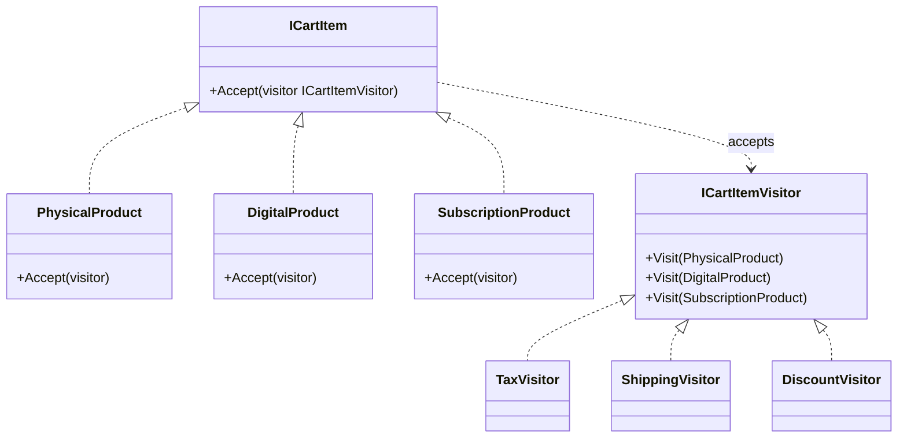

A museum can keep the same exhibits while offering a new audio tour. Each tour performs a different operation over the fixed exhibit set. Adding a tour is cheap. Adding an exhibit forces every tour to decide what to do with it.

Visitor moves operations out of a stable object hierarchy. Each element implements `Accept(IVisitor)`, then calls the overload for its concrete type with `visitor.Visit(this)`. That second call supplies the concrete element type that ordinary interface dispatch would otherwise lose. A visitor can also accumulate state while traversing several elements. The tradeoff is structural: new operations become new visitors, while a new element type changes the visitor contract and every implementation.



Modern C# pattern matching handles small type-dispatch problems with less machinery. Visitor becomes useful when the hierarchy is deliberately closed or stable, operations are added more often than element types, and traversal state belongs with the operation.

# Problem

`CartService` has switch/if on item type for every calculation — adding a new calculation means editing every method:

```csharp
public class CartService
{
    // ⚠️ Type-checking duplicated in every calculation method
    public decimal CalculateTax(ICartItem item)
    {
        if (item is PhysicalProduct physical)
            return physical.Price * 0.20m; // 20% VAT
        else if (item is DigitalProduct digital)
            return digital.Price * 0.05m; // 5% digital tax
        else if (item is SubscriptionProduct subscription)
            return 0m; // subscriptions are tax-exempt
        // ⚠️ Adding GiftCard item type requires editing CalculateTax, CalculateShipping, CalculateDiscount
        throw new NotSupportedException(item.GetType().Name);
    }

    public decimal CalculateShipping(ICartItem item)
    {
        if (item is PhysicalProduct physical)
            return physical.WeightKg * 2.50m;
        else if (item is DigitalProduct)
            return 0m; // no shipping for digital
        else if (item is SubscriptionProduct)
            return 0m;
        throw new NotSupportedException(item.GetType().Name);
    }

    // ⚠️ CalculateDiscount has the same switch — 3 methods × N item types = N×3 combinations
}
```

A new `GiftCard` type must be handled in every calculation. The compiler cannot prove that separate switches remain aligned when the hierarchy is open and each switch has a fallback.

# Solution

**Pattern matching approach** for a small hierarchy:

```csharp
// ✅ Pattern matching — no Visitor ceremony for simple type dispatch
public static class CartCalculations
{
    public static decimal CalculateTax(ICartItem item) => item switch
    {
        PhysicalProduct p => p.Price * 0.20m,
        DigitalProduct d => d.Price * 0.05m,
        SubscriptionProduct => 0m,
        GiftCard => 0m, // ✅ adding GiftCard = one new case per switch
        _ => throw new NotSupportedException(item.GetType().Name)
    };

    public static decimal CalculateShipping(ICartItem item) => item switch
    {
        PhysicalProduct p => p.WeightKg * 2.50m,
        DigitalProduct or SubscriptionProduct or GiftCard => 0m,
        _ => throw new NotSupportedException(item.GetType().Name)
    };
}
```

**Visitor approach** for a stable hierarchy with frequent new operations:

```csharp
// Element interface — accepts a visitor
public interface ICartItem
{
    decimal Price { get; }
    void Accept(ICartItemVisitor visitor); // ✅ double dispatch hook
}

// Visitor interface — one Visit overload per element type
public interface ICartItemVisitor
{
    void Visit(PhysicalProduct item);
    void Visit(DigitalProduct item);
    void Visit(SubscriptionProduct item);
}

// Concrete elements — each calls the correct Visit overload
public class PhysicalProduct : ICartItem
{
    public decimal Price { get; init; }
    public decimal WeightKg { get; init; }
    public void Accept(ICartItemVisitor visitor) => visitor.Visit(this); // ✅ double dispatch
}

public class DigitalProduct : ICartItem
{
    public decimal Price { get; init; }
    public string DownloadUrl { get; init; } = "";
    public void Accept(ICartItemVisitor visitor) => visitor.Visit(this);
}

public class SubscriptionProduct : ICartItem
{
    public decimal Price { get; init; }
    public int MonthsDuration { get; init; }
    public void Accept(ICartItemVisitor visitor) => visitor.Visit(this);
}

// Concrete visitors — each encapsulates one operation across all element types
public class TaxCalculatorVisitor : ICartItemVisitor
{
    public decimal TotalTax { get; private set; }

    public void Visit(PhysicalProduct item) => TotalTax += item.Price * 0.20m;
    public void Visit(DigitalProduct item) => TotalTax += item.Price * 0.05m;
    public void Visit(SubscriptionProduct item) { } // tax-exempt
}

public class ShippingCalculatorVisitor : ICartItemVisitor
{
    public decimal TotalShipping { get; private set; }

    public void Visit(PhysicalProduct item) => TotalShipping += item.WeightKg * 2.50m;
    public void Visit(DigitalProduct item) { } // no shipping
    public void Visit(SubscriptionProduct item) { } // no shipping
}

// ✅ Adding DiscountCalculatorVisitor = new class, zero changes to element classes
public class DiscountCalculatorVisitor(Customer customer) : ICartItemVisitor
{
    public decimal TotalDiscount { get; private set; }

    public void Visit(PhysicalProduct item) =>
        TotalDiscount += customer.Tier == CustomerTier.Gold ? item.Price * 0.10m : 0m;
    public void Visit(DigitalProduct item) =>
        TotalDiscount += customer.Tier == CustomerTier.Gold ? item.Price * 0.05m : 0m;
    public void Visit(SubscriptionProduct item) { } // no discount on subscriptions
}

// Usage
var taxVisitor = new TaxCalculatorVisitor();
foreach (var item in cart.Items)
    item.Accept(taxVisitor);
Console.WriteLine($"Total tax: {taxVisitor.TotalTax:C}");
```

The new discount operation is isolated in one visitor. Adding an element type would have the opposite cost: the visitor interface and every visitor would change.

# Framework examples

**`ExpressionVisitor`** traverses or rewrites expression trees through node-specific visit methods. LINQ providers, including EF Core, use several expression visitors during query preprocessing and translation rather than one visitor that simply emits SQL node by node.

**Roslyn `CSharpSyntaxWalker` and `CSharpSyntaxRewriter`** walk syntax trees with type-specific callbacks. The rewriter can return replacement nodes, which makes the traversal operation reusable without adding methods to Roslyn syntax node classes.

`JsonConverter<T>` is better classified as a serialization strategy than a Visitor: it replaces conversion for one target type and does not provide double dispatch over a stable hierarchy.

# Pitfalls

**New element types touch every visitor.** Adding `GiftCard` requires a new visit method and an implementation in each visitor. A frequently changing hierarchy points toward pattern matching, virtual methods, or another design where element changes remain local.

**Double dispatch is easy to obscure.** The `Accept` call exists solely to reach the overload for the concrete element type. If that mechanism does not buy meaningful operation extensibility, a switch is clearer.

# Tradeoffs

| Concern | Visitor | Pattern matching | Polymorphism (virtual methods) |
|---|---|---|---|
| Adding a new operation | New visitor class | New switch expression | Add method to interface + all classes |
| Adding a new element type | Add to interface + all visitors | Add case to each switch | New class only |
| Element hierarchy stability | Required (stable) | Flexible | Flexible |
| Carrying state across elements | Natural (visitor fields) | Awkward | Awkward |
| Readability | Double dispatch is non-obvious | Explicit and readable | Natural OOP |

Visitor fits a stable element set that receives new cross-cutting operations. Pattern matching keeps a small or changing hierarchy visible in one function. Virtual methods fit behavior that belongs naturally to each element rather than to an external operation.

# Questions

> [!QUESTION]- What is double dispatch and why does Visitor need it?
> Normal virtual dispatch selects a method from the runtime type of the receiver. Overload resolution still uses the argument's compile-time type. `Accept` first dispatches to the concrete element, where `this` has that concrete type. `visitor.Visit(this)` can then select the corresponding overload and dispatch to the concrete visitor implementation. The two calls encode both dimensions.

> [!QUESTION]- When does EF Core use ExpressionVisitor, and what does it do?
> EF Core receives a LINQ expression tree and passes it through multiple visitor-based phases that normalize, expand, translate, and shape the query. A method or member fails translation when the provider has no supported server-side mapping for that expression in its current context. The failure is broader than a missing `Visit` overload because providers often visit the node successfully but cannot translate its semantics.

> [!QUESTION]- When is pattern matching a better fit than Visitor?
> Pattern matching is usually clearer for a small hierarchy or a short operation because it needs no `Accept` method or visitor interface. Its exhaustiveness depends on the type shape: an interface hierarchy with a discard arm does not warn when a new implementation appears. Visitor earns its ceremony when the element hierarchy is stable and compile-time pressure to update every operation is an important part of the design.

# References

- [Visitor pattern](https://refactoring.guru/design-patterns/visitor)
- [ExpressionVisitor — .NET's built-in Visitor for LINQ expression trees](https://learn.microsoft.com/en-us/dotnet/api/system.linq.expressions.expressionvisitor)
- [CSharpSyntaxWalker — Roslyn's Visitor for C# syntax trees](https://learn.microsoft.com/en-us/dotnet/api/microsoft.codeanalysis.csharp.csharpsyntaxwalker)
- [Pattern matching — modern C# alternative to Visitor for type dispatch](https://learn.microsoft.com/en-us/dotnet/csharp/language-reference/operators/patterns)
