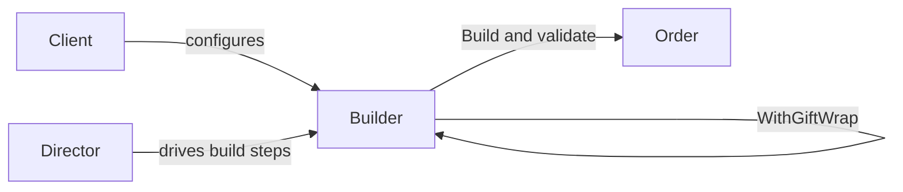

A complex object often cannot be created sensibly in one constructor call. Some inputs are optional, others interact, and derived values should never be supplied by callers.

Builder gives that construction process a temporary home. Its methods collect intent through named operations, and `Build()` checks the complete configuration before creating the product. Fluent chaining is common, but it is syntax rather than the pattern's purpose. A builder is justified when construction has real sequencing, derivation, or cross-field invariants. For a simple data object, `required` members and `init` setters are smaller and provide more compile-time help.



# Problem

`OrderService.CreateOrder()` takes a growing parameter list. Every new requirement adds another parameter:

```csharp
public class OrderService
{
    // ⚠️ 12-parameter constructor — callers must know the correct order
    public Order CreateOrder(
        Customer customer,
        List<OrderItem> items,
        Address shippingAddress,
        Address? billingAddress,      // ⚠️ null means "same as shipping" — implicit convention
        string? discountCode,
        bool giftWrap,
        string? giftMessage,
        DateTime? requestedDeliveryDate,
        string shippingCarrier,
        bool signatureRequired,
        string? specialInstructions,
        bool isBusinessOrder)
    {
        // ⚠️ Validation scattered — which combinations are invalid?
        if (giftWrap && string.IsNullOrEmpty(giftMessage))
            throw new ArgumentException("Gift wrap requires a message");
        if (requestedDeliveryDate.HasValue && requestedDeliveryDate < DateTime.UtcNow.AddDays(1))
            throw new ArgumentException("Delivery date must be at least tomorrow");

        var order = new Order
        {
            Id = Guid.NewGuid(),
            Customer = customer,
            Items = items,
            // ⚠️ Computed fields mixed with assignment — easy to miss one
            Total = items.Sum(i => i.UnitPrice * i.Quantity),
            ShippingAddress = shippingAddress,
            BillingAddress = billingAddress ?? shippingAddress,
            // ... 8 more assignments
        };
        return order;
    }
}

// ⚠️ Call site — what does 'true, null, false, true' mean?
var order = orderService.CreateOrder(customer, items, shipping, null, "SAVE10",
    true, "Happy Birthday!", null, "FedEx", false, null, false);
```

A priority-shipping flag would extend an already opaque call and can force unrelated callers to pass another placeholder value.

# Solution

`OrderBuilder` accumulates configuration through named methods and validates on `Build()`:

```csharp
public class Order
{
    public Guid Id { get; init; }
    public Customer Customer { get; init; } = null!;
    public IReadOnlyList<OrderItem> Items { get; init; } = [];
    public decimal Subtotal { get; init; }
    public decimal DiscountAmount { get; init; }
    public decimal Total { get; init; }
    public Address ShippingAddress { get; init; } = null!;
    public Address BillingAddress { get; init; } = null!;
    public ShippingOptions Shipping { get; init; } = null!;
    public GiftOptions? Gift { get; init; }
    public string? SpecialInstructions { get; init; }
    public bool IsBusinessOrder { get; init; }
}

public class OrderBuilder(Customer customer)
{
    private readonly List<OrderItem> _items = [];
    private Address? _shippingAddress;
    private Address? _billingAddress;
    private string? _discountCode;
    private GiftOptions? _gift;
    private ShippingOptions _shipping = ShippingOptions.Standard;
    private string? _specialInstructions;
    private bool _isBusinessOrder;

    public OrderBuilder AddItem(Product product, int quantity)
    {
        if (quantity <= 0) throw new ArgumentOutOfRangeException(nameof(quantity));
        _items.Add(new OrderItem(product.Id, quantity, product.Price));
        return this; // ✅ fluent — enables chaining
    }

    public OrderBuilder ShipTo(Address address)
    {
        _shippingAddress = address;
        return this;
    }

    public OrderBuilder BillTo(Address address)
    {
        _billingAddress = address;
        return this;
    }

    public OrderBuilder WithDiscount(string code)
    {
        _discountCode = code;
        return this;
    }

    public OrderBuilder WithGiftWrap(string message) // ✅ gift wrap and message are one concept
    {
        _gift = new GiftOptions(message);
        return this;
    }

    public OrderBuilder WithShipping(ShippingOptions options)
    {
        _shipping = options;
        return this;
    }

    public OrderBuilder WithSpecialInstructions(string instructions)
    {
        _specialInstructions = string.IsNullOrWhiteSpace(instructions)
            ? null
            : instructions.Trim();
        return this;
    }

    public OrderBuilder AsBusinessOrder()
    {
        _isBusinessOrder = true;
        return this;
    }

    public Order Build()
    {
        // ✅ All validation in one place
        if (_shippingAddress is null)
            throw new InvalidOperationException("Shipping address is required");
        if (_items.Count == 0)
            throw new InvalidOperationException("Order must contain at least one item");
        if (_shipping.RequestedDeliveryDate.HasValue &&
            _shipping.RequestedDeliveryDate < DateTime.UtcNow.AddDays(1))
            throw new InvalidOperationException("Delivery date must be at least tomorrow");

        var subtotal = _items.Sum(i => i.UnitPrice * i.Quantity);
        var discount = _discountCode is not null ? CalculateDiscount(subtotal, _discountCode) : 0m;

        return new Order
        {
            Id = Guid.NewGuid(),
            Customer = customer,
            Items = _items.ToArray(), // snapshot; later builder changes cannot mutate this order
            Subtotal = subtotal,
            DiscountAmount = discount,
            Total = subtotal - discount,                    // ✅ computed field, not caller's responsibility
            ShippingAddress = _shippingAddress,
            BillingAddress = _billingAddress ?? _shippingAddress, // ✅ default logic encapsulated
            Shipping = _shipping,
            Gift = _gift,
            SpecialInstructions = _specialInstructions,
            IsBusinessOrder = _isBusinessOrder
        };
    }

    private static decimal CalculateDiscount(decimal subtotal, string code) =>
        code == "SAVE10" ? subtotal * 0.10m : 0m;
}

// ✅ Call site is self-documenting
var order = new OrderBuilder(customer)
    .AddItem(laptop, 1)
    .AddItem(mouse, 2)
    .ShipTo(shippingAddress)
    .WithDiscount("SAVE10")
    .WithGiftWrap("Happy Birthday!")
    .WithShipping(ShippingOptions.Express)
    .Build();
```

Priority shipping can become a named builder operation without changing callers that use the default. The builder still has to reject combinations that the final `Order` cannot represent safely.

# Framework examples

**`WebApplicationBuilder` and `IHostBuilder`** collect services, configuration sources, and hosting options before `Build()` creates the host. `Program.cs` may coordinate those steps, though it is ordinary composition code rather than necessarily a formal Director.

**`StringBuilder`** accumulates mutable text and materializes a string with `ToString()`. It is useful for repeated or conditional assembly. Small interpolated strings remain clearer and may be optimized adequately by the compiler.

**`IQueryable<T>` chains** accumulate an expression tree before a terminal operation executes it. This resembles staged construction, but the result is query execution rather than a classic built product.

**`UriBuilder`** exposes named URI components and produces a `Uri`, avoiding manual delimiter assembly.

# Pitfalls

**Simple products.** A builder around independent assignments only duplicates an object initializer. Use `required` members when presence is the main invariant.

**Leaked mutable state.** Returning the builder's internal collection lets later builder changes mutate an already built product. Copy mutable collections, and remember that `AsReadOnly()` is only a wrapper over the same underlying list.

**Partial validation.** Local argument checks can run in individual methods, but cross-field invariants need the complete state available at `Build()`. The product should not emerge invalid merely because one construction path forgot a check.

# Tradeoffs

| Concern | Builder | Object initializer (`required`/`init`) | Telescoping constructors |
|---|---|---|---|
| Required field enforcement | Runtime (in `Build()`) | Compile-time (`required` keyword) | Compile-time |
| Optional parameters | Named methods, self-documenting | Named properties, self-documenting | Combinatorial explosion |
| Validation | Centralized in `Build()` | Must use custom setter or factory | Scattered across overloads |
| Computed fields | Encapsulated in `Build()` | Caller's responsibility | Caller's responsibility |
| Fluent chaining | Yes | No | No |
| Complexity | High | Low | Medium |

Start with a constructor or object initializer. Builder earns a separate type when `Build()` performs meaningful work across several inputs or when a reusable construction sequence needs a stable API.

# Questions

> [!QUESTION]- When is a Builder worth using instead of a constructor?
> A Builder is useful when inputs arrive across several steps and the complete object must be checked before it is created. `Build()` can validate relationships between those inputs and calculate values that callers should not supply. A constructor is still better when all required values fit in one clear call and it can enforce the same invariants directly. Async initialization usually belongs in an asynchronous factory because a conventional `Build()` cannot be awaited.

> [!QUESTION]- Why does `WebApplicationBuilder` use a builder instead of a constructor with parameters?
> Hosting configuration arrives from several extension points before the application can be assembled. The builder gives those registrations one mutable setup phase, then `Build()` creates the service provider and host. Most dependency completeness remains a runtime property, so startup validation still matters.

# References

- [Builder pattern](https://refactoring.guru/design-patterns/builder)
- [WebApplicationBuilder — .NET's primary Builder in production use](https://learn.microsoft.com/en-us/dotnet/api/microsoft.aspnetcore.builder.webapplicationbuilder)
- [StringBuilder — the original .NET Builder for string construction](https://learn.microsoft.com/en-us/dotnet/api/system.text.stringbuilder)
- [Required members (C# reference) — modern C# alternative for simple object construction](https://learn.microsoft.com/en-us/dotnet/csharp/language-reference/keywords/required)
