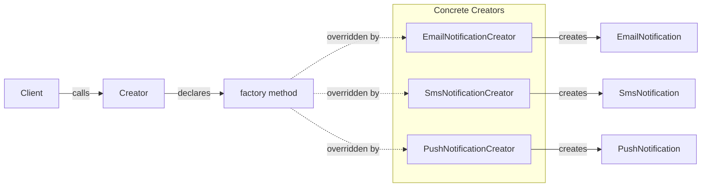

Sometimes a base workflow knows when it needs a collaborator but cannot choose the concrete implementation. A notification workflow can save an order and send a confirmation while a subtype decides whether the sender uses email or SMS.

Factory Method puts that creation decision in an overridable method. The creator owns the surrounding algorithm and works with the returned product interface. Concrete creators override the factory method to supply one product implementation. This is the pattern's defining boundary: product selection varies through creator inheritance, while the rest of the creator workflow stays shared.



> [!NOTE] Factory Method vs Abstract Factory
> Factory Method varies one creation step through a creator subtype. [[Software Architecture/Patterns/Design Patterns/Creational/Abstract Factory]] is a composed object that supplies a family of related products. A standalone factory function may be smaller than either when no creator workflow or product family exists.

# Problem

A deployment selects one notification channel at startup, but `OrderService` still owns the channel switch and concrete construction:

```csharp
public class OrderService(string notificationChannel)
{
    public async Task PlaceOrderAsync(Order order)
    {
        await SaveOrderAsync(order);

        // ⚠️ Deployment-fixed selection still leaks into the order workflow
        var channel = notificationChannel;
        if (channel == "email")
        {
            var emailSender = new SmtpEmailSender("smtp.example.com", 587); // ⚠️ hardcoded config
            await emailSender.SendAsync(order.Customer.Email,
                "Order Confirmed", BuildEmailBody(order));
        }
        else if (channel == "sms")
        {
            var smsSender = new TwilioSmsSender(Environment.GetEnvironmentVariable("TWILIO_SID")!);
            await smsSender.SendAsync(order.Customer.Phone, BuildSmsBody(order));
        }
        else if (channel == "push")
        {
            var pushSender = new FirebasePushSender(Environment.GetEnvironmentVariable("FCM_KEY")!);
            await pushSender.SendAsync(order.Customer.DeviceToken, "Order Confirmed", BuildPushBody(order));
        }
        // ⚠️ Adding Slack, webhook, or WhatsApp means editing this method again
    }
}
```

Supporting Slack changes the order workflow even though one creator could be selected once for the whole deployment.

# Solution

Extract notification construction into a creator hierarchy, then register one concrete creator for the deployment:

```csharp
// Product interface
public interface INotificationSender
{
    Task SendOrderConfirmationAsync(Order order);
}

// Concrete products
public class EmailNotificationSender : INotificationSender
{
    private readonly SmtpEmailSender _smtp;
    public EmailNotificationSender(SmtpEmailSender smtp) => _smtp = smtp;

    public Task SendOrderConfirmationAsync(Order order) =>
        _smtp.SendAsync(order.Customer.Email, "Order Confirmed", BuildBody(order));

    private static string BuildBody(Order order) =>
        $"Hi {order.Customer.Name}, your order #{order.Id} for {order.Total:C} is confirmed.";
}

public class SmsNotificationSender : INotificationSender
{
    private readonly TwilioSmsSender _twilio;
    public SmsNotificationSender(TwilioSmsSender twilio) => _twilio = twilio;

    public Task SendOrderConfirmationAsync(Order order) =>
        _twilio.SendAsync(order.Customer.Phone,
            $"Order #{order.Id} confirmed. Total: {order.Total:C}");
}

public class SlackNotificationSender : INotificationSender // ✅ new channel = new class, zero edits elsewhere
{
    private readonly SlackClient _slack;
    public SlackNotificationSender(SlackClient slack) => _slack = slack;

    public Task SendOrderConfirmationAsync(Order order) =>
        _slack.PostAsync(order.Customer.SlackUserId,
            $":white_check_mark: Order #{order.Id} placed — {order.Total:C}");
}

// Creator — declares the factory method
public abstract class NotificationCreator
{
    public abstract INotificationSender CreateSender(); // ✅ factory method

    public async Task NotifyOrderConfirmedAsync(Order order)
    {
        var sender = CreateSender(); // ✅ creator doesn't know the concrete type
        await sender.SendOrderConfirmationAsync(order);
    }
}

// Concrete creators
public class EmailNotificationCreator(SmtpEmailSender smtp) : NotificationCreator
{
    public override INotificationSender CreateSender() => new EmailNotificationSender(smtp);
}

public class SmsNotificationCreator(TwilioSmsSender twilio) : NotificationCreator
{
    public override INotificationSender CreateSender() => new SmsNotificationSender(twilio);
}

// Composition root selects one channel for this deployment
builder.Services.AddSingleton<NotificationCreator, EmailNotificationCreator>();

// OrderService now depends on the abstraction
public class OrderService(NotificationCreator notificationCreator)
{
    public async Task PlaceOrderAsync(Order order)
    {
        await SaveOrderAsync(order);
        await notificationCreator.NotifyOrderConfirmedAsync(order); // ✅ no switch, no channel knowledge
    }
}
```

Slack can be added as another creator subtype without changing the order workflow. The composition root selects the deployment's creator at startup.

# Related .NET factory APIs

**`ILoggerFactory.CreateLogger()`** is a factory API that returns an `ILogger` for a category. It illustrates construction behind an interface, but it is not the textbook inheritance form because consumers do not subclass the creator to override the method.

**`DbProviderFactory`** exposes several creation methods for one database-provider family, making it a closer example of Abstract Factory. Individual methods such as `CreateConnection()` still demonstrate returning a product abstraction without naming its concrete class.

**`Task.FromResult<T>()`** is a static factory function, not the GoF Factory Method pattern. It is useful terminology to distinguish: many APIs called "factory methods" do not involve an overridable creator hierarchy.

# Questions

> [!QUESTION]- When does Factory Method become the wrong choice?
> It is the wrong fit when no creator algorithm needs an overridable construction hook. A static factory or DI registration is smaller for simple selection. When several product types must vary together, an Abstract Factory makes that family boundary explicit.

> [!QUESTION]- How does Factory Method support the Open/Closed Principle?
> The shared creator algorithm can remain unchanged while a new subtype supplies another product. This protects only the creation variation anticipated by the abstraction. A change to the workflow or product contract still modifies existing code. If subtypes exist solely to return different constructors, a registry or DI registration may express the variation with fewer classes.

# References

- [Factory Method pattern](https://refactoring.guru/design-patterns/factory-method)
- [Factory Method Pattern — Christopher Okhravi](https://www.youtube.com/watch?v=EcFVTgRHJLM\&list=PLrhzvIcii6GNjpARdnO4ueTUAVR9eMBpc\&index=4)
- [ILoggerFactory interface — .NET logging factory method in production use](https://learn.microsoft.com/en-us/dotnet/api/microsoft.extensions.logging.iloggerfactory)
