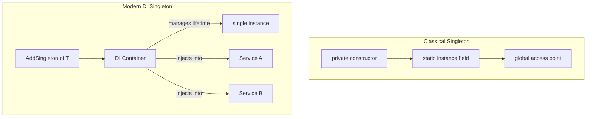

Singleton combines two decisions: keep one instance within a defined boundary and provide access to it. The boundary is easy to miss. A classical static implementation owns a process-level access point, while `.AddSingleton<T>()` reuses one instance for subsequent resolutions from a particular root service provider and registration. A second provider or direct construction can still create another instance.

Application services normally need container-managed lifetime rather than global static access. Constructor injection keeps the dependency visible, lets the container dispose it, and exposes lifetime mistakes during validation. The classical form remains relevant when a library genuinely owns a single access point without a DI container.



# Problem

The classical form below enforces access through `AppConfig.Instance`, but it also hides the dependency from every consumer:

```csharp
// Classical Singleton — the pattern most tutorials show
public class AppConfig
{
    private static AppConfig? _instance;
    private static readonly object _lock = new();

    // ⚠️ Private constructor prevents DI container from creating instances
    private AppConfig()
    {
        ConnectionString = Environment.GetEnvironmentVariable("DB_CONNECTION")!;
        MaxOrdersPerHour = int.Parse(Environment.GetEnvironmentVariable("MAX_ORDERS") ?? "100");
    }

    // ⚠️ Double-checked locking — easy to get wrong, unnecessary with Lazy<T>
    public static AppConfig Instance
    {
        get
        {
            if (_instance is null)
            {
                lock (_lock)
                {
                    _instance ??= new AppConfig();
                }
            }
            return _instance;
        }
    }

    public string ConnectionString { get; }
    public int MaxOrdersPerHour { get; }
}

public class OrderService
{
    public async Task PlaceOrderAsync(Order order)
    {
        // ⚠️ Hidden dependency — not visible in constructor, can't be mocked in tests
        var config = AppConfig.Instance;
        if (await GetOrderCountLastHourAsync(order.Customer.Id) >= config.MaxOrdersPerHour)
            throw new RateLimitException("Order rate limit exceeded");
        // ...
    }
}
```

`OrderService` can no longer declare or replace the configuration it uses. Tests inherit environment access and shared state, and lifetime policy is fixed inside the dependency instead of at the composition root.

# Solution

Register a normal service with singleton lifetime and inject it. The container controls creation and disposal. The consumer only knows its contract.

```csharp
// ✅ Plain class — no static members, no private constructor
public interface IAppConfig
{
    string ConnectionString { get; }
    int MaxOrdersPerHour { get; }
}

public class AppConfig : IAppConfig
{
    public string ConnectionString { get; init; }
    public int MaxOrdersPerHour { get; init; }

    public AppConfig(IConfiguration configuration)
    {
        ConnectionString = configuration.GetConnectionString("Default")
            ?? throw new InvalidOperationException("DB connection string not configured");
        MaxOrdersPerHour = configuration.GetValue<int>("RateLimiting:MaxOrdersPerHour", 100);
    }
}

// ✅ Register as singleton in DI — one instance for this service contract
builder.Services.AddSingleton<IAppConfig, AppConfig>();

// ✅ OrderService declares its dependency explicitly
public class OrderService(IAppConfig config, IOrderRepository repository)
{
    public async Task PlaceOrderAsync(Order order)
    {
        // ✅ config is injected — can be mocked in tests
        if (await repository.GetOrderCountLastHourAsync(order.Customer.Id) >= config.MaxOrdersPerHour)
            throw new RateLimitException("Order rate limit exceeded");
        await repository.SaveAsync(order);
    }
}

// ✅ Test: inject a mock config with controlled values
[Fact]
public async Task PlaceOrder_ExceedsRateLimit_Throws()
{
    var config = Substitute.For<IAppConfig>();
    config.MaxOrdersPerHour.Returns(5);
    var repository = Substitute.For<IOrderRepository>();
    repository.GetOrderCountLastHourAsync(Arg.Any<Guid>()).Returns(5);

    var service = new OrderService(config, repository);
    await Assert.ThrowsAsync<RateLimitException>(() =>
        service.PlaceOrderAsync(new Order { Customer = new Customer { Id = Guid.NewGuid() } }));
}

// When you genuinely need lazy initialization (e.g., expensive resource):
public class ExpensiveConnectionPool
{
    // ✅ Lazy<T> is thread-safe by default, no manual locking needed
    private static readonly Lazy<ExpensiveConnectionPool> _instance =
        new(() => new ExpensiveConnectionPool());

    public static ExpensiveConnectionPool Instance => _instance.Value;
    private ExpensiveConnectionPool() { /* expensive initialization */ }
}
```

# Singleton Lifetime in .NET

**`services.AddSingleton<T>()`** caches one service instance in the root provider and returns it for later resolutions. This is a lifetime rule, not proof that no other instance can exist.

**`Lazy<T>`** supplies thread-safe deferred initialization for a classical implementation. It removes hand-written double-checked locking, but it does not remove global state or hidden dependencies.

Singleton services may be stateless or hold shared state. Either way, their implementations and any mutable dependencies must be safe for concurrent callers.

# Pitfalls

**Captive dependency.** A singleton that constructor-injects a scoped service keeps that instance beyond its intended scope. Scope validation rejects this graph. When work genuinely needs scoped state, create and dispose an explicit scope for the operation or move the operation to a scoped service.

**Shared mutable state.** One instance may serve concurrent requests. The container makes resolution thread-safe. It does not make the service's fields or dependencies thread-safe.

**Oversized lifetime.** A singleton retains its dependency graph until the provider is disposed. Large caches, failed state, or request-specific data can then survive far longer than intended.

**Multiple roots.** Calling `BuildServiceProvider` during registration creates another container and therefore another singleton set. Keep one composition root and avoid static service locators.

# Questions

> [!QUESTION]- How does a DI singleton differ from the classical Singleton pattern?
> A classical Singleton type controls construction and exposes a global access point. A DI singleton is a container lifetime: one root provider reuses one registered instance, while consumers receive it through declared dependencies. Other providers or direct construction can still produce more instances.

> [!QUESTION]- What must be true before choosing singleton lifetime for mutable state?
> The state must be intentionally shared across all callers in that provider, safe under concurrent access, bounded in memory, and independent of scoped data. If any condition fails, a scoped or transient lifetime is usually safer.

# References

- [Singleton pattern](https://refactoring.guru/design-patterns/singleton)
- [Singleton Pattern — Christopher Okhravi](https://www.youtube.com/watch?v=hUE_j6q0LTQ\&list=PLrhzvIcii6GNjpARdnO4ueTUAVR9eMBpc\&index=6)
