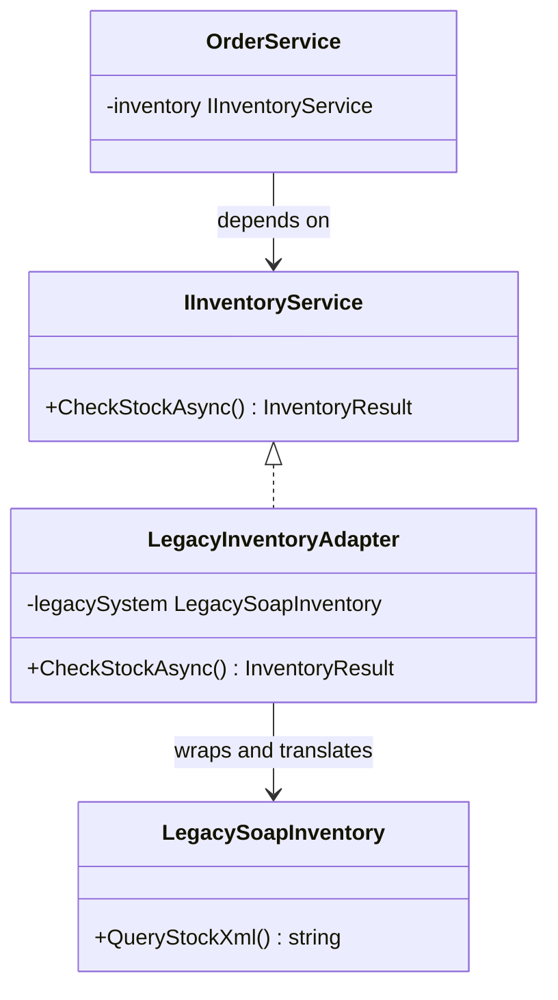

A travel plug adapter lets a US charger connect to a European outlet. It changes neither device. The small piece between them translates one physical interface into the other.

The Adapter pattern applies the same idea to software. An adapter implements the interface expected by client code and delegates to an incompatible object, the adaptee. Translation stays at that boundary: method names can be mapped, data reshaped, and return values converted without modifying either side. The original capability remains intact behind a compatible interface.



> [!NOTE] Adapter vs Facade vs Bridge
> **Adapter** retrofits compatibility onto an existing interface. [[Software Architecture/Patterns/Design Patterns/Structural/Facade]] puts a simpler interface over a complex subsystem. [[Software Architecture/Patterns/Design Patterns/Structural/Bridge]] separates abstraction from implementation as part of the design.

# Problem

`OrderService` directly calls a legacy SOAP/XML inventory system. The legacy interface leaks into the order domain:

```csharp
public class OrderService
{
    private readonly LegacyInventorySystem _legacyInventory;

    public OrderService(LegacyInventorySystem legacyInventory)
    {
        _legacyInventory = legacyInventory;
    }

    public async Task<bool> ReserveInventoryAsync(Order order)
    {
        foreach (var item in order.Items)
        {
            // ⚠️ Legacy XML format leaks into order domain logic
            var xmlRequest = $"""
                <InventoryRequest>
                    <SKU>{item.ProductId}</SKU>
                    <Quantity>{item.Quantity}</Quantity>
                    <WarehouseCode>WH-001</WarehouseCode>
                </InventoryRequest>
                """;

            // ⚠️ Parsing XML response in the middle of order logic
            var xmlResponse = await _legacyInventory.CheckAndReserveAsync(xmlRequest);
            var doc = XDocument.Parse(xmlResponse);
            var success = doc.Root?.Element("Status")?.Value == "RESERVED";

            if (!success)
            {
                // ⚠️ Error handling tied to legacy error codes
                var errorCode = doc.Root?.Element("ErrorCode")?.Value;
                if (errorCode == "INSUF_STOCK")
                    return false;
                throw new Exception($"Legacy inventory error: {errorCode}");
            }
        }
        return true;
    }
}
```

Replacing the legacy system with a REST API now requires rewriting `OrderService` because XML parsing and legacy error codes have leaked into its domain logic.

# Solution

`IInventoryService` gives the order domain a stable contract. The adapter owns every translation between that contract and the legacy system:

```csharp
// Target interface — what OrderService wants to work with
public interface IInventoryService
{
    Task<InventoryReservation> ReserveAsync(Guid productId, int quantity, string warehouseCode);
    Task ReleaseAsync(string reservationId);
}

public record InventoryReservation(string ReservationId, bool Success, string? FailureReason);

// Adaptee — the legacy system we can't change
public class LegacyInventorySystem
{
    public Task<string> CheckAndReserveAsync(string xmlRequest) => /* SOAP call */ Task.FromResult("");
    public Task<string> ReleaseReservationAsync(string xmlReleaseRequest) => Task.FromResult("");
}

// Adapter — translates between IInventoryService and LegacyInventorySystem
public class LegacyInventoryAdapter(LegacyInventorySystem legacy) : IInventoryService
{
    public async Task<InventoryReservation> ReserveAsync(Guid productId, int quantity, string warehouseCode)
    {
        // ✅ XML translation isolated here — OrderService never sees it
        var xmlRequest = new XElement(
            "InventoryRequest",
            new XElement("SKU", productId),
            new XElement("Quantity", quantity),
            new XElement("WarehouseCode", warehouseCode)).ToString(SaveOptions.DisableFormatting);

        var xmlResponse = await legacy.CheckAndReserveAsync(xmlRequest);
        var doc = XDocument.Parse(xmlResponse);
        var status = doc.Root?.Element("Status")?.Value;

        return status == "RESERVED"
            ? new InventoryReservation(doc.Root!.Element("ReservationId")!.Value, true, null)
            : new InventoryReservation("", false, MapLegacyError(doc.Root?.Element("ErrorCode")?.Value));
    }

    public async Task ReleaseAsync(string reservationId)
    {
        var xmlRequest = new XElement(
            "ReleaseRequest",
            new XElement("ReservationId", reservationId)).ToString(SaveOptions.DisableFormatting);
        await legacy.ReleaseReservationAsync(xmlRequest);
    }

    private static string MapLegacyError(string? errorCode) => errorCode switch
    {
        "INSUF_STOCK" => "Insufficient stock",
        "SKU_NOT_FOUND" => "Product not found in inventory",
        _ => $"Inventory error: {errorCode}"
    };
}

// ✅ OrderService works against the clean interface — no XML, no legacy error codes
public class OrderService(IInventoryService inventory)
{
    public async Task<bool> ReserveInventoryAsync(Order order)
    {
        foreach (var item in order.Items)
        {
            var reservation = await inventory.ReserveAsync(item.ProductId, item.Quantity, "WH-001");
            if (!reservation.Success)
                return false;
        }
        return true;
    }
}

// Replacing legacy with modern REST API = swap the adapter, zero changes to OrderService
builder.Services.AddScoped<IInventoryService, ModernInventoryRestAdapter>();
```

Replacing the legacy system now requires a new adapter. `OrderService` stays unchanged.

# Common .NET Examples

**`StreamReader` / `StreamWriter`** adapt the byte-oriented `Stream` interface to text. `new StreamReader(fileStream)` wraps a `FileStream` and exposes operations such as `ReadLine()` and `ReadToEnd()`.

**`ILogger` adapters** let code depend on `ILogger<T>` while a provider translates calls to Serilog, NLog, or Application Insights.

**A boundary `DelegatingHandler`** can contain Adapter logic when it translates an external message shape into an application contract. The handler chain itself is Decorator. Translation inside a handler is the Adapter responsibility.

# Pitfalls

**Leaky abstraction.** Legacy error codes or protocol rules do not belong in the target interface. `IInventoryService.ReserveAsync` should return domain results, while the adapter maps every legacy concept at the boundary. Operational constraints that cannot be translated, such as a provider rate limit, still need explicit handling elsewhere.

# Questions

> [!QUESTION]- How can an Adapter be distinguished from a Facade when both wrap another system?
> An Adapter translates an incompatible interface into the contract a client expects. A Facade gives clients a smaller, workflow-oriented API and may coordinate several subsystem calls. For example, a wrapper that exposes three business operations over twenty legacy calls is acting as a Facade, even if some translation also happens inside it.

# References

- [Adapter pattern](https://refactoring.guru/design-patterns/adapter)
- [Adapter Pattern — Christopher Okhravi](https://www.youtube.com/watch?v=2PKQtcJjYvc\&list=PLrhzvIcii6GNjpARdnO4ueTUAVR9eMBpc\&index=8)
- [StreamReader — .NET's built-in Adapter for byte-to-text stream translation](https://learn.microsoft.com/en-us/dotnet/api/system.io.streamreader)
- [DelegatingHandler — HTTP pipeline adapter pattern in .NET](https://learn.microsoft.com/en-us/dotnet/api/system.net.http.delegatinghandler)
