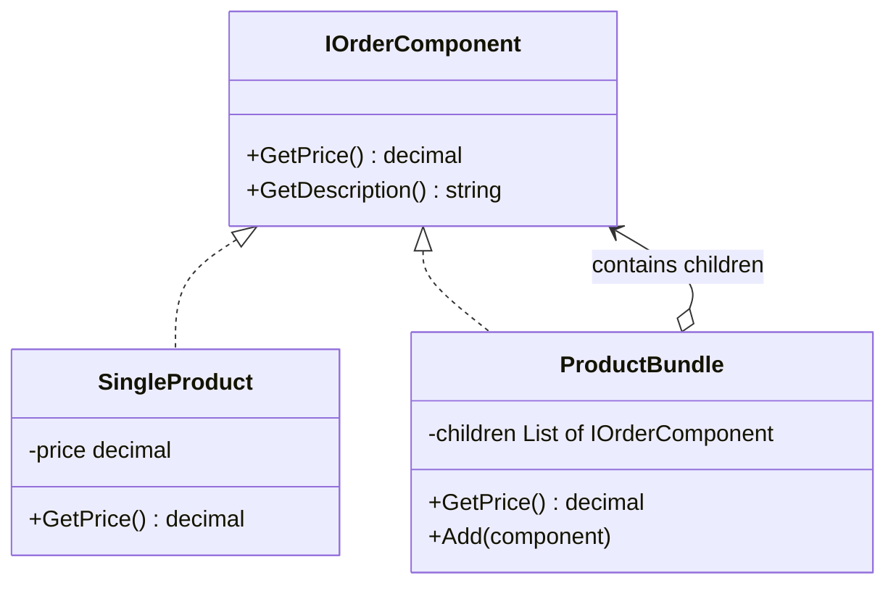

A military command structure is a natural Composite. A general gives an order to a division, which passes it to brigades, which pass it to battalions, down to individual soldiers. Whether you command one soldier or an entire army, the interface is the same: "execute this order." The hierarchy handles the recursion — the general doesn’t need to know whether a unit is a single person or ten thousand.

The Composite pattern composes objects into tree structures and lets clients treat individual objects and compositions uniformly through a shared interface. Leaf nodes (single items) implement the interface directly. Composite nodes (containers) implement the same interface but delegate to their children recursively. In an e-commerce system, a `SingleProduct` has a price. A `ProductBundle` also has a price — calculated by summing its children, which can themselves be products or nested bundles. The client calls `GetPrice()` on either without knowing or caring which type it holds.



# Problem

`PricingService` has separate logic for individual products, simple bundles, and nested bundles. Three code paths, recursive logic scattered in the service:

```csharp
public class PricingService
{
    // ⚠️ Three separate methods for what is conceptually one operation
    public decimal GetProductPrice(Product product) => product.Price;

    public decimal GetBundlePrice(ProductBundle bundle)
    {
        decimal total = 0;
        foreach (var item in bundle.Items)
        {
            // ⚠️ Type-checking — breaks when a new item type is added
            if (item is Product p)
                total += p.Price;
            else if (item is ProductBundle subBundle)
                total += GetBundlePrice(subBundle); // ⚠️ manual recursion in the service
            else
                throw new NotSupportedException($"Unknown item type: {item.GetType().Name}");
        }
        return total * (1 - bundle.DiscountPercent / 100m);
    }

    // ⚠️ Cart pricing duplicates the same type-checking logic
    public decimal GetCartTotal(ShoppingCart cart)
    {
        decimal total = 0;
        foreach (var item in cart.Items)
        {
            if (item is Product p) total += p.Price * item.Quantity;
            else if (item is ProductBundle b) total += GetBundlePrice(b) * item.Quantity;
            // ⚠️ Adding SubscriptionProduct requires editing this AND GetBundlePrice
        }
        return total;
    }
}
```

Here's what breaks when requirements change: adding a `SubscriptionProduct` type requires editing every method that type-checks items — `GetBundlePrice`, `GetCartTotal`, and any future pricing methods.

# Solution

Define `IOrderComponent` — both `SingleProduct` and `ProductBundle` implement it. Pricing is recursive and uniform:

```csharp
// Component interface — the uniform contract
public interface IOrderComponent
{
    string Name { get; }
    decimal GetPrice();
    int GetItemCount(); // works for both leaf and composite
}

// Leaf — individual product
public class SingleProduct(Product product) : IOrderComponent
{
    public string Name => product.Name;
    public decimal GetPrice() => product.Price;
    public int GetItemCount() => 1;
}

// Composite — bundle containing other components (products or sub-bundles)
public class ProductBundle : IOrderComponent
{
    private readonly List<IOrderComponent> _components = [];
    private readonly decimal _discountPercent;

    public ProductBundle(string name, decimal discountPercent = 0)
    {
        Name = name;
        _discountPercent = discountPercent;
    }

    public string Name { get; }

    public void Add(IOrderComponent component) => _components.Add(component);
    public void Remove(IOrderComponent component) => _components.Remove(component);

    // ✅ Recursive — delegates to children, which may themselves be composites
    public decimal GetPrice()
    {
        var subtotal = _components.Sum(c => c.GetPrice());
        return subtotal * (1 - _discountPercent / 100m);
    }

    public int GetItemCount() => _components.Sum(c => c.GetItemCount()); // ✅ recursive count
}

// ✅ Adding SubscriptionProduct = new leaf class, zero changes to bundle or pricing logic
public class SubscriptionProduct(Product plan, int months) : IOrderComponent
{
    public string Name => $"{plan.Name} ({months}mo)";
    public decimal GetPrice() => plan.Price * months;
    public int GetItemCount() => 1;
}

// PricingService works against IOrderComponent — no type-checking
public class PricingService
{
    // ✅ One method handles products, bundles, nested bundles, subscriptions — uniformly
    public decimal GetPrice(IOrderComponent component) => component.GetPrice();

    public decimal GetCartTotal(IReadOnlyList<(IOrderComponent Component, int Quantity)> items) =>
        items.Sum(i => i.Component.GetPrice() * i.Quantity);
}

// Building a nested bundle tree
var laptop = new SingleProduct(new Product { Name = "Laptop Pro", Price = 1299m });
var mouse = new SingleProduct(new Product { Name = "Wireless Mouse", Price = 49m });
var keyboard = new SingleProduct(new Product { Name = "Mechanical Keyboard", Price = 129m });

var peripheralsBundle = new ProductBundle("Peripherals Bundle", discountPercent: 10);
peripheralsBundle.Add(mouse);
peripheralsBundle.Add(keyboard);

var workstationBundle = new ProductBundle("Workstation Bundle", discountPercent: 15);
workstationBundle.Add(laptop);
workstationBundle.Add(peripheralsBundle); // ✅ bundle-of-bundles — same interface

// ✅ Client doesn't know or care about the tree structure
Console.WriteLine($"Total: {workstationBundle.GetPrice():C}");
Console.WriteLine($"Items: {workstationBundle.GetItemCount()}");
```

Adding a `SubscriptionProduct` now means one new class implementing `IOrderComponent` — `ProductBundle` and `PricingService` never change.

# You Already Use This

**`IConfiguration` with multiple providers** — `IConfiguration` is a Composite. The root configuration is a tree of `IConfigurationSection` nodes. JSON file, environment variables, and user secrets are leaf providers; the root `IConfigurationRoot` is the composite that merges them. `configuration["ConnectionStrings:Default"]` traverses the tree uniformly.

**`CompositeFileProvider`** — composes multiple `IFileProvider` instances (physical disk, embedded resources, manifest) into one. `fileProvider.GetFileInfo("wwwroot/app.js")` searches all providers uniformly.

**`CancellationTokenSource.CreateLinkedTokenSource()`** — creates a composite cancellation token that fires when ANY of the linked tokens is cancelled. The composite token behaves like a single token to callers.

**Blazor component tree** — every Blazor component is a composite. `RenderFragment` children are composed into a tree; the renderer traverses it uniformly without knowing whether a node is a leaf component or a layout with children.

# Pitfalls

**Treating all components uniformly when some operations only apply to composites** — `IOrderComponent` doesn't expose `Add()`/`Remove()` because leaves don't support children. If you add these to the interface, leaves must throw `NotSupportedException` — a violation of the Liskov Substitution Principle. Keep the component interface to operations that make sense for both leaves and composites. Expose child management only on the `ProductBundle` class directly.

**Infinite recursion from circular references** — if a bundle accidentally contains itself (directly or through a chain), `GetPrice()` will stack overflow. Guard against cycles when building the tree: check that a component isn't already an ancestor before adding it.

**Performance on deep trees** — `GetPrice()` traverses the entire tree on every call. For large catalogs with deep nesting, cache the computed price and invalidate when the tree changes. EF Core's `IConfiguration` tree is read-only after build for this reason.

# Tradeoffs

| Concern | Composite | Type-checking in service |
|---|---|---|
| Adding a new item type | New leaf class, zero changes to service | Edit every method that type-checks |
| Recursive operations | Automatic via delegation | Manual recursion in service |
| Type safety | Uniform interface, no casting | Explicit type checks, runtime errors |
| Leaf-only operations | Must be excluded from interface | Can be called directly on concrete type |
| Complexity | Tree structure, recursive calls | Flat logic, easier to trace |

**Decision rule**: Use Composite when you have a genuine part-whole hierarchy where clients need to treat leaves and composites uniformly, and you expect new leaf types to be added. If the hierarchy is fixed (always just products and bundles, never new types), the extra abstraction may not be worth it. The signal is when you find yourself writing `if (item is X) ... else if (item is Y)` in multiple places.

# Questions

> [!QUESTION]- How does Composite relate to the Visitor pattern?
> They're complementary. Composite defines the tree structure and uniform traversal. Visitor adds new operations to the tree without modifying the node classes. Example: `TaxVisitor`, `ShippingVisitor`, and `DiscountVisitor` can each traverse the same `IOrderComponent` tree without adding methods to `SingleProduct` or `ProductBundle`. Use Composite when the structure varies; use Visitor when the operations vary. Together, they handle both dimensions of variation.

> [!QUESTION]- When does a Composite tree become a performance problem?
> When the tree is large, deep, or frequently traversed. `GetPrice()` on a bundle with 10,000 SKUs traverses all 10,000 nodes on every call. Mitigations: (1) cache computed values and invalidate on mutation, (2) use lazy evaluation (compute only when accessed), (3) denormalize — store the precomputed total and update it incrementally. The signal: profiling shows `GetPrice()` appearing in hot paths. The cost of caching: stale values if the tree is mutated without invalidation.

# References

- [Composite Pattern — Christopher Okhravi](https://www.youtube.com/watch?v=EWDmWbJ4wRA\&list=PLrhzvIcii6GNjpARdnO4ueTUAVR9eMBpc\&index=14) — video walkthrough of the Composite pattern with OOP examples
- [Composite — refactoring.guru](https://refactoring.guru/design-patterns/composite) — canonical pattern description with tree structure diagram and C# example
- [IConfiguration — Microsoft Learn](https://learn.microsoft.com/en-us/dotnet/api/microsoft.extensions.configuration.iconfiguration) — .NET's built-in Composite for layered configuration
- [CompositeFileProvider — Microsoft Learn](https://learn.microsoft.com/en-us/dotnet/api/microsoft.extensions.fileproviders.compositefileprovider) — composing multiple file providers uniformly
- [Design Patterns: Elements of Reusable Object-Oriented Software — GoF](https://www.amazon.com/Design-Patterns-Elements-Reusable-Object-Oriented/dp/0201633612) — original Composite pattern with transparency vs safety tradeoff discussion
