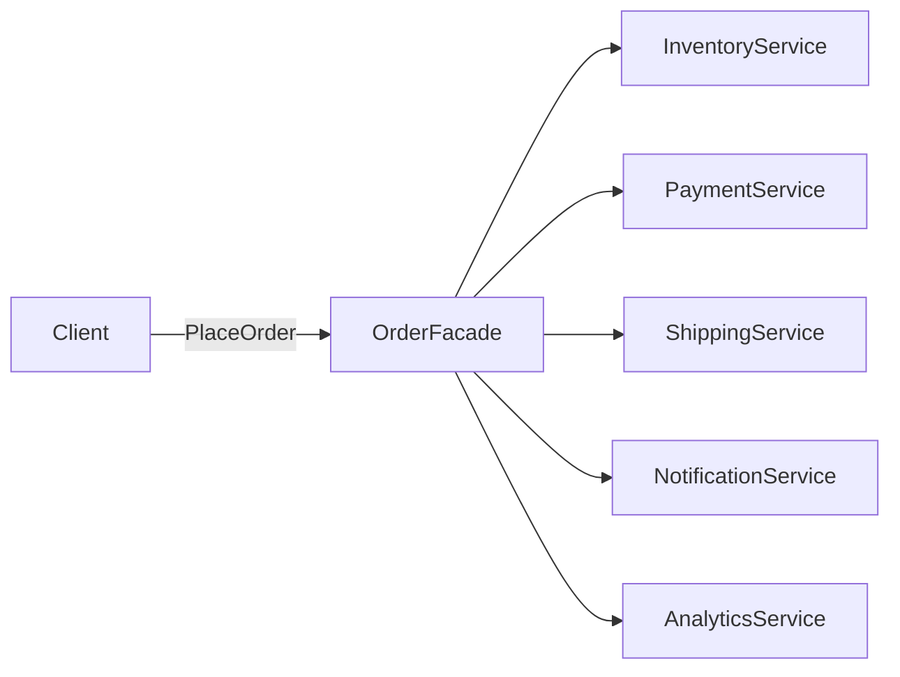

A hotel concierge gives guests one contact for services that still run independently behind the desk. The concierge adds no new capability. The value is a simpler entry point and knowledge of the required sequence.

The Facade pattern presents a high-level interface over a complex subsystem. A facade holds the participating components and coordinates them through operations such as `OrderFacade.PlaceOrderAsync(order)`. Clients avoid duplicating the workflow or depending on the subsystem's internal shape. Lower-level components may remain available when fine control is legitimate. The facade is an entry point, not a mandatory gate.



> [!NOTE] Facade vs Adapter
> Facade creates a simpler interface over an existing subsystem. [[Software Architecture/Patterns/Design Patterns/Structural/Adapter]] converts an incompatible interface into a required target contract. Direct subsystem access remains possible without a Facade. Incompatible interfaces cannot collaborate without an Adapter or equivalent translation.

# Problem

`CheckoutController` orchestrates 5 services directly. The controller knows too much:

```csharp
[ApiController]
public class CheckoutController(
    IInventoryService inventory,
    IPaymentService payment,
    IShippingService shipping,
    INotificationService notification,
    IAnalyticsService analytics,
    IOrderRepository orderRepository) : ControllerBase
{
    [HttpPost]
    public async Task<IActionResult> CheckoutAsync(CheckoutRequest request)
    {
        // ⚠️ Controller orchestrates 5 services — knows the entire checkout workflow
        var order = await orderRepository.CreateDraftAsync(request.CustomerId, request.Items);

        // ⚠️ Inventory check
        foreach (var item in order.Items)
        {
            var available = await inventory.CheckStockAsync(item.ProductId, item.Quantity);
            if (!available)
                return BadRequest($"Product {item.ProductId} is out of stock");
        }

        // ⚠️ Payment
        var paymentResult = await payment.ChargeAsync(order.Total, request.PaymentMethod);
        if (!paymentResult.Success)
            return BadRequest("Payment failed");

        // ⚠️ Reserve inventory after payment
        await inventory.ReserveAsync(order.Items);

        // ⚠️ Create shipping label
        var shipment = await shipping.CreateLabelAsync(order, request.ShippingAddress);

        // ⚠️ Notifications and analytics — controller shouldn't know about these
        await notification.SendOrderConfirmationAsync(order, shipment.TrackingNumber);
        await analytics.TrackOrderPlacedAsync(order);

        await orderRepository.ConfirmAsync(order.Id, paymentResult.TransactionId, shipment.TrackingNumber);
        return Ok(new { OrderId = order.Id, TrackingNumber = shipment.TrackingNumber });
    }
}
```

Adding fraud detection requires editing the controller. Other order-entry endpoints also duplicate the workflow and can drift into different sequencing or error handling.

# Solution

`OrderFacade` owns the checkout orchestration. The controller depends on that single entry point:

```csharp
public record CheckoutResult(Guid OrderId, string TrackingNumber, decimal Total);

public class OrderFacade(
    IInventoryService inventory,
    IPaymentService payment,
    IShippingService shipping,
    INotificationService notification,
    IAnalyticsService analytics,
    IOrderRepository orderRepository)
{
    // ✅ Checkout workflow in one place — all callers use the same orchestration
    public async Task<CheckoutResult> PlaceOrderAsync(
        Customer customer,
        IReadOnlyList<OrderItem> items,
        Address shippingAddress,
        PaymentMethod paymentMethod)
    {
        var order = await orderRepository.CreateDraftAsync(customer.Id, items);

        foreach (var item in order.Items)
        {
            if (!await inventory.CheckStockAsync(item.ProductId, item.Quantity))
                throw new OutOfStockException(item.ProductId);
        }

        var paymentResult = await payment.ChargeAsync(order.Total, paymentMethod);
        if (!paymentResult.Success)
            throw new PaymentFailedException(paymentResult.FailureReason);

        await inventory.ReserveAsync(order.Items);
        var shipment = await shipping.CreateLabelAsync(order, shippingAddress);

        await orderRepository.ConfirmAsync(order.Id, paymentResult.TransactionId, shipment.TrackingNumber);

        // The Facade owns completion and failure propagation for these request-scoped operations.
        await Task.WhenAll(
            notification.SendOrderConfirmationAsync(order, shipment.TrackingNumber),
            analytics.TrackOrderPlacedAsync(order));

        return new CheckoutResult(order.Id, shipment.TrackingNumber, order.Total);
    }
}

// ✅ Controller has one dependency — knows nothing about the checkout workflow
[ApiController]
public class CheckoutController(OrderFacade orderFacade) : ControllerBase
{
    [HttpPost]
    public async Task<IActionResult> CheckoutAsync(CheckoutRequest request)
    {
        try
        {
            var result = await orderFacade.PlaceOrderAsync(
                request.Customer, request.Items, request.ShippingAddress, request.PaymentMethod);
            return Ok(result);
        }
        catch (OutOfStockException ex) { return BadRequest($"Out of stock: {ex.ProductId}"); }
        catch (PaymentFailedException ex) { return BadRequest($"Payment failed: {ex.Reason}"); }
    }
}

// DI registration
builder.Services.AddScoped<OrderFacade>();
```

The sample awaits request-scoped side effects so their failures and lifetimes remain owned by the Facade. When completion should not delay the response or must survive process failure, write durable work to an outbox or an owned background queue instead of discarding a task. That delivery concern is separate from the Facade structure.

Fraud detection can now be inserted once in `OrderFacade.PlaceOrderAsync`, and every caller follows the same workflow.

# Common .NET Examples

**The `File` static class** provides high-level operations over streams and path handling. `File.ReadAllTextAsync("data.json")` hides stream construction and disposal.

**`HttpClient`** exposes convenient request methods while its handler pipeline manages lower-level HTTP work.

**`DbContext` in EF Core** offers unit-of-work and query operations over database connections, change tracking, and SQL generation.

**`WebApplication` minimal APIs** combine hosting and routing facilities behind operations such as `app.MapGet("/orders", handler)`.

# Tradeoffs

**Use it when:** several clients repeat the same subsystem workflow or need protection from changes inside that subsystem. One high-level operation should express a meaningful use case.

**Skip it when:** one class merely forwards to another, or the proposed interface hides no meaningful sequence. A facade should coordinate domain services, not absorb their rules and state into a god object.

**Related patterns:** [[Software Architecture/Patterns/Design Patterns/Structural/Adapter]] translates an incompatible interface. [[Software Architecture/Patterns/Design Patterns/Behavioral/Mediator]] coordinates peers, while a Facade gives clients a one-way front door. At a network boundary, [[Software Architecture/Distributed Systems/API Gateway]] can play a facade-like role over several services.

# Questions

> [!QUESTION]- When does a Facade become a "god class" anti-pattern?
> The shift happens when orchestration becomes ownership of business rules or mutable domain state. `OrderFacade` may call pricing and validation services in sequence. It should not become the place where those rules are implemented. Difficulty testing the facade without reproducing the whole domain is a stronger signal than a line-count threshold.

# References

- [Facade pattern](https://refactoring.guru/design-patterns/facade)
- [Facade Pattern — Christopher Okhravi](https://www.youtube.com/watch?v=K4FkHVO5iac\&list=PLrhzvIcii6GNjpARdnO4ueTUAVR9eMBpc\&index=9)
- [File class — .NET's built-in Facade for file I/O operations](https://learn.microsoft.com/en-us/dotnet/api/system.io.file)
- [HttpClient — Facade over the HTTP message handler pipeline](https://learn.microsoft.com/en-us/dotnet/api/system.net.http.httpclient)
- [DbContext — EF Core's Facade over database operations and change tracking](https://learn.microsoft.com/en-us/dotnet/api/microsoft.entityframeworkcore.dbcontext)
